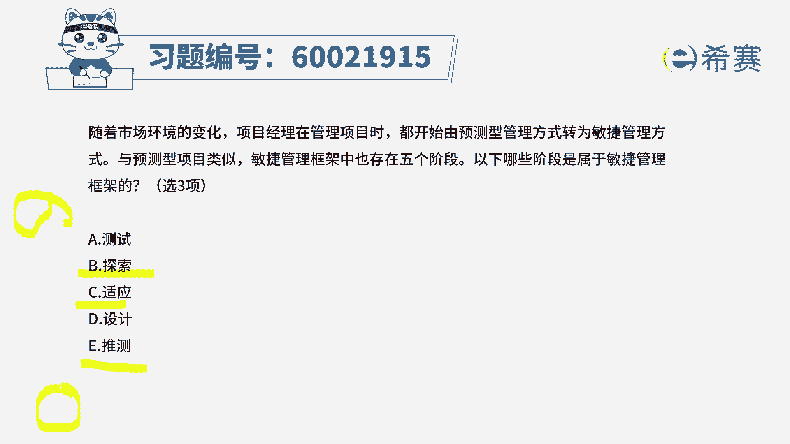
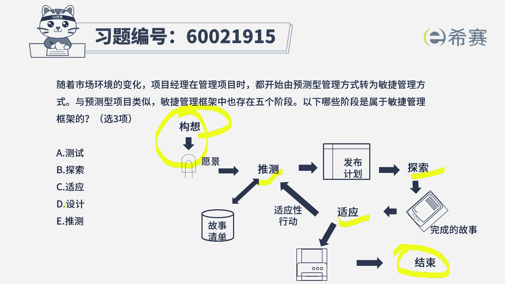
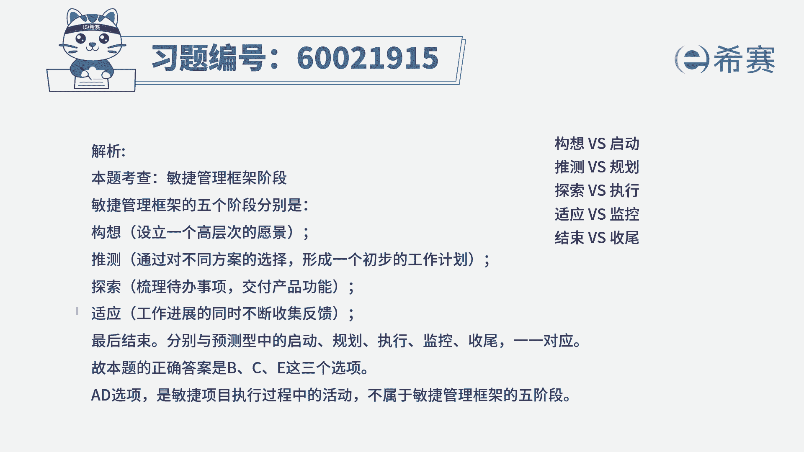

# （24年PMP）pmp项目管理考试零基础刷题视频教程-200道模拟题 - P72：72 - 冬x溪 - BV1S14y1U7Ce

随着市场环境的变化，项目经理在管理项目时，都开始由预测型管理方式转为敏捷管理方式，与预测型项目类似，敏捷项目管理方式中也存在五个阶段，那么下列哪一些阶段，是属于敏捷项目管理框架的阶段。

那一共有三个选项是正确的，我们知道在敏捷型项目管理框架中，它的五个阶段，一个是推测，一个是探索，还有一个是适应，然后在最开始呢会有一个构想阶段，所以最后面会有一个结束的阶段。

所以这样的话就比较容易选了，当然就是选这三项，就是推测探索适应，前面还有一个构想，最后还有一个结束，而其中测试和设计它不是整个阶段，它只是在做这个项目过程中的一些具体内容。

那关于敏捷阶段，框架理论中的这五个阶段，它的这个详细解释呢。

