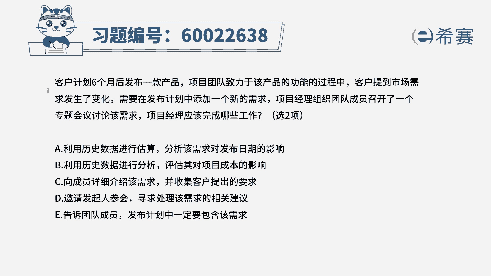
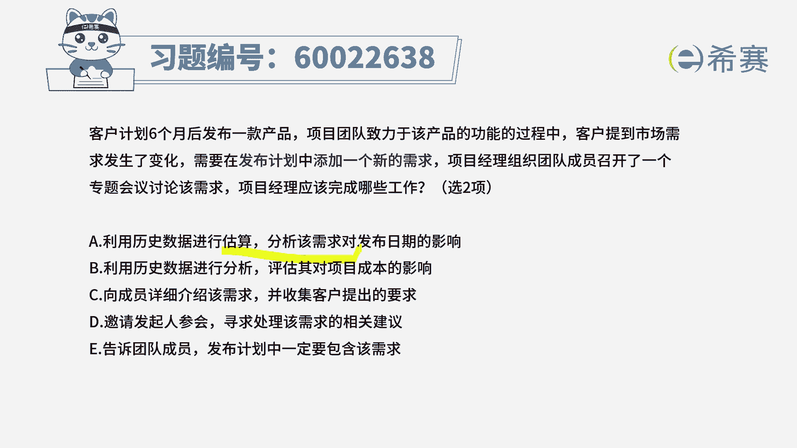
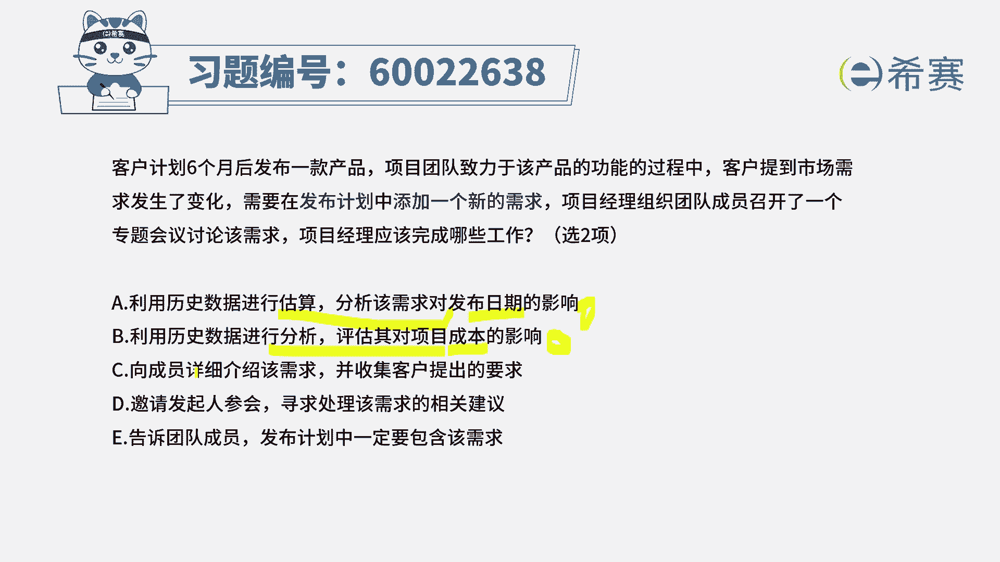
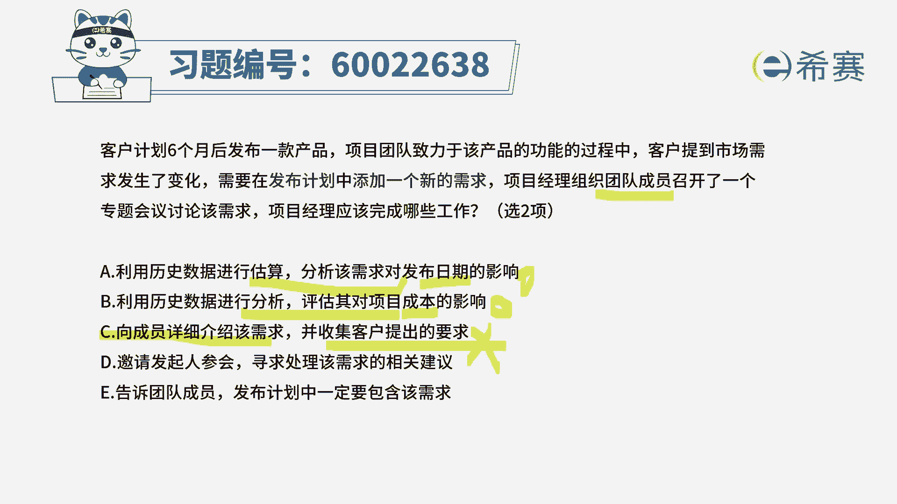
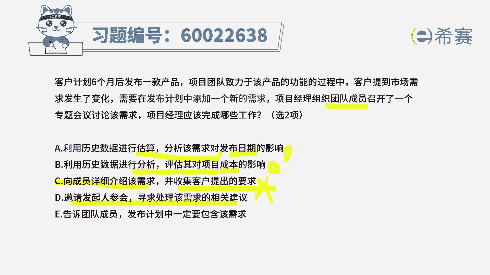
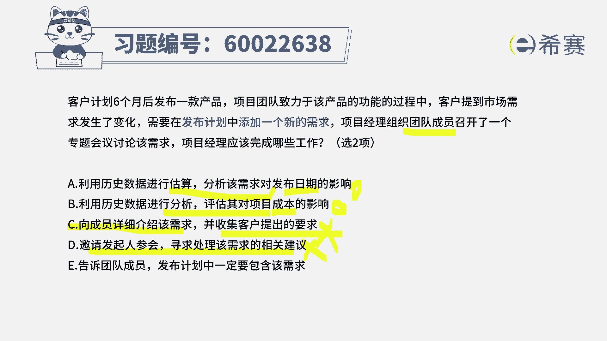
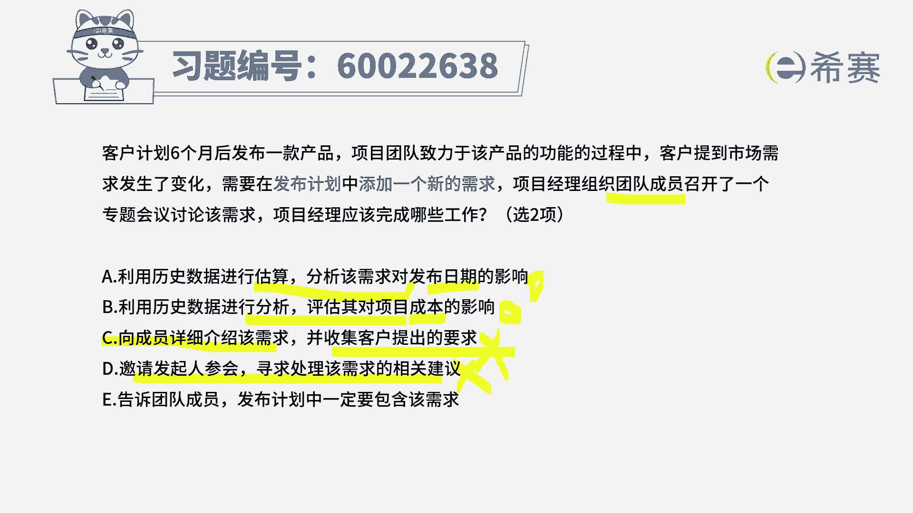
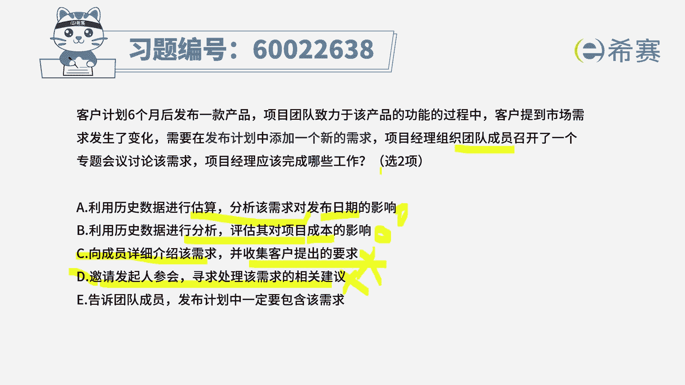
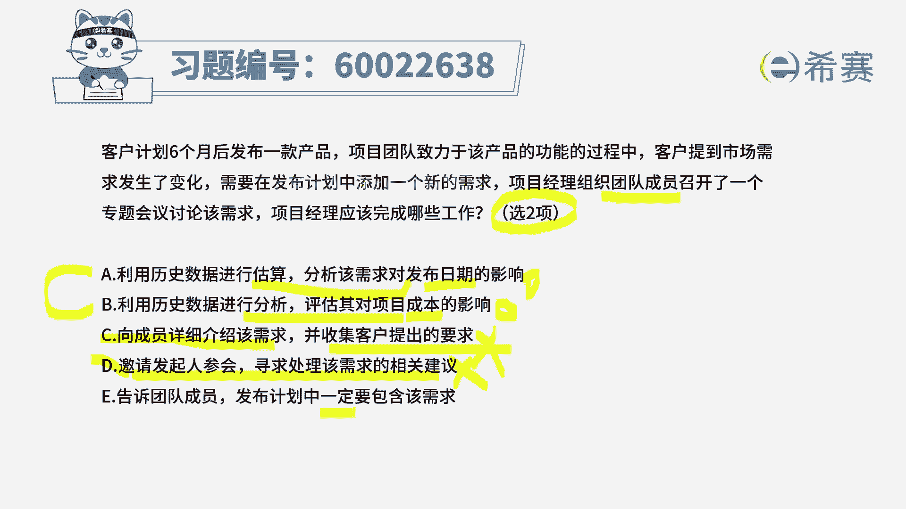
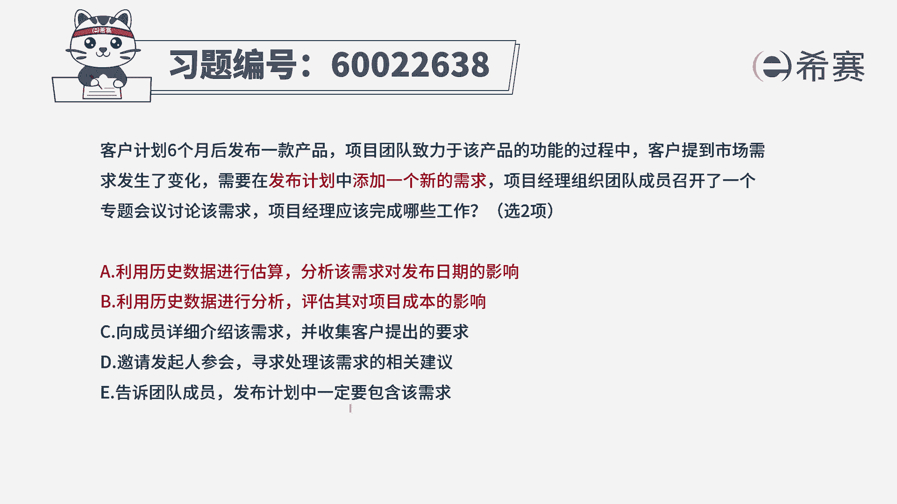

# （24年PMP）pmp项目管理考试零基础刷题视频教程-200道模拟题 - P73：73 - 冬x溪 - BV1S14y1U7Ce

客户计划六个月后发布一款产品，项目团队致力于该产品功能的过程中，客户提到市场需求发生了一些变化，需要在发布计划中增加一个新的需求，项目经理组织团队成员召开了一个专题会议，来讨论该项需求。

那项目经理应该完成哪些工作，呃这里呢其实有一个点我们需要去了解一下，我们一般来讲在整个项目管理的过程中，关于发布计划这个词呢，我们只在敏捷项目管理中提到了发布计划，但是在生活中。

其实我们如果说不用敏捷的方式来去做事情，同样这个事情最后做完以后也是要发布出去的，你可以把它理解为这是一个大的计划，所以呢它并不一定非得是敏捷，才有这样一个发布计划，有了这个认知以后，我们再来做这个题。

可能就会稍微容易一点点，好，选项a利用历史数据来进行估算，来分析这样一个需求，它可能对于发布日期的影响。

唉这就是在去评估分析评估影响对吧，这个肯定是一个可选的。

是一个可选项，然后选项b利用历史数据来进行分析，来评估对项目成本的影响，一个是对于工作的工期，就是进度的影响，一个是对于成本的影响，这个呢应该也没有错，也是一个可选项，但当我们还不是很确定的时候呢。

先做一个待选，然后选项c向团队成员详细介绍这样一个需求。

这句话本身没有毛病，并收集客户提出的需求，请注意这里面是干什么，我们现在目前是召开了一个内部的会议，召集团的成员来去召开这样一个内部会议，那我们能够去收集客户需求，我们好像不太现实哦。

所以呢本身我们其实是需要去收集客户，对于需求的这一要求。

因为你对于这个需求，你的这个验收的标准是什么，我们是需要去了解到的。

但是在这一次会议中是获取不到选项，d邀请发起来参与会议，寻求处理该需求的这样一些相关建议，一般来讲对于提出一个小小的需求，做一些需求的变更，你就不要去动用发行了嘛对吧。

一般来说选他都是错的啊，除非是公司里面着火了啊。

这个项目做不下去了，要终止之类的好，最后一个选项告诉团队成员。

发布计划中一定要包含该项需求，这个里面呢其实有个讨巧的方式来去选择，因为c和d已经被我们干掉了以后，他又告诉我们明确只能选两项。

而a和b它们是同类型的同质性的东西。

要错一起错，要对一起对，所以呢答案就选它，那么再来看到最后一个选项，告诉团队成员，这个发布计划里面一定包含这样一些需求，因为目前我们还在评估，那么最后评估的结果有可能包含，也有可能发现不那么合适。

然后再去跟客户去交互，所以这个一定这个词呢，就可能显得稍微绝对了一点。

所以这样分析下来以后，答案选a和b，那详细的解析呢。

