# （24年PMP）pmp项目管理考试零基础刷题视频教程-200道模拟题 - P75：75 - 冬x溪 - BV1S14y1U7Ce

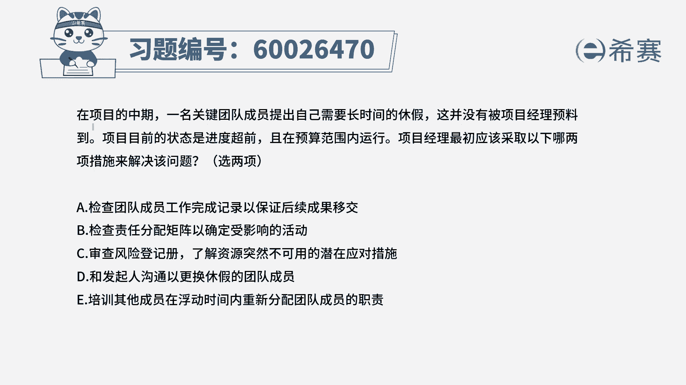

在项目的中期，一名关键团队成员提出自己需要长时间的休假，而这并没有被项目经理预料到，项目目前的状态是进度超前，并且呢预算范围内运行，项目经理最应该采取以下的哪两项措施，来解决这样一个问题。

那么现在是遇到了这样一个突发的情况，有资源他不能去使用，并且是你之前没有预料到的，那么这个时候你该怎么样去解决呢，有两项可以选啊，选项一检查团队成员工作完成记录，以保证后续的成果移交呃。

这个的话关键是我们并没有说安排这段的工作，直到此为止，现在是突然之间发现缺了人手或者将要缺人手。

所以这个a选项，它并不能够解决我缺人手的这个问题。

选项b检查责任分配矩阵已确定受影响的活动。

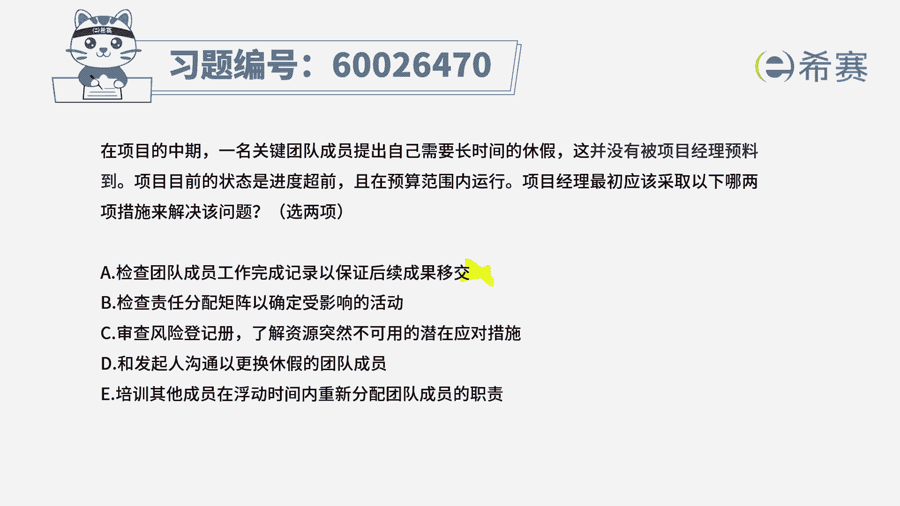

也就是我还想要看一看这个人，我还给他安排了一些什么样的一些工作。

他如果不来的话，可能累一些工作会受到影响，这个肯定是可选的。

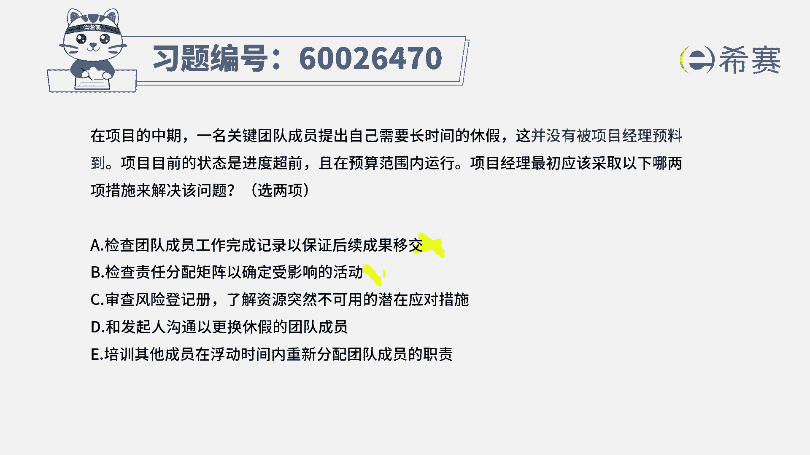

选项c审查风险登记册，了解资源突然不可用的潜在应对措施。

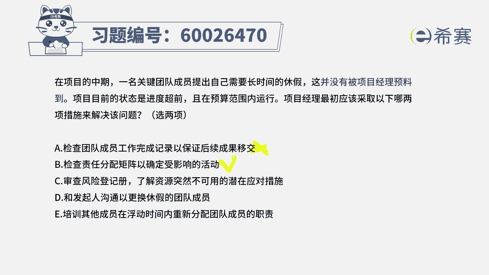

那么现在明确告诉我们，就说这个资源它突然不可用了，那我还有什么样的应对措施呢，如果说在风险登记之中已经列出来了。

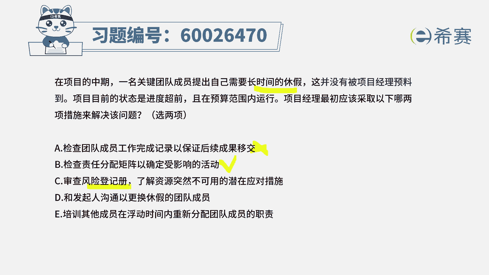

那我们就尽量的去用对吧，那这个肯定就是一个可选项。

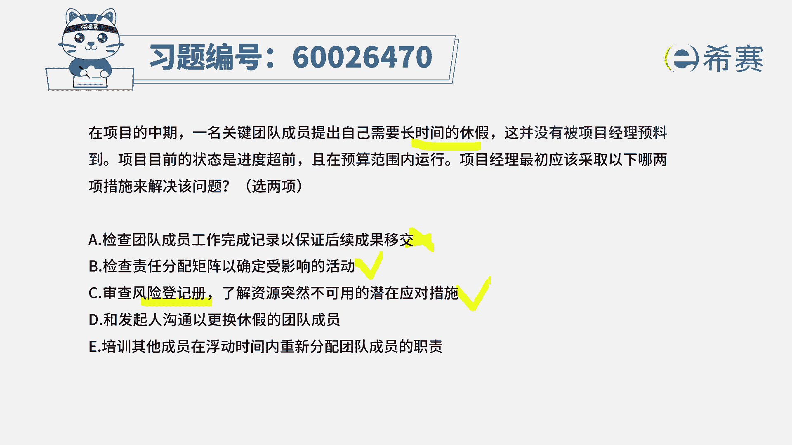

选项d和发起人来沟通，那这种小事情你不需要去忙发起人啊。

选项e培训其他成员，在浮动时间内。

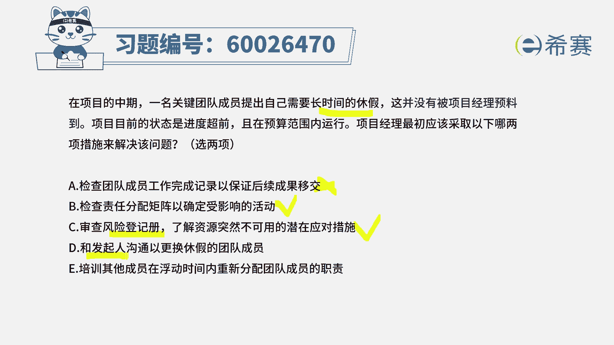

重新分配团队成员的这样一个职责，这个的话来得及吗，可能有点难度哦。

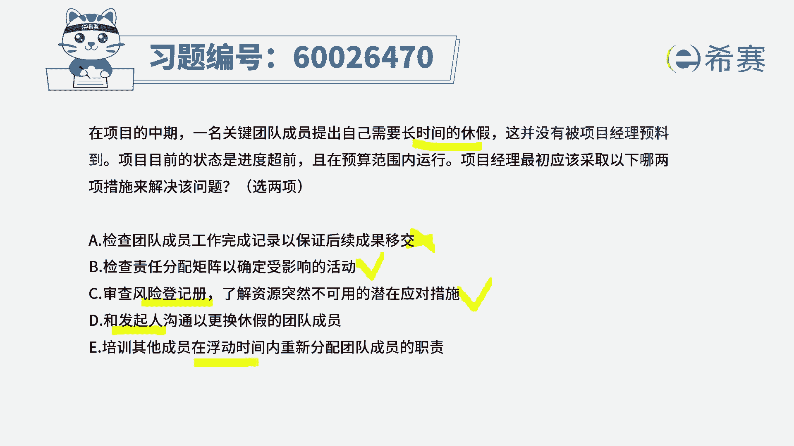

可能有点难度对吧，并且这个人是一个什么人，是一个关键成员。

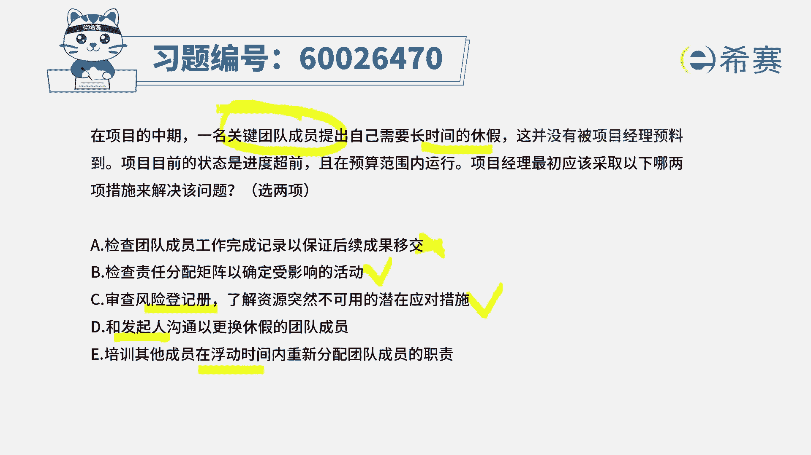

一个关键成员，那么他的工作内容应该是有一定难度，你安排一个人临时去补充一下。

培训一下就来去替代他的工作呃，有点太草率了啊。

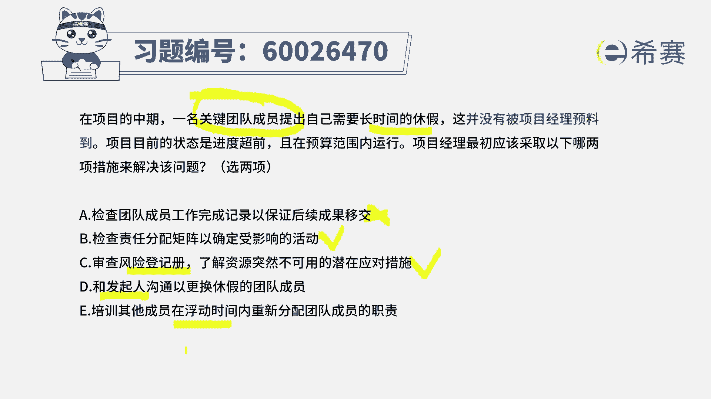

所以答案呢是选第二个和第三个b和c。

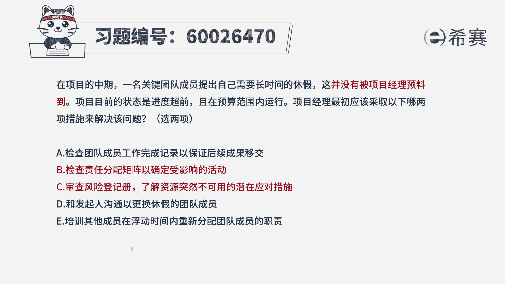