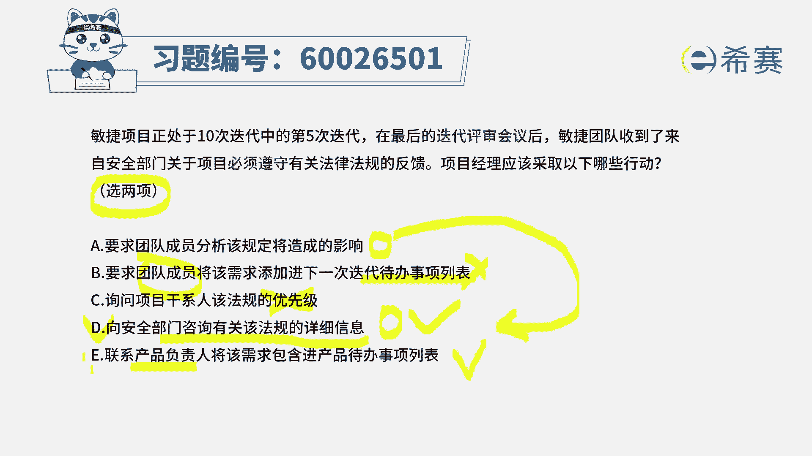
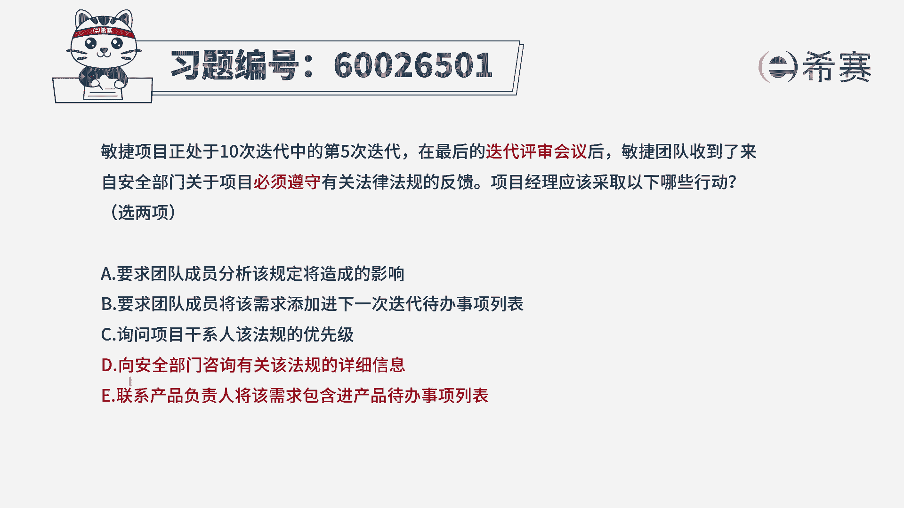
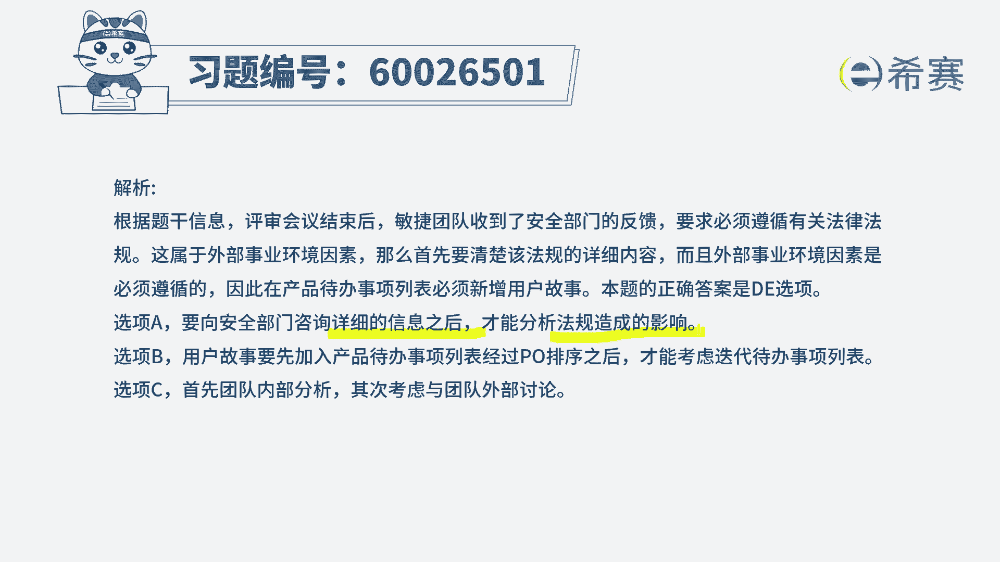

# （24年PMP）pmp项目管理考试零基础刷题视频教程-200道模拟题 - P79：79 - 冬x溪 - BV1S14y1U7Ce

敏捷项目正处于十次迭代中的第五次迭代，在最后的迭代评审会议后，敏捷团队收到了来自安全部门，关于项目必须要遵循有关法律法规的反馈，项目经理应该采取下列的哪一项行动，有两个行动呢是你需要选的这个题目呢。

坦白说其实有点难度，我们一起来看一下啊，选项a要求团队成员去分析该法律法规，将会造成的影响，这是不是你要做的事情，肯定是你要做的事情之一，但是啊对他肯定是要做的事情之一，但是要不要选进来。

我们先做一个待定，然后选项b要求团队成员将该需求，添加到下一次的迭代待办事项列表中，这个表达方式有没有问题，首先肯定有问题，为什么谁负责关于下一轮迭代的这个东西，应该是p o加上团队成员。

而我们首先首先得做的事情是，先得把这样一些需求，放到整个产品待办事项列表中来，然后再考虑要不要放到下一轮的迭代中来，所以这个选项肯定是错了啊，没那么快，也不是他也不是他，选项c询问项目的干系人。

该法律法规的优先级，他都已经是法律法规了，是必须遵循的，它是一个外部的约束，是一个事业环境因素是必须遵循的，那也没有什么优先级不优先级说吧，绝对是要遵循的这个错误选项d，向安全部门咨询。

有关该法律法规的这些详细信息，诶，这一条肯定是需要去做的，就他只是告诉我们说要去遵循某条法律法规，那到底这条法律法规都有一些什么样的，具体情况呢，我们得要搞搞清楚以后才能去分析影响，对不对。

所以呢它会是作为一个正确选项，好最后一条联系产品负责人，将该项需求包含进产品待办事项列表中来，这个是正确的，为什么你首先说把这些要求要遵循法律法规，有可能导致我们做的项目呢，要加很多很多新的东西。

要增加一些工作量，那么这个增加工作量的部分，它实际上不是一个功能性的需求，但是法律法规这种东西是一种非功能性的需求，也是需要去考虑的，所以优先选项的话呢，d和e会更合适，而a选项呢它是在d之后的。

它是跟在d的后面的，而题干中明确告诉你只选两项的情况下，我们就选d和一。

所以答案是第一，那详细的解析呢在后面你可以查看一下。

可能对大家来讲最难的其实就是关于a选项，a选项一般来说了解详细的这种法律信息以后，再去分析它的影响。

