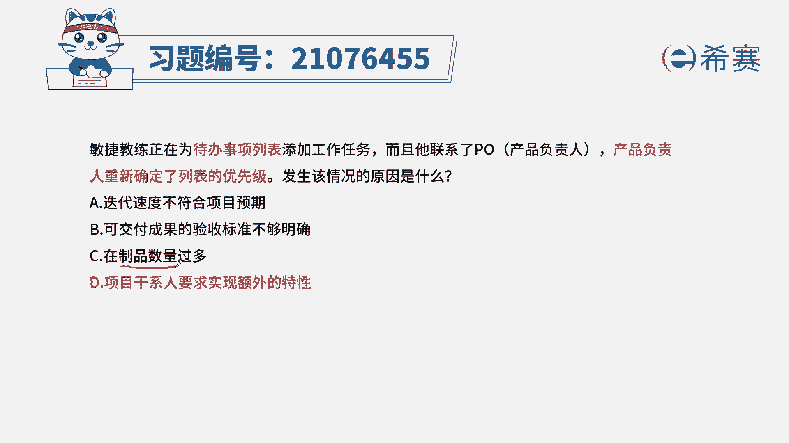
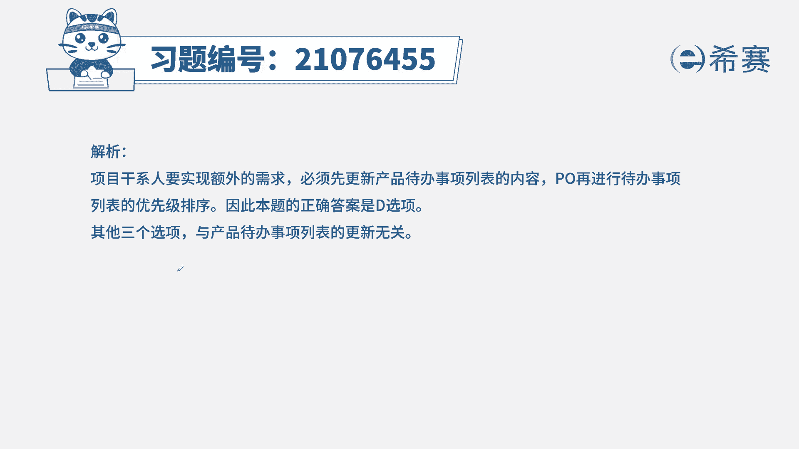
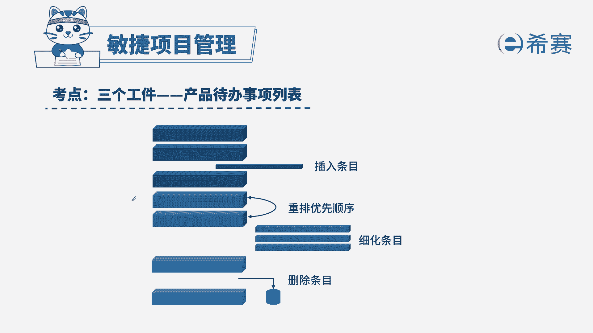

# （24年PMP）pmp项目管理考试零基础刷题视频教程-200道模拟题 - P81：81 - 冬x溪 - BV1S14y1U7Ce

敏捷教练正在为代办时尚列表添加工作任务，而且他联系了产品负责人，产品负责人重新确定了列表的优先级，发生该情况的原因是什么，迭代速度不符合项目预期，b可交付成果的验收标准不够明确，c在制品数量过多。

d项目干系人要求实现额外的特性，本题的考法是考内容和概念，首先通过题干找到关键信息，题干告诉我们，正在往代办事项列表里面添加工作，同时确定列表里的优先级问题，问的是为什么要做，现在这个动作。

也就是问我们为什么要添加工作任务进去，我们想一定是有新的内容，新的需求，新的功能来了，我们才会添加新的任务进去，否则不会有这个操作动作的，而且产品负责人还进行了列表的优先级。

也就是里面用户故事优先级的排序，所以我们这里的知识点是我们产品待办事项，列表的概念和它的特性，针对这个知识点，我们知道产品待办事项列表，是由产品负责人来确定的，有新的需求过来，需要往里添加。

就需要找到产品负责人好，我们来看正确选项d选项，项目干系人要求实现额外的特性，这句话的描述其实告诉我们，干系人添加了新的功能啊，所以才会有下面的那些动作，我们来看看其他三个选项诶。

迭代速度不符合项目预期，也不用添加工作任务，b验收标准不够明确，既然标准不够明确，我们只要调整明确验收标准就可以了，不需要添加工作任务进去，c在制品数量过多好，我这里解释一下在制品的意思。

在制品是体现在我们看板工具中的，看板会分为代办事项，在制品和完成事项，比如说在制品太多了，那有可能会卡在那里，在制品太少了，我们的团队可能会有闲置的时间。

所以我们要控制在制品维持好，团队的迭代速度好，这是本题的解析。

大家可以暂停看一下本题的相关知识点，产品待办事项列表，针对这个知识点，我们要明确几点，第一是谁负责这个列表，第二列表里的项是否可以调整，是否可以细化，是否可以删除，是否可以添加。

同时我们还需要了解迭代代办事项列表，相对应的知识点，这么一来。

针对这类的题目。