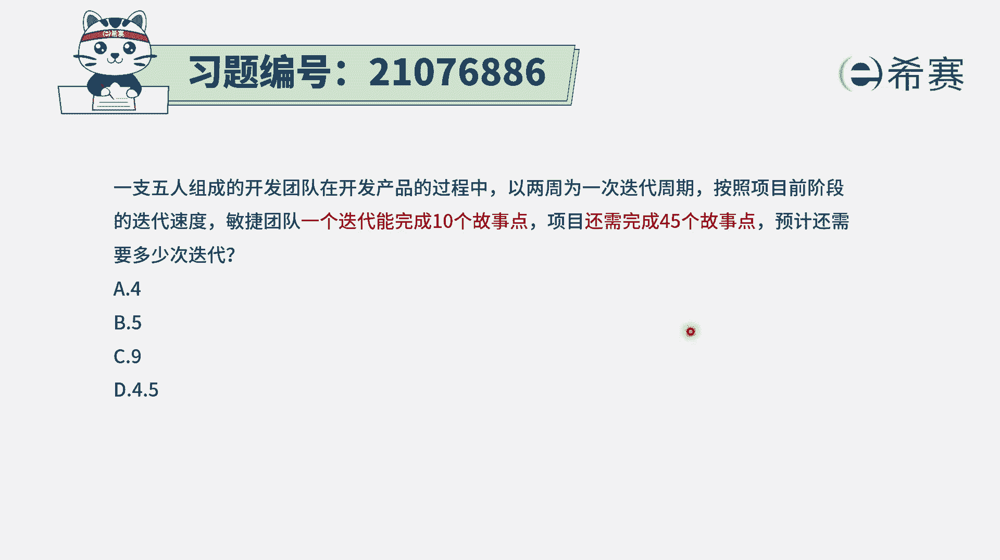
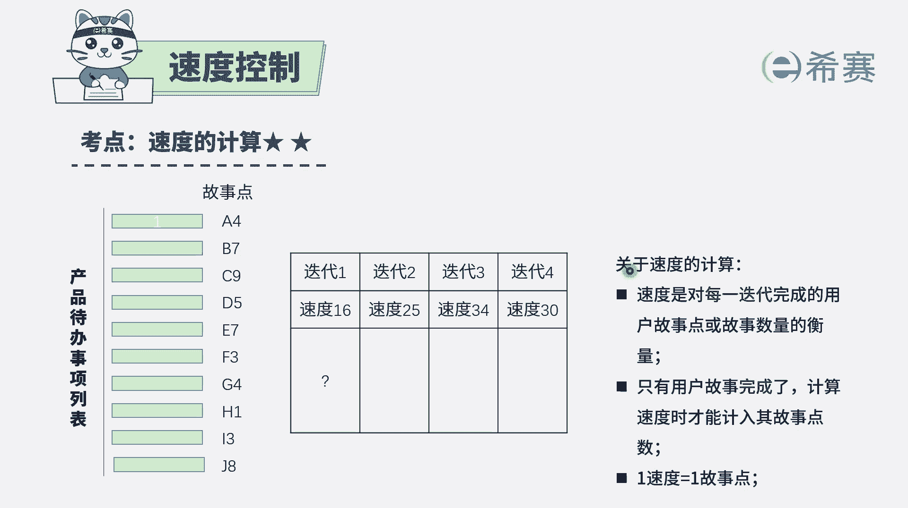
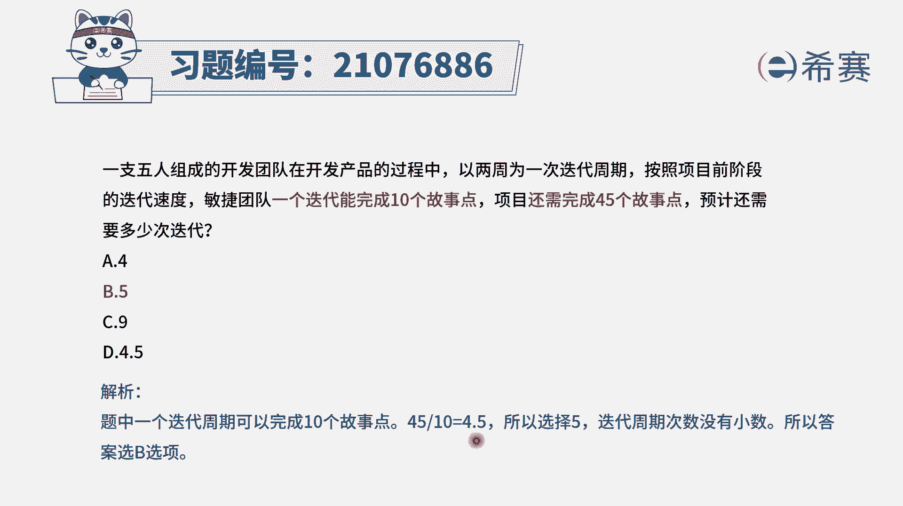

# （24年PMP）pmp项目管理考试零基础刷题视频教程-200道模拟题 - P90：90 - 冬x溪 - BV1S14y1U7Ce

一支五人组成的开发团队，在开发产品的过程中，以两周为一次迭代周期，按照项目当前的这样迭代速度，敏捷团队一次迭代能够完成十个故事点，项目还需要完成45个故事点，那么预计还需要多少次迭代。

那这个的话其实比较容易选啊，你想一想，我们一次可以完成十个故事点，那么40个故事里呢，我就需要去四次迭代，那么还剩五个故事里呢，我至少还需要一次迭代，就是4+1=5，对不对，这是小时候学过的一个数学。

就是只用这个数值去除，以它除完以后等于n，那么它的数值应该就是n加一。

所以答案应该是选五，我们需要去了解一下关于迭代的速度，通常情况下，迭代速度，它是指我们每一轮迭代能够完成的，故事点数的总和变，这个时候只要是完全把这个用户故事完成了，才能够记录进来。

在题干中没有任何别的信息的情况下。

那你就是可以简单来理解，就是我们可以用一些方式来去做拆分，那我就是第一次完成十个故事点，第二次完成十个故事点，第三次第四次，这样的话四次就已经完成了40个，然后最后一次完成五个就可以了。

所以答案就是选b，那解析呢呃可以看到，这是小时候学过的一种数学方式，就是你直接来这个数值取除完以后的这个数值，如果刚好是整数，那就取整，如果说是有小数点。

