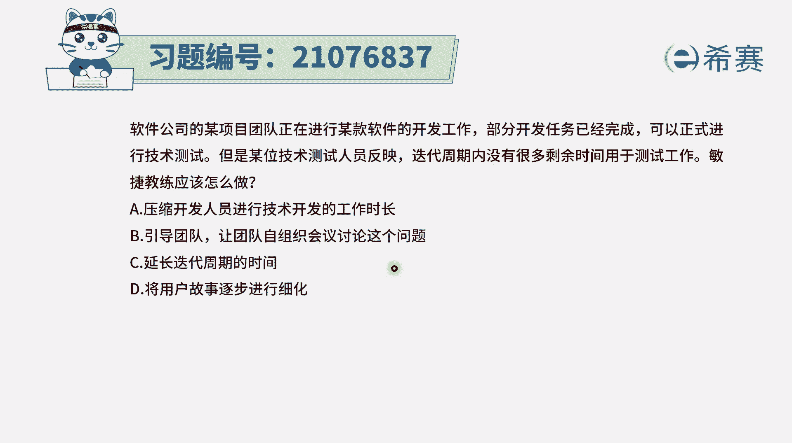
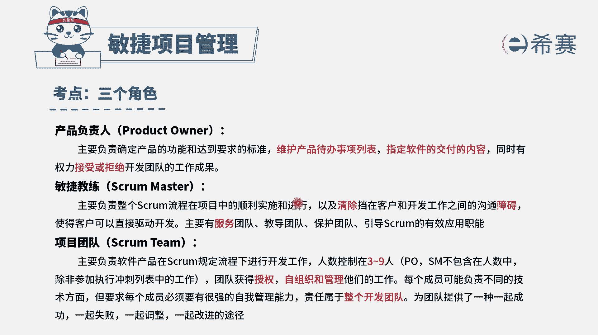
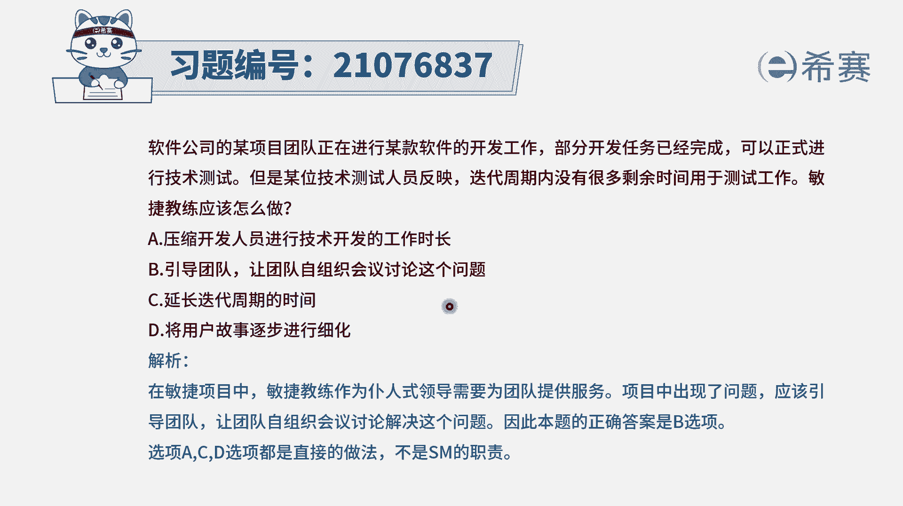

# （24年PMP）pmp项目管理考试零基础刷题视频教程-200道模拟题 - P91：91 - 冬x溪 - BV1S14y1U7Ce

软件公司的某项目团队，正在进行某款软件的开发工作，部分开发任务已经完成，可以正式进行技术测试，但是某位技术测试人员反映，迭代周期内没有很多剩余时间用于测试工作，敏捷教练应该怎么做，那其实这个题目中呢。

它就是出现了一个困境，或者是团队出现了一个问题，遇到了一个问题和挑战，那当团队遇到问题和挑战的时候，应该怎么办呢，其实优先是自我组织。

自我管理，自我解决，这也就是符合这个项目团队的这样一个情形。

就是自组织团队有这样一个基本认识以后呢，我们再来看一下这个试题的四个选项，选项a压缩开发人员进行技术开发的时长，就是说留出更多的时间来去做测试，这就是由谁来去解决，这是由敏捷教练来替他解决，这种方式。

你也不是说就不行，但是显得不够好，在敏捷中显得不够好，敏捷更细更推崇的是他们自己解决，那也就是第二个选项，引导团队，让团队自己来去组织这会议来讨论这个问题，然后从而去想出应对的方式来解决。

这种方式才是更合适的，所以答案选第二个啊，c选项延长迭代周期的时间，一般来讲在敏捷中，它会有一个叫time box，是由时间和的概念，那这一次冲刺是多长时间，那就是多长时间，每一轮都是这么长的时间。

是固定时间的，一般都是这样的，所以这个c选项不合适，d选项将用户故事逐渐进行细化，关键是这个跟题干中的问题风马流不相及，题干中说的是觉得周期啊有限，然后给我留的这样一个测试时间是有限，我可能测不完。

那么你应该是要去奔着这个问题去解决问题，所以只有b选项是最合适的，而a选项的是他们自己讨论以后，有可能会得到这样一个a结论，这也是可行的，答案选b，那解析呢在这边需要的同学可以自行查看。

每年教练也是去引导他们来去思考。

