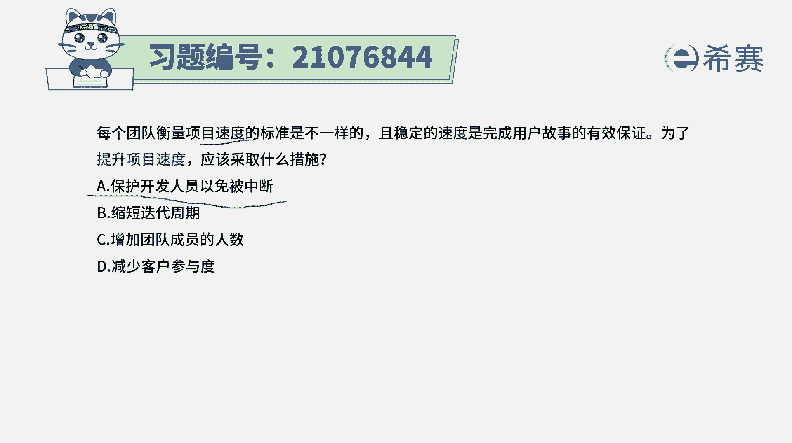
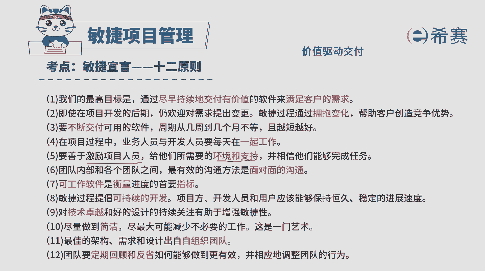
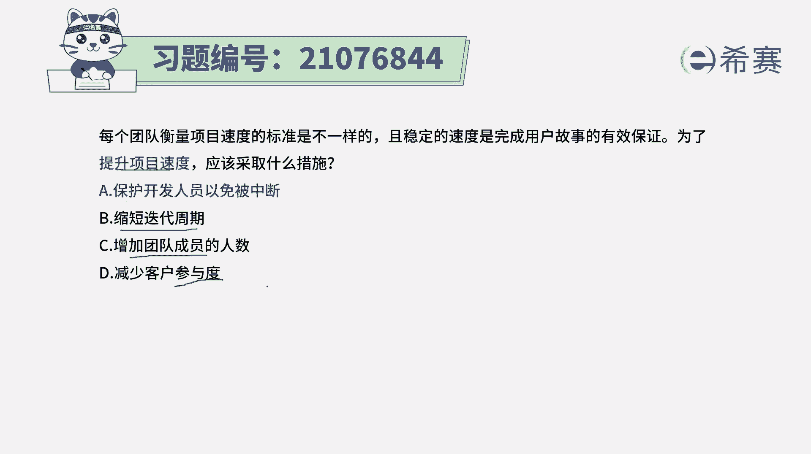
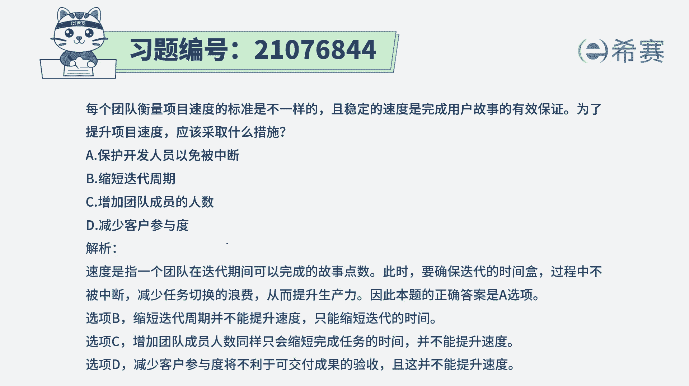

# （24年PMP）pmp项目管理考试零基础刷题视频教程-200道模拟题 - P92：92 - 冬x溪 - BV1S14y1U7Ce

每个团队衡量项目速度的标准是不一样的，且稳定的速度是完成用户故事的有效保证，为了提升项目速度，应该采取什么措施，而这一点的话呢，首先我们来解释一下，一般情况下，每一个项目a项目和b项目。

它的这些速度不相同，就说诶这个项目他怎么每一次迭代，完成了20个用户故事，那个项目怎么每一次做项目，完成了40个用户故事，那是不是表示，那40个用户故事的那个项目团队，他就是做的比这个20个的更快呢。

其实不能这样比较，因为每一个项目上，它的这些用户故事的这样一个安排，或者是估算它都是不一样的，它不是一个绝对值，是一个相对值，好有这一基本信息，然后再来看到，就是我们要有效的去完成这样一些项目的话。

该怎么样去做，或者说是怎么样去提升呃，这个这个表达其实你不知道他到底要讲什么，我们就先看四个选项，选项a说是保护开发人员，以免被中断，这一点的话，其实你一看就是正确的啊，我们在生活中。

有的时候为什么工作效率比较低，这一天下来本来想要做的事情却没有这么做，因为是不断的被打断，不断的被打搅，而本身在敏捷中其实有这样一条信息说。

我们要善于去激励团队成员，给他们所需要的环境和支持，相信他们能够完成任务，并且敏捷教练的这个角色，是一个去帮助团队成员来清除障碍，去给予支持。

清除障碍的这样一个角色，所以有了这个信息后，其实你就知道这个题目，答案呢肯定是选a选项的，它是正确答案，至于其他几个选项，我们也一起来看一下选项b缩短迭代周期，那我们缩短迭代周期能不能提升这个速度。

该做到的事情，每一次能做到的事情它还是有限的，对不对，选项c增加团队成员的人数，其实一般来讲敏捷团队一旦形成以后呢，那就是这么多人不会随意去更新去更改，不会说要多加几个人或是减少几个人。

选项d减少客户参与度，那减少客户参与以后，那就减少了变更，而事实上我们知道，变更是能够去帮助客户，创造竞争优势的一种方式，这也是敏捷的价值所在，那如果你减少了用户的参与的话，那这个客户的反馈就得不到呀。

所以这个方式肯定是不行的啊，所以我们知道这剩下的b c d其实都不合适，而事实上呢如果想要做一个敏捷项目，它的速度比较好的话，最好的方式就是能够去保护团队，能够免受打扰。

或者是能够去帮助团队来清除一些障碍。

