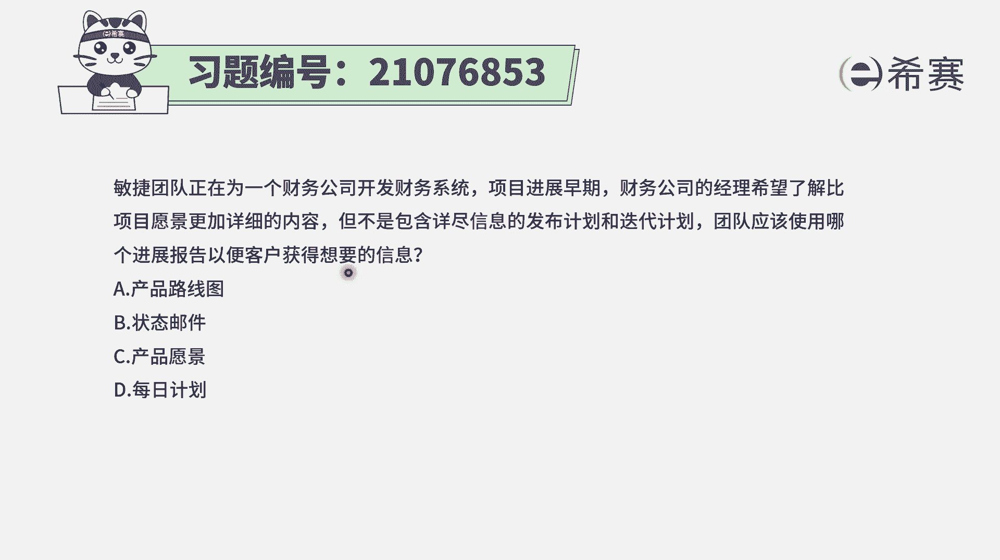
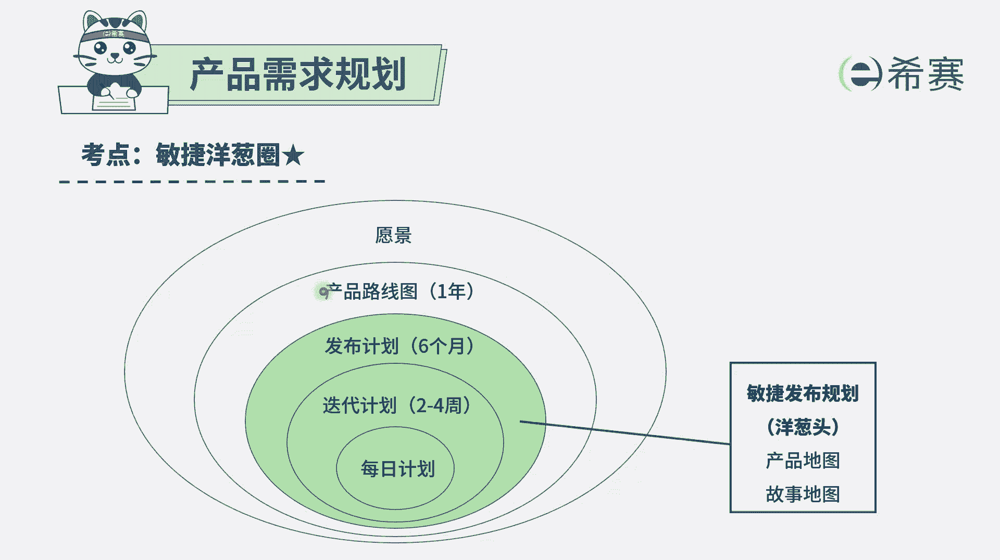
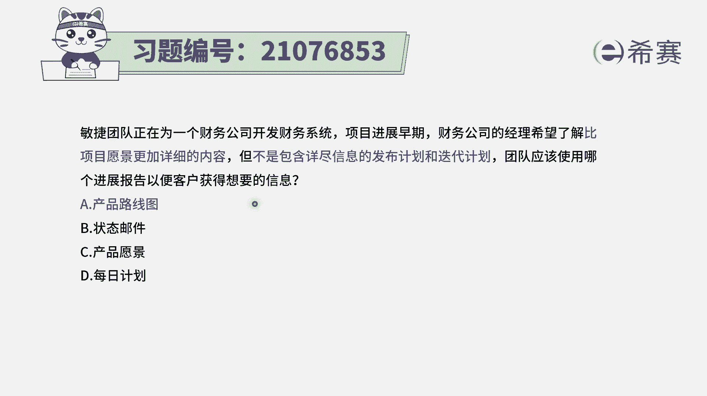
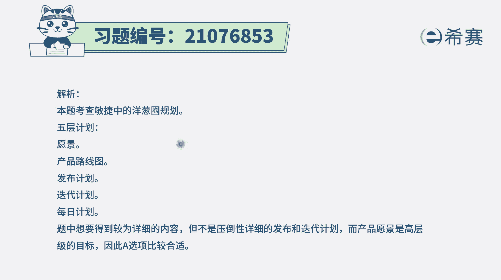

# （24年PMP）pmp项目管理考试零基础刷题视频教程-200道模拟题 - P95：95 - 冬x溪 - BV1S14y1U7Ce

敏捷团队正在为一个财务公司，开发财务系统项目，竟然早期财务公司的经理，希望了解比项目愿景更加详细的内容，但是不包括详尽的发布计划和迭代计划，那团队应该使用哪一个技能报告。

以便于客户来去获知他所想要的信息，呃这个的话呢，其实你如果说能够去记得，敏捷发布的这样五成计划。

你就能够很容易选出来，就整个敏捷发布的五层计划的，首先第一层是产品愿景，第二层是产品路线图，第三层是发布计划，第四层呢是迭代计划，最后第五层是每日计划，那通常情况下，题干中告诉我们说是已经有了产品愿景。

现在要的呢是不是产品发布计划和迭代计划，而是比产品愿你更详细，但是又不是后面两项的，那就只有中间那个叫产品路线图。

通常产品路线图，它会是会基于我们的这个产品愿景，会把这样一个愿景跟时间轴给关联起来，我们在什么时间线上面，可能会把一些某些重要的一些功能，能够展现出来，或者是能够发布的东西里面，包含某些重要的功能。

所以这些题目的答案呢就是选产品路线图，当然这个题目，其实也可以通过排除的方式来去选择啊，你看选项b状态，邮件状态邮件，它首先第一个在敏捷中，几乎不太去提倡这种方式，敏捷中它会提倡的是信息同步，信息透明。

怎么样做到信息透明，用这样一个信息发射器，信息发射语言的方式，比方说像看板燃尽图，燃起图，以及包括开这种会议，迭代回顾会议等这种方式来去做信息同步，它会比较少的提及到用邮件的方式，第三个选项产品愿景。

那题目中已经告诉你，他想了解的是比产品愿景更详细的，那当然就不是产品愿景了吗，然后第四个每日计划，那每日计划，它已经是到了一个非常细节和具体的，就每一天要做什么事情，来了解我昨天干了什么。

我今天要干什么，以及我干这个事情的过程中，遇到什么困难和挑战，那这是一个非常细节和具体的，通常这个财务经理他也没有办法去了解到，每一天每一天都干什么，因为每一天干了什么事情。

它会是根据每一轮的迭代做的不相同，过程中可能会有一些很大的调整和变化。

所以这样排除下来，也只有a选项可以选，叫产品路线图解析。

