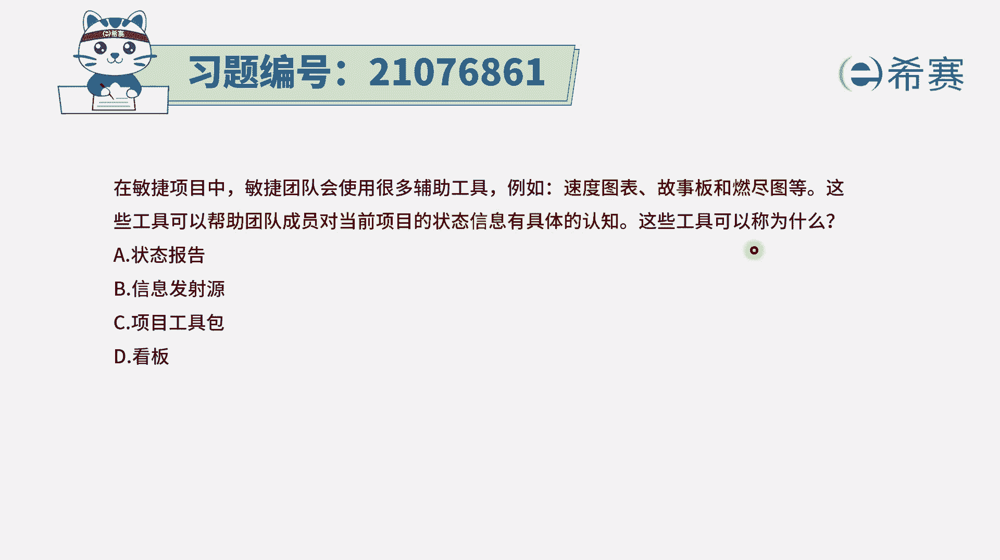
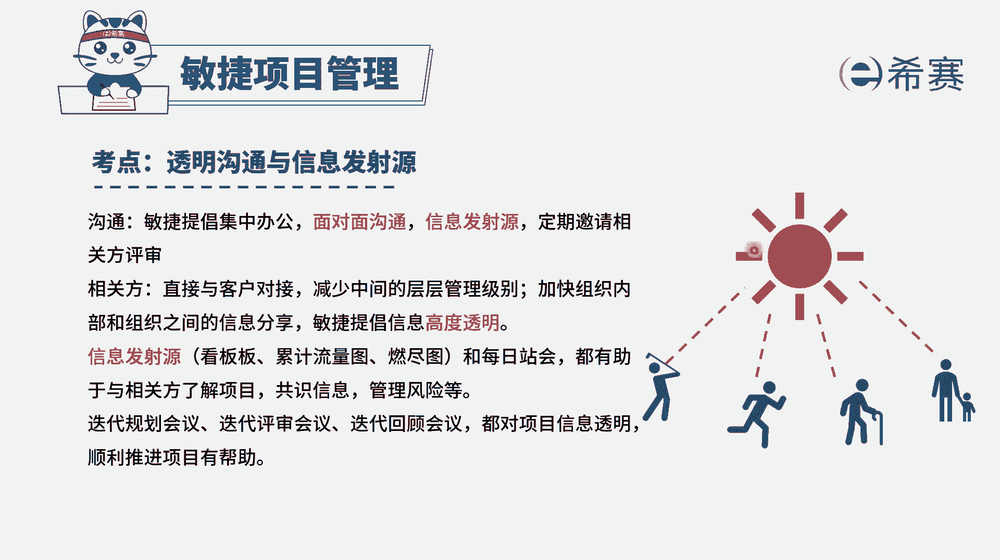
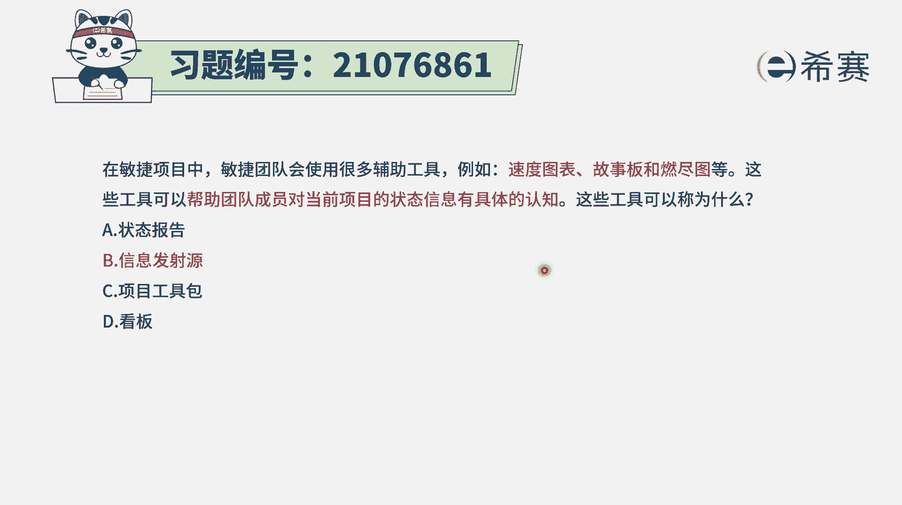

# （24年PMP）pmp项目管理考试零基础刷题视频教程-200道模拟题 - P97：97 - 冬x溪 - BV1S14y1U7Ce

在敏捷项目中，敏捷团队会使用很多辅助工具，比如速度图表，故事版，燃尽图等，那这些工具呢，可以帮助团队成员对当前项目的状态，信息有具体的认知，那这些工具一般来讲，我们会有一个什么样的统称呢。

那事实上就是对于这些什么图啊表啊，它会能够帮助我们说是比较直观的，来了解下面的一个进展情况，我们会有一个统一的名词叫信息发射语言。

呃，其实关于信息发射源，我们需要知道就是整个在敏捷中，它会强调的是要信息透明，而怎么样去做到信息透明呢，有一种方式就是用这样一个信息发射源的方式，用看板啊，用蓝晶图啊。

那干的是什么什么进度图啊之类的这种工具，当然信息透明，除了有这种信息发射源以外呢，我们也可以通过会议的方式，通过这种频繁交互的这种方式也是可行的，所以这个题目的答案呢。

比较确切的就是信息发射源了，它不是什么状态报告啊，因为你想每一个它都不相同，状态报告一般是项目结束的时候，或者是中期某个节点的时候，我们看做了哪些没做哪些，然后对他做一个统计分析，叫做办公。

然后选项c项目工具包没有，这个在这里呢没有这样一个明确的这种说法，然后看板啊，它应该只是属于看板中的一种，不能都叫看板，所以叫信息发射源是会比较直观的。

