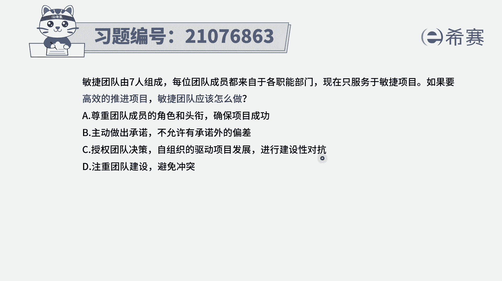
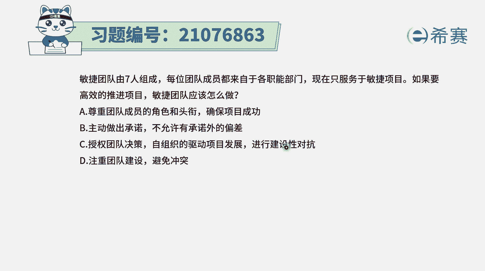
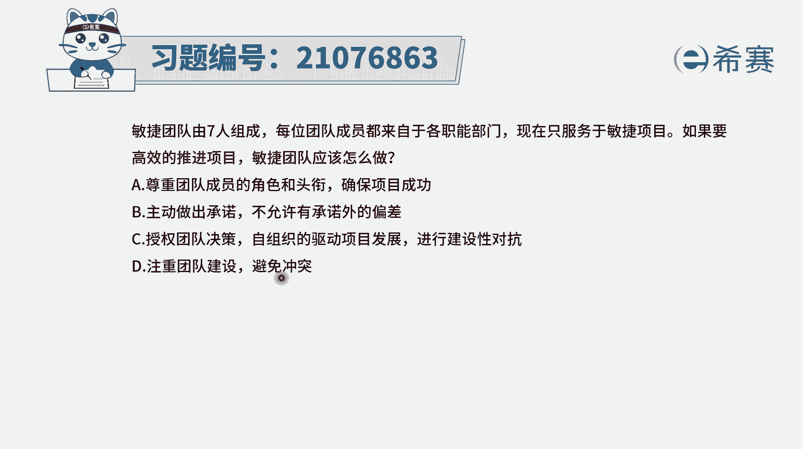
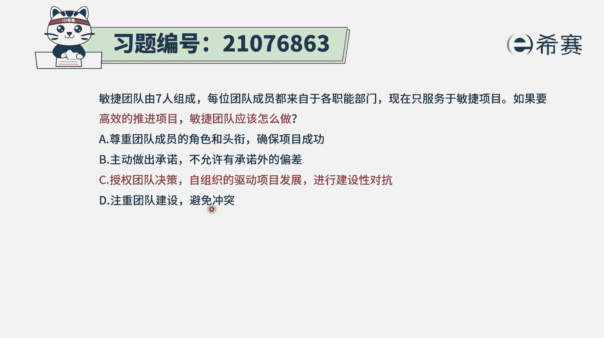
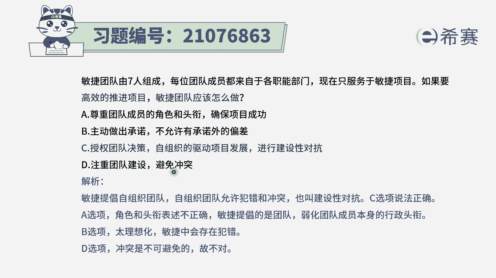
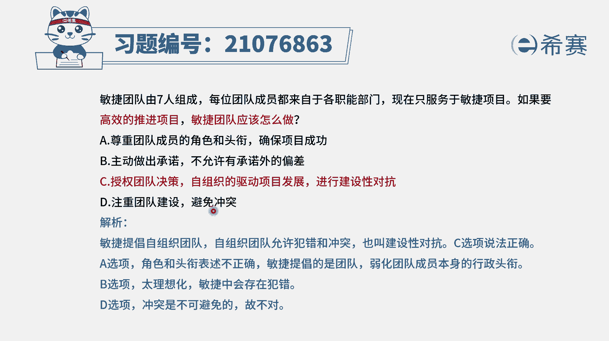

# （24年PMP）pmp项目管理考试零基础刷题视频教程-200道模拟题 - P98：98 - 冬x溪 - BV1S14y1U7Ce

每位团队成员都是来自于各自的职能部门，现在呢是只服务于敏捷项目，如果要高效地推进项目，敏捷团队应该怎么做，那这里其实是告诉我们，敏捷团队来源是来自于什么，来自于各个职能部门。

然后现在是专职去做这样一个敏捷的项目，在这种情况下，我们怎么样去高效推进项目呢，来看一下四个选项啊，选项a尊重团队成员的角色和头衔，确保成功，在敏捷里面的团队成员，其实就已经没有什么角色和头衔了。

大家都是团队成员，虽然每一个人都是一专多人，都是一个t型的人才，是一个复合型人才，但是我们在这里的话，其实不会去重视那些虚名，都是去干实事去完成事情，所以a选项不正确，b选项主动做出承诺。

不允许有承诺外的偏差，承诺呢它是一种对未来的这样一个承诺，是一种设想，或者说是计划，但是能不能够完全按照程度来进行，其实不一定，所以偏差多少都会有一些，只是我们会需要去调整，然后让它能够大差不差。

按照这个目标去进行，完全不允许偏差，这种方式也太吓人了啊，就是这样的话会给大家造成巨大的心理压力，选项c授权团队决策，自组织的驱动项目发展进行建设性的对抗，这刚好就是敏捷中所推崇的。

他会希望大家能够去自我组织，自我管理，能够授权给大家，如果说有一些更好的方式来解决当前的问题，我们也可以提出更好的方式，那么这个更好的方式，对于当前的这种解决的方式来讲。

它就是一种啊对抗性的这种方式，也就是说允许有冲突。

允许有不一样的方式来解决问题，可以有这种建设性的对抗，所以答案就是选c选项的啊。

然后选项d注重团队建设，避免冲突，完全避免冲突几乎是不现实的，事实上冲突它不是一个妖魔鬼怪，不是洪水猛兽，合适的情况下冲突，他能够去引发团队思考，反思，能够去促进团队进步。

所以只能说是我们要做好冲突管理，而不能是完全避免冲突。

所以这个题目的答案就是选c，怎么样能够更高效地推进项目，民团队应该是受获得这一授权，能够自组织，然后能够去进行建设性的对抗。

那解析呢在这边需要的同学可以自行查看，这里有一个点很重要，就是其实是允许团队犯错误，而不是用一种非常高压的方式来做事情。

让大家处在一次很战战兢兢的这种方式。

