# 【24年PMP考试】零基础也能看懂的pmp项目管理视频教程！ - P10：1.4 项目管理的基本方法论 - 冬x溪 - BV1tu411g7UH

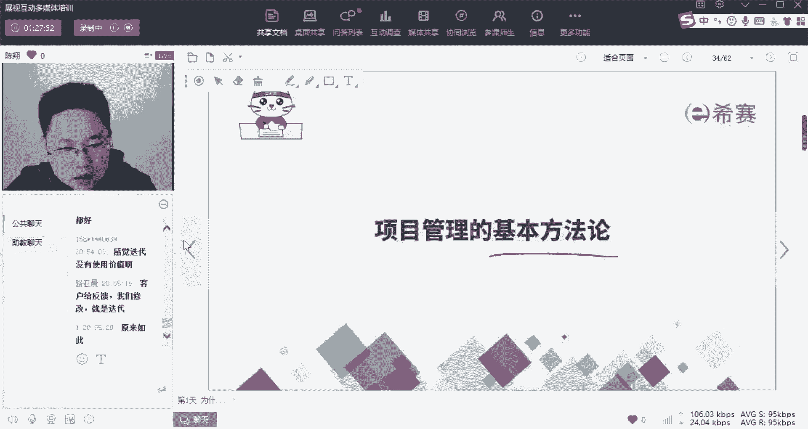

啥叫项目管理的基本方法论呢，啊我们来看一下啊，那么刚才讲的是十大知识领域，那个东西呢是竖的，我们还有一个横的，这个横的是啥呢，好OK我们收回来啊，跟着我先把这个流程走完，横的呢我们叫做五大过程组。

其实这个五大过程组呢它就是一个核心思想，叫做pd c循环啊，也叫带明环，这个工具呢但凡你做过管理应该都熟悉啊，他说的啥嘞，就是PDC循环，就是四个单词，说我们做任何事情啊，一定是先定一个目标对吧。

比如说你要通过偏僻考试，这就是你的目标啊，你要成为啊滑雪冠军，就是你的目标，那么为了实现这个目标，你是不是得有一个计划，比如说我给大家制定学习计划，从现在开始，你到6月份你每天听什么，做什么题啊。

我都给你规划好了，这就是计划，有了计划你还得去做，不做计划是没用的啊，只是摆看的好，做完了以后你还得去执行啊，执行完了之后还得去检查诶，我做出来的效果，跟我计划的效果之间有什么差别，这叫check。

然后再把这些差别呢给他action一下，就是给他纠正修改纠偏一下，然后不断的去做，去检查，去纠偏，直到你能够得到诶你目标的那个效果，然后你才能结束这个项目，也就是这个项目完结。

这个是我们常说的五大课程组，这个东西呢简单却非常实用啊，我们所观察到的是一个会做事的人，他的行为都有这个模子，不会做事的人都是在每个布置上出问题了啊，经常有一种现象呢，就是什么，你们班上。

比如说你原来读高中的时候，读初中的时候，有没有这么一类人狠发狠啊，你去打球的时候，他在写作业，你去吃饭的时候，他在写作业，晚自习下班，你去谈恋爱了，他还在写作业，但是这种人的成绩就是在中等啊。

100分的卷子他就只能打个七八十分，永远上不来，无论他多发狠啊，我们叫做努力而又平凡，有没有这样一类人，你在学习的时候，你在工作的时候，有没有遇见过这种人，比谁都努力，但是呢一直很平凡，成绩就是中等。

可能顶多偏上一点，那么请大家分析一下，这种努力而平凡的人的问题在哪，对吧，你要是不努力，你频繁就算了啊，你努力还频繁的问题在哪儿，好每当我说这个话的时候，就有人说脑子不好使，绝对不是啊。

智商只要过了一条线，谁跟谁都一样，除非你是爱因斯坦这种智商，有人说到说到点子上了啊，因为没有报名西塞，这绝对是一个站得住脚的理由啊，绝对是一个站得住脚的理由，好真正的问题在哪呢。

啊问题就在于他们永远在做自己会做的事，而没有去改善自己不会做的事，什么意思，原来有一条定律叫做1万小时定律，但是现在不这么说了，现在叫做刻意练习，啥叫1万小时定律呢，就原来说你敢干任何一件事情。

做1万个小时，你都会成为这方面的专家，但是有反例，我们从小到大写了这么多字，几10万个字是有的，你的字因为写的多而变得写得好了吗，在座的各位，反正我的字啊写了那么多字以后，我的字还跟狗爬一样。

为什么写字写得多，但是写不好，因为你没有改进，什么意思啊，比如说我表弟啊，我就啊我在我在培养他的时候就会发现什么呢，他做题呀，比如说这套卷子诶，我让他去做，然后呢他很快就做完了，他把自己会做的都做完了。

然后不会做的就空在那，然后他又做了一套，又做了一套，他做了十套卷子，然后你会发现他会做的还是会做的，不会做的还是不会做，那我讲到这，你们应该再结合PDC循环，发现了没有，很多人没有改进。

就是因为他永远在做他什么呀，做已经没有效果的，空的努力，白的努力，而没有诶，你的目标是什么，你执行到什么层面，你真正接下来要做的事情是这个gap，是这之间的差异，是那些改了之后能让你变得更好的东西啊。

你一定要确保，你一直非常清楚的知道自己要做什么，缺什么补什么，你才能进步对吧，这个东西时有发生，说得特别好，时有发生而不自知啊，它的难点在哪儿，第一个人们并不知道自己不知道什么对吧。

你不知道自己计划里面有没有缺陷，因为你不是这个专家，你不知道自己不知道什么，第二个执行力的问题，第三个更重要就是你有没有克服难关，克服难点的这个习惯，因为很多人他是天生为难的，我不会做的事。

我就不去触碰它，我永远停留在自己的舒适区，安全区我会做什么，我一直在做，用一种努力的假象来蒙蔽自己，这种情况就会造成你，对吧啊，造成你不会进步，好说了这么多，其实核心就是pd c，那么项目管理就是啥呀。

项目管理就是教给我们你做每一个项目，你在项目里面做每一块的时候，你都要把PDC循环的思想融进去啊，要计划执行啊，检查和改善纠偏，让你自己一点一点的循环迭代的进步，那么在这儿呢。

我们把这几个东西叫做五大过程组，分别是启动，启动就是定目标啊，规划就是定计划执行就是要去做监控，就是要监督和控制，不断地确保自己在改进以及做到了啊，一定情况才能收尾，通过验收标准好这五大过程组呢。

我们再把它跟十大知识领域诶结合起来。

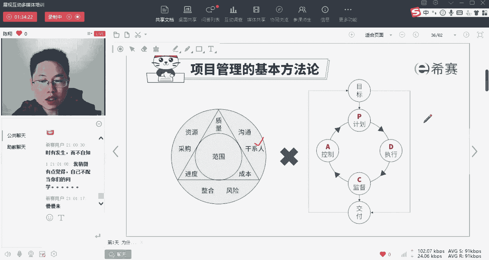

就叫做我们的49个子过程组啊，这个时候呢，我们把五大过程组按时间线从右往左给它铺开，按这个啊十大知识领域呢从上往下给它铺开。

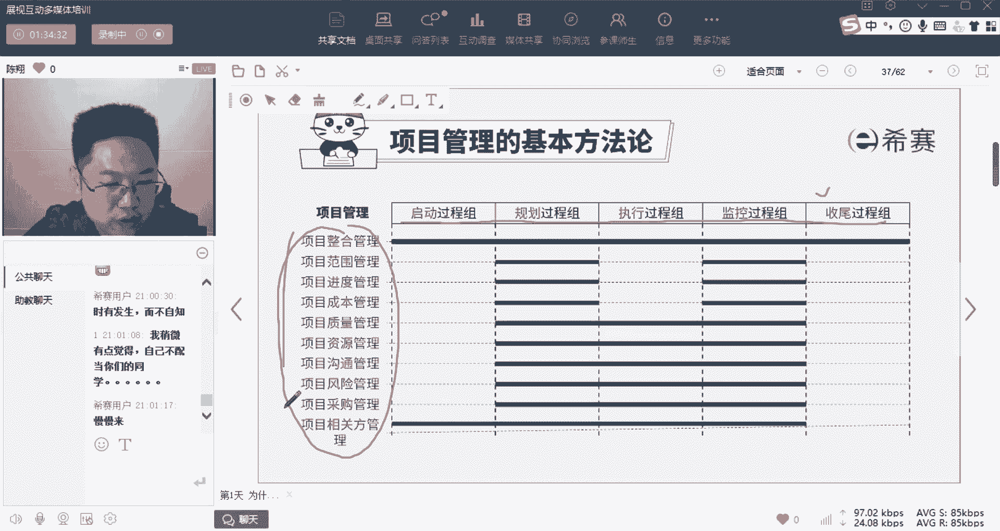

两个东西一交集就变成了49个子过程组啊。

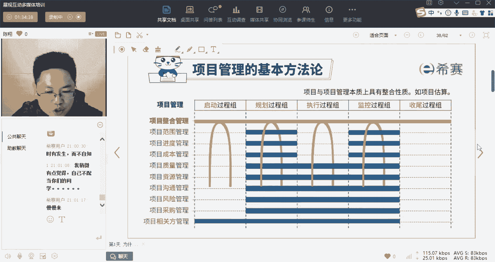

注意是49，不是50，很多人经常问我说5×10，难道不应该是50吗，啊你注意看这啊，它不是一个非常严谨的诶，每个空一件事，有可能这个空上面他的有几个子过程组，比如说规划过程组啊，你在做范围管理的时候。

你的规划动作可能要做四件事情，有些地方完全没有啊，所以呢总共这49个构成主呢，它其实也可以按时间线来排，大致是这样子的啊，那么这49个子过程组呢，就像是一张核查表啊，核对单，核对单是啥呀。

就是你很多事情很复杂的时候，你不知道该怎么做的时候，你就用笔把它写下来，一条一条做的时候就是一条一条check，诶这件事我做完了，那么这张表check完了，这个事你就做完了，那我们做项目管理也是这样子。

任何一个项目呢，他一定会需要你去做到这49个大的动作，那么一个动作一个动作去做到，哎我们要说上要求的标准，你这个项目呢就管完了啊，就管完了，所以是这个意思好，那么这49个子过程组呢。

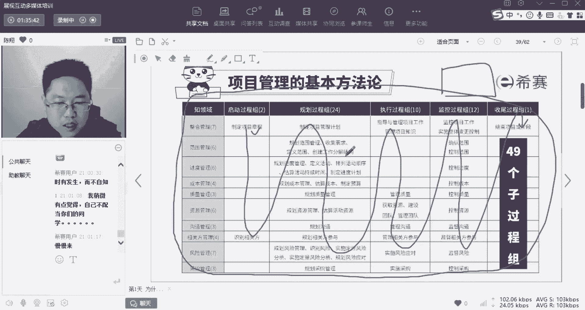

他们内部我们又会给大家讲一些ITTO，啥叫ITTO呢啊，Input output，好技术和工具叫所写字母ITTO。

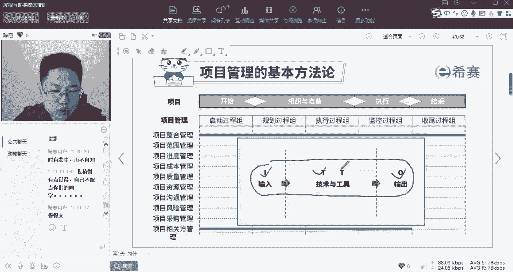

这啥意思呢，我再给你举个例子，比如说我现在教给你一个项目，这个项目是我给你一筐鸡蛋，你把他啊好别急啊，你把它养成小鸡，养成孵出小鸡，养成公鸡啊，砍成鸡腿，做成烧鸡，这个项目你会发现。

这个项目是不是有四个子过程组啊，孵化啊，养大啊，沙雕和啊烹饪，那么在每个过程组，是不是有它的输入物料和输出物料，而且经常是什么呀，上一步输出出来的这个成果，就是下一步我们用来输入的原材料啊。

那么在每一个子过程组中是不会用到的，不同的工具和技术，比如说这个里面啊，你就要用到杀鸡的工具刀和杀机的技术对吧，然后这个里面你就可以用到诶火铲子，盐油盐酱醋和炒菜的技术，这就是我们所说的每个子过程的。

书中专有的工具和技术，那么你做项目管理当然不是用刀这个东西啊。

那是其他的工具和技术了，那么啊比如说啊我们刚才说到的，有一个子过程组叫定义活动，是第六章的第二个啊，那么它下面呢就是排列活动顺序啊，这个就是第六章里面的第三个，那么它就会有它的输入和输出。

在这个活动里面用到的工具和技术，当然有很多地方其实是会有重叠的啊，那么这些东西呢我们叫做ITTO啊，输入输出工具和技术，一般来讲呢就是一些常用的工具技术和文件啊。

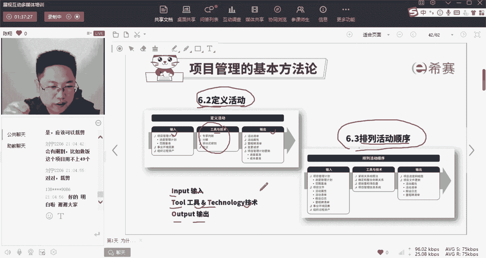

文件模板，OK那么这个就是展开再看，我们就不展开了，好就刚才有人问了，说好，那么我们再来说一下篇部和第六版对是啥呀，五大过程组加十大知识领域，得到49个子过程组，他们的ITTO呢，我给你捅了一下。

大概是啊这个38个啊，输入输出文件和132种工具和技术啊，那么总体构成了一个总体的啊最大的工具包啊，我们叫做PMBOK方法论，是不是好，有人就问了，说能不能啊，是不是都要用，不是的。

你的这个项目是这样的，他跟那个项目是那样的对吧，你根据你自己的进行裁剪，他根据他的进行裁剪，从中选取出最匹配的，你们做这个项目要用到的对吧，你他要钉子和锤子，你要这个油漆桶和油漆。

这些东西呢都在我们的工具包里面对吧，这个东西我们叫做根据你自己的项目特性，进行适配啊，但是我们在教的时候，是不是所有东西都要交交一个最完整的给你好。

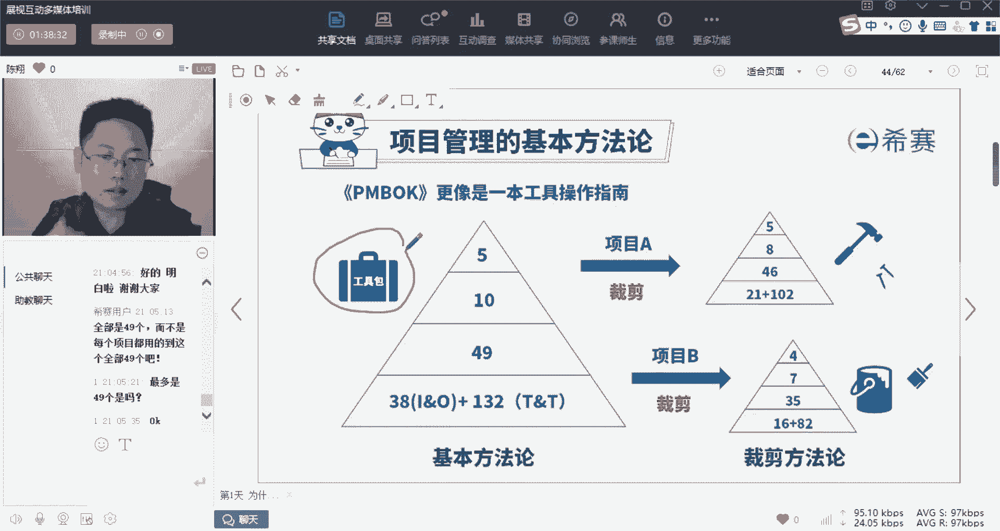

这就是偏book第六版的一个用法，那么我刚才讲了第六版呢，他教的你是站下来固定打固定的靶，那么在乌卡时代，你要变动着打变动的把。

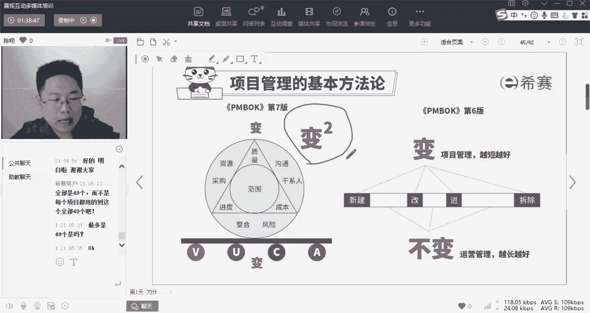

这怎么办呢，这就是要用到的我们的敏捷了啊，就是刚才讲的诶，需求也不清楚，还要多次交付，这么碎，这么啊变动的一个情况怎么来应对啊。

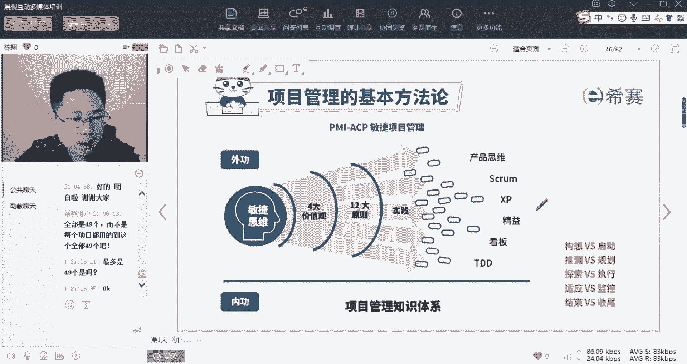

我已经一直在讲预测型生命周期呢。

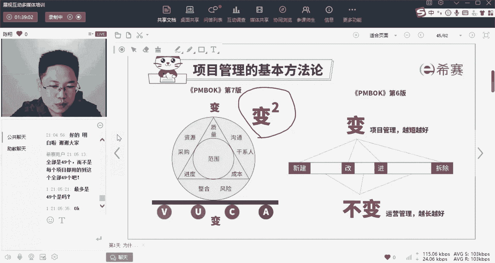

你体验一下它就像一个什么呢，像一个上世纪的这个啊，就是到现在为止六七十岁一板一眼的老嗲嗲，他们做事情呢有张有眼的啊。

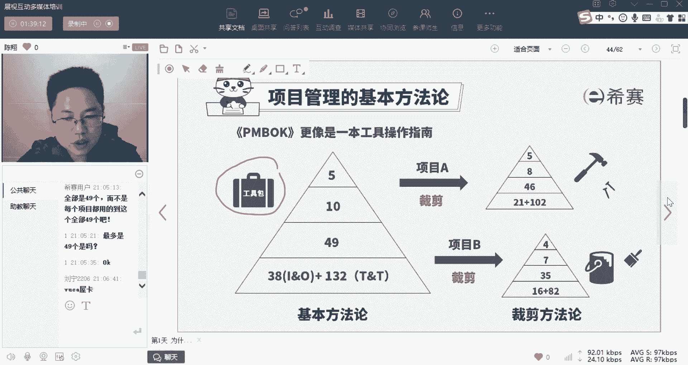

有章有法的，做任何事情都很讲究，哎，先计划再执行。

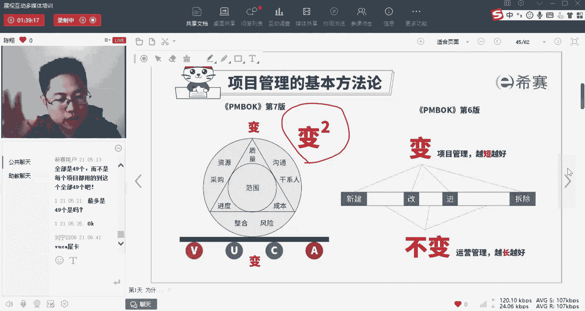

不肯变动很死板，现在这个时代呢就更加像一个唉小年轻，遇见什么事情，抓着耗子就好，猫以我们的最终结果和价值为目标，灵活变通的来进行我们的这个项目构架，那么这个呢，就是我们基于第六版的项目管理体系诶。

在外化为第七版的，敏捷的常见的一些实践和动作啊，那么这个动作是基于我们一些敏捷，价值和原则的啊，这个我们待会儿来解释，所以大家可以理解的就是我们一直在讲，第六版的东西，完全没有颠覆，没有反对他对吧。

因为它是我们做项目管理的内功，你对第六版理解的越深刻，你内功越雄厚，第七版的东西呢，它会给你融入一些外功招式，这是敏捷的变化的对吧，你忘掉原来的这个招式，但是你的内功留存下来了啊。

那么你能把它们使得呢就更有威力，所以这就是第六版和第七版的关系，来预测性和敏捷之间的关系，但是在一些具体的事情上面。

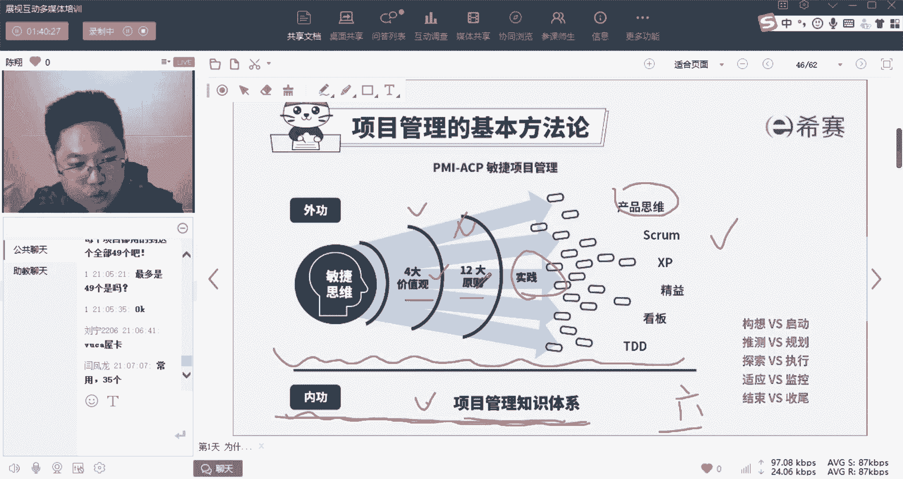

他们会完全相反啊，比如说我们在这儿啊，你看一下敏捷宣言就能体会到啊，预测型的讲就是凡事预则立，不预则废啊，一定要通过规范化的工具和流程，完整的文档诶，合同谈判和遵循计划，这四个词能不能读出一板一眼哎。

讨厌厌恶变化的这种感觉，而呢敏捷宣言就是敏捷项目的话，它讲究什么呢，他讲哎我们要用互动和个体，个体和互动来剩余流程和工具可交付的成果，甚于完整的文档啊，客户合作，剩余合同谈判，应对变更胜于遵循计划。

就是拥抱变化啊，不要反对变化，是不是完全相反啊，那么这个相反，今天我们就不一一展开了啊。

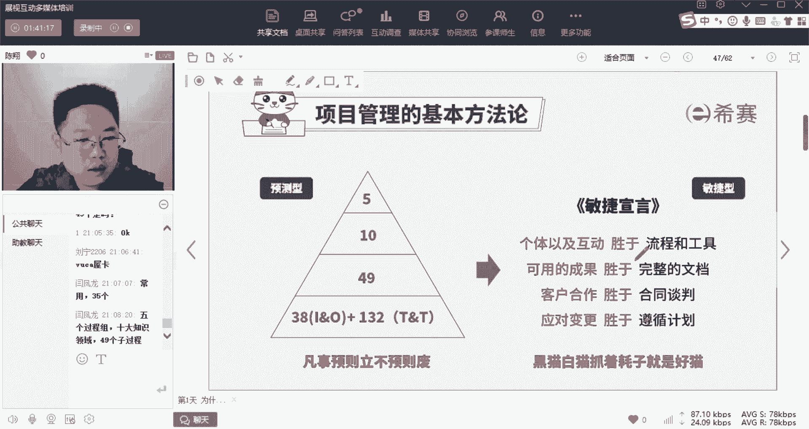