# 【24年PMP考试】零基础也能看懂的pmp项目管理视频教程！ - P11：1.5 项目资源管理 - 冬x溪 - BV1tu411g7UH

我们讲第九章资源管理啊，刚才已经提到了对吧，哎我们项目经理不是一个人在做事情。

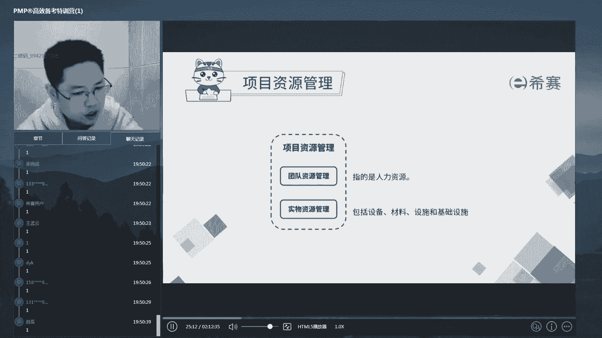

他最要擅长的事情是收集资源，建设团队利用资源，用别人把事给做了，在这儿呢我们先强调一句啊，因为一般来说我们说到资源这个词的时候，我们会说它是代表两类的，一类是人力资源，二类呢是物力财力设备。

资源就是我们昨天讲的人机料法环，除了人以外其他的资源，但是呢在我们啊PMP这个里面，因为他是教大家做如何做管理，而不是如何做技术管理，做技术管理的，跟材料设备打交道啊，做人的管理。

是我们现在所说的这个小小范围的管理，所以呢在整个pp里面，在整个第九章啊，或者说在pp里面，一旦你看到资源二字，你可以马上把它跟人力啊等同起来，比如说我们经常会这样的一个语句的表达。

叫哎我们现在这个呃部门的资源不够，请啊从别的部门去调配一个资源过来对吧。

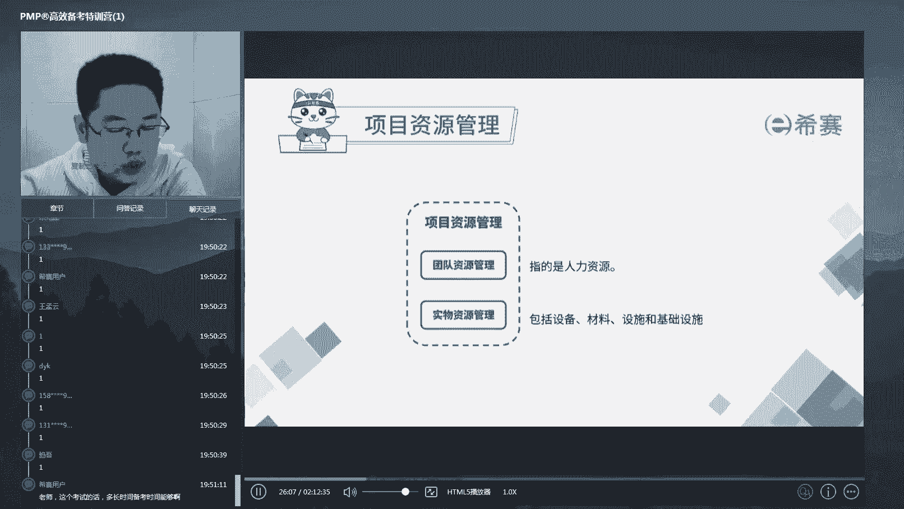

这句话说的就是调配一个资源。

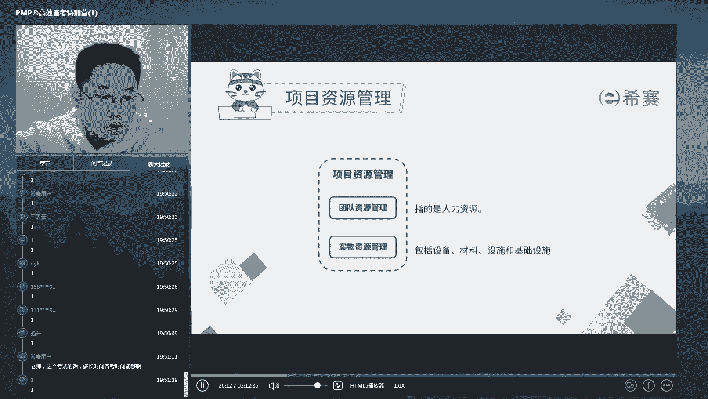

就是调配一个专业技术人才过来啊，所以在这资源等于人啊，这是一个那么关于人力资源怎么管呢。

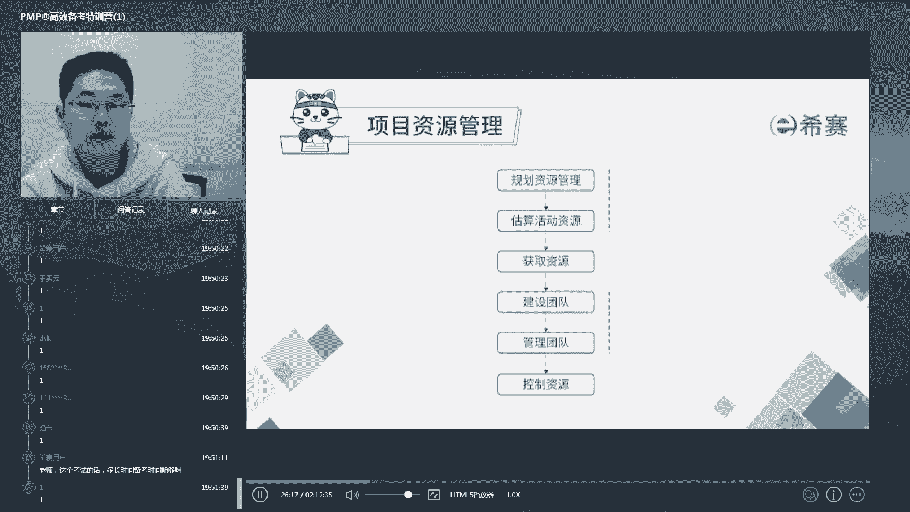

我们昨天是不是说过了，pm book给那里49个子过程组，在每一个领域里面呢分为了几个子过程组。

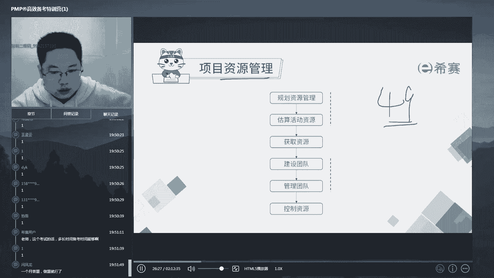

哪个子过程组呢，就是你在做这件事情的时候的几大步骤。

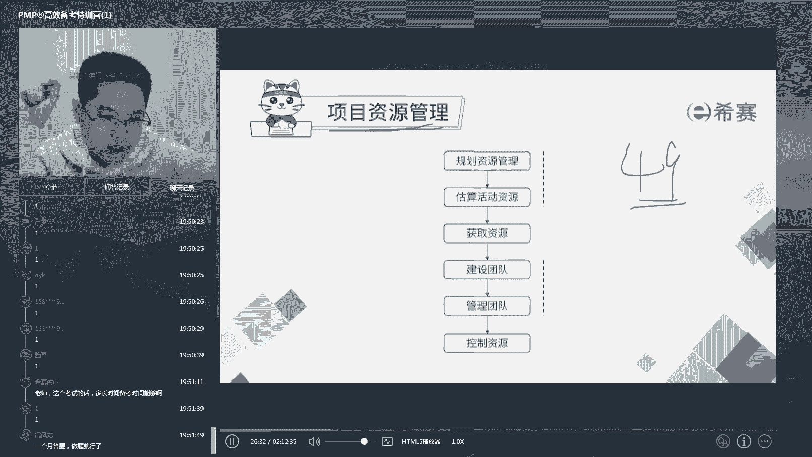

它可以作为一个核对单来作用啊，那么这个地方我们列出了有六个小步骤啊，子方程组他们分别是规划资源管理，估算活动资源来获取资源，建设团队，管理团队和控制团队啊，他们分别什么意思呢，其实很简单啊。

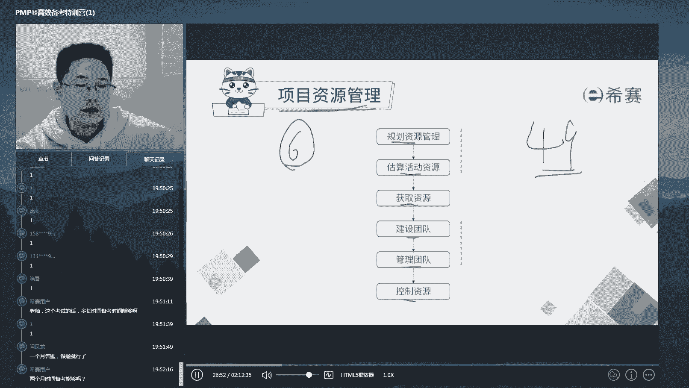

就是说我们是不是说过，在做任何一件事情之前，你首先得去做计划，那么你得了解一下我们这个项目，比如说领导安排给你给他说小陈啊，明天你带着几个人去坐坐某一个项目诶，那这个项目到底是大是小，有什么特性。

需要怎样的专业人才估摸一下诶，你这个项目啊怎么做，那么在此之前，是不是要做好怎么带人的这个计划，然后呢，基于这些计划估算一下你们到底要几个人，要什么类型的人啊，那么再从老板那。

或者是从人事部那去获取到这些个资源。

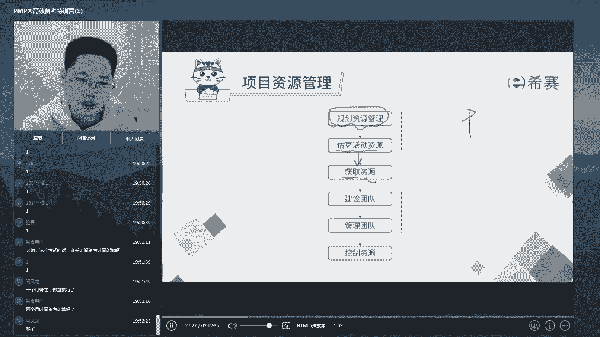

好人都来了。

带过团队都知道最难迈过的就是什么，就是团队刚刚组建的那一刻，互相都不熟，我们说什么呀，人在一起心不在一起叫团伙对吧。

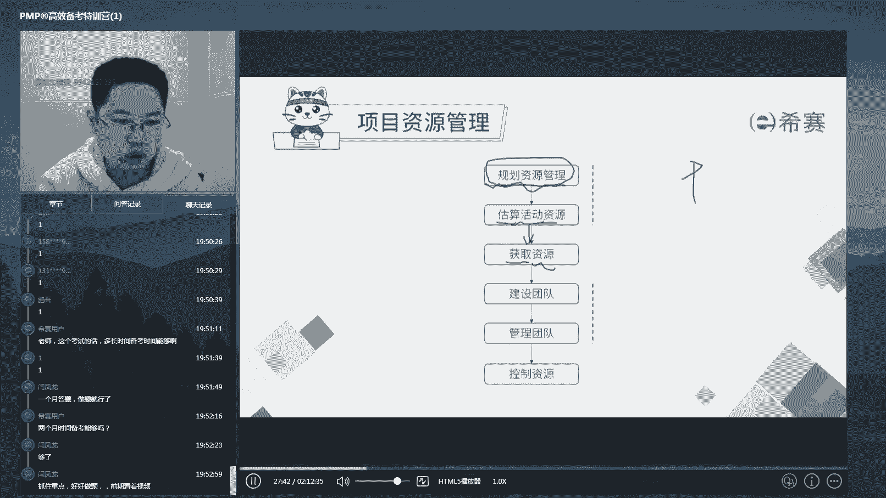

你人在一起心也在一起才叫团队，所以呢我们获取到资源和在利用他们之前，一定有一个建设团队的这样一个过程，让他们的心也在一起，好新建一起了，团队打造好了，这个时候呢就能够带着团队去冲锋陷阵了啊。

那么怎样在打仗的过程中管理我们的团队，又是一个步骤啊，那么在这个过程中我们一定会出现变化。

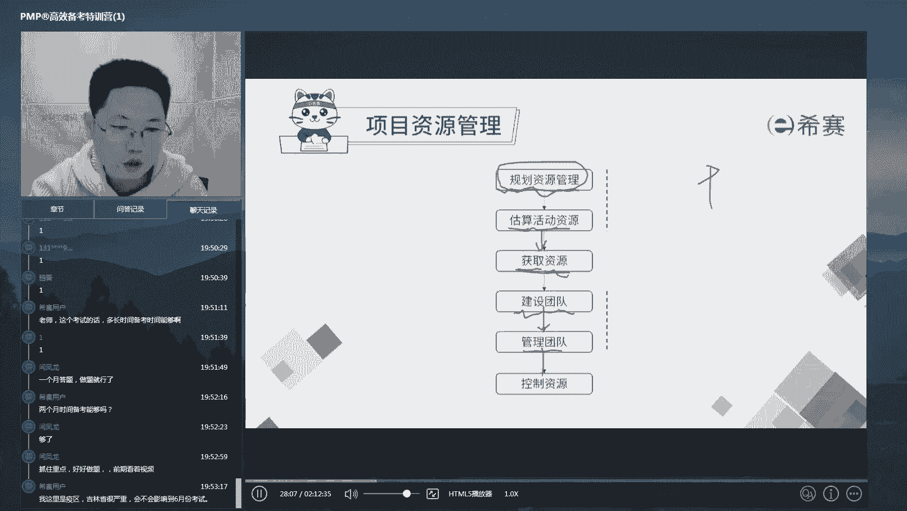

对不对，我们在每一个子过程组中，都未出现跟计划不相符的误差变化，留了我们的操作余地，那么这个呢就叫做控制资源诶，一开始估算少了，或者调过的人不符合你的要求，或者有人生病了，有人辞职了等等。

那么怎样在动态的过程中来，确保这个东西的掌握在你的掌控范围之内，那么这就是控制资源好，那么这六步呢如果我们都做到了。

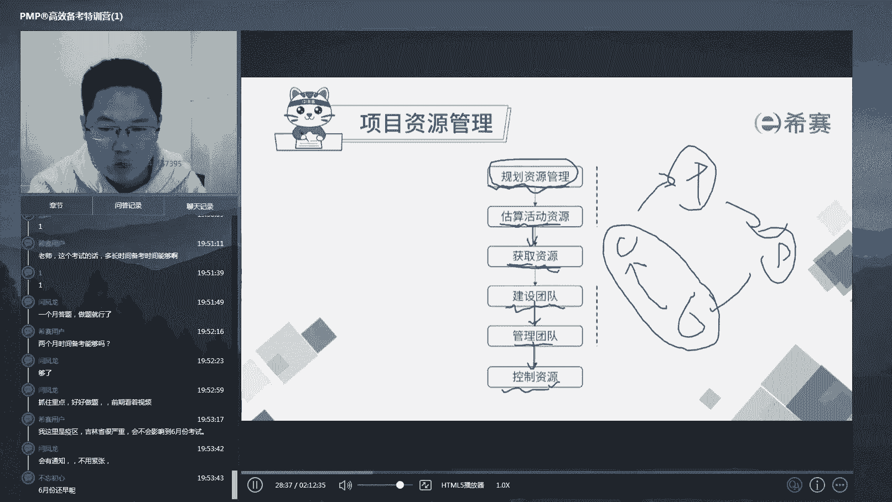

那么对于资源管理这件事呢，基本上也就OK了啊，那么整个这一章节的展开呢，就是围绕着这六个小步骤进行讲，他们ITTO啊，今天呢我们在每一个步骤上挑出考点最多。

实用性最广的几个关键点。

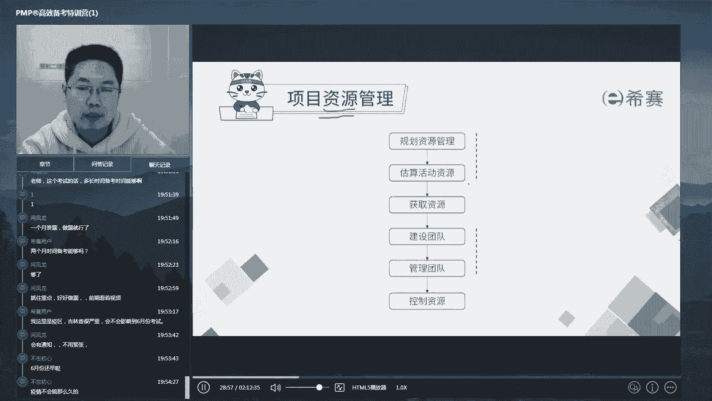