# 【24年PMP考试】零基础也能看懂的pmp项目管理视频教程！ - P15：1.9 规划资源管理--建设团队（上）-团队建设五阶段 - 冬x溪 - BV1tu411g7UH

人在一起了，对不对，哎心不在一起，这是团伙，那么怎么样把他们建设成团队呢。

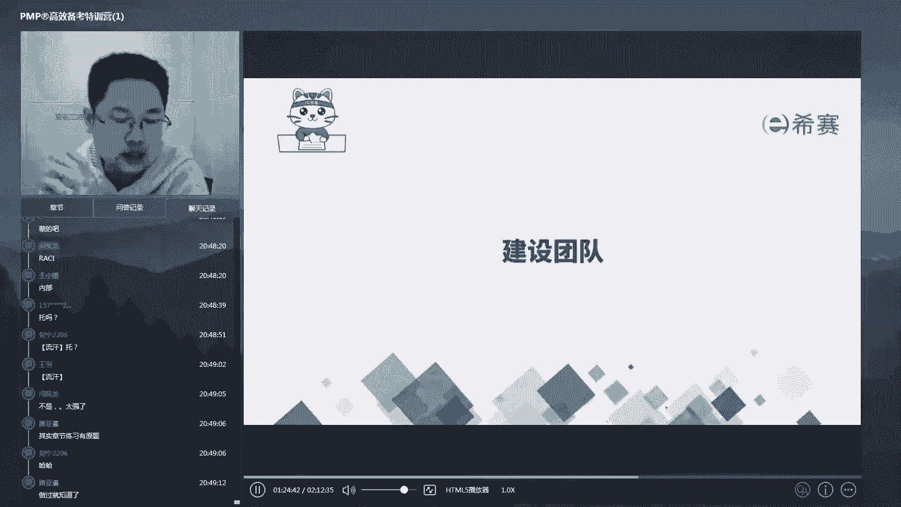

啊我们讲一个特别呃有效也通用的工具。

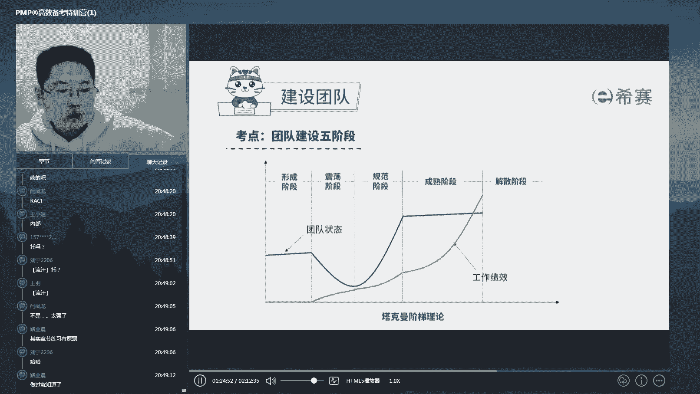

就是呢讲团队建设必然会讲到的一个工具，叫做塔克曼阶梯理论啊，塔克曼阶梯理论呢他就是告诉我们说，任何一个团队他从初始诶到哎成熟到解散啊，就是从生到死，一般会经历五个叫做形成阶段，正当阶段，规范阶段。

成熟阶段和解散阶段啊，这个其实特别好理解啊。

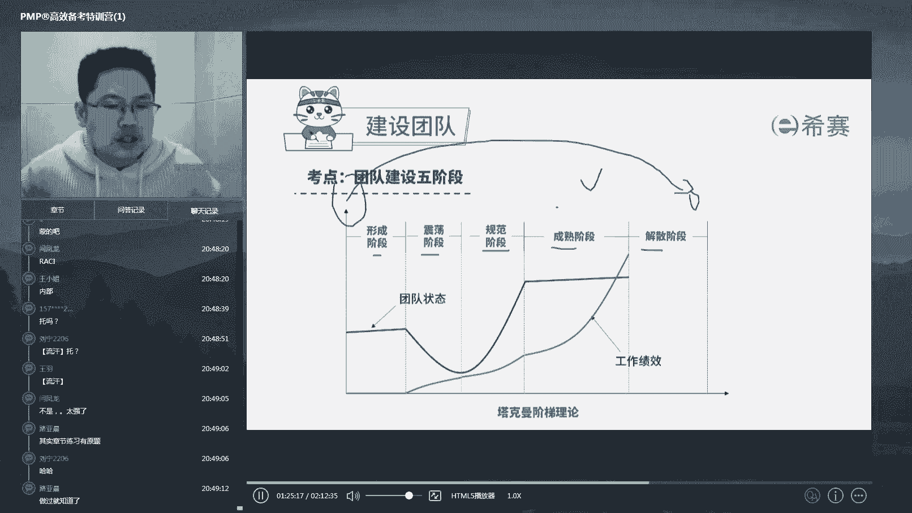

比如说你如果看超级英雄的电影，你就会发现超级英雄电影他一定团队组建，有套路对吧，然后呢如果你比如说这个比如说这个西游记，西游记就是一个典型的团队组组建的一个套路，是不是刚开始大家来自四方哎。

对这件事情呢没有认可，也没有厌恶，但是呢随着我们诶相处了一段时间以后，开始彼此的看不惯，比如说孙悟这个了，这个唐僧就看不惯孙悟空是吧，觉得他打妖精，还觉得他又又又怎么又凶又怎么样，是不是。

然后呢这个猪八戒和唐僧之间啊，猪八戒和孙悟空之间是不是经常发生冲突，所以任何一个团队啊在相处了一段时间。

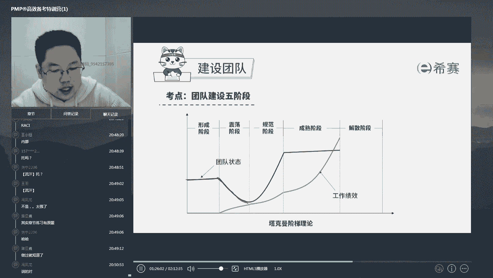

在初期都会吵架，都会震荡啊，这就跟我们谈恋爱一样，是不是你一开始跟你女朋友相处的时候，没什么感觉，相处一段时间之后，他发现你袜子乱丢，身份习惯也不好，怎么怎么样，然后就开始吵架，但是注意对吧。

这个一定会过去啊，只要我们彼此的心是真的。

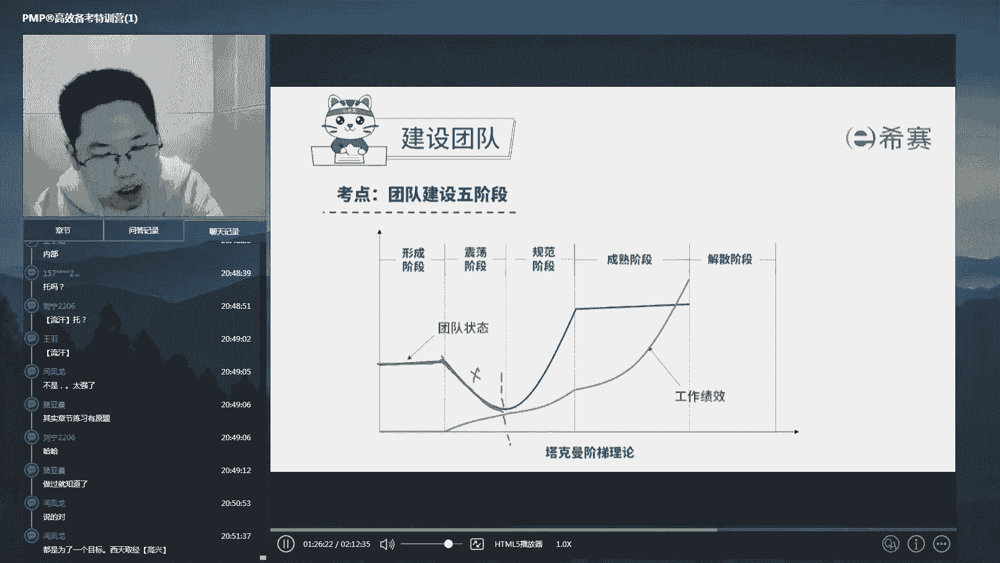

只要我们彼此啊都是为了共同的一个目标来啊，追求，那么呢应该是怎样，应该就会迈过这个震荡阶段，又开始发现彼此的好，又开始彼此适应，了解彼此啊，那么这个我们叫规范阶段，直到呢我们形成一个诶已经很熟悉啊。

已经很规范的团队，这个时候呢我们进入成熟阶段啊，那么在成熟阶段，我们才开始真正的做有效的事情，那么这条线呢是团队状态的一条是一曲曲线，那么整个团队的生产绩效呢应该是这样子对吧。

刚开始组建的时候还没开始干正事的，那么没有效绩效出来，那么震荡阶段呢虽然彼此在冲突，但是已经开始干点事了，所以绩效在增长，但是脚缓慢，规范阶段呢主要的动的这个工作发啊，这个发发挥在团队组建上了。

所以呢绩效的增长也是缓慢的，直到我们的进入成熟阶段，你的这个绩效团队呢才可能突飞猛进，直到你把这个啊项目干完，但是我们说了对吧，呃天下无不散之筵席啊，一定会有解散的这一天解散了，那么就没技巧了，当然了。

有些比较，比如说我们几个人哎，干顺手了就不想离开彼此了，哎我们一起再接下一个这个项目，接下一个项目可能就没有前期这些阶段了，好，但是一般一个正常的由生到死的，这个项目的团队都经历过这五大阶段。

好好这五大阶段我们都知道它是什么了，那么对于我们作为项目经理而言。

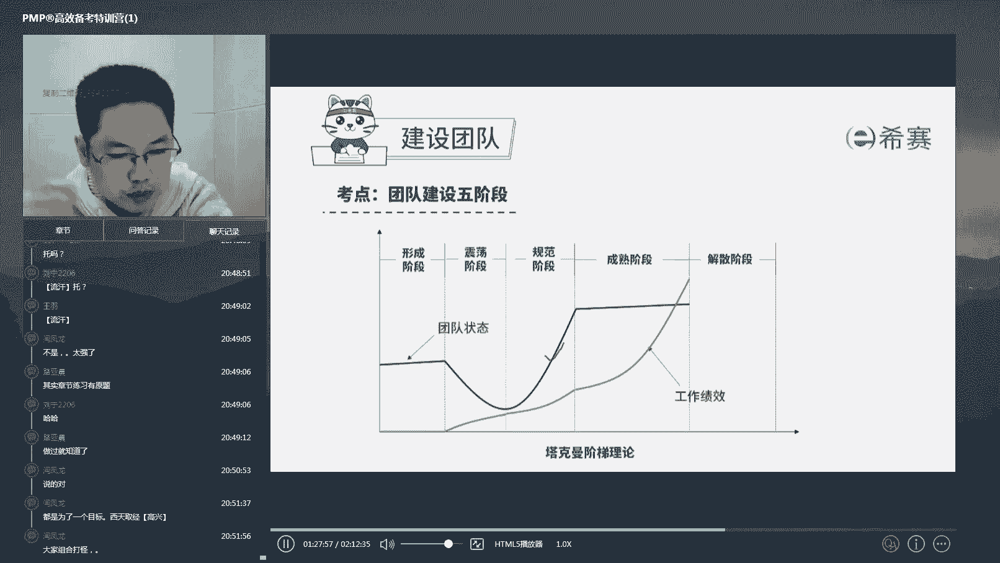

有什么用呢，啊我们再来看一下啊，那么五大阶段它说明团队所处的时间段不同，它的环境不同，那么项目经理呢，应该要给予的这个管理行为也不同，这个地方呢我们介绍一个情境领导力模型啊。

也是我们ITTO里面的一个这个模型呢，它的核心总结起来就两个字叫全变啊。

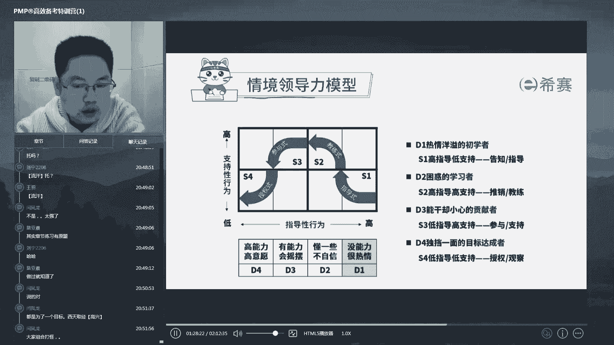

权变是啥意思呢，啊就是其实呢我们科啊，就是说这个科学界有一个说法叫做，一旦当某一个学科或者是一个人说诶，你们要有全面思想的时候，就说明他们已经对这个学科失控失去掌控力了，因为他翻译过来就是见人说人话。

见鬼说鬼话啊，他就是强调不同的情境要给予不同的匹配的，恰当的一个应对方式，那么什么不同情境呢，我们把你的员工的状态按两个维度。

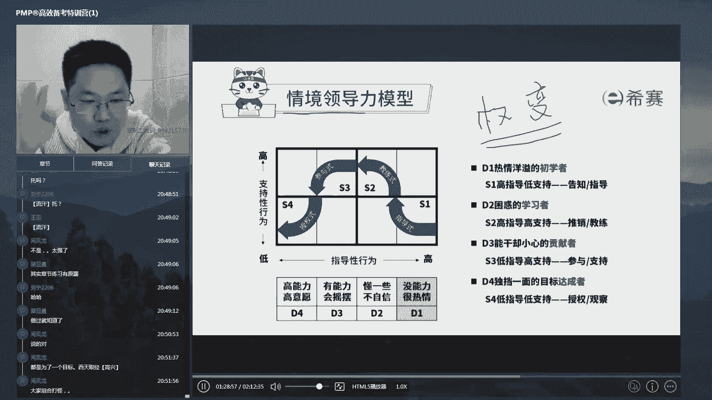

又划分了四个状态啊，四个象限叫做这个初学者啊，学习者贡献者和达成者，什么意思呢，说的是热情和能力，刚进公司的新人对吧，一般来讲呢哎情绪比较高，想做事，但是呢不会做事，所以这个时候是初学者好。

那么发展一段时间之后，热情还是保持在的，这个时候呢诶会做一点点事儿了，但是呢叫懂一些不太自信，然后呢再往前发展一步诶，能力已经初步具备了。

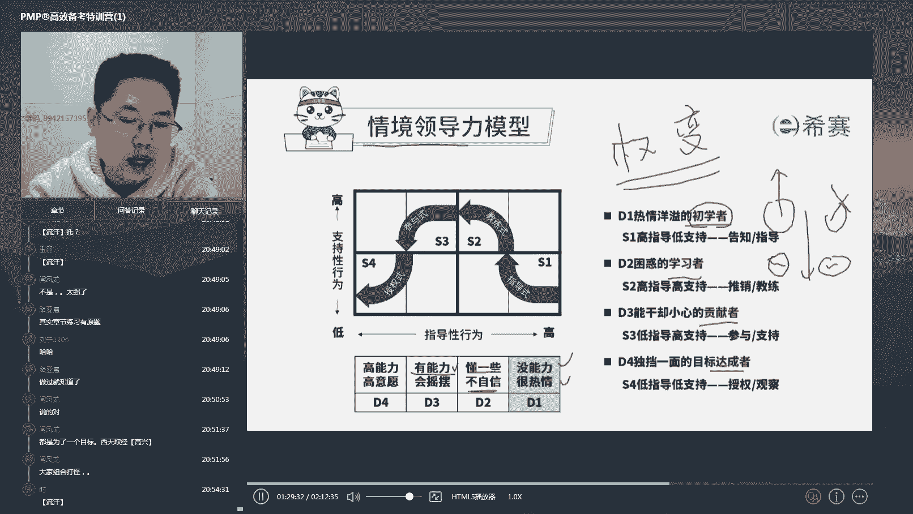

但是呢还不具备直接独木支撑，就是独当一面的这个能力。

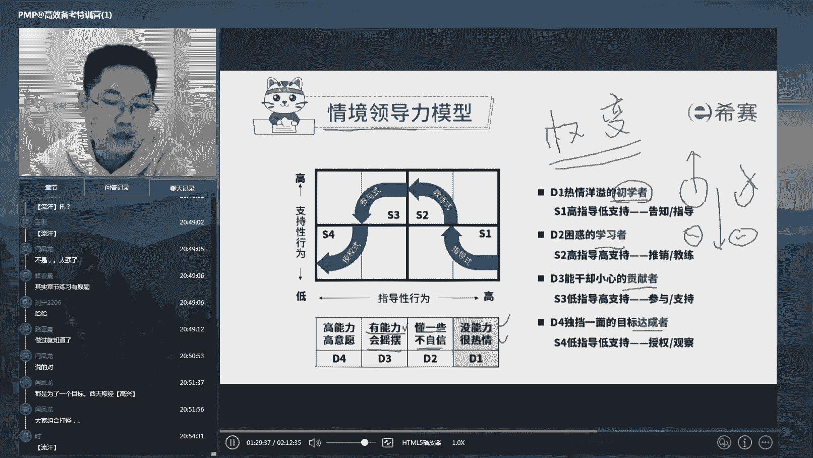

好到了最后它发展成了既有能力又有意愿，能够独当一面的支撑性人才对吧。

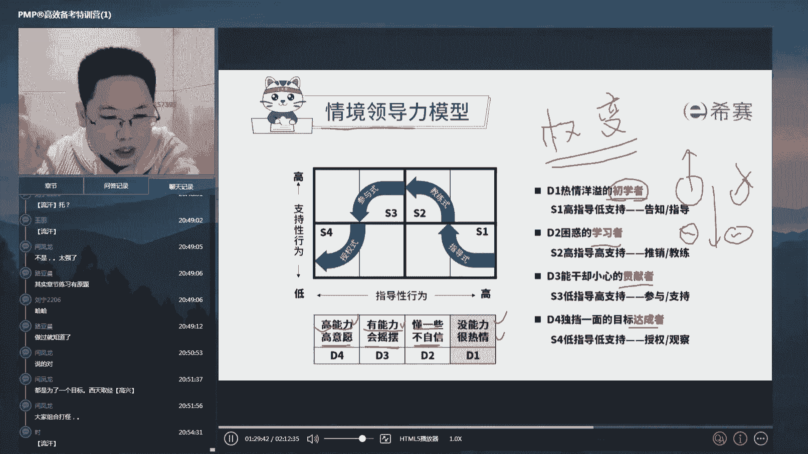

那么任何一个人他只要在上升的路径上呢，应该就是处于这四部中的一部，那么作为领导而言。

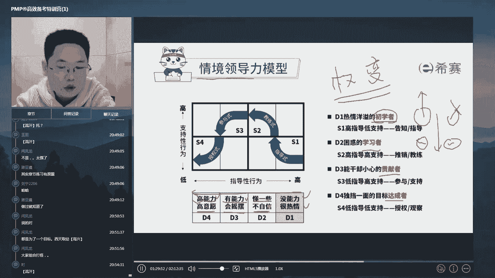

对于每一个不同阶段的人，不能够用统一的这个领导模式啊，那么我们把您的模式呢，就按照指导性行为和知识性行为分为了四个。

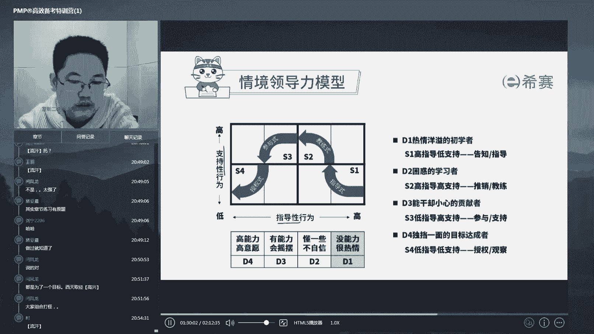

比如说对于第一类人，我们应该用强他指导的低支持的，啥意思呢，就是说这个人进来了，因为他什么都不知道，他希望也需要一个人非常明确的告诉他，什么事能做，什么事不能做，能做的事一定是哪几步。

每一步做到怎样的标准，你不要有太多的这个自己的创造啊，发明创造，你先把唉我们已经非常成熟的行为做好了，这叫指导对吧好，对于这种人呢，诶他随着你给他指的路啊，模子一个模子一步脚印的去做了以后，到了第二步。

自己这个时候有些轻，有些这个想法了，好这个时候你就可以放松一点指导，加强一点支持，意思就是说好，我示范给你看了，唉你也跟着我做过一遍了，此时你自己再去试，不要怕做错，我在你背后给你支持，给你支撑。

但凡你感觉要摔倒了，你赶紧到我这来，我给你扶一下，是不是，这个时候呢我们管它叫教练式啊，就是仍然有指导行为，但是呢已经加入了很多支持性行为，给我们的员工有了一定的自我尝试，自我试错的机会和空间。

好再往前进一步呢，唉其实他的能力已经够了，但是呢他还没有胆量去独立支撑，这个时候我们要进一步减少他的，你的指导性行为给他松绑，让他更多的鼓励他去做，虽然有错，也不要批评他，但是呢要让他自己去攻伐。

去征战，去获得成功，来建立起自己的自信感，那么到了最后只有这样培养完之后，他才能够成为一个诶双高人才，独当一面的人才，这个时候你完全可以放松，既不指导也不支持，什么意思啊，你自己去干就行了啊。

你自己去看，因为你已经具备这个能力了，这个时候你就才培养出一个对吧。

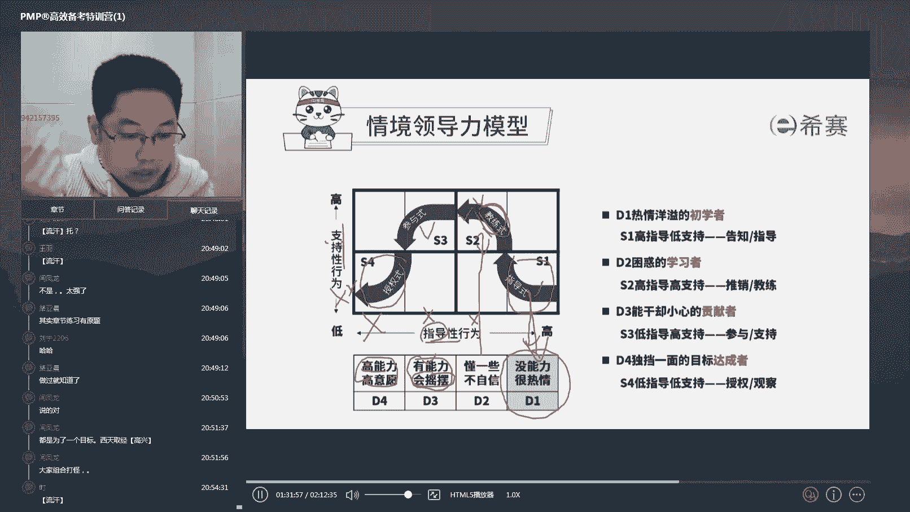

一个教材啊，一个教材好，那么这就是我们所说的全面，对不同的阶段和这个呃状态。

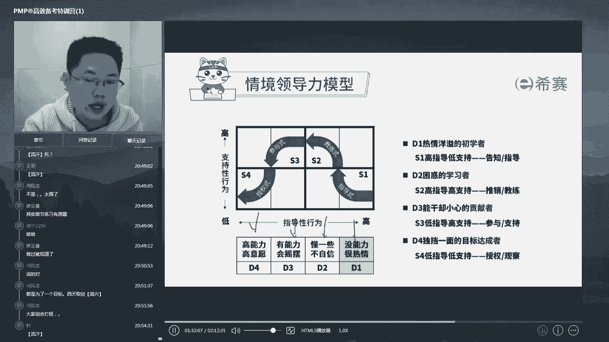

用不同的行为，那么这四个听上去很简单，做起来很难，因为我讲了两个反面教材啊，我接触过很多，包括我自己一般来讲，要么一个人呢他是从头到尾强指导，这个典型现象就是什么呢，哎你作为个新人进去的时候，诶。

这个领导很强势，什么东西都得按他的来A，因为你作为新人，你需要人教，这个时候你很舒服，但是当你过了两三年，你其实已经有了自己的一些方法论了，结果这个领导呢不接受。

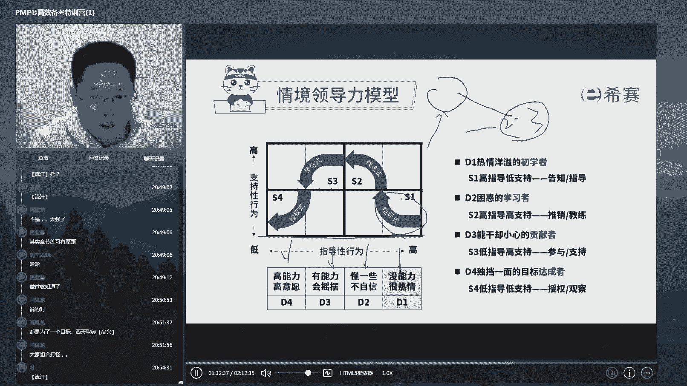

你，还是得按领导一分一毫都不能变得来，是不是，这个时候如果跟他出现冲突，他就会骂你是吧，永远指导性。

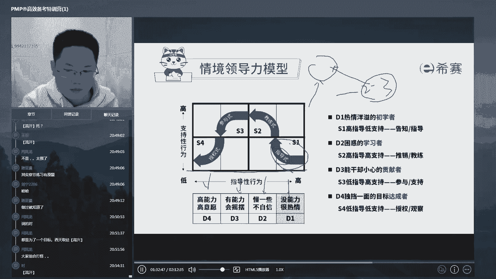

我们把它叫做A类啊，那么或者永远受全新。

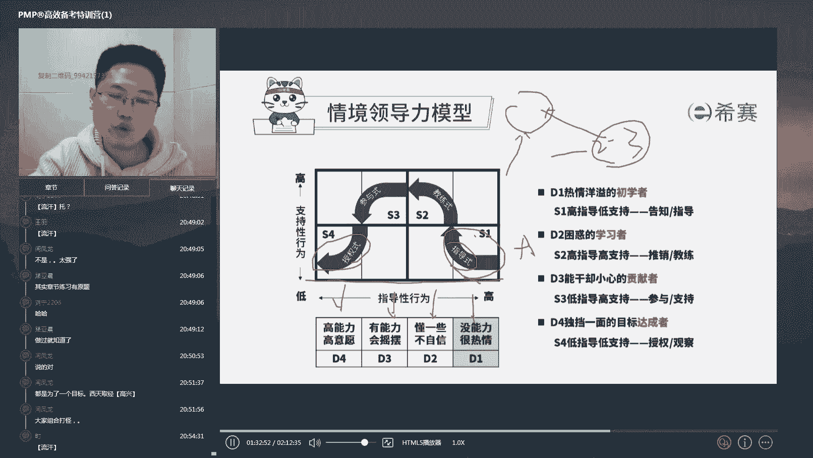

我也接触过不少，就是这个领导，一般新人领导经常会这样啊，就是员工进来之后。

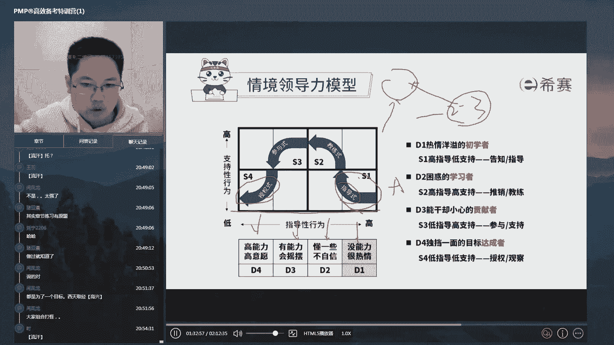

他就跟他们讲，诶，我呢啊也就是这个人最好了啊。

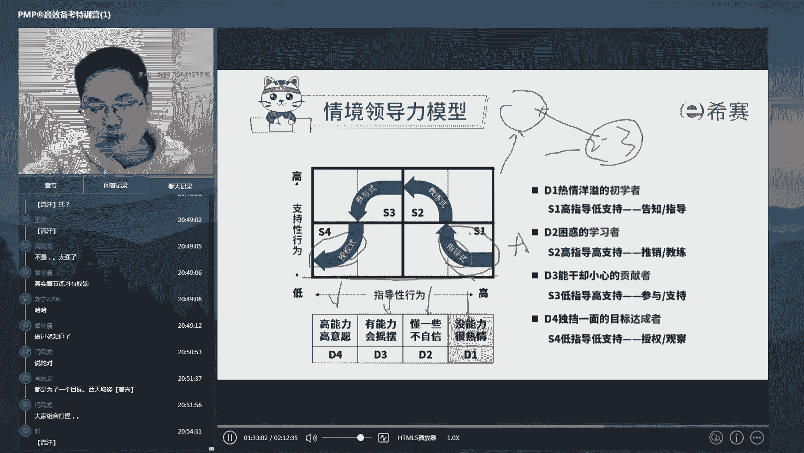

我都不怎么管你们，我都特别相信大家能够按照自己的意愿，成长为自己喜欢的人才，我只会在我自己的范围之内诶，做好我自己是给你们做优秀的榜样，你们呢跟着我屁股后面能学多少学多少，我相信你们加油，是不是这样的。

叫B类领导，这两个是不是显然典型都都不对啊，那么问一下大家对吧，你们自己或者是你身边的领导，有A类的吗，有B类的吗，还是说能做好这种整个过程中的管理的，全面管理的啊。

有C类的吗，我们调查一下啊，看一下我们中国现在啊实践中的领导力。

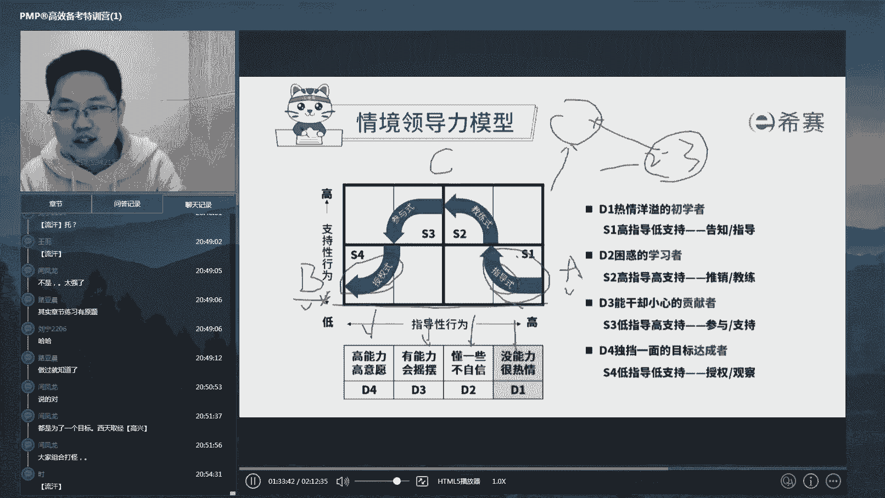

我一般来讲呢我们聊了这么多学员啊，朋友们啊，要么A要么B要么领导过于强势啊，一点别人的空间禁言的空间都不留，要么呢过于放羊啊，打着相信你的名号对吧，打着相信你的名号啊，其实就是不教你。

打着授权的名义就是不教你是吧。

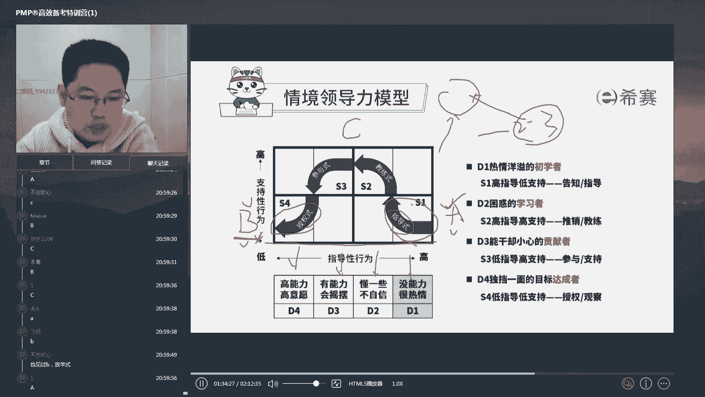

所以呢回到我们刚才这对吧，回到我们这儿是不是针对不同的人聊不同好，刘宁说得好啊，他们的领导考完PPMP以后，开始懂得放权了，OK那我们这就应该怎么样的问题，看在形成阶段的时候。

这个时候是不是大家其实都是新人进来，对于这个团队该干什么，对于这个团队的规章制度是怎样的，都不知道的情况下，你是不是应该用强指导性诶，这个时候作为项目管理者，主要做的工作就是建规则，建制度与流程。

定标准，并且尽可能的把它书面化，并且把这些书面化的东西啊培训下去哎，共识下去哎，让他们知道自己该干嘛好，到了震荡阶段了是吧，你还得尽以继续来操作刚才的事情啊，但是呢你得放开一点，不要害怕诊断和冲突。

因为只有震荡和冲突了，才能够把自己内心的真话说出来，这个时候要善于去解决冲突，协调冲突啊，好那么影响性再往后走一步呢，在规范形成阶段是啥，叫规范形成，就是你做的那些东西，已经逐步的被大家所接受了。

那这个时候呢应该放手了，让他们去试啊，参与性，让他们去试，给他们更多的这个支持，而不是指导好，到了成熟阶段了。

是不是这个时候大家已经融为一体了，有了自己习惯性的高效的做事方法，那么呢你这个时候就应该要懂得授权了，就刚才讲的不要这个时候还事事亲力亲为对吧，授权出去自己去干更重要的事情好，有人说别让他太好就飞了啊。

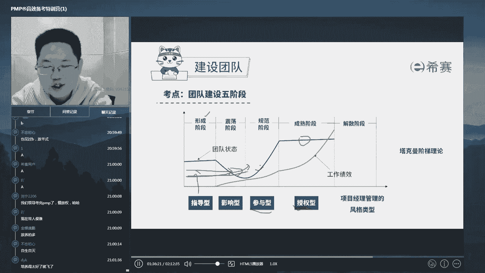

那这就是这个你们公司的这个晋升制度啊，还有这个薪资结构的问题了，这个我们啊以后再聊好，那么所以呢我们说全变形的这个情境性领导啊，应对我们塔克曼的五种阶梯理论，这是我们的一个实践，那么回到考试呢。

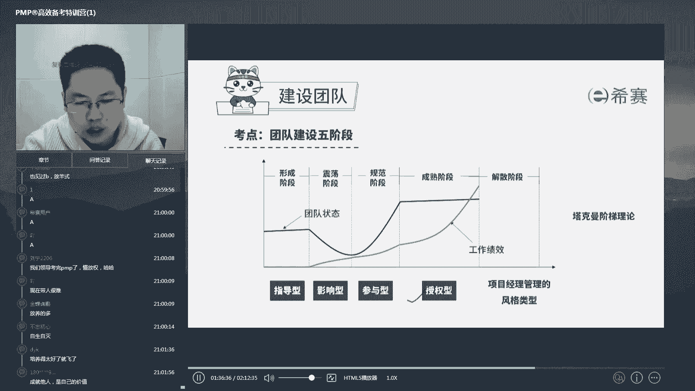

其实就特别简单啊，就其实就特别简单，就是诶给你一个现象描述。

问你这个现象分别属于哪个阶段，我们来做个连线题啊，注意啊，连线题呢我们现在国内考试还没有啊，我们先体验一下，那么左边12345，右边ABCDE看怎么样匹配是恰当的好。

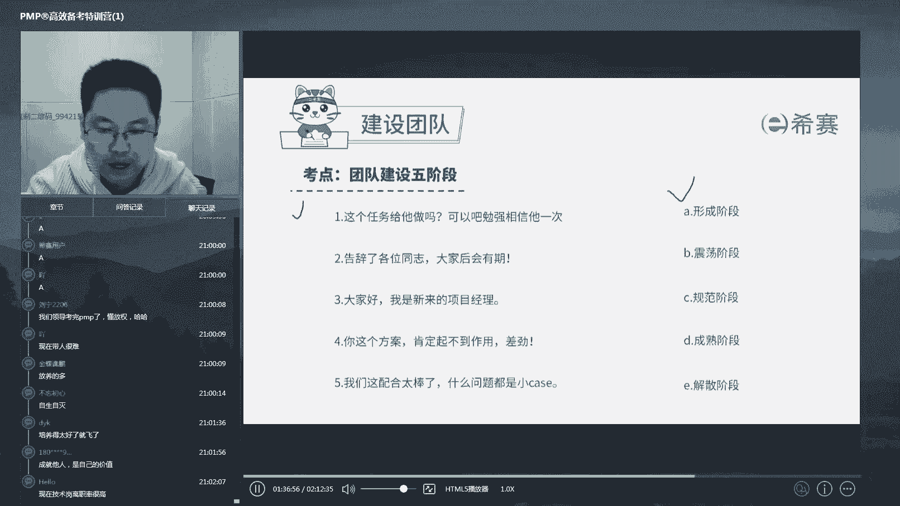

我们来看一下啊，来看一下，我们还是按时间线来对吧，首先形成啊，大家好，我是新来的哎，互相认识啊，很高兴第一天见啊，nice to meet you是吧，这个啊就是三对A，第二个呢震荡啊。

互相认识之后开始做事情了，发现哎呀你不行，开始互相否定啊，你不行，你这个东西差劲等等啊，震荡阶段四是连B，然后呢逐步规范了啊，试了一段时间之后诶，有一些想相信他们的意愿了，这个任务他能做吗。

还是相信他一次吧，让他试一下，逐步的进入规范，然后呢唉解决了规范，解决冲突诶，已如化境，如鱼得水啊，我们配合太棒了，我们是一个team，We are family，we are family是吧。

伐木累啊，我们是成熟阶段，最后东西告做完了唉，喝了顿散伙酒啊，和这个散或酒之后啊。

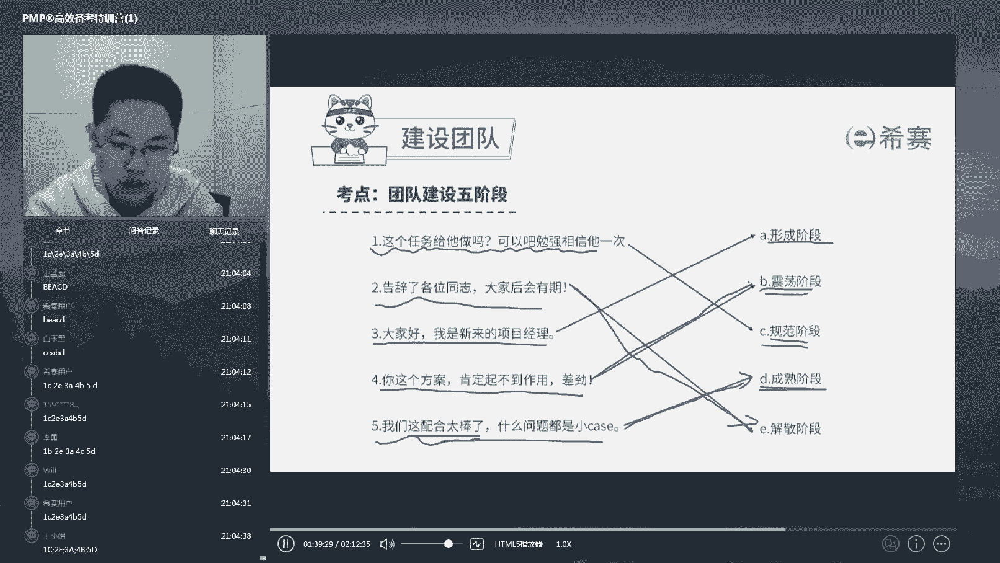

后会有期解散，所以这五句话呢就是这个啊，我们现在考的是选择题，所以不会这样来考大家，那么怎么考，就很简单，给你一个背景啊，把里面一句话进行扩充，问这个动作现在是属于什么阶段来做的事。

发生的情况让你识别判断啊，然后你作为项目经理呢，在现场的时候，就要基于你们现在团队的一个状态，给予与更合适的一个啊管理行为啊。

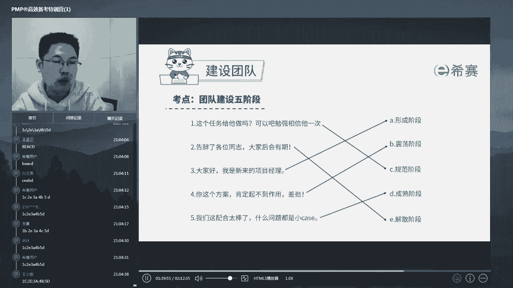