# 【24年PMP考试】零基础也能看懂的pmp项目管理视频教程！ - P21：1.15 敏捷项目管理--仆人式领导（上） - 冬x溪 - BV1tu411g7UH

这道题啊，大家看到了啊，然后。

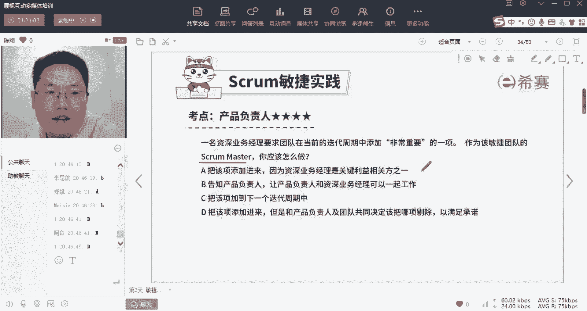

对这道题大家看到了大部分的人呢选错了，没关系，我就是问了你错的啊。

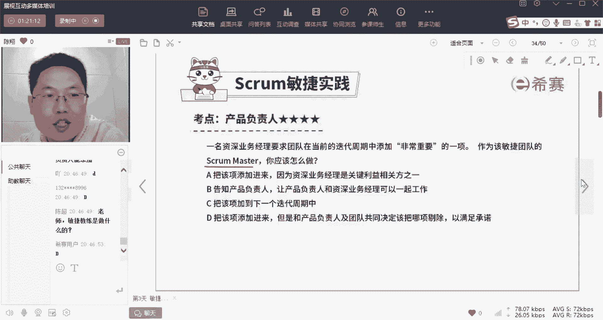

那么这道题我们先讲完什么是敏捷教练，你再回头来看这道题啊。

那么很多人对于敏捷教练这个身份呢，特别容易弄不清楚啊，我们先讲什么是敏捷教练，注意首先我给它一个定义，敏捷教练绝对不等于项目经理，很多人会把它误解为项目经理，那么我说一下他之间的区别。

项目经理呢是一个项目的管理者，他是高高在上的，他是自上而下的发布命令的，做领导的这样一个角色啊，而敏捷教练呢我们经常用仆人式领导，它是自下而上的，通过服务，通过辅助来引导我们团队成员。

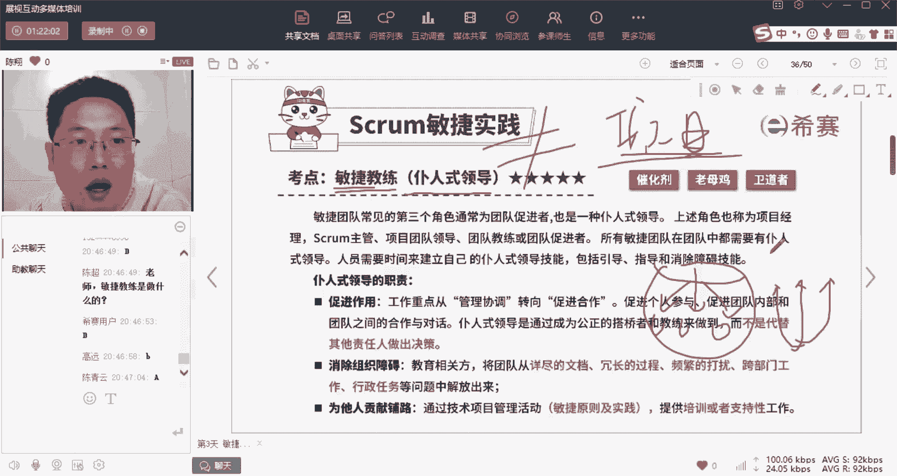

辅助他们完成这样的一个角色，那么如果你打过游戏的话，打过手游什么东西，你就能够理解有一个角色叫辅助，对不对，哎游AADC是吧，有这个主公者，你那只是一个辅助角色而已啊，比如说什么叫敏捷教练呢。

比如说你就这样想象啊，在你的团队里面，如果你是踢足球，踢篮球啊，你打篮球的打篮球，你有五个超巨的队员，比如说乔丹啊，麦麦迪，科比奥尼尔等等，这五个詹姆斯，这五个人组成一个球队。

你呢只是一个他们的教练而已，你并不牛逼，所以你的团队本身就已经很牛逼了，轮不到你来对他们指手画脚，他们但凡做了什么决定，一定都是对的，所以呢你只要起到辅助作用就行了，给他们端茶倒水。

在它热的时候给它扇风，哎在他们需要什么那东西的时候，能够及时提供外面的记者要来吵他的时候，你给他们拦一下，总之当你理解敏捷教练这个角色的时候。

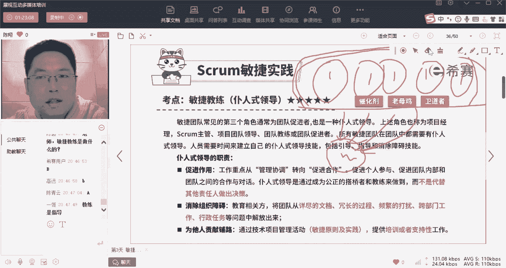

你带着一种弱的感觉就对了啊就对了，所以呢我把它叫做什么呢，第一个叫催化剂，啥叫催化剂呢，我还记得高中化学反应对吧，元素A和元素B反映了A进得到了一个结果C，这个时候他们的速度很慢，反应速度很慢。

如果我们往里面加入一个催化剂的话，诶反应速度加快了，但是注意没有这个催化剂，它不参与反应。

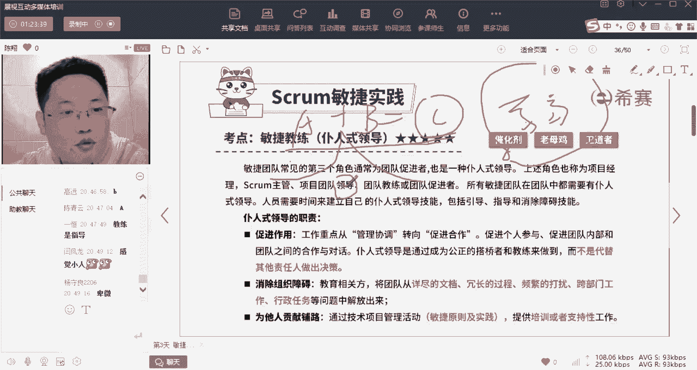

他不参与反应啊，所以呢我们来再读一下。

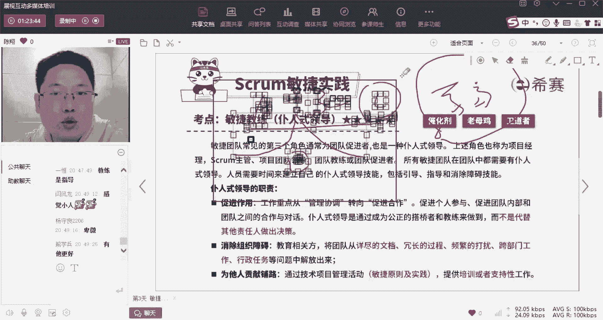

关于敏捷教练这个定义啊，工作重点从管理和协调，这个管理协调是不是，就是原来我们说的项目经理的角色转向了，促进合作，促进个人参与，促进团队内部和团队之间的合作与对话，通过作为一个公正的搭桥者和教练来做到。

而不是替代他人做出决策啊，啥叫不替他人做出决策呢，我给你举个例子，比如说呢假如啊我跟我领导诶，我跑到我领导面前说，领导啊，现在有这么一件事发生了一个问题啊，那么领导就问我说，你对这个问题怎么分析。

怎么看，我刚才说哎领导这个问题呢，我是这样看的，他现在是这么一个原因，我认为呢有1233种解决方案，领导又问我说，那你觉得哪种方案更好，哎我说我通综合比较之后各有优缺点，但是我认为二是现在最合适的。

我觉得二最好，这个时候领导是不是就说行，我相信你，你很强啊，你很强，你觉得二好，我就支持你去做2号，你去做二啊，那么我再问你一句，你做二的时候，需要我为你提供什么支持或者辅助吗啊。

然后我就告诉他领导我做二的话，我缺这个资源，然后呢那边有个人对我造成了阻碍，我希望你能够给我把这个资源搞来，帮我把那个阻碍消除，领导说行，那你去做，我给你打打下手，打辅助哎，这些问题我来解决。

那么你听到了没有，听懂了没有，这就是一个典型的仆人式领导，他是不是把很强的权利，但是呢也把很多的职责都压到了他的下属身上，但是呢诶他起到了一个引导的角色，是不是他请到一个引导的角色。

他是由下而至上的辅导，促进了团队成员达成了我们的工作目标，这完全有别于原来强势的自上而下的管理，对不对，现在是自下而上的，促进我们的团队成员进行合作，所以呢这是一个促进作用啊，所以呢这个人是催化剂啊。

它起到的作用是什么呢，如果在我们体里面，我会提醒你一句，出现了敏捷，教练安排要求指导等等这样子的强势名词，那它一定不是一个说明教练，而是怎样呢，而是弱弱的诶，我鼓励他，我辅助他等等这些词。

就是在说敏捷教练了，好第二个他一个角色呢叫做老母鸡，消除组织障碍，我们刚才是不是讲了我的几个团队成员诶，在我的这个办公室里面，开开心心的在做他们事的时候，外部的人不要来打扰他啊，来打扰他。

我一定要给你拦住了，谁会打扰我的团队成员呢，比如说有些诶，部门要求我的队员提供过于详尽的文档，把时间都花在写文档上了，诶要他走过于冗长的流程，经常的叫他们出去询问一些事情，不让他安心工作。

或者呢有些啊隔壁团队的人要求我的人调出去，跨团队工作，以及一些行政任务等等，总之这些事情会打扰我的团队，安心工作，不允许发生，我要筑起一条栅栏，把这些问题都拦在我的栅栏外部，哎我的队员天天开开心工作。

我天天为他们挡外面射来的冷箭啊，就对了，带我康生兼职的这个岗位了，是吧好，那么第三个叫做为他人的贡献铺路，唉如果我的队员，如果我的队员他们对于敏捷项目该怎么开展，他不知道的话，那么我要负责帮助他们知道。

比如说哎敏捷这个优先级啊，为什么要这样定，敏捷会议为什么要这样开，为我给他们灌输敏捷的操作原则啊，提供支持和培训，但是注意我唯一不干什么呢，就是刚才讲的，有个人讲了，项目经理一个人啥事都干了。

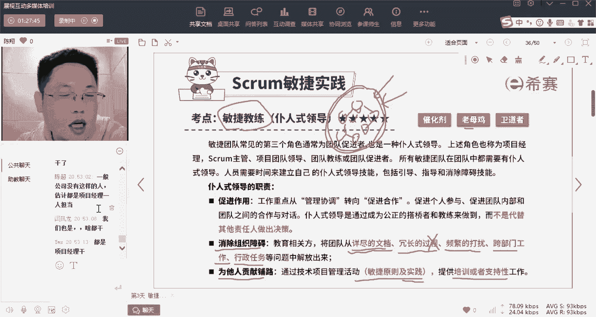

敏捷教练唯一不干什么呢，敏捷教练唯一不做技术活，敏捷教练唯一就不做技术活，什么意思，你想啊，比如说我们把一场球赛，5V5的篮球赛比作一个项目的话，有教练上场打球的份吗，没有吧。

在场上打球的是不是都是队员，所以我们这个项目该怎么做，技术活，怎么干，队员啊，来做来说了算，敏捷教练不做干货，听懂了吗，这是他最大的一个区别啊，敏捷教练不做干货，而项目经理的就不一样了是吧。

项目经理往往是这个团队内最牛逼的，那个技术人员啊，他会负责安排各种跟技术相关的工作细节啊，检验标准，对这个敏捷呢，现在大厂啊。

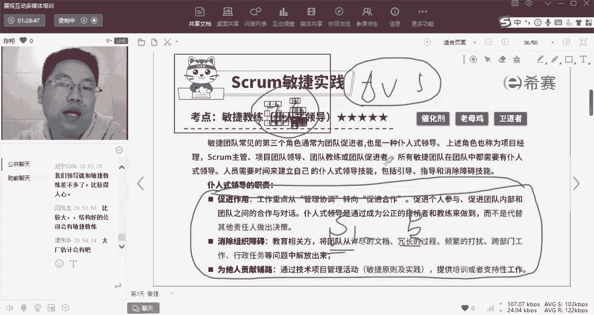

大厂才会有专职的啊，中型厂，再往大型场发展的过程当中呢，会逐步的转型，所以呢啊在这儿我们把它叫做三个啊，催化剂，它是辅助促进合作啊，来引导队员完成任务，老母鸡把我们的环境圈死了，不让外部的打扰卫道者啊。

如果我们的队员他做的事情有为敏捷原则。

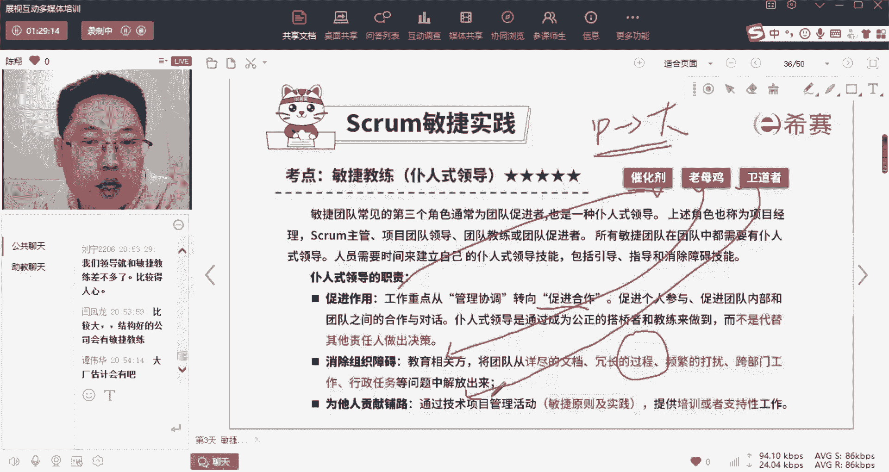

那他要站出来制止啊，或者辅导，除此之外，如果我们的队员有技术性的问题。

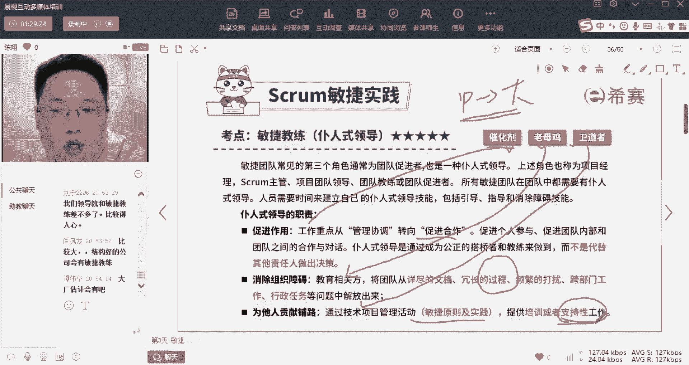

那不好意思，哎我也不懂，那我可以帮你联系外部。

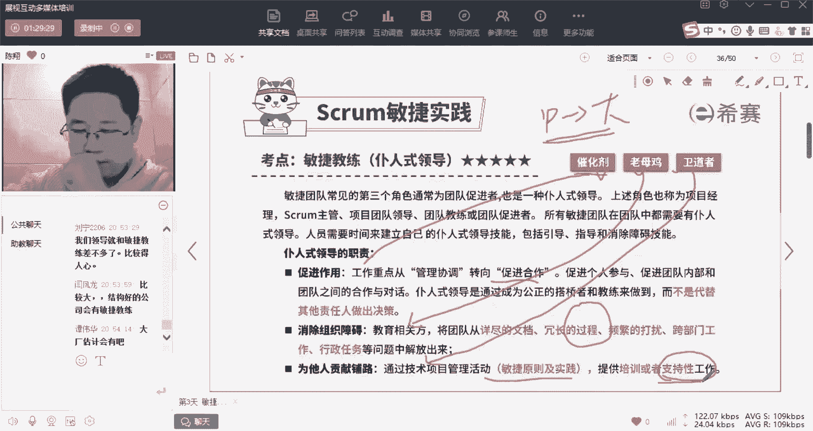

帮你安排一场培训，或者联系一个专家来让你咨询，但是不好意思。

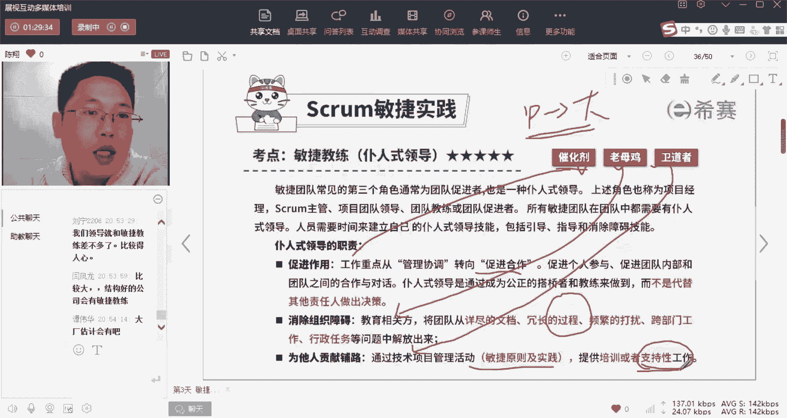

我自己本身我是不懂的，我不会给你进行培训，这三个啊。

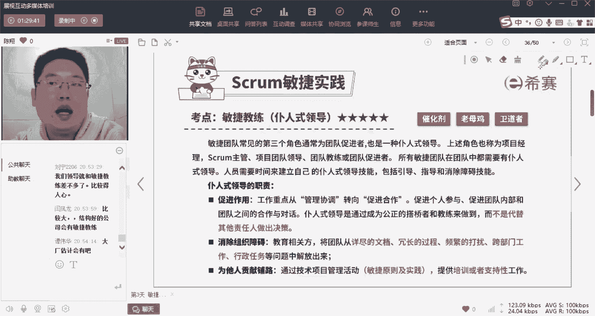

说完之后，我们来试一下，先看第一题，选出答案之后，请大家把帮助你选出答案的关键词是哪一个，早出，就怎么呢，就最难的是什么呢，就是人很难想象自己没见过的东西啊，就没吃过猪肉，也没见过猪跑。

就很难想象猪长什么样，所以没有被仆人式领导服服，这个服务过的，就很难想象诶领导弱是什么样一种感觉，是不是我们说在敏捷团队里面，最强的人应该是谁呢，应该是项目团队，也就是做事的人。

而他的领导敏捷教练是最弱的人啊，这个感觉你已经找到了。

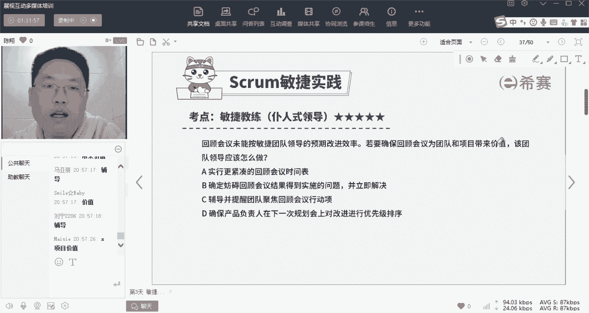

那么在这道题里面呢，应该是选C，我们来看一下啊，回顾会议未能按敏捷团队领导的预期改进效率，A团队成员没做好呀，啥叫回顾会议，就是反思嘛，哎我们做了一个月了，上个月做的好不好，我们反思一下。

那么这个月呢对于上个月做的不好的，我们要改进是吧，这就是回顾会议，但是呢你这个月下来了，发现诶你反思光反思了没有改正，完全没有带来效率的提升呢，那么为了让确保这个回顾会议。

能够给我们的团队和项目带来价值，应该A团队领导该怎么做，是不是这道题显然是在给你挖坑啊，这个地挖坑哎，团队没做好，你作为领导你该怎么办，是不是批评他，教育他等等，但是你注意了，这是在敏捷团队内。

敏捷团队的敏捷团队领导是很弱的，领导是仆人，是领导，他只能够辅导，并且提醒团队聚焦于回顾会议的行动向，哎呀各位我们上次开了回顾会议的唉，你们自己总结出来的有五条要做的事情，但是现在貌似A你们做这个事情。

跟我们回国会议的不太一样，我们是不是聚焦一下，想想当时为什么要这样做，完了啊完了，所以这种弱的啊，虚这个虚的软的这样一个特色，才符合敏捷体里面领导的行为，但凡跟这个不一样。

比如说要求实行更紧凑的回顾会议时间表，过于强硬，确定妨碍回顾会议结果得到实施的问题，并立即解决，过于强硬，确保产品负责人在下一次节的规划会议上，要改进优先级排序，确保过于强硬啊。

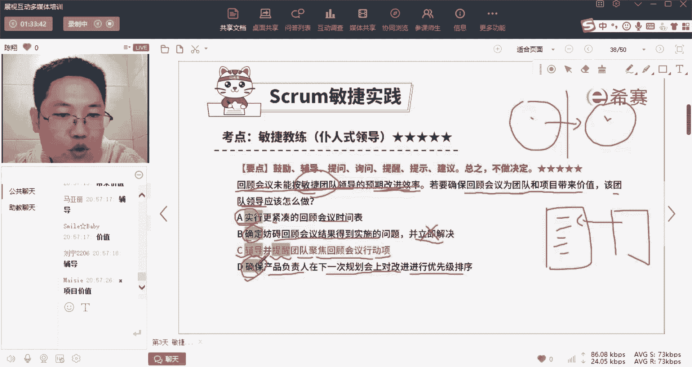

所以这道题后面的内容都不重要，重要在前面这几个动词，所以敏捷教练是通过辅导提问，询问提示，提醒建议等等，总之不能强势，如果是提醒叉叉叉是什么意思啊，如果B是提醒插入他啊，如果B是提醒，那可以啊。

那可以出题的时候出题的人都给你考虑过了啊，不要去改它的答案啊，他的每一个答案的设计都是有它的理由的啊，这道题它既然让你选到CABD，它一定会给你设计强硬的词的啊，他一定会给你设计强硬的词的。

这道题就跟后面的内容没关系啊，不要这样去延展，没有没有什么，要没有效果，这道题的目的就是为了让你强化敏捷教练，他就是一个辅导角色。

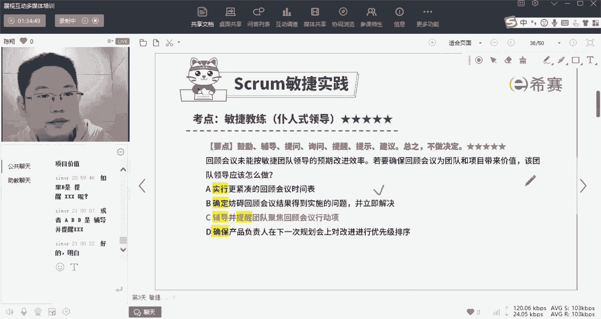