# 【24年PMP考试】零基础也能看懂的pmp项目管理视频教程！ - P22：1.16 敏捷项目管理--仆人式领导（下） - 冬x溪 - BV1tu411g7UH

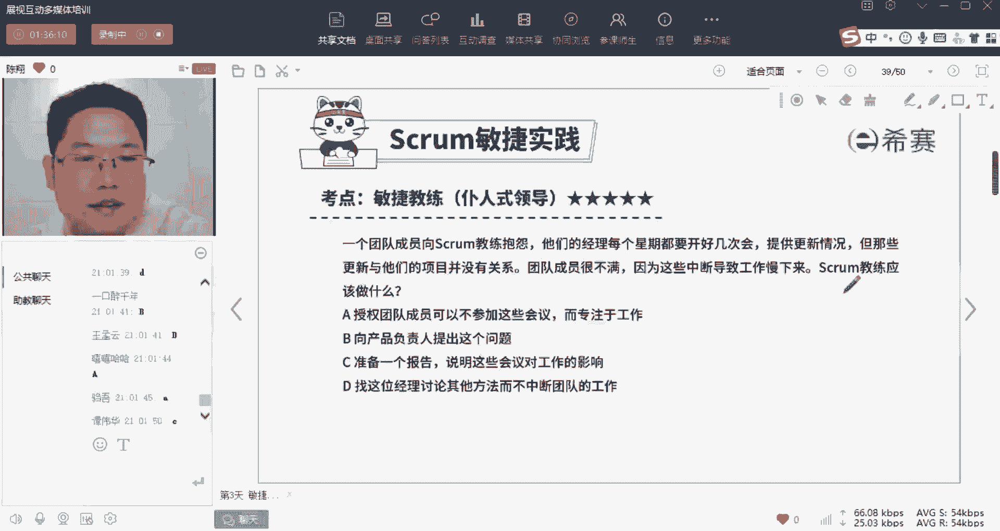

这道题啊有很多人选了C，我想问一下选C的朋友们，准备一个报告，说明这些会议对工作的影响是对谁，说明你们选C的话，你们会认为这个地方是对谁，说明，Pm，没有pm了，敏捷里面没有项目经理，我刚才讲了。

项目经理的职能被尸体都被拆成三份了，敏捷里面没有pm。

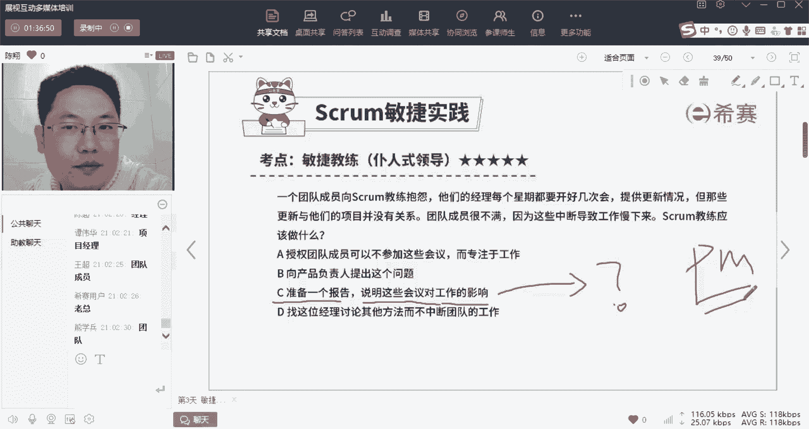

好借着这道题啊，我们再来描绘一下这个组织构架啊，敏捷团队会是什么样子的，对以前都是做项目经理的，所以啊预测性和敏捷性的转化很难，但这也是为什么我们要做的就是一个有客户，二个呢有中间对接人PO产品经理。

然后呢有一个一群很牛逼的团队成员，以及一个支持他们的啊，这个啊SM敏捷教练就完了，就没有在其他的没有pm，然后项目发起人呢啊，你可以当做是客户，也可以当做是这个我们内部的一些成员啊对吧。

你们说说明这个工作的影响对谁说明呢，没人说明，那么这道题是吧，那么这道题是什么呢，一个敏捷成员向com教练抱怨他们的项目经理啊，他们的经理，这个经理呢应该说的是，职能经理每个星期都要开好几次。

会提供更新情况啊，那么但是那些更新与他们的项目并没有关系，团队成员呢很不满，因为这些工作导致我们的工作慢下来了，导致我们这个项目内的工作慢下来了，那么SRAM教练应该怎么做啊，应该怎么做。

这个时候应该是我们刚才讲了，他要起到一个老母鸡的作用，为我们的团队成员住了一条篱笆，如果外面有人来打扰他们工作，他应该要排除妨碍，但是这种排除妨碍应该是怎样找这位经理，讨论其他的方法。

而不中断团队的工作，就是既保持我们团队在正常工作，右啊右能够符合项目经理的要求啊，或者说比如说他这个项目经理，找这个团队成员去干嘛呀，那些事情是不是了解信息或者是什么其他东西。

我能不能代替他来做呀啊帮助他解决这个问题，所以D选项呢，是他做老母鸡最合适的一个事情啊，那么A授权团队成员可以不参加这些，会专注于工作，注意在这个里面对吧，他没有这样强力的权利啊。

在这个里面他没有这样强力的权利啊。

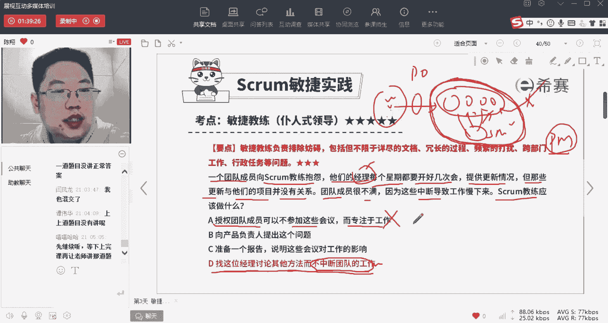

所以呢他应该是用更柔和的方法，或者说我们之前是不是讲过，如果完全没有这种组织结构，你就至少默认为诶，你这个地方的经理跟外面的职能经理之间，是平级关系，所以他没有高级的权利来授权这些团队成员，直接不参加。

那么B向产品负责人提出这个问题，这个是为什么不行呢，因为在整个团队里面，产品负责人负责且只负责做什么的问题啊，做what的问题，至于怎么做好啊，做的做的这个技术，做的快慢，做的这个啊方法通通他都不管。

所以呢他跟敏捷教练的分工还是比较明确的，产品负责人负责跟客户对接，哎，负责做what，而敏捷教练呢负责跟除了诶客户以外的，所有相关方周边人对接，来跑出方案，来确保我们的团队在正确的啊这个做事情。

所以敏捷教练跟产品负责人，他们是搭伙的关系啊，那么他们再加上团队分解了项目经理的角色，在敏捷里面没有项目经理啊，好那么C准备一个报告，说明这些会议会对工作的影响，一个没有人去说明了二个。

如果你说这个项目有个发起人，我向发起人去告状，那是不是等于我们一昨天说过的，不要把问题都抛给你的领导去解决，AD选项，你自己能解决的情况下，不要C选项去找领导帮忙好。

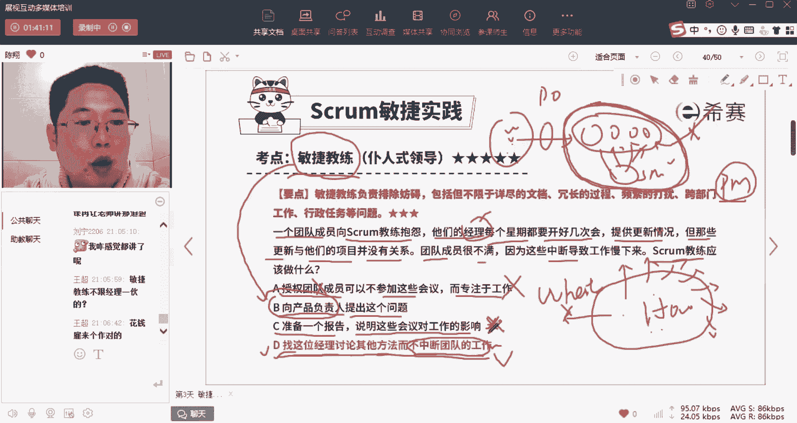

所以这道题啊，所以这道题我们最后应该是选C，它代表着敏捷教练，诶，老母鸡这个身份该怎么样发挥效果，OK这道题我这样解释完之后，大家还有什么疑问没有，我知道刚才还有一道PO的题没讲，还没讲。

是因为我要讲完SM以后啊，我才来讲这个，你们才会有更更好的感觉，所以这道题选D啊，这道题选D，这道题选找，啊口误了是吧，哦不好意思啊，这道题选D啊，准备个报告，说服团队成员屈服于经理啊。

这就有点过分了啊，有点过分了，你要排除妨碍，OK好这道题还有什么问题没有。

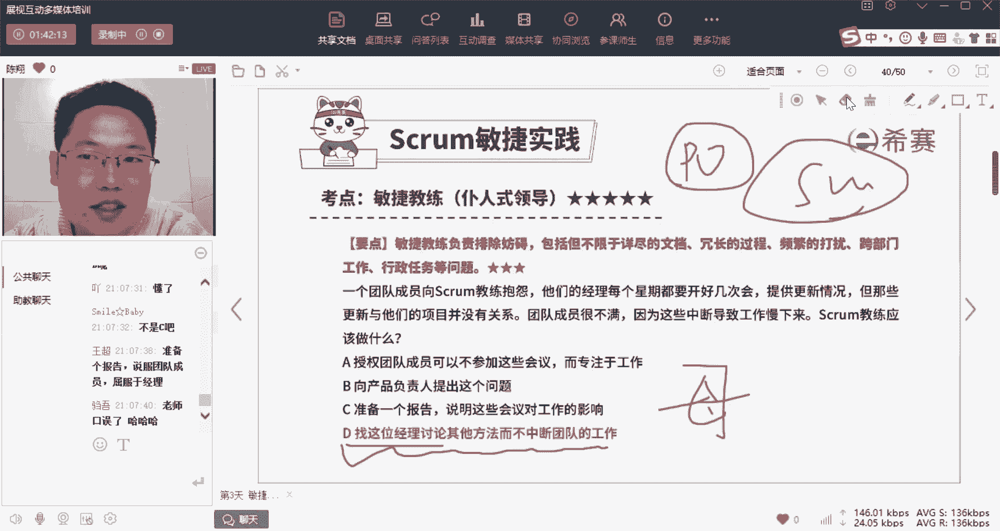

那我们最后再来看一道啊。

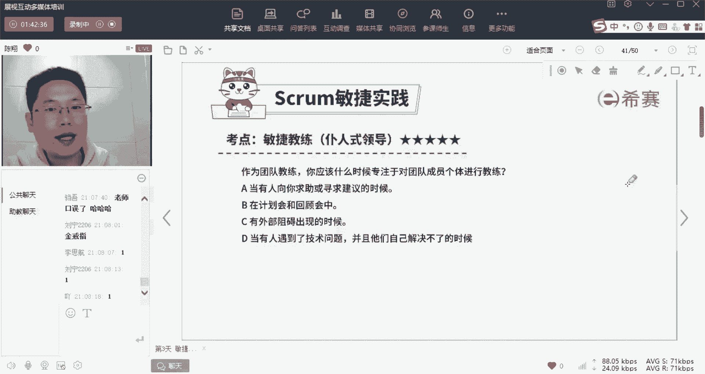

好这道题啊，最开始选对的是一口千年好。

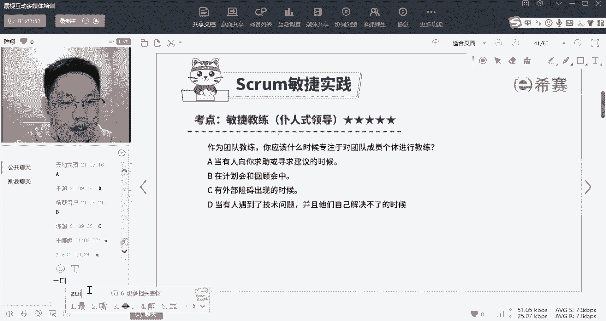

这道题选A，这道题说的是什么呢，作为团队教练啊，这种团队教练你一旦看到教练这个字，应该就知道是敏捷教练了啊，那么应该什么时候，专注于对团队个体进行教练啊，就是什么时候对团队个体进行辅导和教练啊。

这道题呢我们用排除法，首先有人选到了D，当有人遇到技术问题的时候，并且他们解决不了的时候，注意当我们的就是，你理解为团队成员都是技术大牛，我只是一个服务人员，技术大牛都解决不了的问题对吧。

我自然也解决不了啊，所以呢我不会在这个时候去教他们，我只能从外部帮他们，请一个人来教他们，所以不是我去教练他们啊，所以D排除C有外部阻碍出现时，注意很多人选了C，你们没有读懂这道题，它是一个语文游戏啊。

比如说一个漂亮的女孩子被一个色狼骚扰了，那这个时候你在干嘛，你是不是应该去打色狼，而不是教训这个女孩子，你裙子穿穿太短了，所以是不是，当外部阻碍骚扰了你的团队成员的时候，你应该去解除外部主阻碍。

而不是对你的团队成员个体进行教练对吧，所以C排除，那么B在计划会和回顾会中啊，这个计划会和回顾会呢学完呃，在其他内容的话，你会知道是团队成员自己开，或者也可以这样来理解，如果说回顾会上面会是这样开的。

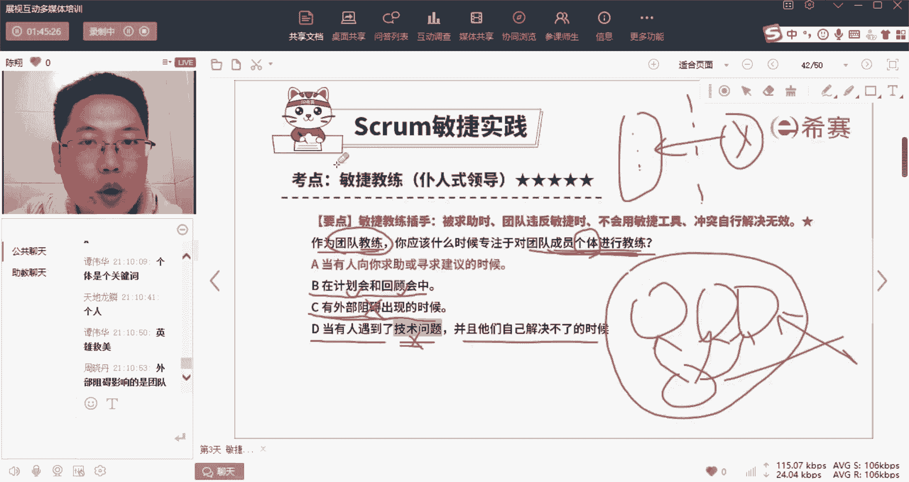

团队成员坐在这儿，然后呢项目经理一个一个喷，你们这个没做好，那个没做好，该这样反省，该那样改进，那么这就是一个典型的预测性生命周期，A项目经理太强了，而真正的敏捷会议，他的回顾会怎么开呢。

是A敏捷教练也参加诶，坐在这儿听大家来聊，你应该默认为你的团队成员会主动的，自动的识别这些问题，你坐在旁边只是起到端茶倒水以及什么呢，辅导他们诶遵从这个敏捷原则的这样一个效果，而真正的对于技术性的反思。

是团队成员自行完成的是吧，所以这些东西都排除之后，只有A啊，你作为敏捷教练，什么时候能对团队进行团队成员个体进行教练，也在他们向你求助或寻求你的建议的时候。

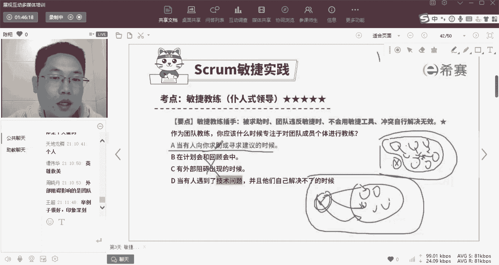

而且这些寻求建议往往是关于敏捷原则之类的。

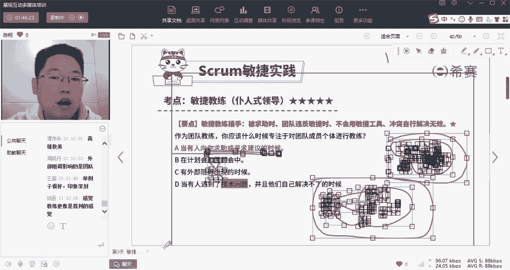

感觉教练更像是裁判呃。

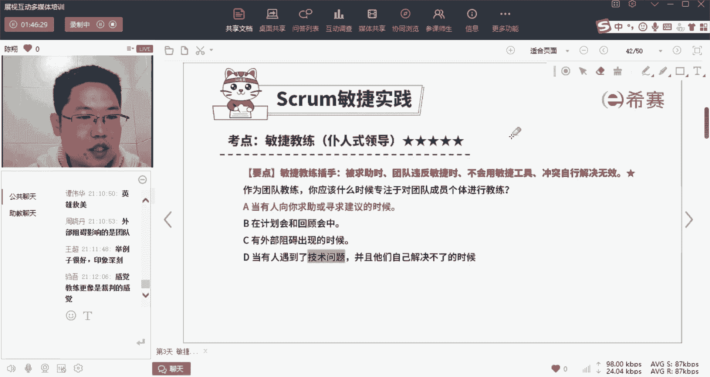

也有点这么个意思吧，好那么这三道题啊，分别是对应到他的三个身份。

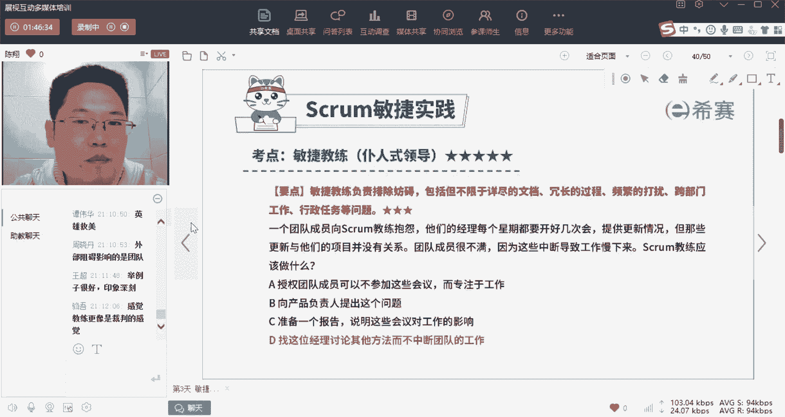

这个时候你再来体会一下，他的三个身份跟PO的区别在于什么，PO管做什么对吧，我们的工作内容是什么，是PO管，而SM呢管诶，我为一群人进行服务，他们能够自发的把what啊做的how这件事做得很好。

而且呢how这件事是由团队成员自主做做的，他SM呢只做三件事，第一个催化剂，如果你们之间有什么合作的问题，沟通的问题啊，有什么这个原则的问题，我帮你们辅导辅助啊，第二个，如果外部有人打扰你。

我帮你消除妨碍，第三个，如果你们对于敏捷原则不了解，你触犯了规则。

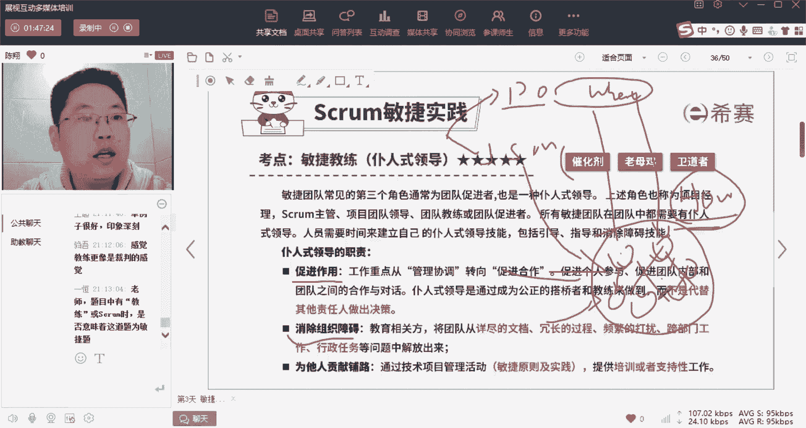

那我要跳出来，我要我要指导你哎，一横总结的这个很好啊。

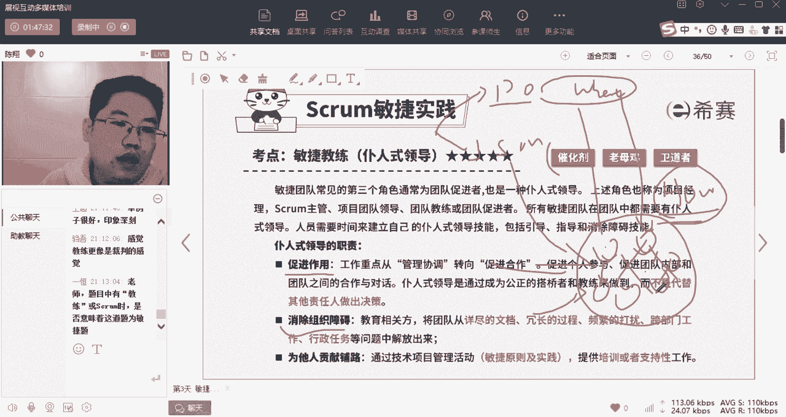

这个很好，如果一道题有教练或者SWM这个的时候，它就是典型的一个定位词。

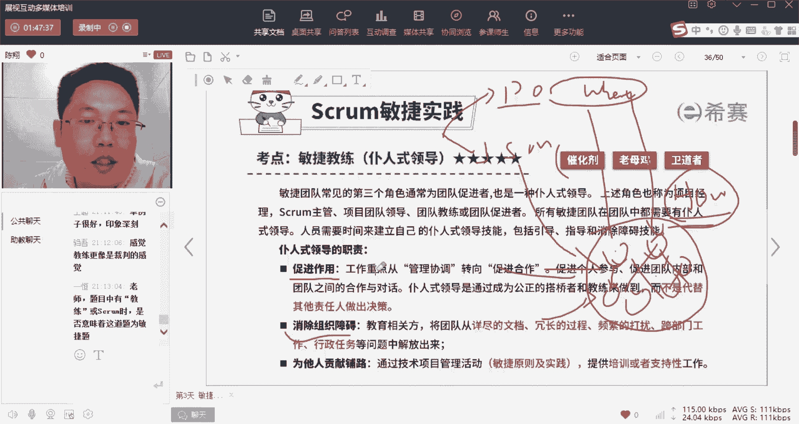

定位到这道题考的是敏捷题，而我今天给你讲的呢是敏捷，所以题目全是敏捷题，所以我没有单独的告诉你唉，关于敏捷题的判断啊。

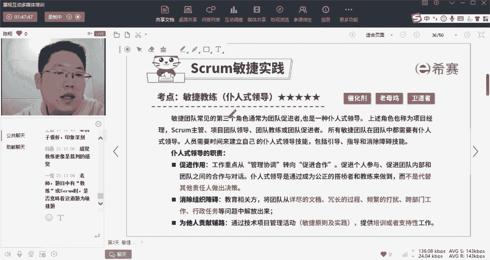

这个我们在政客里面会再展开好，那么敏捷教练你的身份理解了之后，我们这个时候再来看这道题啊。

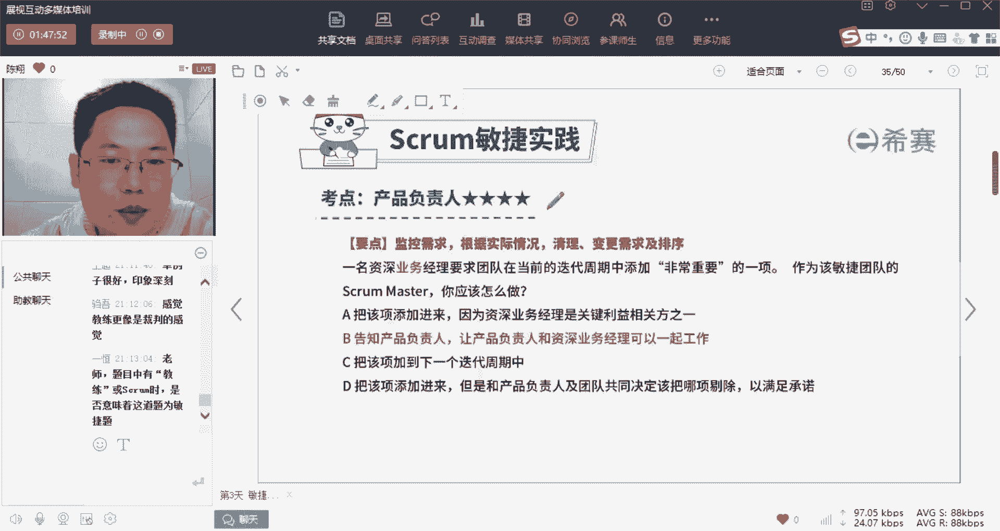

你觉得选什么，你再再看一遍，好这个时候是不是就感觉到了对吧。

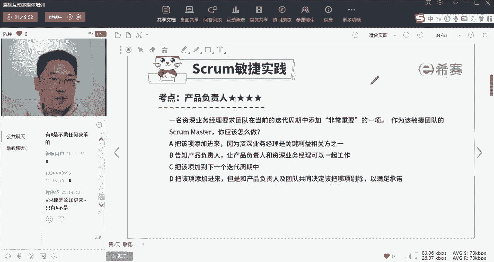

感觉到了敏捷就要练他的一个工作了啊，那么一名资深的业务经理问大家，这是谁啊，这是不是就是甲方，这是不是就是甲方对吧，什么意思，就是比如说你们是你们公司的这个研发部啊，这个平台部技术部。

你们在为你们的销售部门，开发一个销售操作系统，那么这个时候诶这名资深的销售经理，是不是就是你们的甲方对吧，这个东西先得知道了啊，一名资深的业务经理，就是甲方，要求团队在当前的迭代周期中。

添加非常重要的一项，这是不是就是要求添加一项新功能，那么但凡涉及到添加新功能的，是不是诶问squat master ly该怎么办，我们说了，PO对做什么负责，但凡涉及到做what做功能啊。

改功能排序功能的时候就应该交给产品负责人，他专职来负责这一块啊，让产品负责人和甲方可以一起去工作，商量好该怎么办对吧，这是啊产品经理的责任田啊，那么A把该项添加进来也好，C把该项添加到下一个周期也好。

D把该项添加进来，但是和产品负责人共同决定，该删除哪项承诺也好，不好意思，你越全了啊，敏捷教练是一个很弱的，它是一个辅助，并且他关注的模块是我们的团队，有没有在很好的做事情，至于在做什么，他一窍不通啊。

啊这样当然说了。

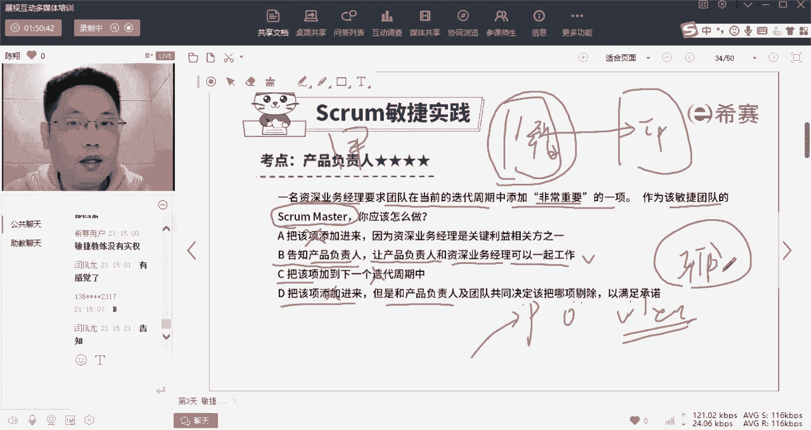

这样说说的过于绝对了啊，我是为了强化这个概念。

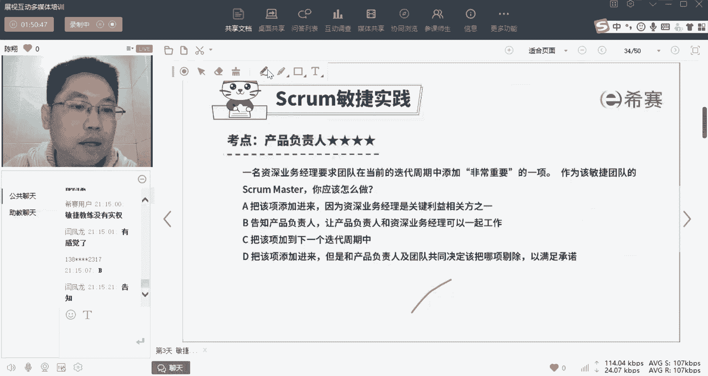

OK所以这道题选B好，这样还有什么问题没有。

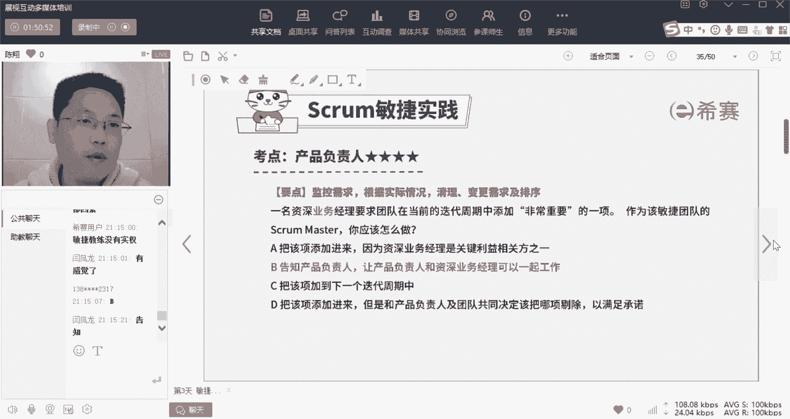