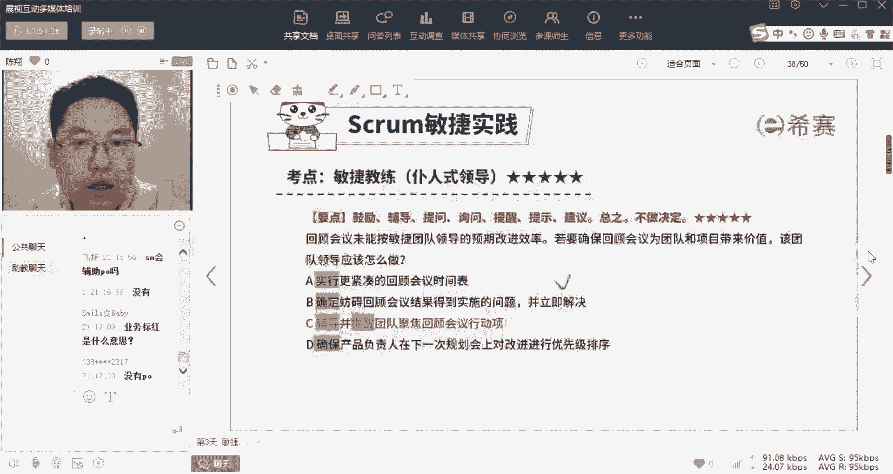
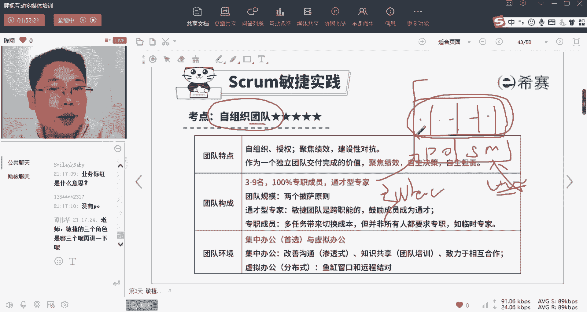
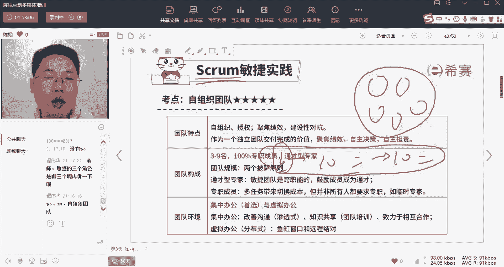
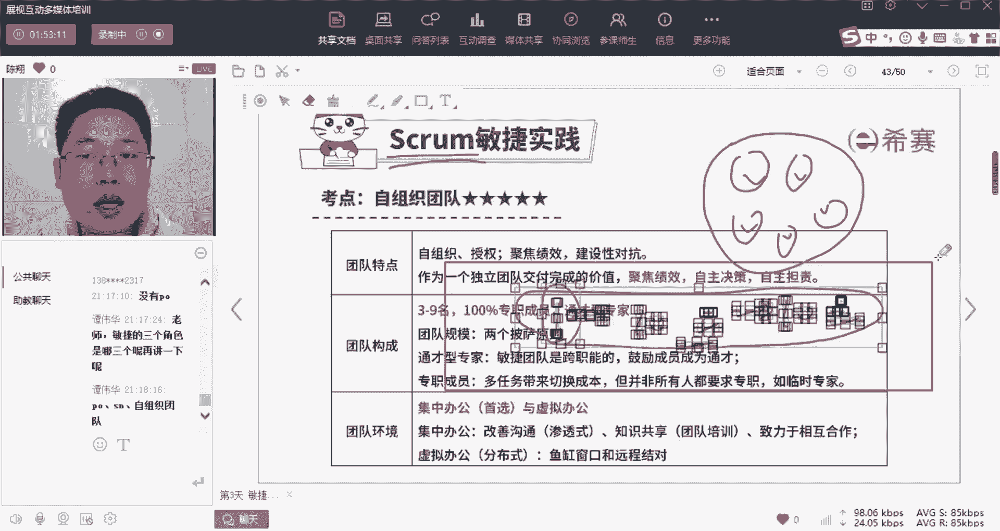
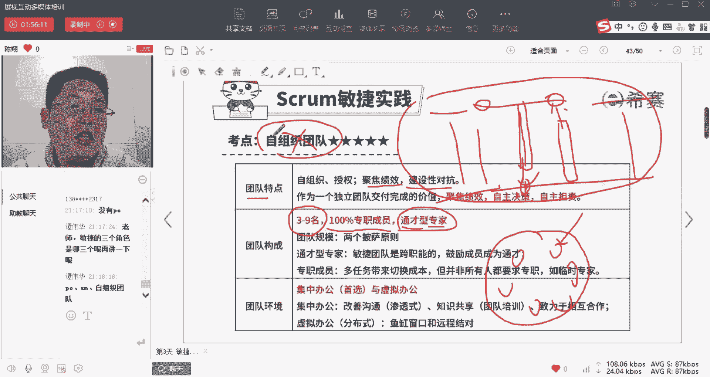
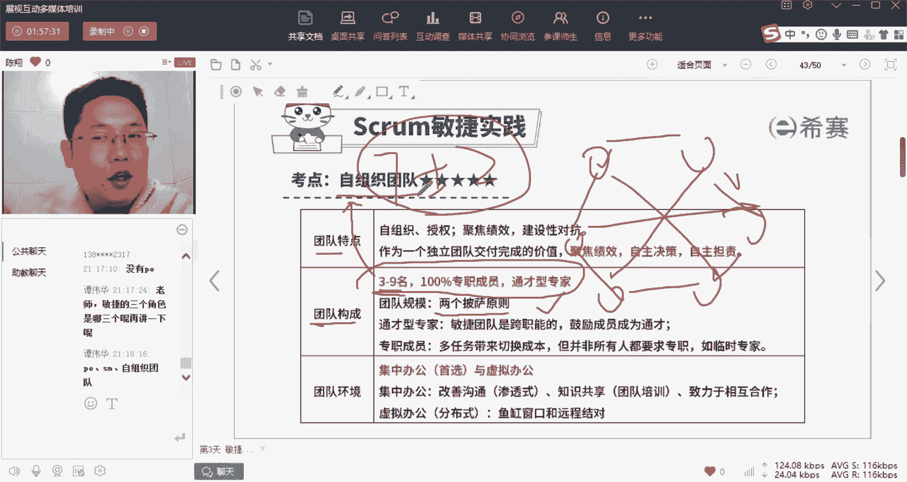
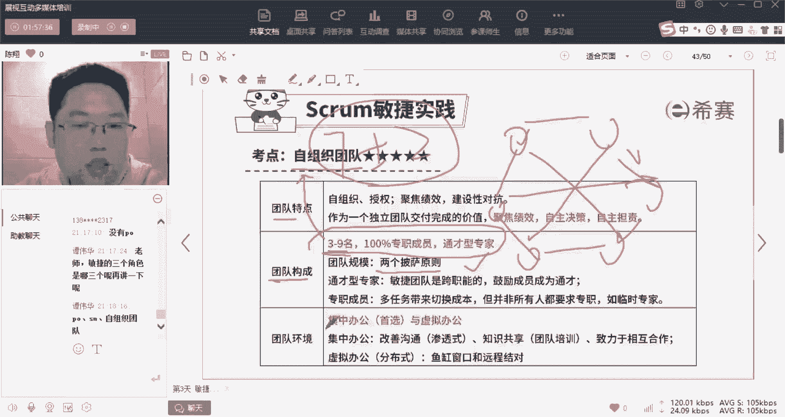
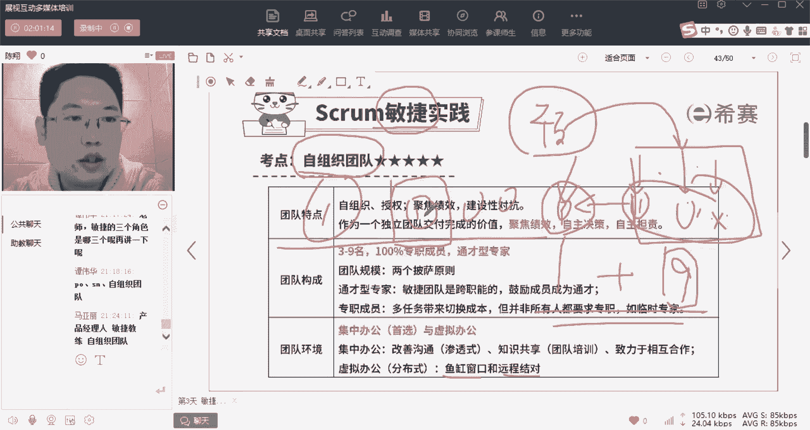

# 【24年PMP考试】零基础也能看懂的pmp项目管理视频教程！ - P23：1.17 敏捷项目管理--SCRUM自组织团队（上） - 冬x溪 - BV1tu411g7UH

这两个所谓的团队领导的工作内容都说完了，你就发现对吧，所有的压力都来到了第三个角色啊，就是团队就是我们团队内干技术活的啊，你会发现整个团队其实是谁在起主导作用，卖力的把活给干完，是不是团队成员自己。

而其实PO也好，以及SM也好，他们都只是在为他们起一个辅助作用，PO起的作用是从产品这样的做，what啊，SM是从好的角度为他们起到辅助作用，真正这个地方的主要干活的动力源对吧。

还是团队自己啊，为什么要这样讲呢，其实要回到我们刚才讲的第一个原则，我们敏捷里面讲究什么呢，讲究相信团队啊，所以刚才为什么说大厂才会有这个对，因为什么呢，因为大厂他要做的都是灵活性很高诶。

没有被未曾探明的啊，其实没有谁知道一定怎么做能成功的，那么这个时候要怎么讲究，招高手来，我们说两个二流的顶十个三流的，一个一流的顶十个二流的，是不是，所以呢对于大厂做复杂的困难的事情的时候。

才会启用敏捷，那么做敏捷你就要招高手。

你招到了团队成员都是各个领域的佼佼者，那么这样一群人进来了之后怎么做事。

你再反过来为他们配哎，谁是他的支持者，为他们配PO和SM，所以整个逻辑是这样顺下来的啊，那么关于这样子的团队，我们应该要求他们是有自组织能力的，啥叫自治组织，没有你们我们也能做。

有了你们只是帮我锦上添花啊，我自己这个团队就能自己商量着把活给干了，不需要有人管我啊，就这么个概念，那么这个概念下面呢怎么样做成呢，我们先看一下它的特点，这样的特点是自组织的以及被授权了的啊。

有充分的权利做出哎我们自己的判断啊，那么这个时候应该是聚焦绩效的啊，就是我们应该是怎样啊，我们直接为这个团队服务，也直接从这个团队拿高绩效，比如说我们说这个王者荣耀团队啊。

王者荣耀团队一年发年终奖发多少呢，发100个月的工资对吧，自然就是有这个东西，就直接跟我们这个团队需要挂上了好了，我会为这个团队拼命的，把他当做我自己的团队来看待，是不是，那么啊这一个第二个呢。

我们也鼓励建设性对抗，在这种团队里面不需要太按部就班，我允许争吵，也鼓励争吵，只要你是争吵是有意的，是有建设性的，而不是这个人情世故方面的，那么在这种情况下，团队聚焦绩效，自主决策，自主担责啊。

那么所以就对立的SM啊，管理者就弱了，那么怎样才能组建成这样的团队呢，第一个就是这个团队要由通才型专家组成，首先他得是专家对吧，如果是很弱的年轻人啊，刚毕业一两年什么都不懂的人。

你指望他能自己管自己不可能，所以我们刚才讲了，要招一流的专家，其次呢我们最好还是通才型专家，为什么呀，因为这个里面我们得自己沟通，就意味着你是销售人员，我是产品人员，你是推广人员。

我们之间可能会有技术壁垒，那么你是单项专家，我们可能就鸡同鸭讲，所以我们要求通才，也就是T字型人才，啥叫T字型人才呢，哎我在教研方面是专长，我研究的很深，同时呢我要懂一点销售和推广的这样一些知识。

而你呢在销售方面很专业，又在产品方面懂一些研发的东西，这样我们是不是就能对上了，那么所有人都是T字型人才的话，是不是就能构建起一个A有连接能沟通的啊，这个柔性团队，所以我们要求通才型专家。

才可能组成有效的自主团队，第二个最好是百分之百专职人员，因为我们刚才也讲了，要构建一个篱笆，还把外面的防碍都排除掉，专心致志的在这儿来做事情，因为我们自己做个事都知道，工作之间的切换太耗心神了啊。

第三个呢，你这个团队还不能太大了啊，为什么呀，因为你要自组织。

你要自组织的话，又它就是一个什么呀，一个这个平面结构，我们叫分布式结构，分布式结构就决定了诶怎么样自我交互，如果一个团队20几个人，上百个人，那么这上百个人之间没有一个层级关系，就靠自我交互的话。

是不是就乱套了啊，根本交互不清楚，所以呢要小而今的团队形成一个什么呀，尖刀连直插敌人心脏的这种啊，就是所以呢应该人数在3~9人之间啊，大概意思就是七正二啊这么一个水平啊，我们书上写的是3~9。

那么国外呢把这个叫做两个披萨饼原则，因为国外他们吃吃午餐就是吃披萨饼对吧，两个披萨饼叫过来，团队刚好够吃，那么这个人数就不会太大，在我们这可能就是一顿一顿饭吃十个包子，原则啊，不能人人不能太多了好。

所以呢啊这样的团队构成，能够更有利于我们组建成一个有效的自组织，团队啊，这个了解一下，其中呢我们还是讲，那么为了让这个组织呢能够运行得很通畅，因为没有人管理这个管理，要求他们给他们定计划了吗。

他们要更多地进行信息交互啊，及时的共享彼此的所有信息。

那么在这种情况下，要求我们一定是集中办公。

集中办公就是大家在一块儿背对背坐着啊，就算是你这个呃集中办公的，你最好还是有什么呢，不要说每个人都戴这个耳机什么的，你得讲究渗透式沟通，啥叫渗透式沟通呢，就是你在这儿坐着诶，另外两个人在这聊天。

其实呢虽然你没有参与他们聊天，但是他们聊了个什么，听了个这个大概了是吧，就跟听八卦一样，竖起了耳朵诶，就听到了别人其实没有在对你说的东西，相当于这些信息渗透了到你的脑子里面。

这个东西呢更加有利于我们这个小团队，有充分的信息共享啊，如果实在比如说现在疫情影响对吧，我们没办法坐在一个办公室里面，那么呢你也要运用各种手段，完成虚拟的空间上的集中对吧，比如说很简单啊。

呃就我们现在经常开这个电话视频会议，是不是电话视频会一开啊，九个九宫格，九个头像都在这，大家都能看见对方在干嘛啊，他说了些什么，那么这个视频会议一开开一个小时，有些公司极端一点的。

直接让你们开着视频会议，自己在家做事，一天八小时，开八小时视频会议啊，那是不是相当于人不在一起，其实也在一起了啊，这就是我们说运用远程结对或者鱼缸窗口，其实就这么个意思啊。

用虚拟的技术手段达到集中办公的一个效果。

那么这些内容做完之后呢，我们基本上这个自组织团队形成的一个特点啊，就差不多了啊，OK所以呢这三者他们是一个有机整体，我最后再解再说一遍，整个敏捷，我们讲究的是相信专业的人能把事儿给干了啊。

而比较啊这个不太重视什么计划呀，文档啊，工具啊，谈判呀，这种原来更忽视人的行为，你想吗，原来的预测做这么多东西是怎么来的，是不是，比如说我很牛逼，但是呢我这个时间不够，我能做一个项目，我做不了十个项目。

但是呢我会发现，剩下的九个项目和我已经做好的这个项目之间，有极高的诶这个相同性，那是不是我就想了唉，我人不到场，我能不能也把这九个九个项目管了，可以，因为它其实就是在重复我已经做过的事情。

那我是不是把这剩下的九个项目，全部用流程梳理好，每一步做什么的工具确定好唉，然后标准定好，并且要做的什么事情，计划也得定好，对不对，然后谈判谈好，那么这个时候我需要的只是什么呀，水平不太高的一群人。

能够按部就班的来完成我的计划，就把这个项目给做了对吧，所以预测型生命周期更讲究的是有标准的规范，流程工具技术，而忽视人这个存在，因为什么呢，在原来啊在这个环境中，优秀的人才难得，但是普通的人才好得。

所以我只要有足够完善的平台，那么我用普通的人，就能把重复性的项目事件给他做了，但是我们现在是敏捷，意思是你现在要做的其他九个项目，跟你已经做的这一个有极大的不一样，有极大的不确定，那么在这种环境里面。

你是没办法通过预测型的标准化的那些东西，把事给做了的，你只有相信招高手来啊，让高手投入到这个项目去，并且相信他们能把这件事给做了啊。

把保压在人身上，就是我刚才讲的讲究个体和互动，而不是工具和流程，那么这群高手招过来了，哎他们可以把这件事做了，但是不是还得有人给他们打辅助，那么这个时候你给他们配一个PO。

唉这群PO呢负责翻译客户的需求，给他配一个SM诶，在这群人受到打扰的时候，保护他们，尽可能的给他们创造一个诶，要做什么就去做的这样一个环境，其实三个人的身份呢就是这样发展而来的。

所以跟原来的预测型的项目经理，这个思路是完全调个个儿来的，所以如果我们大家是习惯了做啊，预测项目经理这个角色的，那么很可能在这儿就完全转不过来啊，这个呢得花一定的时间，所以比如说昨天的题目。

你们基本上听完之后都能做对，今天的题目基本上听完之后都会做错，这就是你们在啊往反方向转的一个适应过程，那么这个自组织团队我们讲的比较多了，总结了我们带着三个身份都理解的情况下。

