# 【24年PMP考试】零基础也能看懂的pmp项目管理视频教程！ - P24：1.18 敏捷项目管理--SCRUM自组织团队（下） - 冬x溪 - BV1tu411g7UH

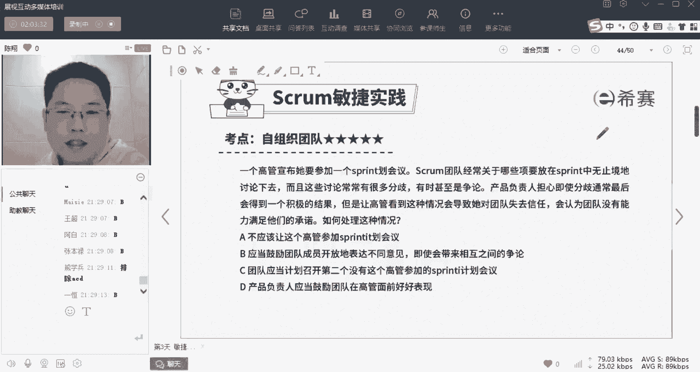

很多人都选了B啊，我问你如果是在实际的工作中，你会选哪个，是不是哪个的，可能反正就不会选B是不是，所以这道题的，它它它这个差异性，极大的体现了老美的这本证书，它传递的一个思想。

YMX也说实际也是B那你们公司的环境啊。

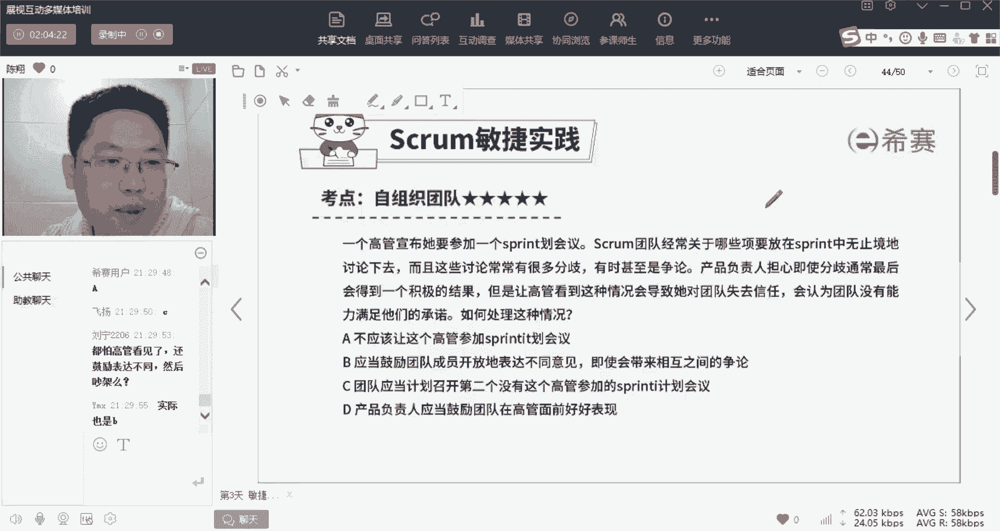

你们公司的环境应该还是比较不错的。

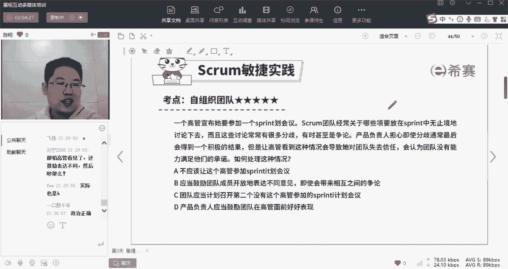

这道题呢啊正确答案要求的是选B，他说什么呢，你注意几个关键词对吧，一个高管宣布他要参加一个计划会议，就是要到你们团队来视察，你们的这个团队呢，经常关于哪些项要放在这个spring中。

就是这个冲刺中永无止境中无止境的争吵下去，经常会有许多分歧，甚至争论，产品负责人担心，即使分歧通常最后会得到一个积极的结果，啥叫这什么意思，意思就是分歧通常最后会得到一个积极的结果。

是不是就是我刚才讲的建设性对抗啊，无论是炒也好，分歧也好，讨论也好，其实都是有意义的，而且是这个团队自己已经形成了习惯了的啊，而产品负责人也就是PO这个角色，他担心高管看到了。

会导致高管对团队失去信任啊，认为团队没能力，那么如何处理这种情况，是不是，那么这个无论是产品负责人也好，还是SM也好，都不能违反敏捷原则，敏捷的原则大家应该已经体验到了，就是自组织团队，他们最大。

他们有权啊，按照自己这个习惯的方式啊，有用的方式来完成他们的工作，所以呢我们应该要维护他，唉，应当鼓励团队成员开放的表达他自己，即使会带来更多的争论，因为这些争论怎么样，最终会得到有效的结果。

所以这道题呢啊在敏捷这个大环境下。

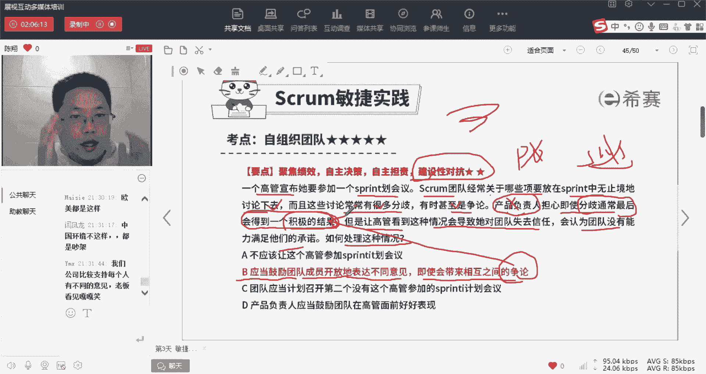

要求我们一定是选择B，那么ACD那么大家都看了，就不用我多解释了，都是属于啊约束团队的开放性，自由度的这样一种做法啊，在敏捷里面，那么就会带来敏捷原则的一个违反，就不会啊带来敏捷的这个优势好。

所以这道题啊体现的比较明确的。

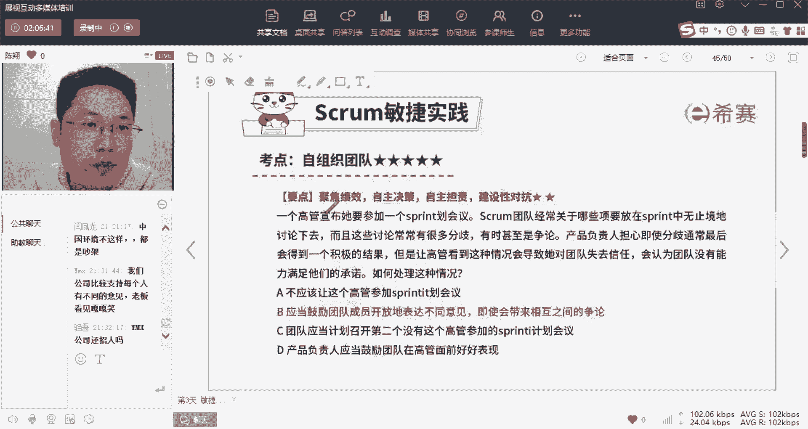

就是自组织环境这个特点，OK我们再来看一道啊。

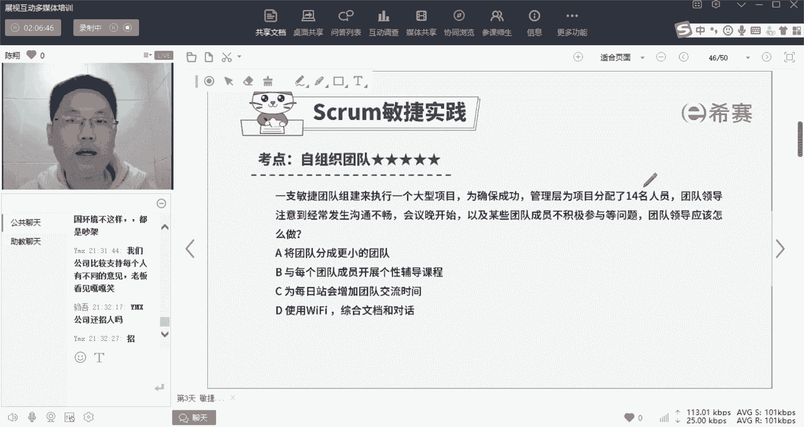

OK这道题啊，我们来看一下，几乎都没有找到最关键的这个要素啊，一直敏捷团队组建来执行一个大型项目，为确保成功，管理层为项目分配了14名人员，那么团队领导注意到经常发生沟通不畅，会开始晚。

以及某些团队成员不积极参与等问题，领导应该怎么办，对其实呢这道题就是说人多了啊，就是人多了，那你应该把它分成两个团队啊，那么两个团队，两个SRAM团队，叫做多人敏捷啊，多团队敏捷，注意啊。

更小的团队不是说不是说只有七人，而是分成两个七人团队啊，然后在这两个精神团七人团队上，还有这种整合的一个工具，两个披萨是怎样，两个披萨就是就是就是两张披萨饼啊，一餐能吃饱。

代表着人数在七正二这个范围内啊，沟通的时候也是啊各自沟通，然后沟通完之后，可能他们之间再有协调机制啊，另外的再沟通啊，就是为了确保这七个人沟通的时候，他会比较啊简单顺畅啊，这个知识点了啊。

我们正课里面再来讲啊，因为我们这个时间所限啊，很多东西不能全面展开而敏捷，它又是一盘整体的棋，所以你学的东西越多啊，全貌了解的越多，你就会觉得啊越顺，对每一组放个代言人诶，刘玲总结的非常好啊，刘总好。

OK那么这道题呢，我们应该说把它分成更小的团队，而而不是说展开个性辅导或者是交流啊，或者是文档对话，这个就是我们讲过的一个典型啊，美国佬这个考试呢它有一种东西做最佳实践。

最佳实践的意思就是每个选项可能都是对的，但是呢你要去选最对的那个啊，那么这道题呢其他东西其他行为都可以做啊，当然除了D以外，因为D呢使用WIFI综合文档来对话，它就不是面对面沟通了。

这个违反敏捷敏捷原则了啊，ABC都是对的啊，那么A呢更适合而已，敏捷教练就是敏捷团队成员吗，一般是一个PO啊，一个SM加N个团队成员啊。

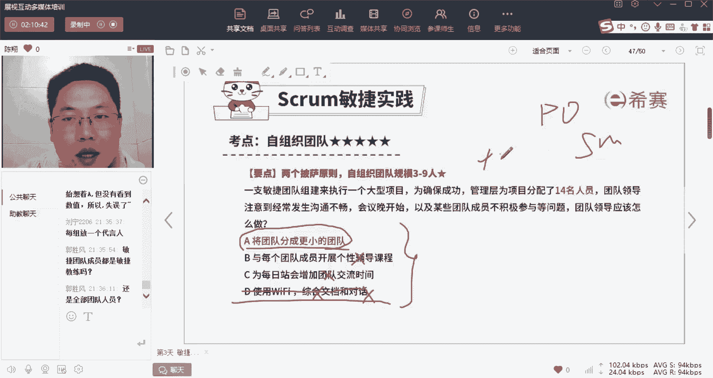

加N个团队成员好看，最后一道题啊，对敏捷讲究时效性，对的全球分布的团队应该采用哪一种注意，你还是得稍微尊重一下题干中的一个确定信息，已经说明是全球分布了，那你还强制性要求集中办公就有点过分了啊。

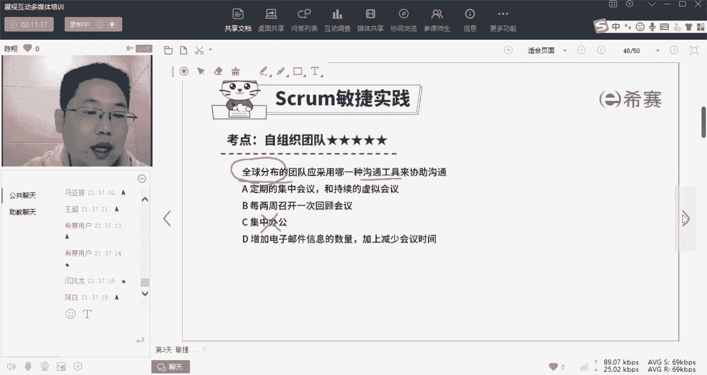

这就类似于诶你们公司是全世界啊的这个公司，那么集中定期会议，比如说开集中的年度会议，季度会议等等啊，和平时呢就更多的利用这个网络，发达的网络来实现啊，面对面的这个用虚拟会议实现面对面啊。

那么这个是最恰当的，OK那么每周召开一次回顾会议啊，这个不是一个概念，C集中太过于太过于这个异想天开了啊，第一增加邮件时间，这就相当于不是面对面了啊，就不是面对面了，文字沟通会带来各种信息损耗。

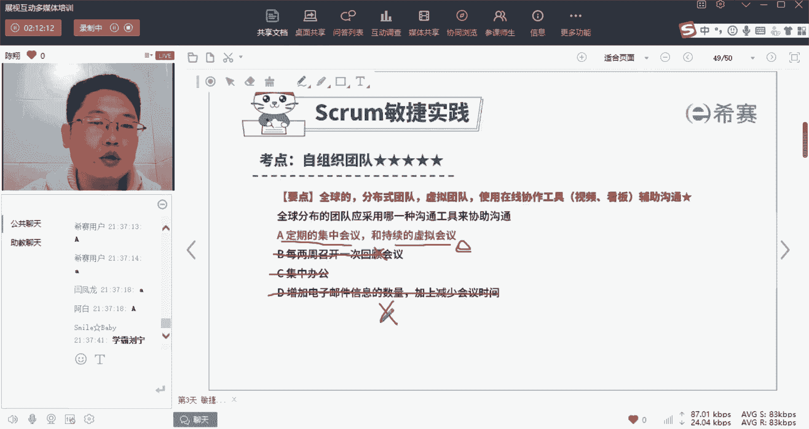

OK这是我们说的这个自治团队。

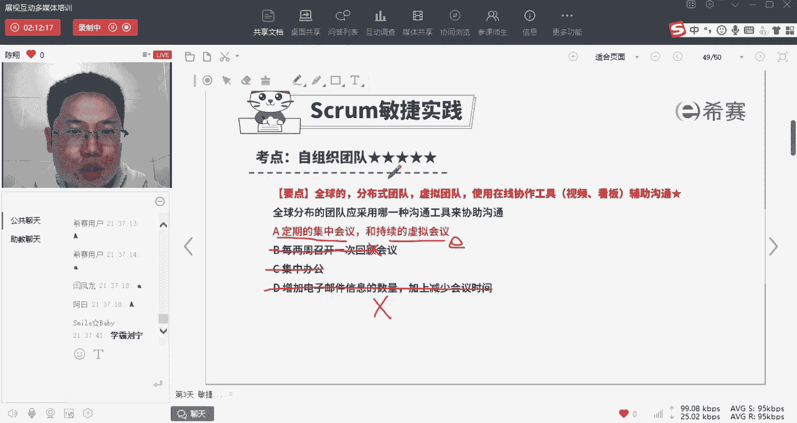

要面对面沟通的一个原则，好那么到这儿啊，今天我们的内容就讲完了，呃呃今天呢呃花了一点时间，其实整个讲的内容非常少，但是我们讲的时间很长对吧，就是因为敏捷这个东西呢，它跟预测完全不一样。

大部分人其实是泡在预测的环境里面的，对3355只讲了一个三，因为今天时间有限，大部分人是泡在预测环境里面的，所以讲的东西能够马上连接上，而敏捷这块东西呢，哎我们很多人没接触，就算接触的人呢。

其实接触的也不是所谓的标准敏捷啊，因为我们现在整个中国啊，就只有大公司可能更倾向于这个软件行业，倾向于这个，而且呢大部分是在由预测王，敏捷转型的过程当中转的呢，也是半拉不拉啊，所以呢对于纯敏捷的东西啊。

跟我们的工作习惯经常甚至是冲突的，需要我们先破后立对吧，原来预测性的东西建立了，然后要打破它，再重新柔和和建立，所以这个过程呢是比较吃力的，OK那么今天讲完了啊，明天就没课了啊，我们整个这个训练营啊。

三天就到此为止了，目标呢反正我的目标说过了，为了帮助大家，首先建立起一个关于第六版到第七版，预测到敏捷整体框架性的内容，以及通过相同的都是人对吧，岗位角色哎，在预测里面怎么说，哎，这个敏捷里面怎么说。

那么我们昨天讲的这个人是不是讲究强计划，强管控，项目经理负责一切，而今天讲的是完全倒过来，所以这个颠覆感大家应该也感受到了啊。

所以呢嗯还是要花点力气的，OK但是没关系啊，还是那句话，敏捷是一盘整的棋，当你把它全貌理解了以后。

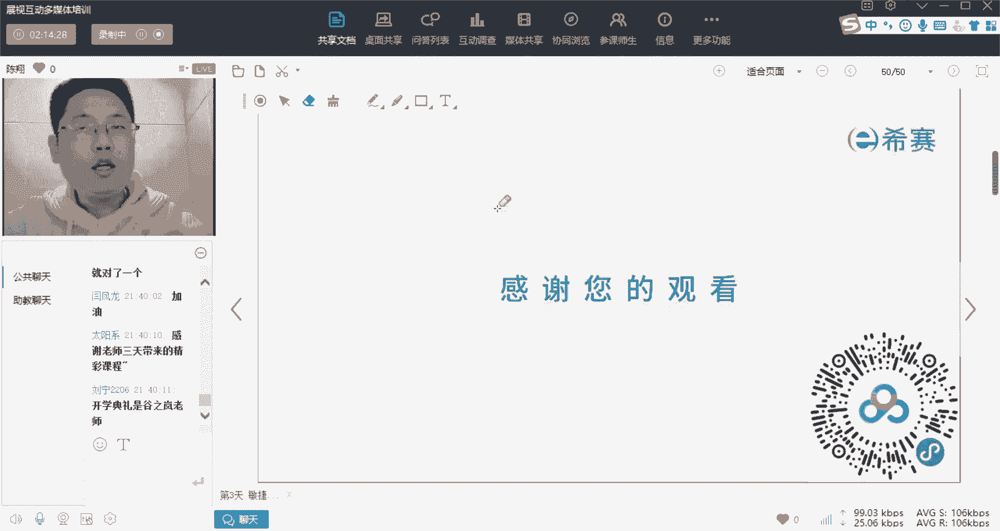