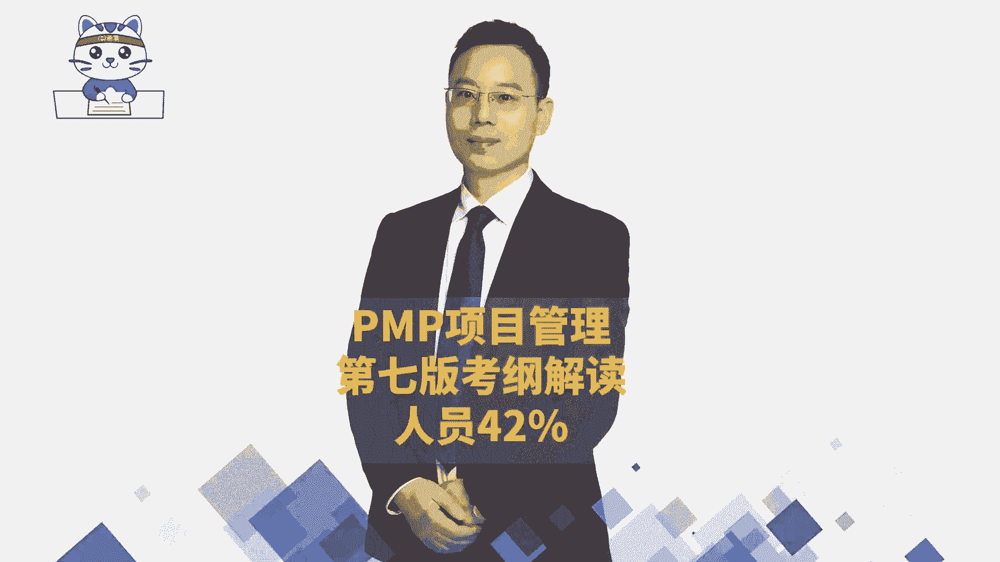
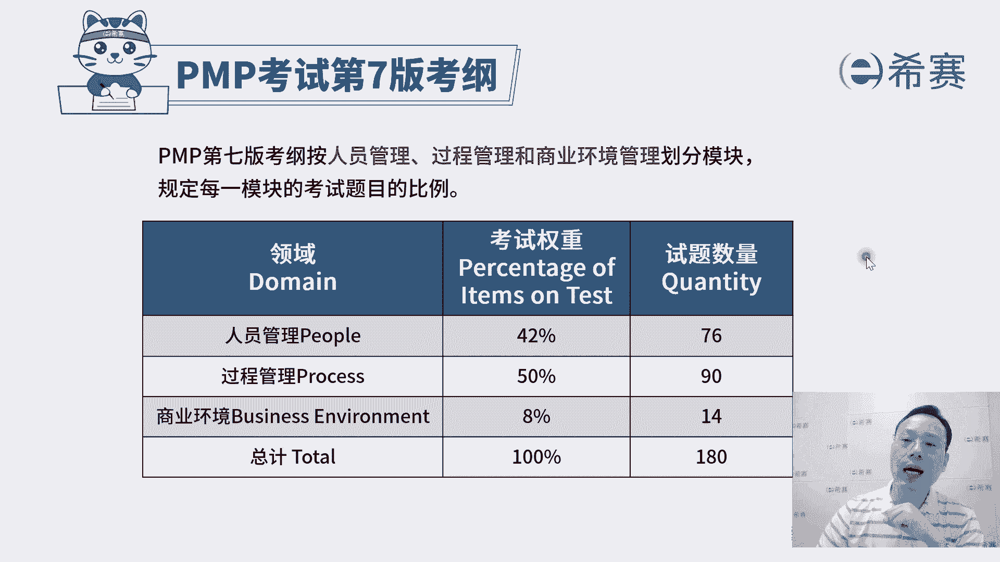
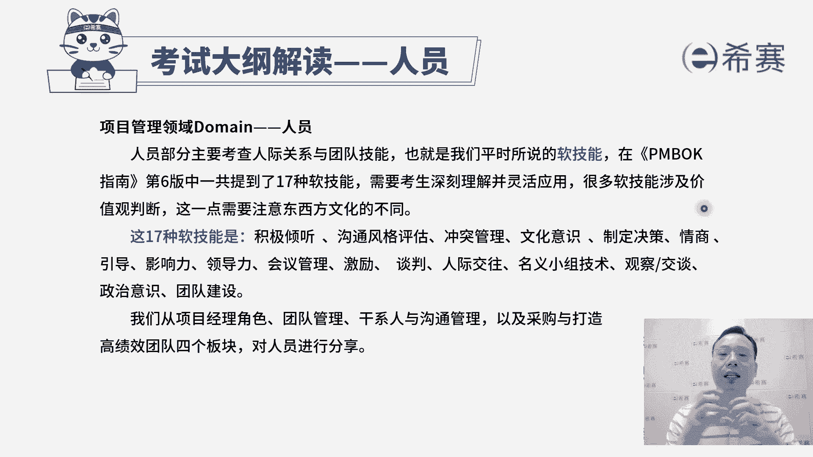
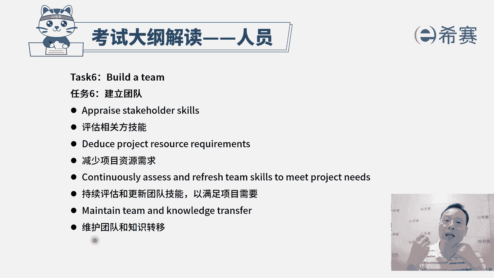

# 【24年PMP考试】零基础也能看懂的pmp项目管理视频教程！ - P25：2.1考纲之人员板块A - 冬x溪 - BV1tu411g7UH

大家好，我们一起来看到的是PMP考试第七版考纲中，关于人员的这个板块，那整个第七版考试呢，他目前是按照人员的这个板块占比，占到42%，有76道题目，然后过程呢降到一半，有90道题目。

然后还有商业环境占了8%，有14道题目，我们来看一下整个关于人员这个板块呢，它的这些考纲一共有14条task。

整个考纲，它其实讲的是关于人际关系与团队技能，就是我们的软技能，包括沟通能力啊，倾听的能力啊，冲突处理的能力啊，情商啊，影响力，领导力，谈判的能力，然后观察交谈，政治意识，团队建设等等这些。

那我们重点会是按照这样一个项目经理啊，团队啊，跟干事人啊。

还有沟通这几个维度来去考虑，我们一起来看到，首先第一个任务task叫管理冲突，我们经常会讲到说有人的地方就有江湖，就有是非，没有冲突是在所难免的，我们都要了解一下到底是为什么会有这个冲突。

冲突来源有哪一些，以及目前冲突的严重程度是什么样子，然后呢，再去分析一下可能导致的这个背景是什么，再来取找到一些可能的解决方案，可以去评估一下解决方案，推荐解决方案，然后去协调解决方案。

这个呢我们在冲突管理这一段，已经是有学过了啊，这是冲突管理，这是我们需要去了解的，那人员的第二个内容叫领导，团队，其实也就是有领导力，所谓领导力我们前面也讲过，说兄弟们给我上。

兄弟们跟我上都是一种领导力，就是能够去引领别人，来去完成工作内容的这样一种能力，那你要去引领别人，首先你自己要有一个清晰的目标，所以是设定清晰的愿景和使命，这样才能够去激发大家。

然后第二呢支持多样性和包容性，也就是说大家可能是各不相同的，其实可能每一个人他的这种行为，习惯的行为处事，那那个唐僧他要带领着像猪八戒这样的人，孙悟空这样的人，和沙和尚这样的人是完全不一样的人。

那你要是领导不一样的人，包括他们这种行为呀，想法呀，习惯了能力各不相同，第三个要重视服务型领导，也就是这个是我们在后面讲，敏捷项目管理的时候，会展开来讲的，一种叫仆人式领导或者服务性领导，也就是领导。

你不是那个高高在上的，来去发号司令的这个角色，你更多的是能够去为团队提供支持和帮助，让团队更有效的去做某些事情，把这事情往前推进，会更加重视服务型领导，只是在敏捷中会重点强调好。

最后一个要确定适当的领导风格，嗯就是其实你在不同的场景下，你管理不同的群体，你这种领导风格一定是要有所调整，你去管蓝领工人和管这些白领阶层，你管这种文化工作者和管这些程序员，他的管理方式一定是不相同的。

你需要去有效的调动大家的积极性，来去参与一些事情，来去解决事情，所以这是你要有这样一个领导力，能够去领导团队，并且呢在整个过程中，你需要去懂得一些关于激励因素啊，激励模型。

因为其实我们在前面已经学过了很多，激励模型啊，就是这些激励模型它不相同的时候，它的这种操作方式是不一样的，你能否去激发激励，鼓励大家来做某些事情，并且呢我们大家一起去共事的时候。

你要善于去利用这一种所谓叫做团队章程，或者叫社会契约，就团队战成社会契约，他就是我们经常会讲到一个词，没有规矩不成方圆，那这个呢就是我们的团队规矩，咱把规矩列好，不管说是共同共事的规矩，沟通的规矩。

产生冲突的规矩，汇报的这个制度规矩，奖励的这样一个制度规矩，惩罚的制度规矩，我们提前把这东西列好，并且有效去落实，这是去激发激励和影响团队，然后再有一条叫分析团队成员和相关方的影响。

而我们需要去了解大家的这个，比方说他的权利啊，它的利益啊，他的这是一个影响力啊，他会看到什么东西啊，你对他有越多的了解，那么你才能够越有效的去打动他，去引领它，去影响他区分各种方案。

以领导各种团队成员和相关方案，其实也就是说我们的这种领导方式，针对不同的人，你的这种管理风格和领导策略方式是不一样的，以及针对同一个人，他在不同阶段的时候，他在做一个新手阶段的时候。

作为一个正在学习的阶段的时候，已经是比较熟练的阶段的时候，已经是可以独挡一面的时候，我们都是会有一些不同的方式和方法，来去领导他们，引领他们好，这是关于领导团队，其实也是你的领导力好。

第三个任务呢叫支持团队绩效，其实也就是说你要有一些好的方式和方法，能够去让团队成员成长起来，并且他到底有没有成长，你需要有一套这种度量的指标，来去测量它是不是真的成长，所以第一句话叫。

根据关键绩效指标KPI来评估团队成员的绩效，看每一个人他的建一个行为模型啊，能力模型呢，各方面是不是达到一个，我所期待的这个状态和水平啊，然后是知识并认可团队成员的成长和发展。

也就是说团队成员他如果在监狱岗位上，他还不足的话，他需要去弥补某些技能才能够去完成胜任的话，我们需要去帮他来找到这些东西来支持他，让他去成长，并且呢他如果真的有成长，我们也要对他表示认可。

还有就是他为这个团队做出的贡献，我们也要去认可他啊，去支持他，确定适当的反馈方法，因为它可能在做事情的过程中，我们其实需要很多的这种正向反馈对吧，我们自己需要一些正向反馈，那同样的我们的团队成员。

他也需要一些正向反馈，他做的不好的时候，我要告诉他，你可以怎么弄，就变得更好，他做的好的时候，我们说诶这样做非常好，你继续加油，可以做得更好，类似这样一个方式，我们需要一些反馈的机制，需要给到他反馈。

其实这也是要给他指路指路指路啊，给他导航，那还有一条呢是核实绩效的改进，就是他如果说目前的这个表现情况，有点差强人意，有什么样的一些方式和方法能够去优化改进，提升，让大家更有的动力以及能力更强。

能够更好的去往前冲，这都是你作为项目经理，你所需要去关心的，这是关于支持团队绩效，然后第四个任务呢叫授权团队成员和相关方，你要知道你在什么情况下，你才舍得授权，一定是他做的还不错。

所以我们有一个基本认识，就是当我们想办法让他提升起来，并且让他做的还不错的时候，我们才会去授权他去做一些事情，对吧好，你看首先是围绕团队优势进行组织，什么叫未来团队优势，经营者组织其实就是这个团队。

他如果在某一方面很强，那么在这个维度上，我们是可以授权让他去做这个事情，他如果说是在这方面很弱，那这个事情上呢他就是还是要受管控，受控制的对吧，还有第二个呢支持团队任务的责任，什么叫支持团的任务。

责任就是他们是自我组织，自我管理，这个呢我们在敏捷中会看得更加仔细一点啊，大家是自我认自我认领任务，自我组织，自我管理，你不要去微观管理，你要避免微观管理，你要管大条，管大内容，我只管给你一个。

就是我给你定一个目标，然后我要一个结果，你只要做到了都是OK的，过程中我可以适当的去考察，但是我不会盯得那么细，那么细，好，就是支持团队的这个任务责任，还有一个是评估任务责任的这个证据。

其实也就是你要有依据，你说他表现的好，你有依据，你说谁表现得还不太够，你也要有依据，你要有数据说话，我们前面学过一个叫政治分析对吧，拿正直来去看到这样的这样一个完成情况，也是可以的一种方式啊。

还有说确定并赋予不同等级的这个决策权限，他的水平是这么高，那么你就可以给他多一些这种权限，让他去自主自主裁量，他的水平是这么高，那么我给他自由裁量权就少一些，他如果水平在这里，什么也不要自己做决定。

什么东西都听我的，我告诉你，这里我直软，你打哪就可以了对吧，我按按我的要求来进行就可以，所以不同的水平，不同人员，你的这种授权方式是不一样的，以及同一个人他在不同的阶段的时候。

你的授权方式也是不一样的啊，然后看到第五个任务，确保团队成员得到充分的培训，以及确保相关方得到充分的培训，相关方也叫干系人，首先就是你要去知道团队成员，他并不一定说一定都能够满足。

我们这个工作的需要和要求，他如果不满足怎么办呢，我们需要去把那个能力拉上来，拉起来怎么拉，有一种最快的方式就是培训，那我们先要去了解它需要一些什么培训，他需要一些什么样的技能和能力好。

如果说发现混明白了以后，接下来就是根据这些要求，我们来去定一个培训方案，比方说很多企业他会去找西塞来去啊，做这个团队这个成长的培训方案，那我们也就是罗老师也会经常去一些企业，给他们做一些项目管理培训啊。

产品管理培训呢啊，这些就我们还有一些很多老师，去给他们做各种技能培训，那你有这样一个培训的需求，并且是基于这个需求来定一个培训班，然后接下来就是去找到对应的资源，这个找到对应的资源。

它不一定是项目经理自己亲自找，甚至都不一定是项目经理亲自来给大家培训，可以亲自做，也可以是寻求其他的帮助，找PMO啊，那找公司的人力资源部啊，找这样一个团队来去获取资源，可以是公司内部的这些内训师。

也可以是外部的，这些培训师也不一定是非的是类型师，也可以是公司内部一些其他的工作人员，它不一定是专门的工类型，是它就是普通的工作人员，但他在这一方面做的非常好，他也可以给大家提供培训，这都是可以的啊。

当然也可以去从外部找人都是可以的，并且呢我们培训，其实你不能够是光是靠这一个培训，因为有的时候如果没有考核呀，很多人他就不认不认真，所以呢这还有一个叫度量培训的结果，我们需要有一些考核。

这些考察来看大家的这个进展情况，看到底做的怎么样啊，这是第五条，要去确保团队成员他得到充分的培训，当然了，这个充分这个词你不要去非得叫钻牛角尖，是啊，我怎么样才叫充分，他的意思就是说。

我们要想办法让他能够达到这个工作岗位，所需要具备的技能和能力，尽量让他达到，是这个意思啊，然后呢再有一个叫建设团队，建设团队其实我们让他去达到，这也是建设团队的方式之一，但是健身团队中还包含了什么呢。

就是人和人之间，那么这里你看，首先第一个要评估相关方的这些技能，或者说团队这些技能，第二个减少项目资源需求，嗯也就是说如果说我们的技能水平越行的话，那我可能就不需要那么多人来去做，对不对。

我水平不太行的时候，我觉得需要更多人来去完成，那么我们团队成员开的水平，我们要去评估一下，如果达到某种状态或水平的时候呢，可以适当的去减少一些对应的资源，把这个资源示范出去，可以去做一些其他的事情。

并且呢要持续评估和更新团队技能，刚开始小五进来的时候呢，他是一个初级工程师，现在呢他已经成长为一个中级工程师，他已经可以去负责好多好多事情了，他就不需要专门有一个师傅去带着他呀。

还需要他一天只能做一点的东西啊，它可以甚至两个小时就可以完成某些事情对吧，那么我们要不断去评估，这样的话呢，对他的这样一个工作任务的分配，也会有一些调整，还有就是维护团队和知识转移，这个什么意思。

就我们后面会其实专业也会讲到，就是他在做这个事情的过程中，一定会有一些经验和教训，那么好的经验要传承下来，要分享出去，坏的教训也要留下来同步出去，这样的话，避免下一个人在这个类似的事情上栽跟头。

以及说能够让下一个人在类似的事情上，可以做的更好一些，这些都是能够让我们团队变得更牛的，一种方式啊。

