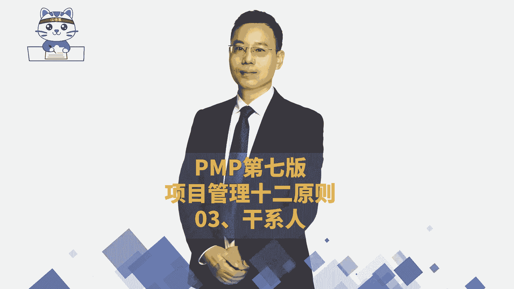
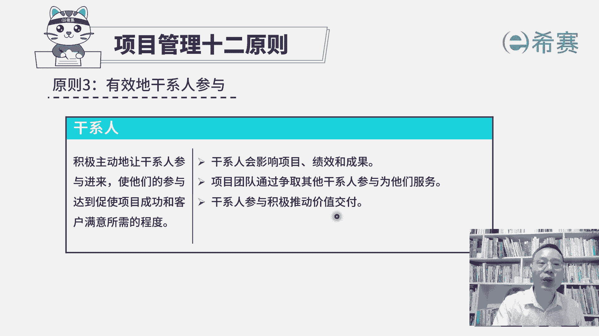
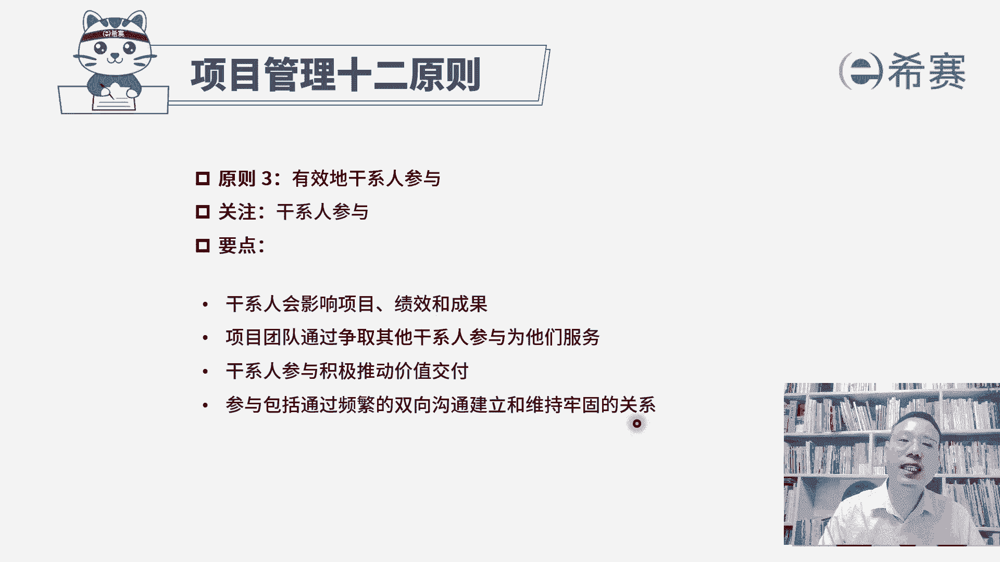

# 【24年PMP考试】零基础也能看懂的pmp项目管理视频教程！ - P33：3.4PMP第七版项目管理原则之03干系人 - 冬x溪 - BV1tu411g7UH

接下来我们一起看到的是，项目管理12原则中的第三条原则，叫有效的干系人参与呃，首先干系人这个词呃，有的版本呢会翻译成叫相关方，它不管叫翻译相关方也好，还是干系人也好，他都是那个stick holder。

其实同一个词啊，其实也就是跟这个项目相关的人，所以会影响这个项目，以及会被这个项目所影响的这些人都叫干系人，都叫相关班，那整个这一条有效的干性参与，它的内容，基本上就是你之前所学过的这一个干性管理。

我们来看一下，积极主动地让干系人参与进来，使他们的参与，能够达到促使项目成功和客户满意，所需要的这个程度，其实也就是说，如果能够让干洗有效的参与这个项目的话呢，项目成功的可能性会更大。

如果项目比较成功的话，那客户满意度也会更高，这就是干性参与他要干的事情，那这里有展开三条信息，第一条说干系人它会影响项目，会影响绩效，会影响成果，想都不用想，肯定是有可能的哦。

我们说干些事会影响项目的人，你就会受项目所影响的人，所以所有那些影响项目，影响这个项目有效推进，影响这个项目的建一个进程，所有的进程就是包括进度呀，成那个成本管理呀，这都是他的绩效对吧。

哎那就一定会导致影响结果好，第二句呢，项目团队通过争取其他的干线参与，来为他们服务，也就是说我们在做事情的时候，一定要想办法把他们给拉过来，跟我们在那一个阵营，他如果以前是不太考虑这个事情。

我们让他去主动去积极参与，他如果说是反对这个事情，我们尽尽量想办法去策反他，让他不要反对，我要去把他争取过来，让他更好的去参与这个项目，去支持这个项目，并且呢他越参与这个项目的话。

他越能够提出一些想法和建议，包括一些反馈信息，那我们就越能够去做一些探索需要的东西，这样从而能够更好的去为他们服务，那整个干线参与，它能够积极的推动价值交互，因为他只要参与进来的话。

它能够更有效的去提出一些这种反馈信息，而这些反馈信息和意见，他其实就是在给我们指路啊，他告诉我们说我们应该要走哪里，ZAIZI对吧，我们应该要做什么做什么做什么，就这么一回事。

那这样我们做出来的东西就更加有价值，因为是客户跟随他来去定义价值。

所以整个关于项目管理12条原则，第三条，有效的干性参与，它相对比较简单，因为前面你都学过了，就是首先谁是干系人，所有会影响项目，影响绩效，影响成功人，他就是干系人，当然了，被这些东西影响的也是干系人。

而我们呢需要努力去争取他们的参与，从而能够让他们对于项目的支持变得越来越多，而抵制变得越来越少，并且事实上能够积极的去参与的话呢，它能够有效地推动这个项目，交付一个正向的价值，而这个参与。

他说包括通过频繁的双向沟通，来建立牢固的关系，并且呢通过频繁的双向沟通来维持牢固的关系，这也就是人与人之间呢，这是属于这样一个人际关系和交往技能中，你要能够有效的去跟他互动和交流来。

去让他更好地去支持项目好，这是第三条原则。

