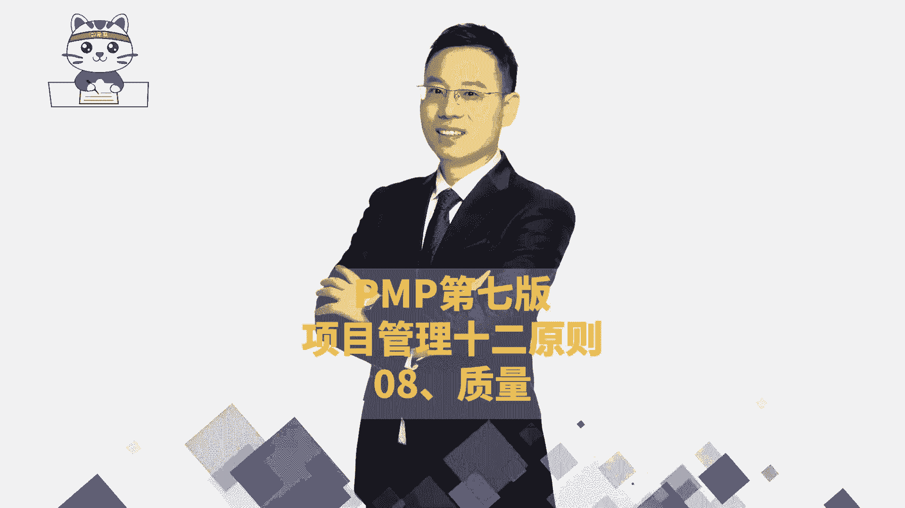
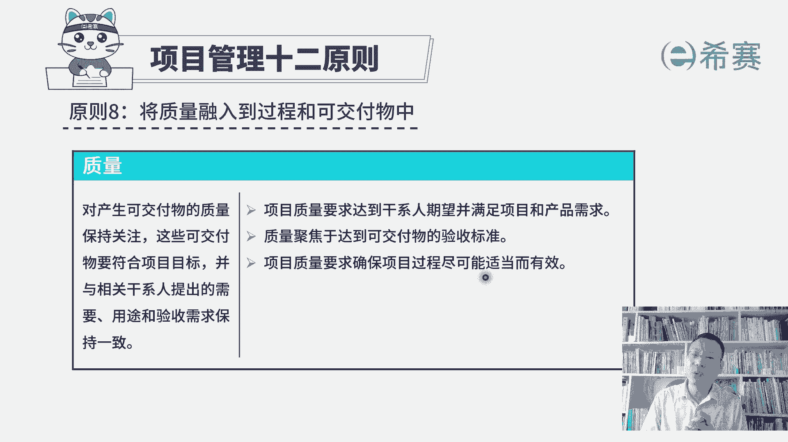
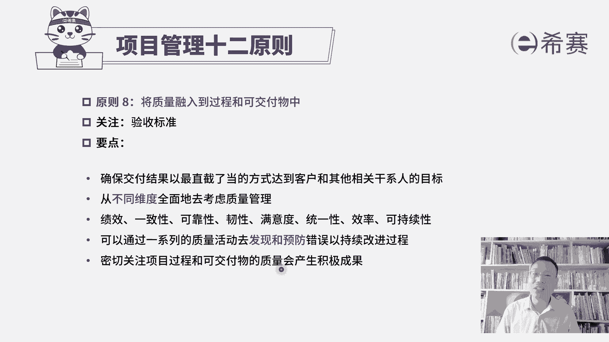

# 【24年PMP考试】零基础也能看懂的pmp项目管理视频教程！ - P38：3.9PMP第七版项目管理原则之08质量 - 冬x溪 - BV1tu411g7UH

接下来我们一起看到的是，项目管理师二原则的第八条，叫把质量融入到过程和可交付成果中啊。

我们在前面的预测型项目管理中的，专门有讲到质量，其实质量我们既要去再开始制定一个质量，测量指标，制定一个质量管理计划，在整个做项目的过程中，我们需要去管理好质量，要实施质量保证。

并且呢我们对于做出的成果需要去控制质量来，去确保这些东西的质量没问题，然后采取走确认范围来进行验收，走最后的结束项目或阶段来进行项目大的验收，所以你会发现项目验收它的一个前提条件。

就是这些东西的质量没毛病，等到后面我们再去学敏捷的时候，你也会发现敏捷中它会特别强调的是什么呢，我们要去交付一个可工作的软件，可用的软件，那这个可工作可用它的前提是质量没毛病，如果质量都不能达标。

那别人是没有办法用的，所以质量在整个项目的过程中，其实是非常重要的一个内容，那我们一起来看一下项目管理原则，第八条中的质量，这个板块对产生可交付物的质量保持关注，这些可交付物它需要符合项目的目标。

并与相关干系人提出的需要，用途和验收需求保持一致，也就是说对方他对这个项目希望做成什么样子，希望包含什么功能，那这样一些测量指标，我们都要去满足它，能够达到的一个验收的标准啊，所以展开来看的是。

项目质量要求达到干系人期望，并且能够满足项目和产品的需求，也就是说客户或者是相关方干系人，他们对这个项目有什么一些期待和要求，我们是能够去做到他的这个基本程度，质量是聚焦于达到可交付成果的验收标准。

这个点很重要，就是我们的东西是不是做的越好，才是一个好事情呢，我们前面学过项目质量管理，其实你大概知道，如果你希望那个东西的质量，达到一个极其好的一个状态，你需要付出代价是很昂贵的，而我们每一个项目呢。

它都有一定的资金，对应的，它就会有一个质量的一个标准，理论上来讲是刚好够用，刚好达标是最为合适的一个状态，并不是越高越好，因为每一份质量提高都是带着金钱的味道，好在第三句，项目质量要求。

确保项目过程尽可能适当而有效，所谓的这个适当而有效，它讲的是什么，就是为我们后面的敏捷项目管理来做一个铺垫，这并不是每一个项目，它都是像我们在预测型项目管理中，一开始就完全定好这些指标啊。

然后就去去落实，去执行，然后去检查质量，在敏捷中可能某一些需求它提出来，直到我们在某一轮迭代开发的时候，才会定好它的一个DOD叫验收的标准，或者完成定义，所以他是在持续的过程中会逐步去定义清楚。

并且逐步去落实，你只要知道它会用一种迭代的方式，用一种敏捷的方式来去完成。

就没毛病，那我们来一起看一下，关于这条原则，将质量融入到过程和可交付成果中，他关注焦点其实是质量，关于这个项目它的这个验收标准，或者说是具体的可交付成果，它的验收标准，那这里要领有这样几个，第一个。

要确保交付结果，以最直截了当的方式来达到，客户或其他相关方的这一个目标，就是满足客户的要求，包括质量的要求，以及他在验收的要求好，第二句，从不同维度来全面的去考虑项目的质量，哪些维度呀，关于绩效。

关于一致性，关于可靠性，任性满意度，统一性，效率可持续性，那这些词里面可能有一个词叫任性，你不是很好去理解，我们前面稍微讲过一个词，说一个东西弹下去，然后又弹上来，他重新回到原有的这个状态。

这是所谓的韧性，也就是说他面对挫折和困难，能够恢复到原来状态，这个能力这叫任性，我们做某一些产品的时候，他需要考虑到建议能韧性，你可能从一些枪战片里面，看到类似这样的一个桥段，一把枪扔过来，结果没接住。

然后掉到地上，他都已经是摔开了，但是你把它重新组装以后，依然可以瞄准啪啪啪，哎这也是它的一种韧性，就是它能够去对抗这种环境的破坏，依然可以恢复到原来的状态，但这只是任性了一个小小的维度解释啊。

你要知道一下，我们在做项目质量的时候呢，要把这些因素都考虑进来，那还有一个关于可持续性嗯，你可以把它叫做循环的概念，就是去生产这个原材料，去组装这个产品，去卖给客户，去使用，客户用完以后啊，把它丢掉。

那丢掉丢弃的东西它又可以去回收利用，可以去回收其中的一些些的原部件，唉这都是一种所谓的可持续好，接下来看到下一句，说可以通过一系列质量活动去发现和预防错误，已持续改进，所以这里面会讲到那个质量持续改进。

我们有一个叫PDCA循环，那通过这个PDCA循环不断去优化改进，优化改进，并且前面在讲质量的这些个呃原理的时候，有讲过说预防剩余检查，因为检查你只能去把那些已经产生的错误，给挑出来。

而预防是尽量让它少产生错误，甚至不产生错误，所以这都是跟我们项目质量管，另一端是完全相关的，一致的，密切关注项目过程和可交付成果的质量，会产生积极的成果，什么积极的成果能够更好地去通过验收啊，对不对。

所以这是关于项目管理12条原则的第八条，将质量融入到过程和可交付成果中。

关注质量。