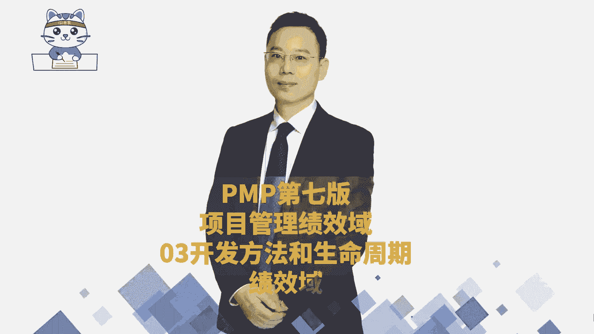
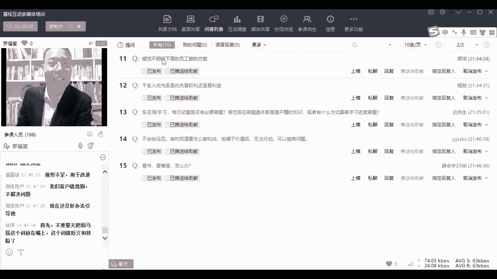

# 【24年PMP考试】零基础也能看懂的pmp项目管理视频教程！ - P52：4.10PMP第七版8大绩效域之03开发方法和生命周期绩效域-下02 - 冬x溪 - BV1tu411g7UH

啊我们的课程呢今天的课就已经上完了，接下来是呃有同学的问题，首先第一个问题是张雪同学问了一个，说我的社交能力很差怎么办，社交能力很差，那到底是什么原因导致的，这个需要去了解一下是什么原因导致的。

社交能力很差，是你本身不愿意社交，不乐意社交还是不会说话还是什么情况，你要有个具体的场景，比方说也有一些同学他不愿意社交，但是他很很OK啊，他很自得其乐，我不愿意社交，我不社交。

我就是自己就自得其乐也是很好的呀，为什么需要社交，那我做技术性的工作，我做技术性的工作，我能够把这个技术性的工作做的非常棒，非常棒，非常牛逼，我能把这个卷饼卷的非常漂亮。

你们有没有看过说有人他会摆那个餐盘，十个键盘一甩就甩到那个桌面上，他可以做得很牛逼，那可以啊，我为什么非得要去社交呢，但是如果说你很想社交，你又不知道社交诶，这是另外一个话题了，跟客户聊天不知道聊什么。

那你就聊业务呀，聊工作上的事情呢，你聊工作上的事情，你就只聊业务上的事情，OK并且把你的业务做的非常漂亮，把这个业务做得非常漂亮，把这个跟这个业务相关的，对哈哈对，有个同学给了一个很好的信息。

你增加你的词汇量，就是你增加你关于业务上的词汇量，增加管理上的词汇量，你能够比较好的比较漂亮的去去去去完成的话，他会很服你，他足够服你，他足够服气的时候，其实你不擅长于沟通，也变成一种优点。

就是当你变得很牛逼的时候，你不擅长于沟通，你甚至有点社恐也变成一个优点，变成哇哦，这个你们有没有看到一个有一个叫韦神，是是北大的韦神，是不是别人会觉得他很牛逼啊，觉得他很很那个呀，他有需要那么多社交吗。

其实所以有的时候这个社交就是看你的需要，你自己如果觉得你需要社交，你去做社交的事情，但如果说你的职业并不需要你那么多社交，你为什么需要社交，就像我不会喝酒，我不觉得我不会喝酒，就是一个多么大的一个弱势。

我不需要我做，我做一份不太需要喝酒的工作呀，我以前的我以前做项目经理的时候，我也不能喝酒，那时候我的老板，首先第一个是不太需要去陪客户，不太需要喝酒，第二个呢是偶尔的时候，偶尔跟客户一起喝饭吃吃饭。

吃饭的时候，我的领导他也会跟我讲，他也会跟客户讲，还说那个小罗喝不了酒，因为他知道我喝不了酒，我确实喝不了，那我现在我现在做了换了这份工作，我不需要去陪客户喝酒呀，对不对。

你做一份能够满足你的这个适应你的就可以了，为什么非得要跟别人一样呢，为什么要非得跟别人一样，但是如果说你自己很想要去做社交，那你可以尝试着去做一些交朋友的事情，你可以去跟你的一些同学同事朋友来成为朋友。

OK可以去成为朋友，VIC说那个项目经理非常需要社交是吧，那你也不一定非得要做项目经理啊，你觉得销售需不需要社交，你觉得销售需不需要社交，销售需不需要喝酒啊，我们我们先说那个啊啊我们换一个词。

假设喝酒这个东西，我们说销售需不需要喝酒，很多人都会觉得说销售一定是需要喝酒的，但是我曾经见过一个朋友，他做销售，他真的是不喝酒呃，甚至都不怎么请客户吃饭，他做的是一个什么呢。

他当那当然也是很多年以前吧，时至十多年以前，他就是专门做那种传感器，而现在已经是下课了啊，同志们，现在已经下课了，他做传感器那种业务，就是就是把国外的一些传感器卖给国外，卖给国内的一些一些这种高校啊。

科研科研机构啊什么之类的，那些人，他也不太需要你的这个社交的一些行为，不太不太需要你这种东西，你只要做的这个传感器是足够足够，OK足够牛逼就很好，所以有些东西其实你就说你这一方面不行。

你在另一方面变得很强大，但你在另一方面变得很强的时候，你这方面不行，也变成一种好可爱，好有趣，好有意思，所以你还是要想办法让你的产出变得更长，你不要总是想着去补短板，我觉得补短板这个社会不太流行补短板。

你更多的是要去发挥你的优势，发挥你的长处，让你长出变得更长，哦我看到图卡已经给了你一个很好的回答，多读书，多接触，多了解知识，没事的时候看图，我想这也是一个很好的一个点，但是如果说你本身不乐意社交。

不愿意社交的话，就那就不太需要好啊，来先回答一下同学们的问题啊，就是嘴巴跟不上思维怎么办，嘴巴跟不上思维，哎呀你可以去看一本书，叫推荐你看一本书吧，推荐你看一本书叫什么呢，叫叫金字塔原理，在精彩原理中。

他会告诉你，就是我们去讲一个，我们去讲话的时候，你在脑海里面快速的去过一过，你在脑海里面快速去过一遍，这些事情能够有一个12345，当你脑海里面有一个12345的时候，即便你说话说得很快。

你也能够说出来很很有条理，很有条理，但还有一种方式呢，就是说先不要说对，先停一停，你先不先别说，OK你说话之前你先稍微过一过也是可以的，那我有的时候其实也有那种说话，说的很快的时候，说话不过脑子的时候。

但是你如果有些重要的事情，你就会稍微思虑一下，对不对，你稍微思虑思虑，然后再缓慢的去说，当然如果你能够真的去养成一种习惯，就是凡是能够想个123，123123那样的话，你你说话一定不会太差，不会太差。

就是有些时候那种说话，不需要说说你有多么的优美，但是不是不是说非得要有多么的优美，但是你一定要能够有条理，当你能够有条理以后，其实没太多问题啊，然后再看一个啊，就是郑春青同学问的说是880。

听完以后练习练练习题还是做章节练习，还是知识，你先做章节练习题，然后顺便可以做知识点练习，就可以做章节练习，也可以做知识点练习，你可以这样去做呃，知识点练习有很多，你不要求自己一次做完，你可以做50个。

再做50个，你稍微记录一记录，这种方式是可行的啊，然后看一下干系人中途退出，是不是可以理解为他不再是干系人，怎么讲呢，他不再是重要的干系人，只能说就是我们在讲干系人的时候，我们是不是有讲过很多。

有有一个区间对吧，有个区间是权力比较大，都是同时力也很大，他现在从这个项目中退出了以后，他不是一个重要的关系，但是你保不齐，他可以给你一些助推，他在客户面前说说好什么好话，就能够让你变得更牛逼。

有没有这种可能性，非常有可能，对不对，所以只能说是他可能不再做一个重要的干系人，但是你也不要，就是我们也不要做那种过河拆桥的事情，不要说嗯他他在的时候，我就对他笑脸相迎，他不在的时候。

我就是呃这种方式就不太好了，你还是就是真正的在做项目管理上的，你其实还是要做一个好人，能够能够能够相对来讲搞好关系吧，这关系怎么讲呢，就是让别人不讨厌你，至少至少尽量的让别人不讨厌你，这个还是很重要的。

呃27页说甘先参与活动，始于项目开始之前或项目开始之时，那中途家人怎么理解，干系人可以有很多，我们在后面会专门有一个章节，就是你看一下目录，你看一下今天我在群里面发的那个东西。

目录目录里面有有专门有一段，就是讲干系人管理或者相关方管理的，就是专门有一课就是讲肝性管理，内脏会展开来讲，但你现在问的话，我现在可以跟你说一下，就是在项目还没开始的时候。

就有一些人默认就是这个项目的干系人，比方说领导客户提出这个事情的人，他就是项目的干系人对吧，那还有呢还有就是在做的过程中，不断的会发现新的人可能会是项目的担心人，包括项目快要结束的时候。

又有一个新调过来一个领导，他也是这个项目的干系人，所以各种情况他都会有，都是厦门干系人啊，都是厦门干系人，好看一下啊，杜志涵同学说的，杜志涵同学说的说，有一个问题要请教一下，项目是团队自组织完成的话。

那么项目团队应该由谁去组建呢，那当然还是有领导啊，肯定有领导嘛，有人去传这个团队吗，没有人去管这个团队，那个那个了得，他是有人去管这个团队，但是他不会不会去微观的管理，他不会去微观的管理。

而是会去授权的方式，就把单能够把大家给拉起来以后，就授权给大家，让大家去自我管理，但是一定是有领导的，你要真的完全没有领导，怎么可能对吧，呃干系人的优先级，我们在后面会专门有一章叫干系人管理。

加了一张在展展展开讲，再展开讲，好不好啊，在这个点上面的话呢，就是说我看一下啊，就是相对来讲，如果说我们如果说我们用一个简单的一个框，用一个简单框架的话，他肯定是第一优先满足的，OK第一优先满足的。

然后这个群体呢肯定是第二优先满足的，然后这个群体是第三，然后这个是第四的，这是它的一个优先级，这是一个优先级好，最后还有一个就是说，现在公司的领导特别喜欢挑技术方案的刺，怎么办，这个怎么讲呢。

我给你分享一个，我跟你分享一个我自己的亲亲身经历的故事，看会不会对你有一点点启发啊，就是我们在职场中其实都会经过很经历，很多项目，也会经历很多人经历很多事，曾经有一个项目客户对我特别挑剔。

经常会就反正对我很挑剔吧，然后那时候呢其实我过得也很不也不是很愉快，也不是很愉快，但是事后就是多年以后，我再回想我在哪一段时间进步最快，就在那个最挑剔的客户手上，我进步最快就是当他在给我挑剔的时候。

其实是能够帮我发现我所忽略的问题，或者我所遗漏的问题，所以这些人虽然会让你觉得很讨厌，但是他有可能会让你很快的进步，你想一想，如果说你的方案真的做得足够牛逼，他可还能挑得出刺来。

既然他还可能可以挑得出刺，是不是表示你还有改进的空间，改进的机会，所以如果你能够想明白这个事情的话，你可以把它当做是你的一个测试，把它当做一个你的测试人员，OK这个测试人员在帮你测试，帮你成长这种方式。

你再去思考这些东西，你可能会变得感激他，你可能会有点真的想要去谢谢他，Ok，所以所以很多时候别人是在帮我们成长，当我当我的次，当我的这个问题，我这个方案的问题很多的时候说明什么。

说明我还说明我还有很多进步的空间，我还有很多进步的空间，我能否下一次再做第二个，再做一个方案的时候，我可以把上一次所有犯过的错误都不再犯一遍，就不再犯了，如果你真的能够把上一次做的方案的那些错误。

不再犯的话，你一定会变得很牛逼，哎这就是一个复盘的力量，你要不断去复盘，然后去回顾，去自我成长，就会变得很牛逼，当然了也有那种很讨厌的人，讨厌的人，那是另当别人讨厌的人的话，那你有什么办法呢。

唉有些时候讨厌的，那你只能是说你尽量跟他少一些的，少一些互动吗，有的时候你能躲就躲，躲不了的，躲都躲不了的话，那也没办法了，反正你领这份待遇，领这份工资，稍微受点气也是正常的吗，别人说你几句，骂你几句。

你拿了拿了这个几万块钱也是可以理解的嘛，是不是，好再看一个啊好然后有一位西餐用户同学说，罗帅老师先学八班，先学习880，再来听直播课吗，建议是先看880，看过以后你会打个底子。

其实很多内容在880中都有讲过，在很多很多内容在880面都有讲，所以建议大家去学学的时候，你也可以直接是按照，我按照我今天在群里面所发的那个文件，在群里发了一个对照的文件。

那个那个那个excel表格去看，那这样可能会更好一些，因为有可能有一些东西就是你完全不了解的话，但如果说你本身也有很多很丰富的工作经验，就你本身自己的经验比较丰富，那么我可能讲的东西你都能够理解。

那也有一些同学本身自己没有太多的工作经验，或者没有太多的项目管理的经验的话，你听这东西很辛苦的话，那你一定要提前去勤能补拙，那一定要花时间和精力提前去预习会更好一些，会更好一些。

但我是会建议每个人都要自己都要预习一遍啊，是是是，这个建议，嗯对啊，然后再来看一个呃，呃就是说他的挑刺是不相信项目的员工，那他不相信下面的员工的话，其实那你就要去，我们就要有一个叫什么批判性思维。

你要通过这种批判性的思维，你要通过这种批判性的思维去看他的这个挑刺，到底是真的挑了你的刺，你真的是有改进的地方，还说他是为挑刺而挑刺，其实你已经做的足够好，他就是那种个性，我们说人的这种这种信念也好呀。

这种价值观也好呀，还有这种一些处理方式，有一些他就是很散的一种文化，有些人就是很积极向上的文化，那么每个人这种习惯性格不相同，看它是属于哪一种，你在有有针对性的来去来去应对它，来去应对它，OK好。

然后干系人优先级是优先看权利，还是优先看利益呃，这个没有绝对的优先，但是权力大的人肯定是更重要，权力大的人是不能得罪的呀，权力大的人是不能得罪的，权利大的人是不能得罪的好，然后池先生说。

刚开始学习每日试题是否有必要刷，没必要没必要没必要没必要，因为那个每日试题呢它是打乱顺序的，是打乱顺序的，所以目前还不在那个状态啊，大部分都是你没学过的，暂时可以不必要，暂时就看880视频教程。

或者是刷一刷章节练习题就可以了，然后JS说不会拍马屁，有的时候要怎么做和说，但碍于价值观无力行动，嗯有的时候是这样的呀，就说我不想撒谎，但是我可以不说话，我我我不想撒谎，那我也可以不说，我可以选择沉默。

我可以选择不说，对吧，呃就像有一些东西你你不说出来，你不讲，你也没有撒谎呢，他也也在，还是赢，还是符合你自身的价值观，不一定非得要去拍马屁，其实职场上有一些岗位，肯定是需要拍马屁的能力和功夫的。

但并不是每一个岗位，并不是每一个岗位，很多时候还是靠实力，你有足够的实力嗯，很多事情都不是事情，真的真的呃不愁赚大钱，赚小钱过生活是没问题的啊，就只要你有实力的话，呃，过个小生活是完全没问题的。

你你这个点我希望每一个人都可以，我相信每个人都能够理解，所以并不是每一个工作都是需要靠靠靠，靠这种逢迎拍马的方式来去完成，尤其是技术感，尤其是那些技术感，真的是靠靠你自己的实力就可以了，好。

然后是学会与同学说看书会看懵逼怎么办，看书看懵逼是很正常的呀，这些书里面全部都是不说人话的，全部都是使用哪种，一种很莫名其妙的这种语言在表达，所以才会建议大家看880视频教程来预习，看了听老师的课程。

让老师讲给你听，你再去翻书，你就会变得很容易了，你没看过没听过课程，你直接去看书，就是会很懵逼，这是很正常的，因为这是这是这一这一类课程的特性，所有的这种这种类型的这种书籍都是不说人话，都是不好看。

正常啊，好啦同志们，要不我们今天晚上就先到这里了啊。

