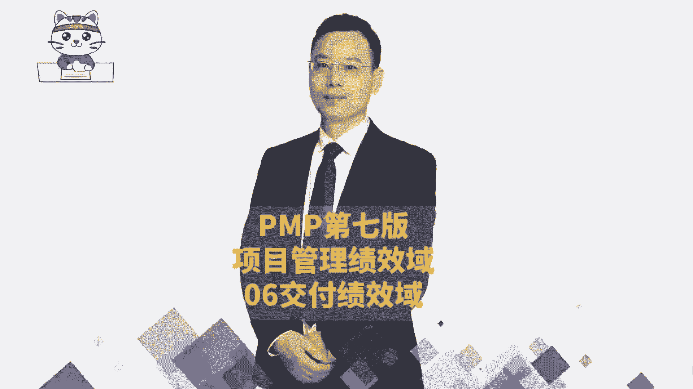
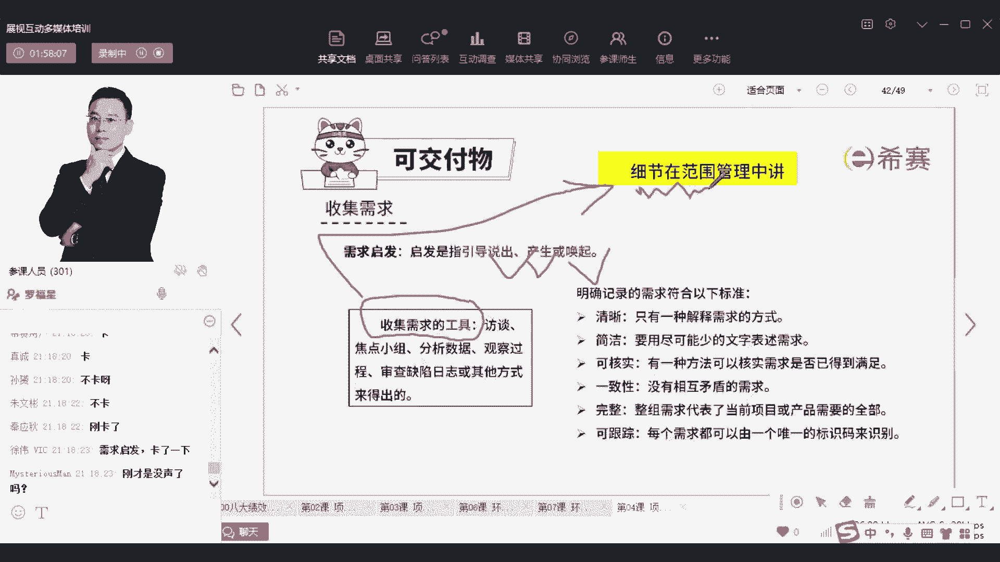

# 【24年PMP考试】零基础也能看懂的pmp项目管理视频教程！ - P58：4.16PMP第七版8大绩效域之06交付绩效域-上 - 冬x溪 - BV1tu411g7UH

然后接下来我们看到第六个。

第六个叫交付交付，它依然还是属于执行，他只是把焦点放到另外两个板块，放到哪两个板块呢，它把它放到了范围的这个板块和，质量的这个板块，也就是说前面是会会发到各个事情啊，然后什么又是采购啊，又是沟通啊。

又是什么这种这种东西，而现在呢他把他最后放到交付交付，这个教育可能是说我要去交付这个东西，我交付的东西到底是包含什么功能和性能，这属于范围，以及我交付的东西它的质量达到什么水准，这属于质量。

所以他给了一个叫交付的绩效语，但是我觉得这种其实也就是，把原有的东西又打散了，去重新讲啊，你看交付绩效于涉及到是与交付的项目，所要实现的这些范围和质量小相关的东西，你如果要去做好交付期教育。

第一个说项目要有助于实现业务目标，推进战略，那不就是能够达成目标，达成目标的话，一定是靠一些具体的可交付成果对吧，那么可交付成果呢，你要能够去实现这些可交付成果，OK项目实现了最开始启动的时候。

就想要的这些可交付成果，那不就是范围能够去满足，然后在规划的时间框架之内，去实现了项目的收益，你怎么样实现收益，你能够实现结果，并且能够交付出去，并且能够运行起来，这才能够去实现收益，然后呢。

还有就是项目的团队，对于项目的需求有清晰且一致理解，这就是也是跟范围有关系，还有可还有大家对于这个东西是能够接受，接受的，前提是什么，干系人或者客户，他对于这个结果的接受接受，前提是你的质量没毛病。

质量是OK的，你先是质量OK，然后我再去接受这个产品，所以是质量方面很重要，那我们就一起来看一下关于交付的绩效，与那整个交付绩效域中，它会聚焦在一个是满足客户的需求，满足项目的范围。

其实需求和范围算是一体的啊，算是一体的，并且呢还要满足质量的期望，继续关注这个点，所以我们最后做出这一可交不成果，是既能够满足需求和期望，也能够满足质量的要求，这样的话才是OK的。

那这里面会涉及到一些内容，首先我们做项目的话，项目本身可能是为了去解决某些问题，来去做项目，也可能是去满足客户的某种需要去做项目，那他一定会产生一些结果出来对吧，它产生的结果有可能是有一些产品做出来了。

或者提供的某一些服务，而这些东西呢都能够去为为社会创造价值，也有可能是解决了某些问题或者修复了某些bug，它其实也在去创造价值，或者他没有达到最开始所理想的状态，达到一个叫次优的特性，这个刺有的特性呢。

可能很多同学不能够顾名思义，但是我们稍微解释一下，首先什么叫次优，还有一个东西叫最优，最优的东西咱们做不到的情况下，我们做一个其次的也还不错，那叫次优，可以理解吗，这叫刺绣的东西，什么叫特性的特性。

这个词，f e a t u r e feature fetch这个词，它你可以把它简单理解为是功能，但它其实说的是一堆功能的集合，就一些些的功能的集合，咱们给它取一个名字叫特性。

那么次幼的特性其实也就是是不那么好，但是呢也还可以的一些功能的集合，也还可以的功能集合，那咱们去做出这些东西出来交互各种成果，那么交付成果以后，其实会希望就在客户的角度来讲。

他会更关键是这个东西有用没有用对吧，有没有功能下面没有毛病，然后呢唉也很容易去使用，能够帮我省时间，能够帮我省力气，能够产生价值，能够产生回报啊，并且呢他说有一些差异性，能够让我在市场中异军突起啊。

这些都很虚啊，那我们来去看一下十的，就说首先交付呢可能会有多次交付的方式，比方说第一条他给的是一种什么样的交互，就白色的这个方式交付就吭哧吭哧做做做做做，做事情以后哎，交付一个东西。

然后又开始做事情做事情做事情，然后又交付一个东西，然后又开始做事情做事情，然后又教会一个东西，这是什么呀，这是用什么样的方式来交付，同志们来帮我敲出来，你所理解的第一条，它是什么样一种方式在做的交付。

他是不是交付了很多次，他交付了很多次，是不是就是一种真练交互的方式，对就是敏捷，就是真练交互的方式，对不对，所以其实这就是在用增量交付的方式，就是这个意思，意思啊，就是啊我搞了四个礼拜交付一次。

我又搞了四个礼拜，我又交付一次，我又搞了四个礼拜又交付，就不断在交付的这种逻辑，OK这是一种交互的方式，那还有一种交互的方式是什么呢，还有另外一种交互的方式，我一直做一直做一直做一直做一直做一直做。

做到最后啊，终于做完了以后交付，这不就是预测的方式来做吗，对吧，这是预测的方式，所以他告诉你说，价值交付中既可以用敏捷的方式来去交付，也可以用预测的方式来去交付，可以理解吗。

你通过图形就能够知道这个意思啊，通过图形就能够知道这个意思，那咱们在交付的时候呢，你要去关注，就说我们通常来讲，一个项目的周期其实是有限的，但是项目做完以后并不代表这个项目就结束了，项目做完啊。

不要说出来，就，项目做完以后，并不并不代表整个这个事就结束了，项目做完以后做了这个结果，比方说你给某某单位做了一个ERP系统，你这个项目做完以后，他是不是就开始去投入到运营，对不对。

他是不是就开始投入到运营，所以他投入运营以后，那运营又可以做很长很长的时间，对不对，他又可以做很长很长的时间，并且很多时候，很多东西它是投在运营的过程中来创造价值，在运营或者运维的过程中来去创造价值。

是这样的一个逻辑，所以你要知道这个价值交付，就是说可能做的时候本身没有太多创造价值，但是做完以后诶他可以去创造价值，那包括我们在前面讲过一个叫产品的生命周期，产品生命周期中。

产品本身你研发完成还不能算是产生价值，你研发完以后你拿去卖，你可以卖出去，OK你大胆的卖出去，这才是去创造价值，你有这个思路就可以了啊，所以即便是项目结束以后，你看后面还会持续去产生这个商业价值。

会有这么一个逻辑，你不要觉得这个东西看不懂，其实其实就是咱们做完一个项目，交付给对方以后，对方会拿它去用，用的过程中才真正的去产生价值，就这么回事，就这个逻辑就可以了。

那整个这里给了一个叫项目的生命周期，这里有个叫产品的生命周期，还有的是项目集，什么叫项目集，一堆项目A项目和B项目对吧，哎这里有一个项目啊，这里有个项目，他们之间合在一起呢，诶这个不重要啊。

这你只要知道这个你只要知道第三条就可以了，第三条就是项目结束以后才开始正儿玩，去创造价值，把这个逻辑给搞清楚就可以了，然后再往下面一看，你看我们去做做这个项目来去交付对吧。

我们去交付是希望他能够去一些价值交付，那么希望他有价值交互，我们怎么样去判断它的一个交互的东西是真的，OK的，在最开始还没有做之前，咱们是不是做了一个商业的论证，做了这商业论证。

其实就会从很多维度去考量，这个项目值得做对吧，我们从经济的维度呀，从技术的维度考量啊，啊从那个那个那个什么资源的维度一样，从这种社会的角度一样，从各种风险维度啊，那么现在其实我们是需要去综合去看一看。

我们去看他说项目的结果，跟公司的那些商业目标，是不是依然是保持一致的，有没有去达到那个目标，比方说我们最开始说了一个商业的理由，现在是不是依然成立，然后项目的价值有没有去满足他的这个投入，产出比啊。

投资回报率啊，投资回收期呀，而这些东西它的收入啊，结构啊，跟我最开始的预期是否有相一致，我们可以在项目投入到运营以后，做一个叫项目的后评估，项目后评估，就项目已经投产以后，投入运营以后。

我再来去评估它唉，这是可以的，然后我们同时我们在做事情的时候呢，会产生可交付成果对吧，那么这些可交不成果，你看项目的可交付成果，它是指临时的，最终的这些产品服务或成果，你把它交付出去，叫可交付成果。

而且可交不准模式有助于帮助我们去实现目标，那么整个可交付成果一定是满足客户的需求，所以满足客户的需求，满足干系人的需求，并且基于他的需求，他要的东西我们会做一个叫产品的范围。

但是我们还会把这个产品的范围呢，把它转成项目范围，也就是开始说的你去装修房子的时候，你开始有一个叫效果图，你还会把这个效果图去转变成一个施工图，那么那个施工图就说我要去做哪种具体的事情。

做了一个具体的事情，做了一个具体的事情，那种施工的图纸叫施工图，这是我们的一个范围，同时在施工的时候呢，咱们还需要去考虑，就是每一个地方你要做到什么的维度，就说我们会把客户的需求。

我们会把这个客户的需求，把它转换成项目的范围，那这些都是我们需要去关心的，并且我们在做这件事情的时候呢，我们还会列出来我们要做到什么程度，就做到什么样的水准，做到什么程度，那这是一个质量的要求。

OK这是一个质量的要求，OK那整个在做事情的时候，你看他说我们依然会需要去考虑的是关于利润，人员薪酬，这又是三通底线对吧，就是其实就是利润图片是我自己关掉的，图片是我关掉的啊，图片是我关掉的好。

然后呢图那个什么人员，其实也就是我们这一个社会群体，然后地球是我们的环境，而这些东西还是我们来做做这个事情的时候，他需要去满足的，也是满足三通底线的情况下来做这件事情，然后至于说需求。

需求就是客户的需求了，而不去展开讲，可以是高层级需求，也可以是详细需求，你不同类型的项目，你的项目需求其实可能会有点不相同，不同类型的项目，你的项目的需求可能会有点不相同，OK啊这是一个客户需求。

然后第二个呢就是你收集需求的时候，你可以有很多种方式，比方像这里这是预测型的项目管理，那预测型的项目管理中唉，我们就前期集中去收集需求，我收集完数学以后就开始做事情。

做事情做事情做做做做做做做一直做的方式，诶，这是一种预测的方式来做事情，那还有一种敏捷的方式，敏捷的方式呢我们说拥抱变化，也就是你做了一点点事情啊，客户又提了一些新的东西过来。

然后做一个A客户又提了新的东西过来啊，又提了一些新的东西过来，然后又提了一些新的东西过来，持续的拥抱变化，持续的有一些新的东西提过来，所以你可以分成不同类型的项目来去做，那这也是我觉得PMP。

他自己现在想要试图难过，所有的项目有这种方式，但是我真的觉得这种方式其实也挺没意思的，就是他既要把这个预测的这一块吞下来，他要把敏捷这一块吞下来，还要把它放到一起，你只要知道这个逻辑。

但是真正在做事的时候，他们做的方式还是有很大的差异啊，还是有很大的差异呃，这里面给的是什么点呢，呵呵这是为了写这个字，写ABCDEFG这一字，写那个已有高层级了解的项目，写这些字。

所以他要把这段必须搞得很长，可以理解吗，其实理论上来它就是一段一段的啊，就是一段一段的，但是为了把这些字融进去，所以他搞搞有点好长啊，是这样一个逻辑，然后呢在还有就是收集需求的时候。

他会讲到说有一个叫需求启发，而需求启发重点讲的是什么，就是你能否通过你的手段和方法，让对方把他的一些想法和需求给讲出来，所以说引导他们去说出诉求，说出需求，让他们去产生需求。

或者唤起他们心中对于某些东西的一些需求，那这个东西啊其实说白了就是需求的工具，OK就是收集需求的工具，那么对于这些收集需求的工具呢，能看得到吗，给了一个黄色的图片，就是所有那种具体的收集需要工具的细节。

