# 【24年PMP考试】零基础也能看懂的pmp项目管理视频教程！ - P67：5.1备考心得-3A心得交流 - 冬x溪 - BV1tu411g7UH

好现在已经是晚上的07：30啦，各位同学晚上好，欢迎来到今天的西塞。

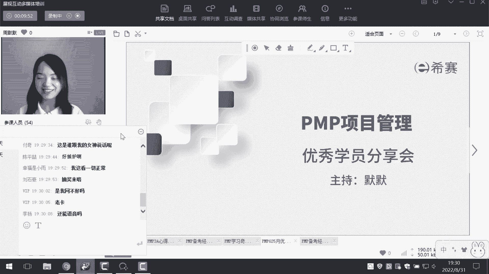

不是网络课堂，今天我们是优秀学员的分享会，那么分享会主要内容就是，我们邀请了6月25号刚刚考完试的，一共是五位同学给大家分享他的一些考试经验，以及他呢也会给我们的学弟学妹们做一些榜样。

除了这是我们的主题，我们呢还会有一个非常隆重的环节，也就是抽奖了，大家这段时间应该也有收集一些抽奖码，参与一些活动，对不对，那么今天晚上呢我一定会给大家抽23个，西夏娃娃，长这个样子啊。

23个娃娃看到没可爱吗，大家想要吗，想要的给我扣个一二十三个西塞的娃娃，然后呢还会给大家抽八个榨汁机，那么可以抽奖的同学，都是之前把抽奖码已经上传给我们的班主任呐。

助教小姐姐的同学是我们已经考过的这一批啊，如果在座的有新班的同学啊，比如说和风旭日啊，还没有考的同学之后的分享会，你们也是有机会的，好对今天有抽奖，OK那我们嗯抽奖是在每一位同学。

他分享完之后给大家抽的，那么话不多说，对抽奖码啊，话不多说了啊，我就给大家来展示今天的主题，今天主要是分享会吗，我们分别请到了来自云翔班，云顶班，凌云班以及雷霆班的五位优秀学员给大家分享。

那我们废话不多说，我们首先来有请到第一位同学，是我营销班的同学，非常厉害啊，他在这次考试当中呢拿到了3A，当然我们五位同学都是3A，其实6月25号的考试，是属于一个非常特殊的阶段，是属于一种改版。

新旧交替的一个怎么说呢，非常尴尬的阶段，那么在这次考试当中，如果你能达到3A，那其实含金量是非常高的，那么接下来我们就来有请第一位同学汪辉辉，同学来自银翔班，我们来欢迎他，辉辉在吗，你在吗，在吗。

我现在把屏幕交给你啊，好主讲人身份。

然后呃启用视频。

你的视频黑的呀。

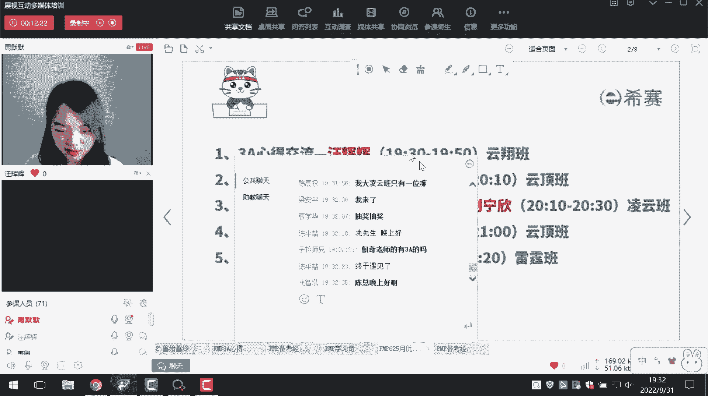

你视频打开了吗，我再打开了吧，你看见没看到了，可以看到了，那接下来的画面就交给你了。

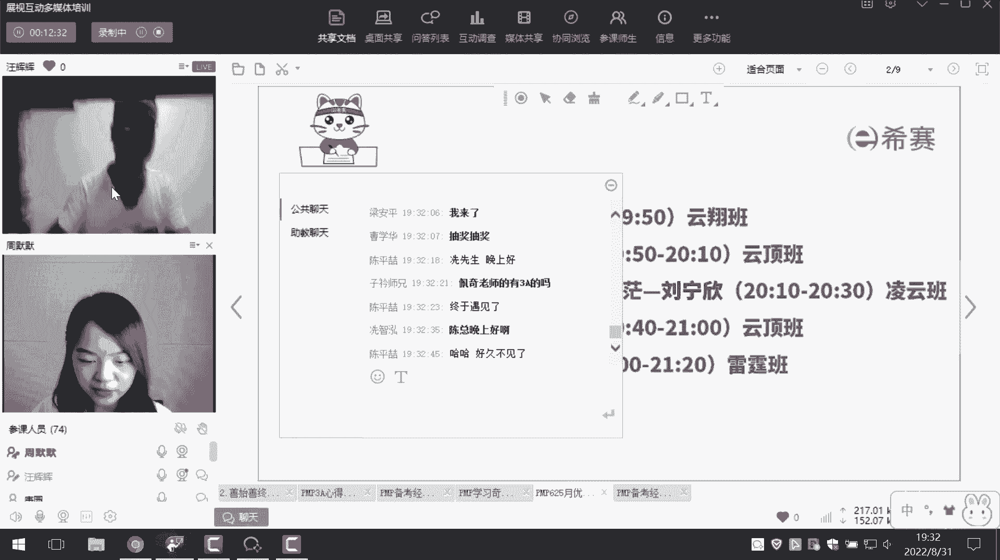

好你的PPT是在呃，是哪一个呀，我看一下好，OK可以好，那接下来的时间就交给你了啊。

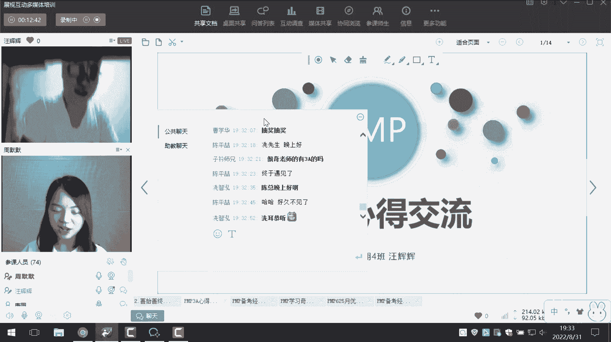

像大海中的灯塔给我指明了正确的方向，使得学习起来成体系有侧重，我才能顺利的通过考试，同时我还要感谢各位同学们，茫茫人海中的相遇，不是因为贫穷，而是因为努力和缘分，流星划过天空，虽然短暂。

但每一分都在彼此，照样独行的人不敢夜路，纯纯的人不怕天黑啊，结伴而行也是成功的一个关键，那么我大学的时候学习的是医药专业，毕业后也顺利的进入了医疗这个行业，就是从最初的打发，逐渐成长为一名资深的场景人。

就是一转眼已经有10年了，目前定居佛山，就职于某医疗信息化大厂嗯，主要目前主要是做政府企业工作，偶尔也做to b to c的一些项目啊，个人兴趣比较广泛啊，常年参加一些户外的活动，是一名老狱友。

同时我也喜欢旅游，下棋那个学习，希望今生能爱我所爱，赠我所认，做金钱的主人，热爱生活，热爱青铜，那我报考的一个初中的话就是啊初心不改，致死人是少年，就是终身的学习呢是一种向上的姿态啊，有人会问我。

就是说做产品为什么要考篇文批，那我所从事的工作是一种项目交付型的，就是对团队成员的要求呢是一精多专，也就是常说的梯形人才，要想产品更好的落地，那只会只会怀胎10月还不够，我觉得我需要掌握一些驻场的知识。

所以呢我就报了POP，希望系统的去学习项目管理的知识，帮助我做更合格的产品人，使产品能够更好的落地，那么同时呢我也是考虑到，就是来增加未来的一个择业机会。

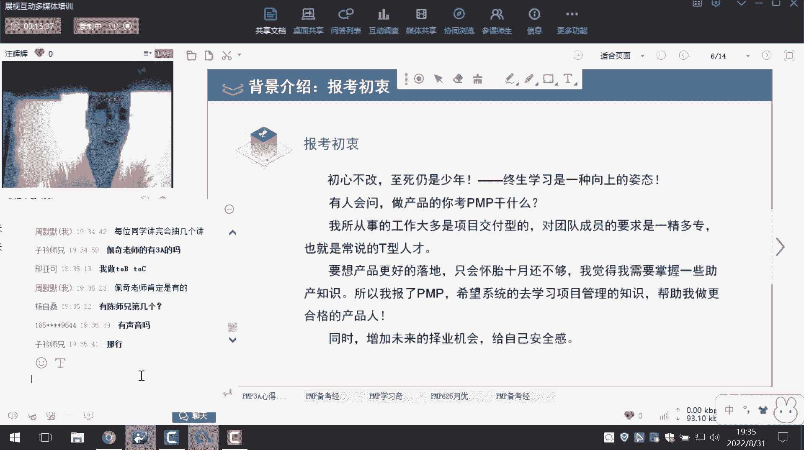

给自己一些安全感，那么考试的历程可以说是一波三折，就是月上柳梢头，就是原来呢是打算几个月就把这个证考到了，但是因为疫情嘛就是研考了几次，所以呢不光是让西塞的老师啊，同学们陪我赏个月，还一起陪我看看日出。

但是这个整个过程都是非常的快乐的，我从2021年9月份开始报名，然后十一十一月份的考试了，因为疫情延期，主题到2022年3月份又延期了一次，然后6月25号参加了考试，8月份的时候查成绩呢，就是3A通过。

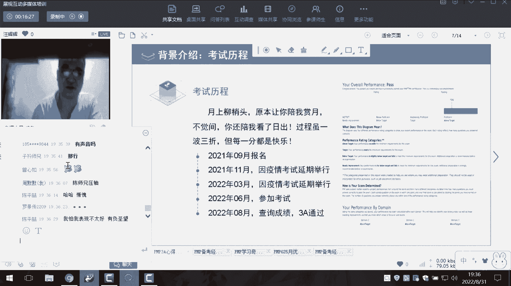

那么学习的一些方法，其实谈及学习方法的话，没有最好的一种学习方法，就是每个人可能就是找到一种，最适合自己的一种学习方法，就只有最合适的，那么第一步就是他想老师，他把书寄给我了之后。

我就把讲义就是粗略的从头看到尾，然后在没有在没有去预习的情况下呢，就是在书上做一些我认为重要的一些标记，然后就去听老师的啊，880的课程啊，去听他视频课程啊，然后听了之后又回头又再看一遍。

然后讲义就是反复的去看，那么每一次的话呢看了之后就是由快到慢，开始的时候可能我一个画一个小时，把书就是从头看到尾看，第二次看的时候呢，因为我听那些课程老师的直播课啊。

然后呃罗帅的880课程呢有了一些新的理解，那么我看的时候就带着一些思考去看，那么就稍微慢一点，因为看到后面呢，就主要是攻克一些关键的一些知识点，那么实际上也就是有一个广泛的过程。

然后到最后唉逐渐的清晰的一个过程，我知道了一些考点，然后就是每天的就是啊每日一练，我觉得西餐的这个每日一练就是比较好，每天都能给你一些提，就是题量也不是很多，那么我们就可以用一些零碎的时间去做一下题。

也很容易就每天都能坚持住，因为题太多的话，可能有时候做不完啦，嗯就就感觉不是很好，那么每天都做一些题，然后把错题呀，不会的题呀，还有自动有错题库，这些可以平时可以刷一下错题库啊，啊收藏起来呀。

这些都比较好，那么做完题，听完课之后再去看一些讲义，那么这个时候我们就只看一些重点的地方，就是巩固起到一个巩固的作用，然后考前的时候呢就要做一些模拟题，那么模拟题的话其实都比较好。

那最后面的几套模拟题呢难度要稍微大点，就建议要嗯要还是要好好做一下的，然后就是刷错题，我我考试前把所有的错题都全部刷完了，然后清完了，然后收藏收藏题的话还没有。

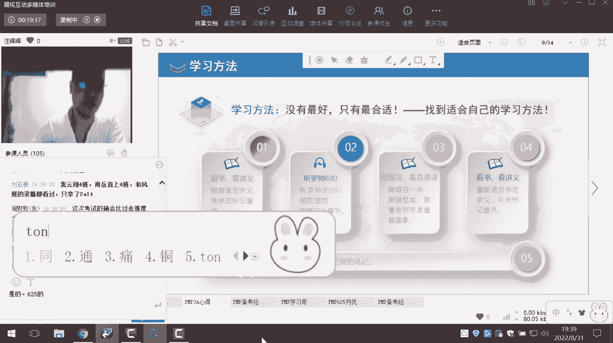

但是建议的话也把收藏的题，就是全部全部清完比较好。

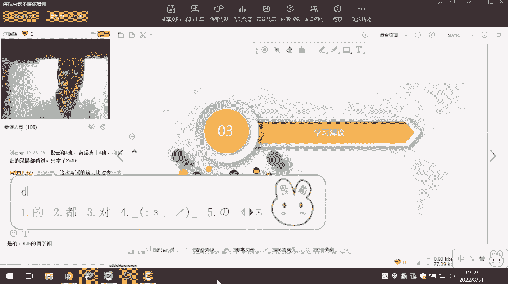

然后学习的建议呢，我觉得是所有的学习吧，就是功夫呢还是在平时就贵在每天的坚持，最忌讳的就是一破石寒的学习方法，就三天打鱼两天晒网啊，这样的效率实际上是很差的，就是我们每天可能就是必须要坚持下。

哪怕每天只做十道题，也比你花一天做了100道题，然后其他几天都在玩，这样这样相当于这招就每天都是要做题，做题再找一种感觉，然后找到适合自己的学习方法，然后跟着老师的节奏去走，这一点也很重要。

然后就是多做题，在做题的过程当中呢，可以找到一些感觉，然后反复的练习当中，可以掌握知识点的一种不同的考法，他同一个知识点的话呢，他可能就是换种方法来考你，那么如果你不做题的话。

实际上你很容易掉到坑里面去，我要考前要做一些模拟题，尤其是最后几套模拟题，那么我们这次考试呢就有十多套题，基本上就是原题啊，我我错了一道，就是我之前是嗯原题全部做对了，后面我我做完了之后。

还有还有蛮多时间嘛，然后我就去仔细琢磨了一下，然后改改了一个原题，改错了，然后就错了一道原题，然后就刷错题库啊，然后我说我收藏了一些题，然后最后的专题课文和知识，知识点串讲的一些课程呢都非常好的。

就是融会贯通嘛，就要好好的去看一下，然后考前的时候要调整心态，就平常心去轻松的应应考啊，防疫的要求，因为疫情期间的话，比你以往的考试呢就多了一个防疫的要求，这个很重要，因为我上次考试的时候嗯。

在群里面看到有个考生就是非常的可惜，就是已经到了考场，但是因为就是防疫要求这一块不过关，人家不让他进考场，那么就紧急还考了，这些就就很麻烦，法律要求的时候要跟你们考场的老师啊，提前打电话确认一下要求。

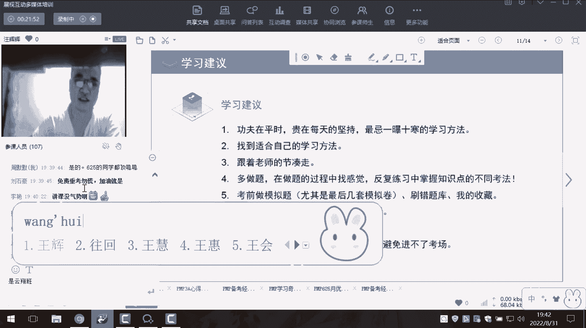

然后避免到时候进不了考场，那么考场的一些提示呢，就是我个人的一些小一些一些经验嘛，就是我那天呢就是想着，我一看这个学校举行考试嘛，我现学校周围应该是很多商店了，很多吃饭的地方，我早早的我就过去了。

因为路还有点远，我过去之后嗯的时候发现居然没有地方嗯，找不到吃饭的地方，我就问那些嗯旁边的人，他说有一个吃饭的地方，离这里要要有两个红绿灯那么远，我就没有过去，然后也没有没有吃饭，然后想买瓶水喝。

发现商店也没有，就很偏，然后也没有水喝，然后第三点就是要看防疫要求，就是你有时候打没打加强针呢，它的防疫要求都不一样的，然后就免得到时候进不了考场，那么第四点就是涂答题卡，这一块。

就是一般建议是做50道题或者30道题，涂一次答题卡，哎一个是避免就是免一次性做完之后涂卡了啊，万一就是涂错了呢，嗯到后面你发现错了，可能没有时间又改过的不好，就是我我那时候涂答题卡。

是因为他试卷像一本书嘛，我就把我就把这正反一页做完，除一次，正反一页做完，涂一次，反正所有的题做完了之后还剩下了蛮多时间的，然后最后的就是调整心态，就要考场考考前要保持一个好的心态，考场中心态要平和。

要放松，考试过程当中也是的要放松，不要受到一些人提前交卷的一些影响啊，或者一些噪音的影响啊，就不要去影响你的心情。

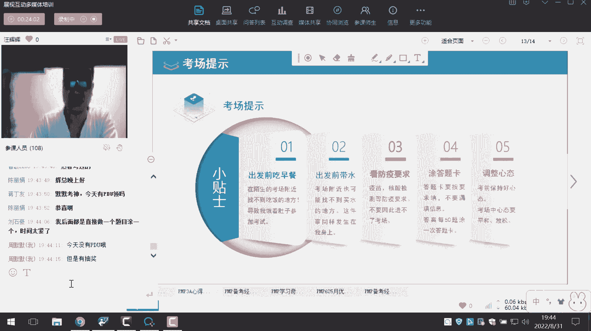

嗯基本上就是这样的。

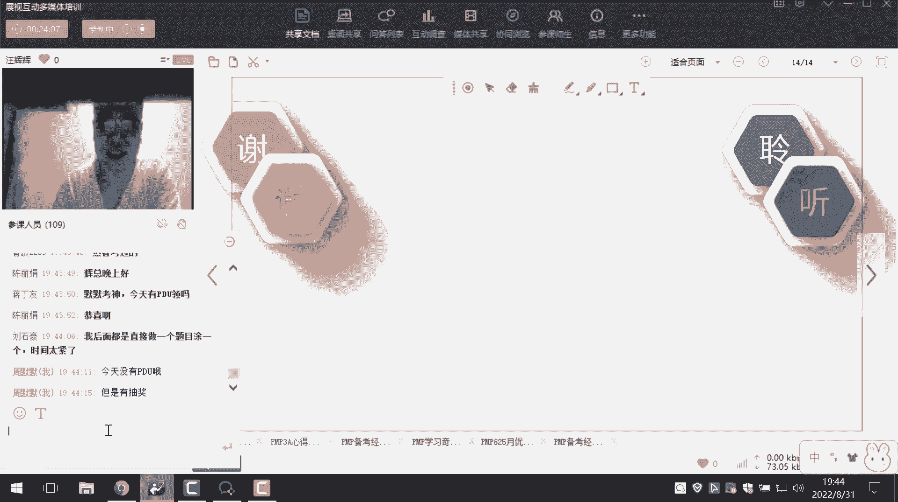

然后最后呢就是祝大家前程似锦，好老师，我这边要分享完了好的。

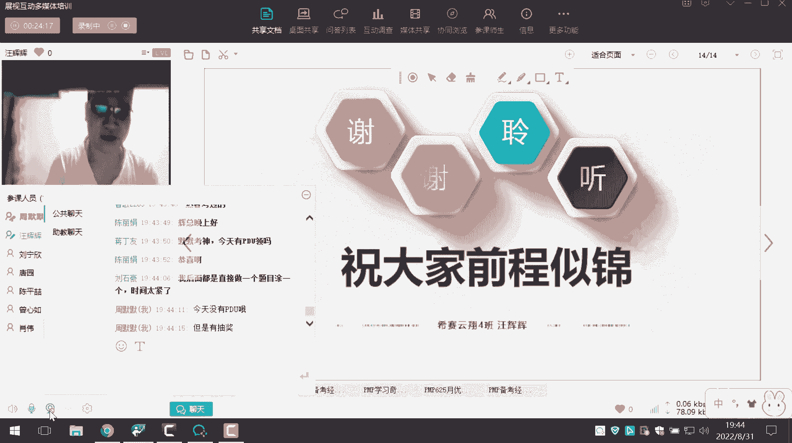

讲的非常的精彩，给大家总结一下啊，那我把这边收回来了啊，嗯OK好，稍等一下啊，我看一下这个字呢。

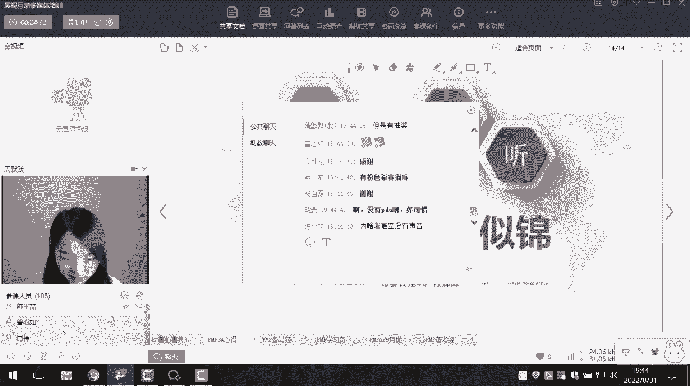

我我我我我找一下啊，这个是设为主设为直播视频啊，好了OK了，那刚才是我们云翔班的王辉辉同学。

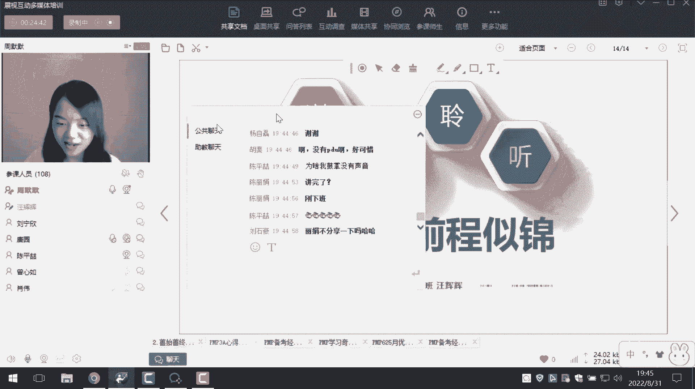

给我们做的分享，给大家总结一下他有什么备考经验呢。

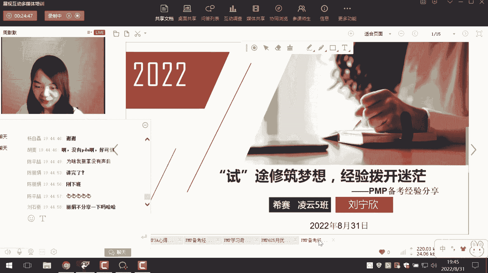

其实我听下来一共是有四点特别需要注意，首先第一个就是咱们学习方法一定要找对，并不是所有的同学他都适合同样的学习方法，每个人有他自己适合的点，对不对，所以一定要把路找对，这是第一个。

第二个就是大家一定要多做题，咱们有一句话是考试不做题等于白复习，最终的考试它其实就是一个做题的过程，所以并不觉得只听课就好，听完了课真正验证你到底听懂了没有，学会了没有，那还是做题，所以说这是最重要的。

第三个就是刚刚我听到王辉辉同学说到啊，现在我们防疫的要求特别严格，所以在我们考前也一定要注意，你当地邮件里面到底给你发了什么样的要求，要做几次核酸呢，要有什么证明啊，千万不要有一些遗漏，导致你。

比如说你满满的复习好了，当时最后进不了考场，这个是最让人伤心的事，对不对，还有第四个就是考试的时候一定要注意心态，心态心态一定要百端正，以及就是考前一定要吃好喝好，不要挨饿受冻的考试。

这样子呢就可以更好的一种状态，来迎接我们的考试。

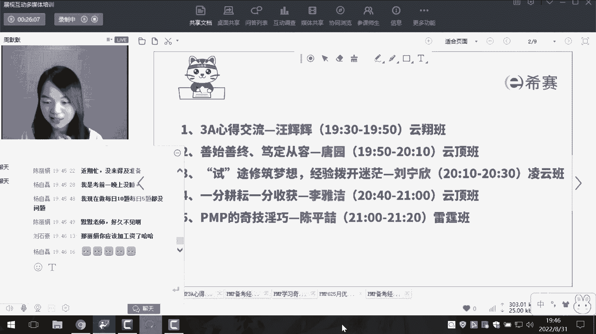