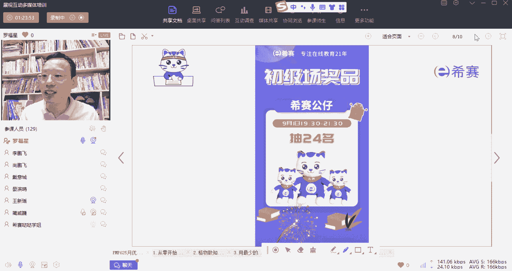
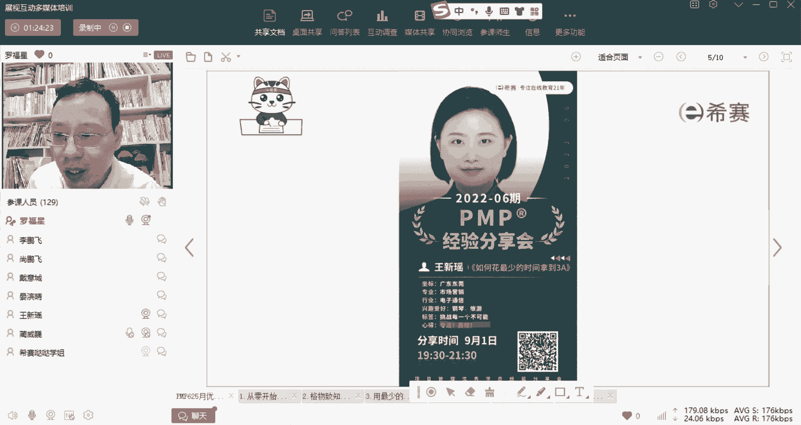
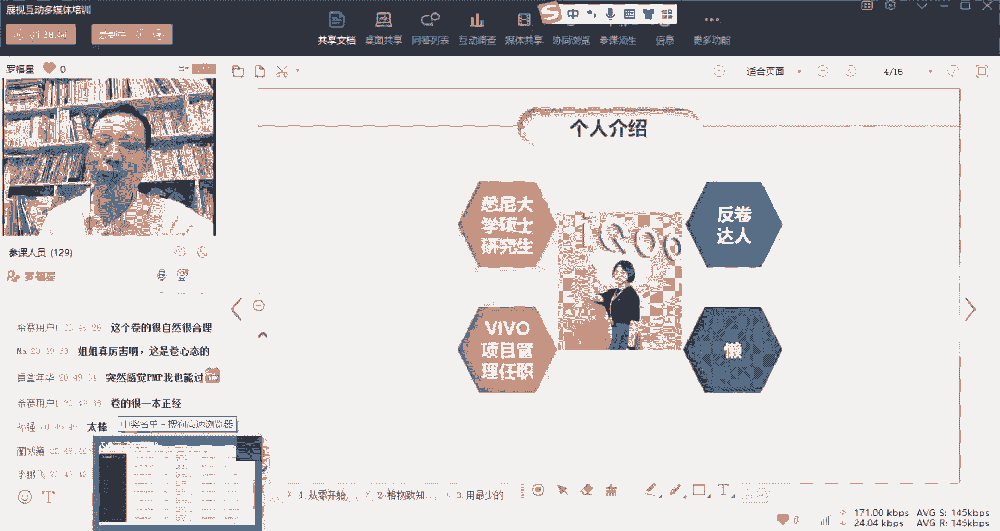
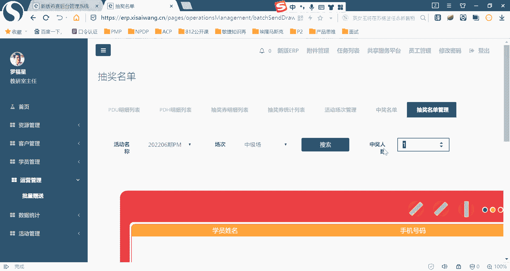
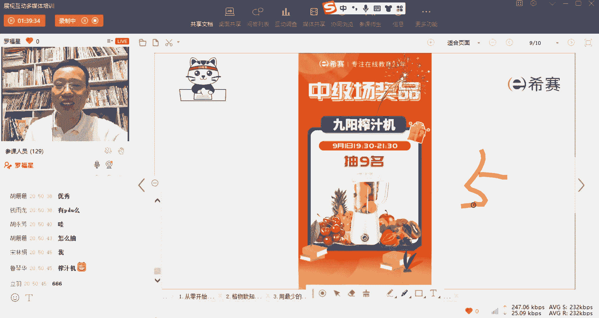

# 【24年PMP考试】零基础也能看懂的pmp项目管理视频教程！ - P68：5.2备考心得--用最少的时间拿3A - 冬x溪 - BV1tu411g7UH

就你们，你们八位同学都获得我们的这个，西夏公仔的小礼物啊，OK恭喜你们好，接下来我们还是继续分享。

我们继续呃，接下来邀请到的分享嘉宾是王欣瑶同学，王欣瑶同学他就前面同学都很卷，对不对，那王欣瑶同学他又来个反卷，就是呃包括林薇薇同学做了3万题，然后那个向东飞同学是写了很多很多笔记，看了很多书。

但是王欣瑶同学说是大概花多长时间啊，挑战每一个不可能花最少时间哦。

没有说具体花多长时间，反正就是花比较少的时间吧，好那么接下来就邀请王欣瑶同学，打开音频好，那我好的，谢谢谢谢罗老师啊，谢谢西塞给我这么好的一个机会，让我来给大家分享一下，我是如何用最少的时间拿翻译一下。

也刚刚听到了薇薇，还有彭飞的分享，真的是太卷了，我刚刚也在我那个群里面跟大家聊过，说我说我这个分享我就是来反转的，给大家一个新的视角，看看他们这种卷王可以，我可以拿3A。

我这种划水全程划水的这样一个选手，也可以拿得了3A，首先做一个自我介绍，我叫王欣尧，然后我是毕业于澳大利亚悉尼大学的，市场营销专业的硕士研究生，然后目前是在VIVO嗯的第一个字品牌IQ啊，像我班主任职。

那么我啊没有预见到刚刚这么卷，但是呢呃我本人也是一个反卷达人，就是无论是同事怎么卷，这任任敌人，敌方卷王千万重，再有一个就是懒，说句实在话，我在啊我们无数次的这个延期考试，延期的这个过程中。

我只要一听到有延期的消息，这个PMP的书和视频我就再也没有看过，所以啊我就是这么一个非常懒的人了，我的学习初衷也非常简单，p mp拍马屁，我考这个证非常简单，就是为了拍领导的马屁，我没有什么报销啊。

因为我没有报销，然后这个很生气，然后呢再有一个就是呃拿个证都曾经，万一未来是吧，能受到领导重用，万一或者会有更好的工作机会呢，整个考试历程呢和很多的其他同学是一样的，就是21年的6月份报名西赛啊。

本来是想着9月份能够第一次考试，结果考试延期了，前三位我是真的非常认真的在准备，这个是平心而论的，然后呢听说考试延期啊，数一炮没再看我，然后呢就是延连续的看到啊，听接到了好几次的考试研究的消息。

直到6月份非常忐忑，终于能够考上试了，查询成绩3A通过，那现在来给大家聊一下我是怎么划水的，首先需要这个划水需要以四个前提，如果大家没有办法，完完全全的满足这四个前提的话，希望大家需谨慎。

首先呢我自己对自己的学习特性是非常了解的，我不知道大家以前这个小学，从小学到高中是怎么背单词的，我看到很多同学都喜欢，比如说哎苹果这个词。

apple很多人就是apple apple练的差不多20遍30遍，然后然后就可以记住了，我从来不是这么一个一个同一个学生，我是喜欢把这个单词表从A到Z全部背一遍，然后记下来差不多10%。

然后在第二遍记下了三四十%，再到第三遍，第四遍的时候，我基本上七八十就能记住，而且我发现这样的记忆方法非常的持久，不太像他们这种apple apple背个20遍记住了，然后第二天默写肯定就拿满分。

但是他一个学期之后忘光了对，所以我一直都是拥有这种啊快速的看一遍，然后再来一遍的这样一种方法来学习的，所以我对自己的这个学习的特性，是有充分的了解的，然后平常也有阅读的习惯，基本上每个阅读都看得完啊。

3~4本完整的书，然后在最近的一到两年之内呢，我也有啊备考的经验，像之前那个出国之前考雅思，然后在国外读研的时候也是长期有写作的经验，所以啊就对于我来说，考试是一种，就像我脑子里有一个开关。

就是我可以一键进入考试模式啊，再有一个就是我的心态非常的好，对我来说，我真的就是考这个p mp，就是为了拍马屁，考不过啊，那就是2000来块钱掉水里，那我也没有什么关系，不像很多同事。

可能考这个证真的是为了升职加薪，真的是为了换一份更好的工作，非常需要这个证，我就是真的就是考一个证，然后给自己镀镀金，所以如果你是没有办法完完全全做到，像我这么好的心态，那我劝你还是脚踏实地，早做准备。

然后像现在的各位老师，像罗老师说的，就是多听课，多刷题，然后在群里面的每天练习，每日练习五题啊，去认真的做，然后呢如果有错的话，及时跟这个助教老师沟通，那特别有一个就是如果你心态不好。

就更不要去跟这些卷毛比了，特别是前面这两位啊，嗯重点批评一下太太卷了，这个真的是我，我现在都感觉心很慌，要是我们三个一起考试的话，那我就必须垫底呀，然后呢再讲到我这个学习方法，我这个学习方法呢。

嗯真的就是完全跟前两位是没有办法比的啊，我这个学习的总体耗的时间也是非常的少的，我呢真的就只听了罗帅的可巴巴那个视频，我虽然报的是疾风班，但是说句实在话，我的直播课是真的没怎么上。

哼小小智在这里跟小智老师道个歉啊，我真的没怎么上你的课，就即使是罗帅的880的课，我第一遍也是用1。5倍速听的，然后后面呢如果你忘记知识点了，我就会挑个别不太熟悉的这个章节，然后我再用两倍速来听。

所以五官今天我是第一次听到罗帅用一倍速，正常的速度说话，然后呢每日习题呢在前三个月我刚也有聊到，我前三个月真挺认真的，前三位我每天都在群里面答，后来就慢慢的就是水过去了，章节练习。

我在备考前一个月的时候，我们基本上把章节练习都刷了一遍，然后呃后面就如果有错题，我也基本上就再刷了一遍啊，模拟题像应该是有十套啊，但是实在是我也是来不及了，我到最后差不多十天我才开始做模拟题。

所以一共也就做了六套模拟题，这里也给大家提个醒，真的不用不一定哈，非要把每道每一套模拟题都做完，你才能够你才能够考过，像我这种这种划水选手，真的就是觉得这个这就抱着考不过的这个形态。

我们所谓的心态去做这个题，所以就不要觉得自己如果没有把16集刷完，刷一遍，两遍三遍才才能够啊，没有不存在这这一套的，然后要学习，那么我个人的学习方法刚刚也有聊到，就是快速的刷一遍知识点。

那如果我没有记住的话，我再来一遍，再一个就是我们要把自己的专注力提升了，就考试不仅仅是要把这个题目给做对，更要有那种长期专注的这么一个能力，不要说我做到三个小时就非常的疲惫。

我需要真的花10分钟去无数遍了，看一道题，我才能把它给看懂，就是这样已经说明你的脑子非常的疲惫了啊，这样这样子的专注力会导致要么你就考不好，要么你就没有办法全部做完，所以我们要培养自己长时间的专注力。

匀速的把这个系统给做完，再一个就是心态，我一直都觉得考试真的就是一个心态很多，就像刚刚维维有有讲过啊，做了很多遍题，但是还没过，就是嗯别人交卷会不会影响到你呢，也有很多绝望对吧。

群里面经常会有这个模拟题，已经刷了四遍了，正确率99%，那那我我这种只刷了一遍，而且还没刷完呢，那我能过吗，我们上考场了，你可以没有问题，就是然后再有一个就是这个学习方法适合我了，那我平常看电视剧。

我都是喜欢用两倍速，2。5倍速，三倍速看，那我如果你要让我听课，用一倍速，我真的会睡着，那我就是没有办法用，就是看直播课程哈，再次跟小智老师道歉哈，我没有办法，我这个人学习方法是这样子。

我没有办法看直播课程，我就是喜欢用两倍速去听课，快速的听一遍一遍的听，然后呢就是总结来讲就是不要人云亦云，要找到适合自己的才是正确的，然后呢再有嗯下一趴就是学习建议，这边我给大家的学习建议就是啊。

选择一个自己相对不忙的时间段来准备考试，多留一点学习的时间，当然就是疫情影响，我们也不能百分之百保证我就算这三位比较闲，我能拿来学习，但是这三个月学完了之后，我就能真成功约到考试啊。

这个都是看天看命的啊，然后也要懂得取舍，很多计算题我发现啊嗯比较难，而且那个公式真的是有点整不明白，所以如果你真的就是背不下来公式就算了，就有有有取，有取有舍，然后才有得。

再一个呢就是平常要参加这个每日练习，就是每个人在群里面的练习真的很重要，积极参与会加深自己的一个做题的感觉，后面就是啊不要范围蔓延，我发现很多同学都喜欢去看那个特别特别厚的，那个PMP的那个教材。

原教材啊，其实呃我能看就真的能把这个教材看一遍的，人就真的好少，很难的，现在的资料也就真的是足够了，不要去，然后特别是罗老师这边，如果觉得他告诉过你这个东西不太会考虑，你，不要去纠结了。

也不要去为难助教老师是吧，就是没关系的，不会考的，而且你放掉了这一个知识点，没关系，还有千百万个知识点可以让你去抓，然后再一个就是考前啊，看看知识点就行了，不要再看题了，你这个心态汇报。

因为真的就像刚刚微微说的很多题，你做了一篇错，做第二遍还会错，第三遍还是错的，第四遍你还是觉得他很奇怪，然后呢就是考场的几个小贴士啊，这个刚刚大家也有分享到，就是可以自己带水，一个透明的玻璃杯。

那是水只能放到地上啊，就是防止作弊啊，手表的我们考场是不让用的，所以但是一般考场都会有时钟，所以不用担心时间的问题啊，不要去不懂的题，不要过多纠结，因为很多题真的就是翻译的急，去熬牙的。

所以可能有1/3的题，你觉得都是没有办法确定的，我当时也是做一个题，哎，没法确定，我就打个勾，然后等回头来再看这个，但是一定要保持这个做题的匀速，这样让时间稍微可控，然后呢不确定的题。

等最后把答题卡全部读完了，再回头看一看，然后再有一个就是不要受到提前叫恋人的影响，这个也是拼拼的心态啊，要按自己的节奏来，不要受到别人的影响，然后呢还是刚刚说的这个嗯，每50题图一大题卡。

的确是我们考场就有好几个，最后做完了题，但是吐不完答题卡的，那真的是太亏了啊，所以呢呃我的分享就到这里了，也比较简短啊，也希望大家都能取到取得的量啊，理想的成绩大家都能拿3A啊，不建议都像我这样划水。

但是也不建议大家都成卷王，太累了啊啊也非常感谢现在所有老师，罗老师，张明老师哦，所有老师的这个倾情付出好谢谢大家，Hello，冯老师，当然了，事实上呢王欣尧他不卷呢，他有他不卷的资格对吧。

人家可以人家可以比较快的速度去考考雅思，考托福，能够去出国去留学，其实已经是很厉害了，所以他有他的这些卷的资格，就每一个人可能会适合自己的方式不相同啊，没有唯一的方式，只有适合的方式好了。

我们还是继续来抽奖吧，感谢感谢王欣尧的另外一种卷的方式啊，另外一个不一不一样的方式。

我们继续来抽奖了，这一次呢继续还在冲换一个吧，我们来抽抽，抽那个什么抽那个那个那个抽了一个中级场吧，抽中级产，今天抽抽五个。

先抽五个，嗯给大家共享屏幕啊，给大家启动，诶，等一下先先启动屏幕之前先来看到，就我们今天今天的这个课堂小，今天这个小礼物呢是，是榨汁机，九阳榨汁机一共会有九个，我们先抽五个，先抽五个九阳榨汁机啊。

先抽五个九阳榨汁机，看是哪位小伙伴，今年没有PDU，就只有听分享，听优秀学员们的分享，以及啊呃一些已经考过的同学。

