# 【24年PMP考试】零基础也能看懂的pmp项目管理视频教程！ - P69：5.3备考心得--贵在坚持-历时14个月取得3A - 冬x溪 - BV1tu411g7UH

在的在的好嘞，那我现在舞台就交给你了好吗，稍等一下，哈喽大家能听到，我稍等一下，我要把你的画面切换成在这里，可以，我切了我切了我切了我切了，你现在能操作PPT吗，可以你看一下，我已经切换了啊，OK好好。

那可以，那这样吧，你先开始分享吧，好吧啊，行行行好啊，PPT能看到就行，看不到我本人不要紧，嘿嘿嘿，各位小伙伴们，大家晚上好，然后我也是我看从18年吧，然后就是了解到PMPMP这门语言。

然后当时是有同事介绍，然后就了解了一下这个东西是干什么的，结果结果就是呃18年的时候呃。

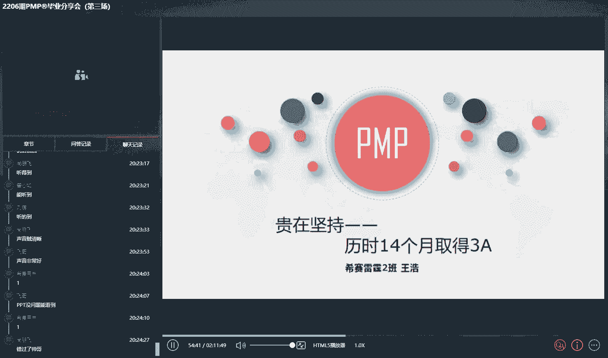

以及诸多原因推迟了，然后在上一家公司的时候，就是偶然啊，说是就考完这个可以报销诶，所以就是顿时就有劲了。

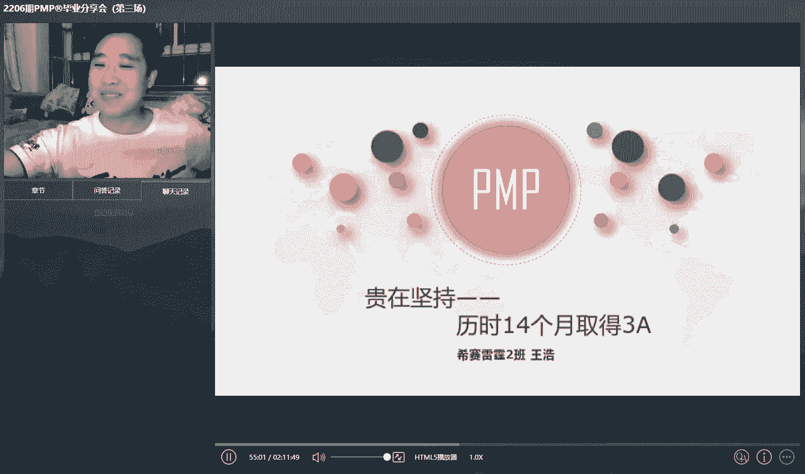

然后立马就报了，结果大家可以看一下啊，就是呃我我我等下就给大家讲一下，就是我我会为什么会去考，然后最后就是怎么就是有兴趣的3A的。

看一下啊，这我首先先自我介绍一下，我是搞程序的，然后是web前端开发，有的也应该应该也有不少，就是咱们同就是同城的，或者说呃同行业的啊，呃web前端开发一直是做前端行业。

然后平时的话是比较喜欢看一些动漫，比如说最近国产比较火的斗破啊，斗罗大陆啊之类的，然后不良人秦时明月之类的，平时上班的时候，就是因为现在周末一般就是陪家人去了，像周周那的时候有时候不忙。

或者说晚上下午加班的时候，然后和同事一块呃，去打打篮球啊，打打乒乓球之类的工作啊。

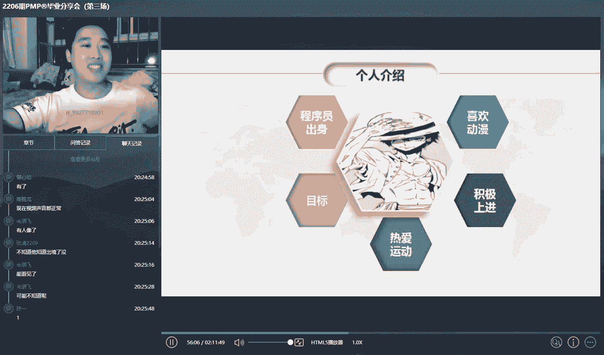

这还是比较上进的啊，啊这个就是刚刚回到我最开始说的地方，因为我是搞前端开发嘛，然后不像他们搞后端呀，或者说搞专门搞项目管理的，然后可能就是对PMP的需求更大。

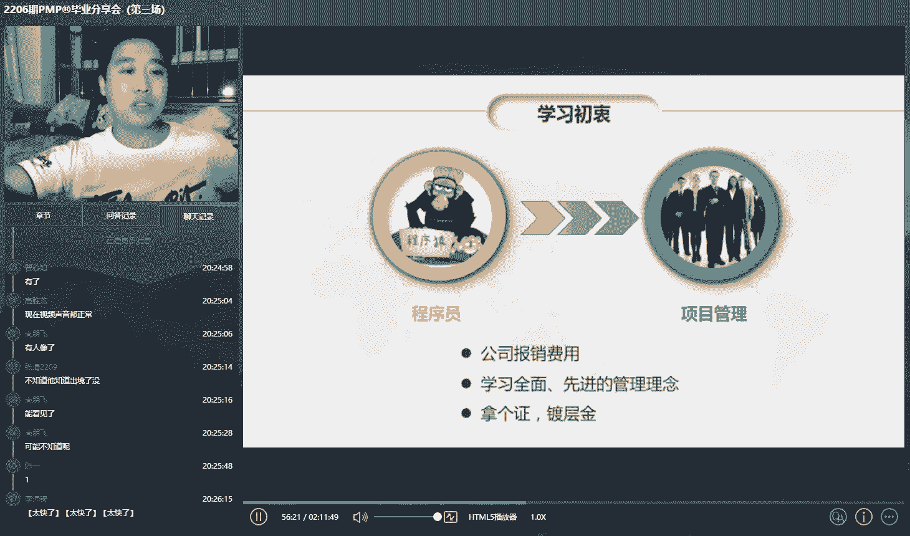

我是主要是因为就是公司第一个就是报销，然后就是第二个是呃，他自己是想去学习一个新的东西，然后因为我们做程序嘛，然后现在一般也是敏捷开发，然后就是占的还是比较多的，然后接待评审啊之类的。

这些会议我觉得还是就是还是很有帮助的啊，对公司报销，但是哎这往后看吧，然后最后就是想的是拿着这种镀层金，因为当时我在上一家公司的时候呃，第一个就是报销嘛，第二个就是第二个就是说呃。

考完之后可以就是挂科的公司，好像还有一些额外的补助啊什么的，乱七八糟的，当时就报了，想着房间跑考过了，然后报销嘛，因为我自己的学习成绩其实一直都有的还可以。

所以就是也也报了，呃其实我现在也是自费，为什么呢，因为来给大家看一下我的考试历程，大家就知道了，我18年就是虽然了解到PMP，但是就是由于各种因嘛一直没有考，去年就是21年3月份的时候，我换了一家公司。

然后在那家公司的时候就是说是能够报销，所以我4月份的时候就联系上西塞这边，其实这里就是还是得感谢一下西塞，就是从最开始的咨询，然后到整个学习，然后备考，还有包括就是现在我们考完之后的。

后续的一些这些流程啊什么的，都非常就是给力，然后我是14年报，但是我就想的是三个月怕来不及，所以就是没赶上21年6月份的考试，结结果呃就参加的是9月份的，我想的是，然后就是能准备的充分一点嘛。

结果9月份的时候西安就是在线的，可能都知道，因为疫情的话，然后延期了，然后说是延期到11月份，结果11月份的时候，因为就是疫情又延期，然后说是延期延期到今年22年3月份，结果3月份的时候又延期。

延期到22年6月份，然后到今年6月30号的时候，终于是呃考上试了，然后8月份，然后成绩出来，结果就是还很幸运，3月通过了嗯，嗯培训费再给大家说一下，因为因为啥啊，我在上一家公司的时候，入职之后。

就因为呃银行业务嘛，因为一直出差，所以就是实在扛不住，拿着二线二线城市的工资，然后去一线城市出差的话，然后就扛不住，所以在今年的今年的3月份，然后现在是在上家公司干了一年，然后离职了。

所以这个报销相当于就是还是自己报销，所以就是没赶上这个时，这个时候因为新公司的话，他是也是能报销各种的费用，但是不包括PVP，像那个高校啊，还有什么的一些其他的，我上次大概看了一下，没记住。

好像就是有报销的，说到这儿，然后多提一句，就是我也准备就是在考，就是NPDP啊，或者说那个高校之类的啊，最近就是因为也是比较忙，然后后面我看准备好的话，然后应该还会继续在西藏这边。

然后去选择一门新的新的，就是呃有能力吧去学习，就跟罗帅，因为我是当时是罗帅的课程嘛，我觉得罗帅当时给我们分享的一个东西，还是比较好的啊，就是罗帅也分享说他每年都会给自己安排一门。

然后证书或者说呃与呃就是学习的一个技能，然后去作为他即使每一年的一个小目标，所以我觉得还是挺好的好，接下来看一下下面啊，从就是从去年到现在到今年，然后拿了3月的号。

基本上就相当于是花了14个月左右的时间，因为我觉得就是当时我觉得就是呃一鼓作气，再而衰，三而竭嘛，所以我觉得是时间太长的话，然后人人也容易疲劳，包括我们去年也是刚开始说9月份考的时候。

让你那个学习的劲真的是真的是可以，然后说说延期延期，然后后面的话呃就真的是不愿意去做题了，还好就是现在这边有坚持的，有每日一练，然后我还是把每日一练坚持的做到后面，然后就说然后要临时要考试了，哎。

赶紧的，然后又把这个每日一练，还有就是希特这边出的模拟题，然后都刷了一遍，接下来就是通过呃下面几个方向，然后就是呃说一说呃我的一个备考过程，然后或者或者说是一个心得，因为每个人的话，他的学习能力。

或者说学习的这个时间点可能不一样，因为比如说有的人他坐公交车，然后听听这个嗯喜马拉雅，他觉得哎呀挺挺有帮助，有的人比如说早上学的时候，他他做做做做题，或者说有的人他是晚上夜猫子做做题是吧。

呃首先可就是你不能光听，就是我们或者说前面咱们学长的一些分享，交流诶，他的思路，然后肯定可以写，你觉得这个想法肯定是很危险的，因为每个人的学习方式是不一样的，明白吧，我的我的觉得我的这个思路就是啥。

相当于是刷这个题海战术，我是把西塞，就是我从我报名那天开始，新赛官网上的每日一练有十个题，我基本上是不间断的，然后最少刷了一遍，然后是呃咱们微信群里面分享的每日一练，还有就是西赛最后出的所有的模拟题。

然后都刷着刷过了，当然运气也是不小的，因素，因为现在最后就是输的几道模拟题里面有有有，特别是有的题很难去理解，然后我也看了上面的一些评论，都觉得不可思议，但是呢考试的时候可能是原题，就是这，嗯准备的话。

当然就是呃大家刚报名的那段时间的话，肯定是要跟着西塞的节奏去走，然后每天然后去最好是看这个直播课程，包括跟老师的互动，然后或者说咱们学员之间的互动还是比较好的，最后的话就是呃确定什么时候考的时候。

那考前一个月左右或者一到两个月，我觉得其实一个月，然后就可以了，你突击，然后刷上几套模拟题，然后把那个错题然后看一看就没问题了，呃直播和录播的话，其实我觉得最好还是直播，因为第一个就是刚刚咱们学。

前面学姐分享肖想的，你觉得她有录播后，人就容易容易养成这个惰性思维，哎反正有录播，我今天然后打把游戏，或者说然后出去呃，浪一浪是吧，然后然后就过去了，后面看录播，结果录播越做越多，越做越多。

然后可能就不想看到，或者说看到这个质量，然后就会很差，直播的话，因为你跟着老师一块去探讨，或者说一块去讨论，或者说呃跟着这个学员一块去呃，解析某一个题的时候，你的这个因为咱们做题嘛。

其实主要在于这个理解，因为呃虽然考试的时候有原题，但是大多数的话都是什么情景题，主要是在于你的理解，啊是有联系的啊，啊看一下我的备考记录啊，我当时就是刷了这个上面显示的是的，已经刷了1万多个企呃。

反正我自己没记，反正就是我是吧，就是跟我们说的，我把每日一练。

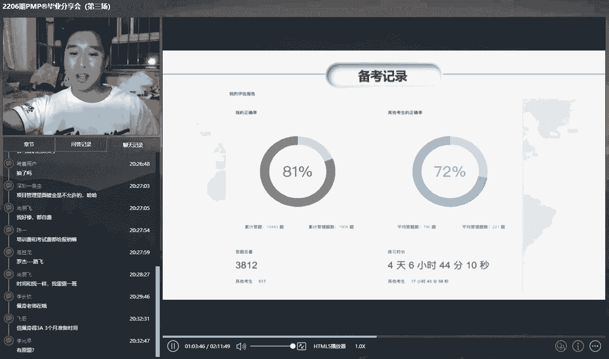

然后全都刷了，然后所有的模拟题都刷了，然后包括就是这这这个车上面，我截图激动了一下，其实大家可以看到我的，我的这个正确率也并不是特别高啊，你看最近的时候还有六十六十%多了对吧，所以说平时的模拟题啊。

当然如果一直分高的话，其实你的信心肯定是更更肯定是更大的，呃如果就是说比如哪一套模拟题没有答好，或者没及格，你不要气馁，因为这只是模拟题嘛，你把错误的题一定要去过一遍，最少过一遍。

呃然后是我把这个这个里面大家可以看到，就是每一章节，然后还有一个习题，然后我把这里面的习题也都全都刷了一遍。

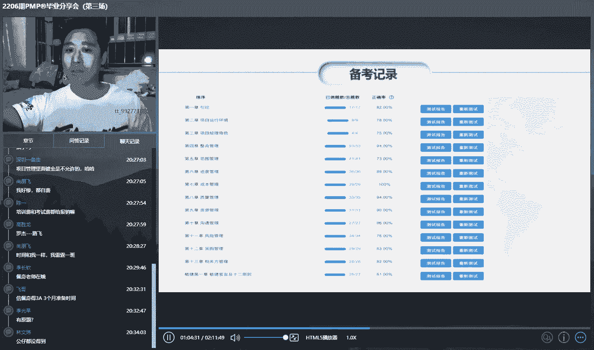

然后还有还有里面那个主要主要。

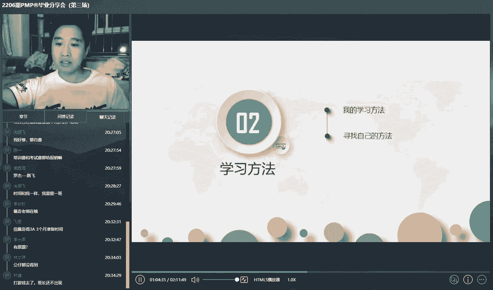

主要主要就是这几个题啊，这我反正就是把呃西在这个官网上面，你能测的题基本上我都过了一遍啊。

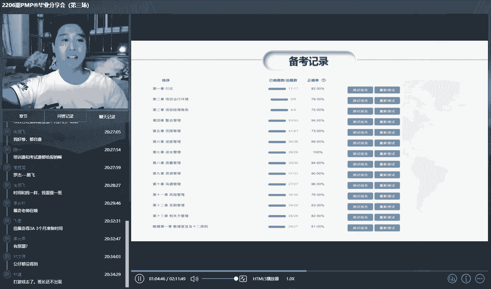

这样子，题海战术呃。

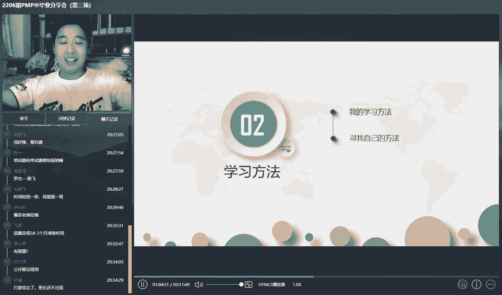

下面就是分享一下我的一个学习方法，每个人都不一样啊，然后我觉得我我反正就是按照大多数都是按照，西塞就是安排的这个节奏来的话，我觉得呃心罗帅脸，然后信息在里面就是3A应该是问题不大的。

呃我最开始的时候我也是呃就是刚开始嘛，因为我是从14年毕业之后，也就没有考过任何事了，然后突然考个试，然后因为毕竟还是花这么多钱是吧，也不少，然后就是还是有点紧张，所以就是把喜马拉雅呀，然后然后什么的。

然后就都下来了，然后提前也听了一下，就是880课程什么的啊，当然后面就是我觉得最有力的，还是看这个直播课程，然后刷章节题，我基本上都是看的，直播，录播的话就是除非是因为呃软件行业嘛，有时候加班什么的。

然后实在是没有没有时间看，后面的话我是1。5倍速听，不论是看录播或者说是看直播的时候，呃，罗帅也让我们就是找到对应的就是这个讲义嘛，然后大概就是把一些东西简单的标记一下，我其实呃书籍的话。

其他书籍然后都是都可以说没有打开过，然后这个讲义的话，然后是跟着老师的一块，然后分享就是过了一遍，当时是比如说他给你讲解哪个地方是重点，然后就把它标注出来画一下，或者说有的地方。

然后你把它简单的记录一遍，呃我反正基本上都只过了一遍，就这样子，每日一练，我觉得这个东西还是还是有用的，持之以恒嘛，特别是现在你看全国也是疫情，你也指不定这个就是会不会延期啥的啊，现在这边呢每日一练。

然后我觉得还是大家坚持，第一个是群里面分享的，每日十题或者每每日五题，然后实习在官网里面的，还有每日十题，大家我觉得还是可以刷一刷，然后是呃，抽空我把这个章节练习题和知识点评估里面的，然后全都刷了一遍。

最后就是要考前的时候把主要是刷一下错题注，因为呃人都有先入为主的一个观念，你第一遍答对了，第二遍可能还是对的，你第一遍答错了，然后第二遍那80%还是错的，所以就是你要把错题库，然后再刷一刷。

实在实在理解不了的啊，可以记那么几个题，因为运气好的话，你记得那几个题有可能就是到时候会考，我是周六考试嘛，我是周四的时候晚上回来刷了一套题，模拟题，周五的时候刷了一套模拟题，就是上次的第九套，第十套。

结果运气也挺好，考试的时候真的是有，反正有不少原题，模拟题的话，大家就是尽可能就是多去刷一刷，如果时间有有有有限的话，刷一遍时间就是出去的话，你可以刷上两遍啊什么的，我我没有。

反正微信群里面我看有的人都还刷两遍三遍的，呃主要就是这几个方法，然后这是我的一个思路，然后每个人的话可能不一样啊，就是你觉得呃你是哪一个，因为我这立体的有有有很多啊，有的是比如说我就只看直播。

或者说我只听这个呃喜马拉雅，然后他也可能就是也能理解，有的人说就是疯狂刷题，我就是那个疯狂刷题的一个代表，对有有一部分掩体啊，这个因为毕竟西餐也有20多年了吧，然后这个预测能力还是还是有的，我觉得。

呃每个人就是包括前面两个学姐学姐讲的，然后每个人的方法肯定都不一样，所以就是大家就是，取其精华，去其糟粕，然后把每一个人的好的思路，然后自己都试一试，明白吧，对不公开的秘密，嘿嘿嘿，因为方法很多。

不一定就是说要找到一个最牛逼的，你找到一个适合你自己的，就可以，因为你觉得你能学得进去，这就是最好的方法，其实我们上次考试的话，这个计算题很少，而且简单的话，你就记记记记记那几个简单的公式就行了。

像那个复杂的呀，然后我我是真没记住，然后考试的话我觉得就拼一下运气就可以了，对多少题型是没错的，几乎是对，上次几乎是没有计算题的，然后就是就是有的话，然后也是很少，或者说比较简单的那种复杂的那个公式啊。

什么的，我觉得你能记住就记，记不住的话就算了，然后呃我在平时就比如说呃工作的闲暇之余，然后当时给咱们发的不是一个小的男册子嘛，然后里面就是有一些知识点什么的啊，我好像是看了一遍，我觉得就是像其他的。

我是真是没时间，像那个发的，还有一个我记得还有一个呃，书本那个题册里面是模拟题，我那个那个都是新的，然后现在我已经送送给我公司同事去了，呃记就是记住一句话，就是啥不要范围蔓延啊，不要养成你的这个。

因为我也有时候也打游戏，然后也也会去玩，就是说你玩的过程中，然后就是安安排一点，就是这个学习，比如说就是嗯你就看一套视频，或者说你就做一套题，其实你看一下视频的话，跟做一套啊，看一条视频的话。

我觉得就一两个小时，但是你做一套题的话，时间肯定比他长，每天反正就是坚持刷题，我觉得是可以的，对就是这个复杂的这个公式真是记不住。

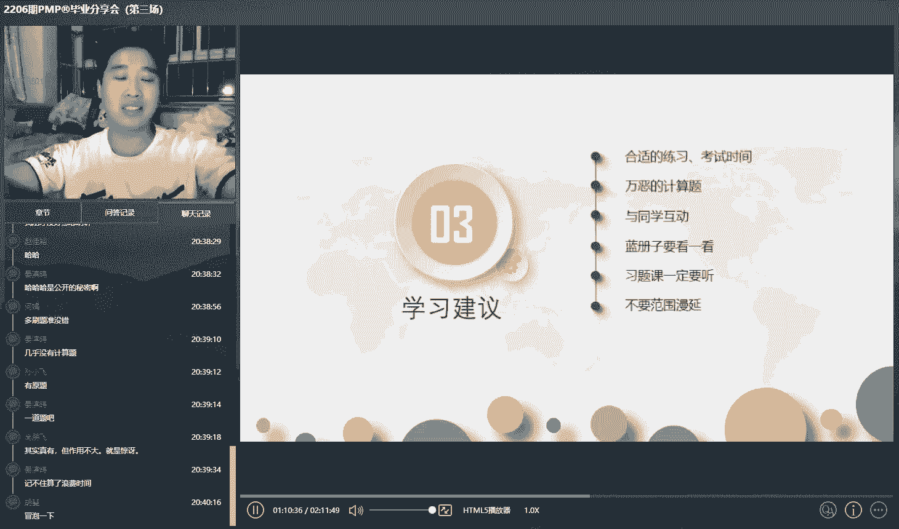

你就不用去记了，这又费脑细胞，又浪费时间，呃学习的一个建议，我觉得就是大家就是因为微信群嘛，或者说还有班委，我当时就是也想着督促一把自己，所以也竞选了一下班委啊，因为你在班委群呀。

或者说微信群直播的时候，然后和别人一块讨论，其实我觉得这这是最大的一个收获，然后就是在考前的时候呃，谢谢本老师也会给大家划重点，说哪些基本上不考的，哪些那个就是你需要去重点突击的。

因为就是一般都会给大家来一个，考前一个月的一个突袭嘛，你把那个然后就是最后突击一下，3A也是应该是没啥问题的，对下一期后面的话我给大家分简单分享一下，就是考试的一个呃。

上次我们就是遇到了一个1111些东西啊，第一个就是大家最好是，因为我上次我还我这还算运气好的，我我的考试地点距离我就几公里还比较近，我骑电瓶车过去，然后就呃提前看了一下路线，然后知道怎么走。

我当时我还去问了一下那个学校的保安，然后就说啊考场地点在哪个地方，然后就是大概了解了一下准备资料好，因为就是现在疫情嘛，然后把这个核酸相关的东西，然后还是要带好其他的，就是重要性和身份证。

这两个是必须的，小册子的话就是看大家个人喜好，因为我当时我当时好像是啥都没带，就只带了前面的，就是这些必考的东西，结果我进去之后发现有的人在排队进去的时候，就还在看东西，然后进去之后。

然后你在还没就是进那个考场的时候嘛，然后有的人还是在那看东西啊，我觉得这些人好好好卷好厉害，嘿嘿但是我就没没做到这么充沛，第二第三个就是呃，你这点战略上是要非常重视他的，因为毕竟还是花了几千块钱吧。

然后再一个就是你还是要学到一个一定的东西，特别是对软件行业的话，我觉得还是很有帮助的，最重要的就是我觉得是你的心态，心态也好，因为你不能觉得哎呀这次没考好，或者说然后这次模拟题没考过，或者说今日主题。

然后一下错了五个或者错错了四个是吧，没然后没必要，不要在乎一时的成败，啊对三三下学的考试费，最后给你的纪念纪念，就是橡橡橡皮擦和这个一支铅笔，最后就是我觉得你要充足的休息。

因为呃当时我们说的是七点多要到考场，我是我是六点多起来的，然后七点左右还是六点多吧，反正就到考场了，结果因为就是排队的人太多了，你去晚了，其实我觉得去晚一点也可以，但是我就想着，然后去早一点吧。

结果去了之后也是在那排队，然后进去之后也是在那个考场，考场那个教室一圈，然后站着嘛，所以就是除了那个睡眠的话，大家这头天晚上的话还是睡睡好一点。

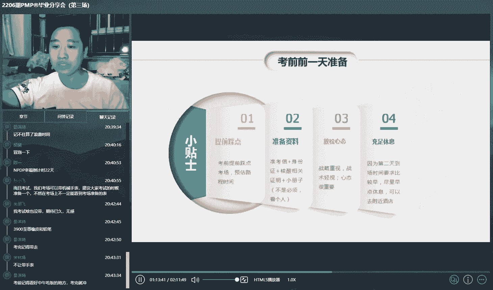

对下面给大家分享一下，就是要那可以带哪些东西，我们当时呃本来就是听他们以前说，然后还可以带吃的呀，带水，有的有的那个考场还发的有这个面包啊什么的，但是我们当时是在欧亚学院，什么都什么都没发。

然后进去的时候，那个我我当时带的是机械手表吗，手手手手表也不让带，就只能带一个身份证和那个中考新景区，其他其他都不用带嗯，这个就是大家嗯可以不用太在意，因为就是到时候的话。

不同的考点或者说不同的地区的话，然后他的这个可能不太一样，对有的在酒店的话，好像上次也有发早餐的，还有发水的，然后这个还有一个就是呃，考那个大家交卷的时候，因为当时呃我是我们考场第一个交的。

但是我出来之后听听听人说，有的人就是好像是有进去之后半小时，然后就有人交卷的，所以就是不要太太在意别人，你只要觉得你自己的时间够，然后就行了，我是当时是提前，我大概看了一下，提前就是半小时左右。

然后交的我这个人咋说呢，就是不愿意再去检查，因为我那我是有时候老师一检查，然后就把你本来给正确的，然后给搞错了，所以我是当时一遍过了，然后就直接交了，啊对了，有的有的考场的话，老师还给你提提醒。

然后比如说呃要注意填答题卡呀，然后给你提醒时间，有的有的还是没有的，每个考场的话，然后都会有一个计时器，这个大家不用担心，然后最后就是这个也是老师，或者其他这个呃学学长学姐都强调过很多次。

就是天空塔里卡，真的是千万不要一一把天太累了，我当时是第一把，然后涂了50个，然后我就觉得纯纯答题卡的时候呃，感觉也挺累的，所以后面的话然后就减少一点，然后变成30个，然后拖到30个的时候感觉眼泪。

然后后面我有时候做十个题，做20个题，然后就出，反正就是看你自己的一个，就是当时的一个状态吧，你不能就是一下就一直20个或者一直十个，然后也不行，因为有时有时候，比如说你正处于一个答题的一个一个。

一个一个一个状态，你就多答几个题，比如说你那个那个时候状态不好，你就答十个题，然后一涂就这样子，呃最后的话就是也非常感谢西塞啊，就是呃让我也取得了3A，也祝愿大家就是以后在考试能顺利取得3A。

以后的生活也越来越好好，我的分享就到这，谢谢大家，好了老师必须老师好嘞好嘞。

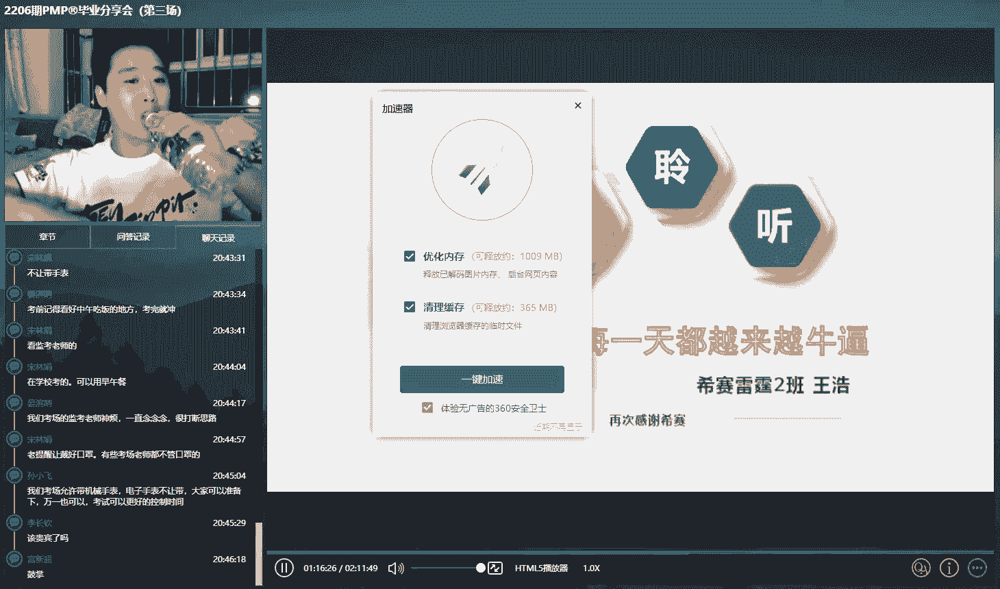

对王昊同学讲的非常非常好啊，依然是我们来借着王皓这股劲儿来抽取第三次。

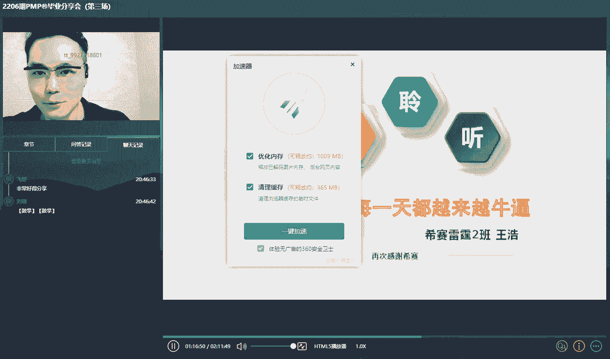