# 【24年PMP考试】零基础也能看懂的pmp项目管理视频教程！ - P7：1.1什么是项目-知识点 - 冬x溪 - BV1tu411g7UH

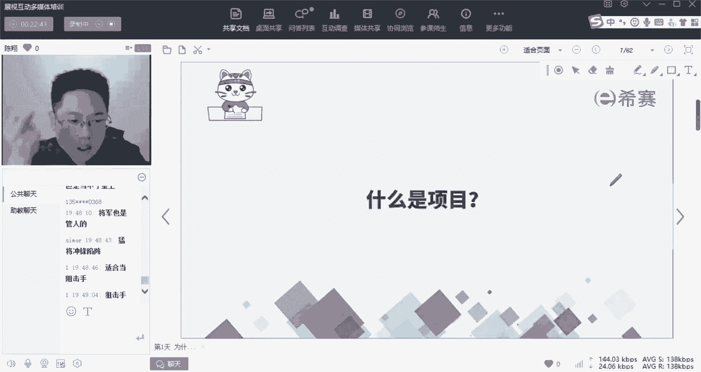

什么是项目，为什么项目需要管理啊，那我们先来讨论一下这个问题，大家帮我看一下，这张图上我画了好多事情，那么这些里面哪些是项目，哪些不是，做一顿饭，写一本书，开发一个app啊，搭建一个云平台啊，研制疫苗。

造金字塔啊，建设北斗系统，哪些是项目，哪些不是，对吧，OK都是项目啊，都是项目，我们有一句话叫什么呢，叫做万物皆可项目啊，万物皆可项目写书也是啊，万物皆可项目为什么呢啊用土话来讲，我说项目是干嘛。

项目就是怎么样把事情干成的啊，一个能力对一个能力。

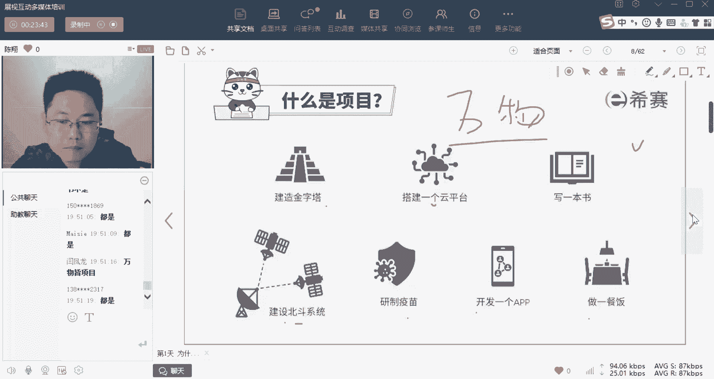

那么那么刚才讲了哎，有人说有人说是，有人说不是，那怎样判断是不是项目呢，为什么项目需要管理呢，因为项目一般具有三个特性啊，这三个特性决定了它很复杂，它需要有特别的管理技巧，分别是临时性啊。

独特性和渐进明细性啊，这三个什么意思呢，啊这三个例子，经常我们会把项目管理和运营管理，这两个东西呢，诶对立着来看，对立者来看什么意思呢，啊，我们经常说，一家公司呢在做的所有事情都可以分为两类啊。

两类一类是求变，一类呢是求不变啊，比如说我举个例子，假设你是苹果生产手机的啊，那么要想生产IPHONE14，是不是首先你得建一条生产IPHONE14的生产线啊，那么这条生产线建好了以后。

是不是交给运营生产方去运作，然后生产出千万条抬这个手机来，那么在这个过程中呢，哎可能IPHONE4要进化为IPHONE4S14S14S呢，你得改进一些修整一些动作诶，那么这些呢又是中间的改变的动作诶。

那么为了维持它不变的生产下去，好到了最后你可能A14这条生产线没用了啊，再也用不着了，咱就给它拆了，那么拆了也是项目啊，比如说去年在去年的时候，有一个特别著名的拆除项目是什么呢，呃大家应该知道。

这个俞敏洪老俞送了8万台的课桌椅，给我们的这个希望小学什么的，大家想一想，老于为什么要送8万台这个课桌椅给小学，作为普通人而言，看到的是A他是有善心有善意的一个人，但是如果你是一个生意人。

运营人和项目人，你应该看到的是什么呢，他再把他当做一个项目在做，为什么呀，因为当我们的这个K12政策出来以后，新东方这些企业已经面临着没办法的对吧，一定得啊对吧，一定得覆灭的这一个命运了。

那么覆灭了能不能废物利用呢，能因为老于当时要怎么样呢，他要进军是不是抖音平台带货领域，那么抖音平台带货是不是需要有名声，有知名度，所以呢既然要拆，那么不能默默无闻地拆，咱拆也得给拆出个惊天动地来。

让他发挥娱乐报一下，推着老于的在抖音上的知名度上去上去，对不对，所以如果你学过项目管理，你会发现这个东西我们叫做实现什么呀，实现虚拟价值，实现无形增值啊，带来民生，他也是项目结果之一。

然后为我们进入带货领域铺上路，开个口子啊，所以说这么多呢是什么意思呢，就是说啥叫项目，啥叫运营，我再总结一下，如果你做了一件事，这件事呢它是有一个明确的，明确的起和指的时间的，它是一个诶临时性的。

它不是一个延续性的持久性的，那么呢它一般就是项目了啊，那么这个项目他可能开头，在你们这个运营活动的钱，也可以在运营活动的尾，也可以在运营活动的中间，总之呢它跟整个运营活动是有机交互的啊。

新建建筑一个成果和结果来交给运营，持久不变的去运作啊，那么过程中可能会发生一些改变，最后可能会面临拆除啊，所以我们一直在说运营是持续不变的，而项目是临时特殊的啊，这是他们两个之间的区别啊。

但是在这里要注意一个就是，我们虽然说诶项目是临时的，它是有起有纸的，但是并不代表诶这个起止时间临时就短啊，比如说我问大家一个问题，我们国家的这个三峡大坝工程，三峡大坝工程城。

上世纪1950年代就开始修修，到了21世纪才修完五六十年，那么这么长一段时间修一个大坝，它是项目还是运营，这么长几十年的时间啊，或者说我们说中国的长城修了几百年，几千年，对吧，所以大家啊应该能够想清楚。

项目跟它持续的时间长短没有绝对联联系，只看这个项目是起还是只好，那还有一个问题啊，那么我们经常说哎我这个项目，比如说我这个三峡大坝，三峡大坝我在1950年就开始修了，但是在当时来看。

这个到底是要修50年还是修100年对吧，我其实是摸不准的，那么对于这样一个情况来讲，听清楚没有，什么时候开始我很清楚，但是修到什么时候能结束，我并不清楚，那请问这个还是不是一个项目对吧。

比如说我们现在开始一个工程啊，什么时候开始的，我知道，但是到底什么时候截止，是50年以后截止还是100年以后截止，我摸不准，那这个起止时间就不确定了，那他是不是项目，好在这就有一点点被被绕了是吧。

注意啊，我们说的明确的截止时间呢，它是一个相对关系啊，就算你不知道，但是你摸清楚一个，我们修大坝是不是为了让他修完，你听懂我这句话，咱们修大坝的最终目的是什么，修大坝的最终目的是不是要让他修完。

因为这个大坝修完了才能用，才能用来发电，所以你体验到项目是什么了，项目的根本是你想让他尽早结束，因为结束了项目才能产生价值，好那一个大坝它一旦投入产运营了，一直在发电了，你是不是希望它永远不晚。

是不是因为一个像一个这个呃工程啊，一个这个大坝它不完结，不停的发电，它才能创造电，创造价值，对不对，所以你发现没有啊，我们说的项目是有明确的截止时间和起止，是起始之间。

就算你现在还不能确定他什么时候结束，但是啊你知道我我做这个大坝的建设，我是希望他有一点有一天一定赶紧结束的，那么这个就是项目啊，那么项目的可交付成果交到运营手上，咱们是希望他一直持续不断的运作下去的。

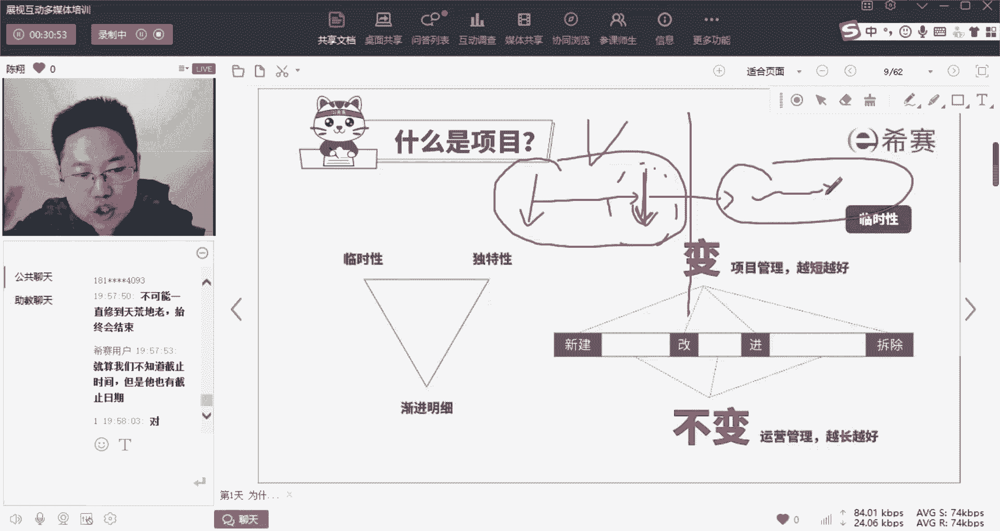

才能创造价值，对所以现在用户总结的这个也是对的啊，修造建等等，这些是项目诶。

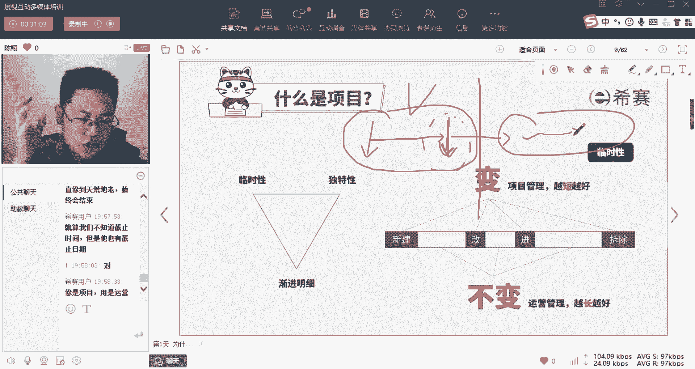

用运营啊创造价值好，所以这个临时性呢唉听起来挺简单的，但是经常有些人在细节上容易掉坑里，这个一个是它的临时性好。

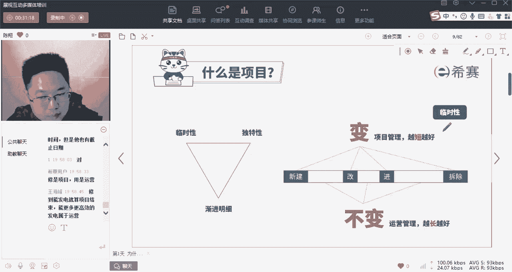

我们再来看一下它的这个独特性对吧，光有临时性，可能还不能足足以帮你判断他们俩的区别，再来看一下独特性，独特是啥呢，啊对啊，反反帝国说的这个是对的啊，好独特是啥呢，我们经常说你做成一件事。

一定受五个因素的影响，如果你自己是做制造业，接触质量管理比较多，你肯定听过这五个字叫做人机料法环啊，啥意思呢，这个口诀备注备注了啊，对你们平时分析问题也有用，一个东西没做好，一定是这五大原因。

第一个做这件事情的人啊，做没做好，第二个用的机械啊，或者是呃方法，这个机械啊，这个工具对不对，用的材料好不好，用的方法对不对，以及你做这件事情的环境对不对，叫做人机料法环啊，这个是万能口诀啊。

我们待会儿以后学的时候也会接触，所以呢如果你做哎同样一个结果，用同样的人机料法环，那么唉你这个东西叫做相同的过程，相同的结果，你做的是运营工作是不变的，就比如说你在同一个工厂的手机生产线上。

生产一样的手，IPHONE手机是不是用的人机料法环都是一样的，产出的成果呢也是一样的啊，虽然每台手机的编号不一样，但是他们其实没有太大差别对吧，那么这个叫做运营的啊，一个相同性，而做项目呢。

做项目就一定是独特的，你有可能是用相同的人机料法环，在做出了不同的这个成果，也有可能是诶用不同的人机料法环，做出了相同的成果，比如说哎，你们这个团队今天做的是一个这个微信手机app，同样的一批人。

明天跑那去做了一个王者荣耀的这个手机app，是不是你用的一些相同的过程元素，造出了不同的成果性的这个结果啊，也有可能用不同的两批人，做出了同样的这个结果啊，这些呢只要有一个层面不一样。

我们都说这个项目是独特的，为什么要这么说呢，因为项目它既零食又独特，所以呢特别复杂难管啊，如果是一模一样的东西啊，做了一遍就能做1000遍，那就不用很多的管理能力了，好这是第二个，那么再来看一下第三个。

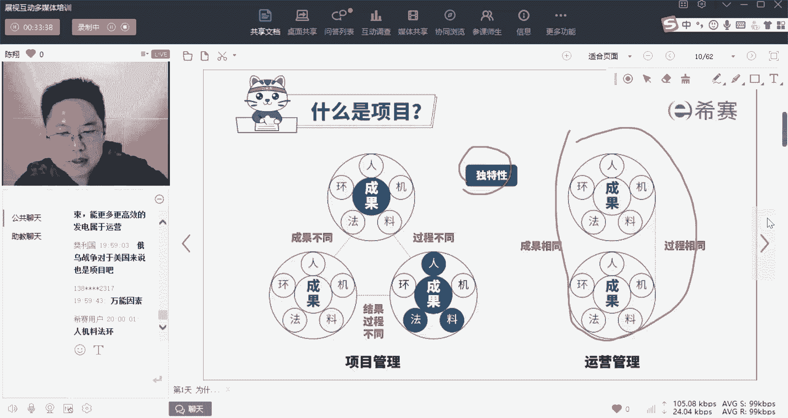

第三个就是我们项目也一直在说的，叫做渐进明细性的特点啊，这个特点呢渐进明细一读好像挺拗口的，美国人的叫法，其实你看懂了就明白了，渐渐的越来越清晰，越来越细节，是不是做运营。

你一开始就知道你这台手机怎么生产，对于你来说他是没穿衣服的啊，就看得干干净净啊，那么左边这个呢你做一个项目，是不是，比如说我们说女孩子对于自己的婚礼的设想，对吧，结婚就是一个。

我们这一辈子都会碰见的一个项目，那女孩子小时候就对，就对婚礼这个项目有所设想了，但是当时是很粗糙的啊，那随着婚期将近了，跟这个婚庆公司商量过之后，已经清楚了一些了，直到这个婚礼完结。

你才真正的对自己的婚礼的每一个细节，都了解得极为透彻，是不是，所以呢我们做项目永远是从粗到精，从大到小啊对吧，1。1点渐进明细的啊。

所有的项目呢都有这三个特点啊。

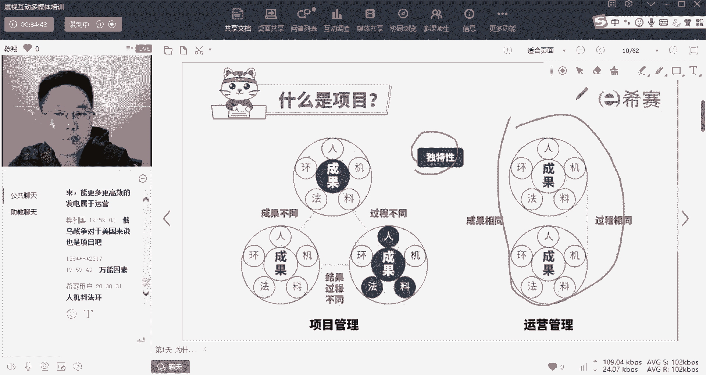

正是因为这三个特点造成了我们做项目很复杂，需要由很高的管理能力，嗯嗯嗯OK那么到这三个特性。

对大家听懂了没有啊，关于项目的这三个特性，我们先从理论上来了解它啊，理论上如果没问题。

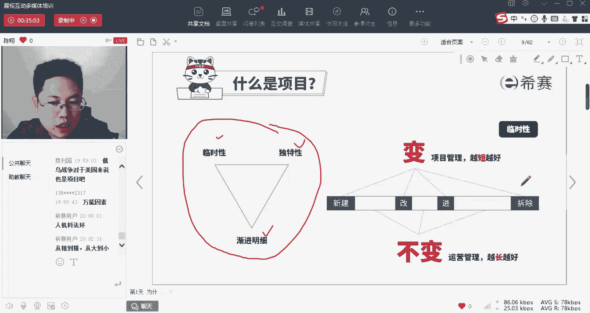

你打个一，我就得给你讲考法，因为我刚才讲了第一步啊。

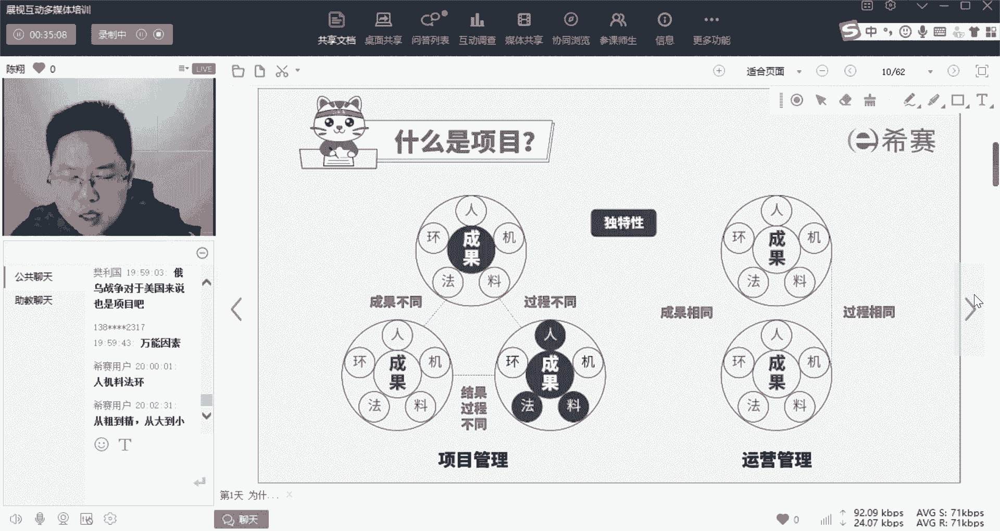

第一个目标是哪本证书通过考试对吧，那么我再告诉你在这个考点上啊。

他会怎么考啊，好考法，我们待会再说啊，我先把这个再给你总结一下啊，最后总结一下，就是我们说一家公司为什么要做项目啊。

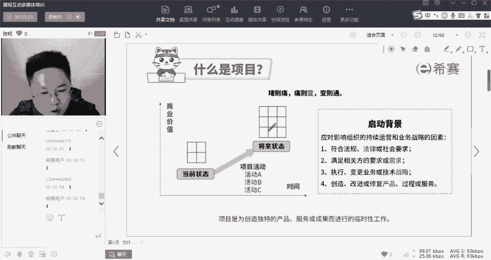

因为呢项目是变通啊，我们中国有句古话叫做堵则痛，痛则变，变则通，为什么要做项目，就包含着在这三个里面，其实一家公司就跟一个人一样啊，一家公司如果遇到了哎外面的一些因素的影响，或者内部的因素影响。

它就会痛什么呢，比如说四个层面唉，国家的法律法规带来的影响，最典型，就是我们教育行业面临K12政策的改变，双减政策一出，咱们教育行业整个行业死了一大半啊，这就是啊我们的国家层面，法律法规。

社会层面带来的影响，要求我们这个公司要与时俱进的变化了，如果你不变，你就只能死在这啊，第二个就是相关方需求的变化，就是我们客户诶口味变了，30年前喜欢什么哎，30年后喜欢什么是吧，我们叫做滥竽充数。

什么意思啊，就是有一个父亲啊，老子这个皇帝喜欢听秦群吹箫啊，儿子喜欢听单吹箫，那么这个客户需求变了，那么是不是你的这个能力也要跟着变，也要启动项目，第三个呢，针对同样一个能力，我们的战略技术目标啊。

技术方案变了，以及我们对于同样一个产品进行，改造和修复的过程，是不是这些东西，通通都给我们公司带来一个什么，现在我们这家公司因为受到了变化因素的影响，诶，我没那么爽了，没那么舒服了。

我要通过一系列的变化，让我自己把这件事情打通，唉，通过时间资源的消耗带来商业价值的提升，那么这个过程就是我们用做项目，这个变化的动作来适配的，所以这就是为什么一家公司永远在做着项目。

因为一家公司面临的环境永远在各个层面上啊，不停的变化着，这就是项目启动的背景好，那么了解这些以后呢，我们再来最后看一下书上给我们写的这句话，PMBOK这本教材上写的是，项目是为了创造独特的独特性。

是不是的产品服务和成果，而进行的临时性的工作，所以它带有独特和临时性这两个特点，那么刚才还讲了哎啥叫产品服务和成果啊，我们平时叫做可交付成果，那么为什么在这要分成三份了啊。

因为它描绘了不同形状的一个结果啊，一个产品是啥呢，一台手机，一台电脑看得见摸得着的实物，咱们一般叫产品，那啥叫服务呢，你能说诶我摸着了这一套这一块服务吗，是不是摸不着了，但是呢哎你出去按个按个摩洗个脚。

你一样得到了一个可交付成果呀，那么这种看不见摸不着的叫服务，那么啥叫成果呢啊，比如说啊你经过我们这几年课的培训诶，脑子里面多了一些跟原来不一样的知识啊，或者说你通过了PMP培训，你的能力得到了增长。

这个东西很难，你说它是一个服务啊，所以我们管这种东西呢叫成果，所以呢产品服务和成果啊，描绘的是不同类型的这个可交付成果啊，在这呢我们稍微了解一下，可能会考到其他的时候呢，我们统称为可交付的啊。

就是可交给啊，你的这个付钱的甲方爸爸的一个成果，叫可交付成果啊，这个专业名词。

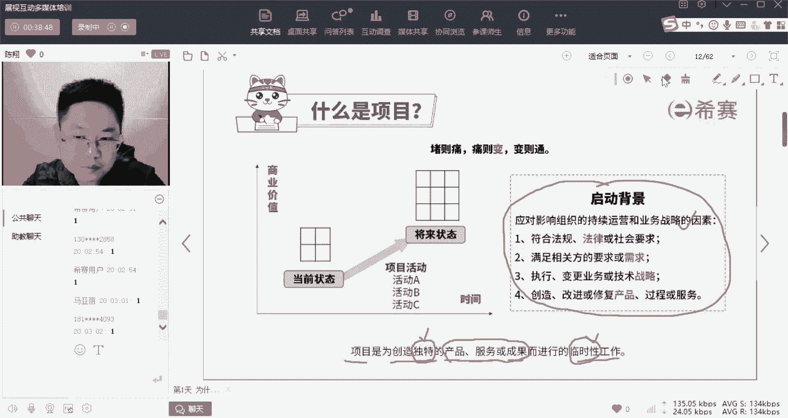

OK那么这些说完之后呢，我们再来说一下他怎么考啊，在这个地方的考法呢，永远是在要你分辨运营和项目管理，这两者之间的联系和区别啊，一般呢会从临时性和独特性两个视角出发哎，来考核你，那么在临时性的时候。

你要注意两个坑点，就是我刚才讲的第一个诶，临时性和时间的长短无关啊，无论多长多短，只要有明确的起止时间哎，都是临时的，第二个啥叫有明确的起止时间啊，可能他的什么时候结束，它并不是很确定。

但是他一定是希望他尽早结束，才能发挥它的效果的，这叫临时性好这两个点，第二个独特，这独特是刚才讲了啊，你要注意，无论是成果是独特的，还是做的过程中用的人机料法，环五个因素的任意一个因素是独特的。

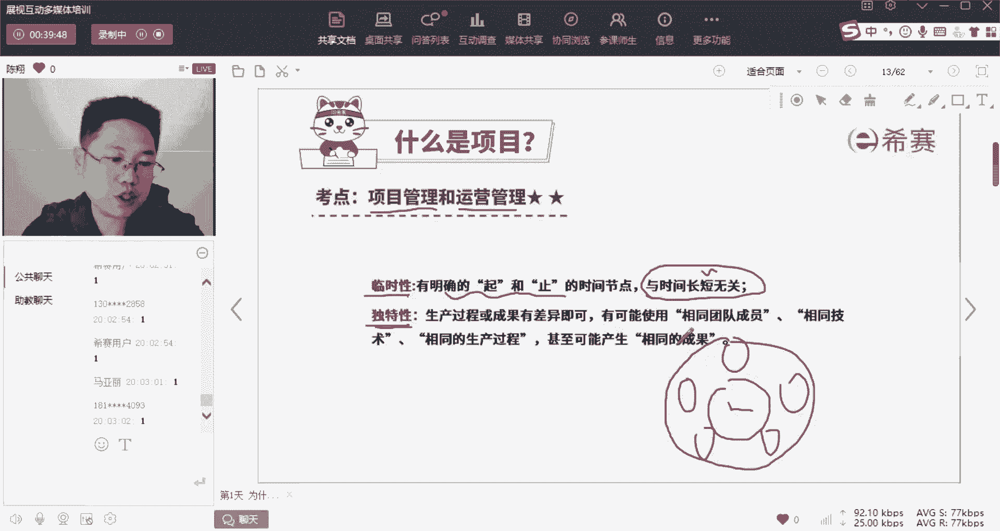