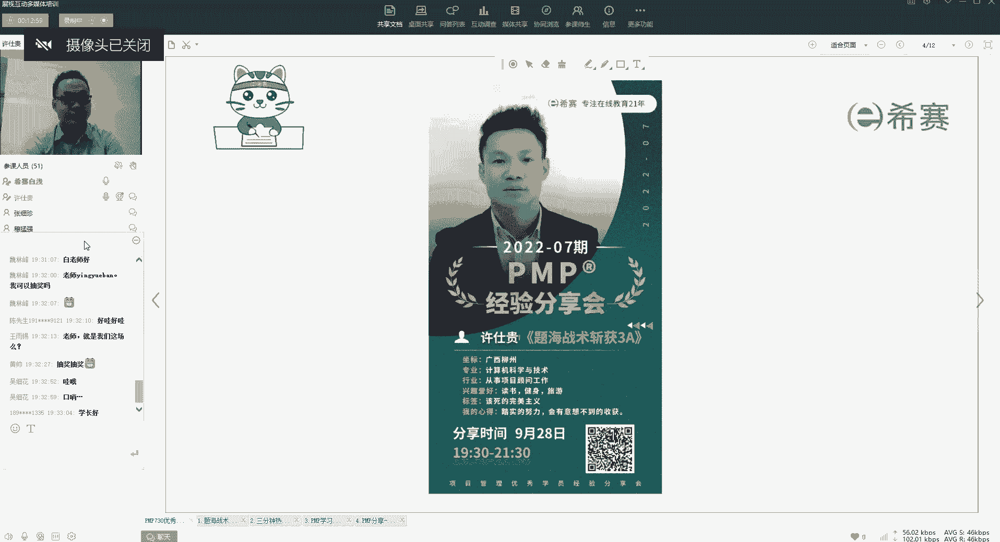

# 【24年PMP考试】零基础也能看懂的pmp项目管理视频教程！ - P70：5.4备考心得--题海战术斩获3A - 冬x溪 - BV1tu411g7UH

好然后另外呢啊除了我们今天听经验之外呢，很多同学他就会问说老师今天晚上有没有讲啊。

对不对，好的可以大家预告一下啊，今天晚上呢我们是奖品非常非常的多啊，总共是有22个名额可以给到大家，然后呢我们的初级场呢大概是17名啊，是送我们的这个西塞公仔啊，就是图片上这个样子好。

那我们的终极场呢今天晚上会抽四名同学，然后呢会送我们的小米加湿器，还有最后一个啊，大家都非常期待的，期待已久的就是我们的终极大奖啊，是我们的高级场的奖品，然后呢这个呢就是我们抽到一位同学啊。

如果说抽到你了，你的学费，我们就可以给你进行一个免单这样的操作啊，不用怀疑，就是你那个交了2000多块钱的学费好不好好，那所以现在我们就开始今天晚上的正式的分享，好吗好，那先给大家看一下顺序啊。

今天晚上呢我们总共是有四位同学啊，第一位同学呢是我们许世贵同学，他会跟我们分享的是题海战术，斩获3A好，那第二位同学呢是我们的木门墙同学，他会给我们展示的是努力可以解决大部分问题。

好那第三位呢就是我们的张锡珍同学啊，他的主题是赢在执行力好，他会给我们展示是模拟卷的做题心得啊，这个名字就很有意思了，对不对好，那现在我们话不多说啊，我们正式的进入到今天的第一个分享环节。

有请我们的许世贵同学啊，许世贵同学好，那许世贵同学，我这边先打开你的这个麦好不好好，我先打开你的麦好，我现在要打开你的摄像头了，准备好了吗，可以吗，可以可以可以好，OK好。

那我这边把你设置为我们的主讲人，好好，那你这边可以开始讲了啊，可以了，可以开始做好。

大家可可以听见我的声音吗，好你可以先往下面翻一下PPT，我们的第二个下面的PPT是你的这个。

好你试一下能不能翻动声音是不是，喂能说话吗，哦可哦，可是有回音吗，哦没有没有，我等一下我关掉我的麦，你先试一下你的pp能不能翻动，你能翻动的话，我就把我的麦关了哦，可以的可以，OK好的好的，那你讲吧。

嗨大家好大家好，有西月班的同学吗，打个666啊，我看到好多美女来商家这个分享会哦，哦有点紧张啊，主要是七赛确实是包括老师，还有同学都是好多美女哦，我一看到美女我就紧张，这个是浅色的，OK那不多说。

你看到我这个分享的题目的话，其实是比较简单的啊，我这种就是做题目比较多，我之前累计刷题就是2万2万多一点吧，呃我知道分享几个几个方面的内容啊，先做一下自我介绍吧，我是来自柳州的，专业是计算机科学与技术。

和从事是项目顾问的工作，平时喜欢保护啊，健身啊，还有偶尔出去旅游一下，个人比较追求完美哦，有有一点点，完美主义感觉是这样子，呃我这学习偏僻的性能呢，就是我这个人就是要那时的学习吧，努力花的时间也多一点。

当然了也收获也是不错的，接下来我说一下这个我为什么考偏僻呢。

呃其实，跟西塞结缘，是考这个项目管理师，还有那个这就是中级和高级啊，这个项目管理师啊，我凭那个执政就是信息系统项目管理工程师，还有这个信息系统项目管理师两个考试，我是去年参加的，考试都是一次性通过的。

所以在西赛学习还是蛮好的，然后呢就学着学的过程当中就接触这个PNP呃，也了解了他的一些含金量啊，还有对在国内的一些企业啊，对他的一个认可度，包括他的一些内容，跟之前高像我学过的是很多内容其实是一样的。

所以我就想把它这个证书也给拿下来，还有他在简历上也可以多一点点内容嘛，对吧嗯，可能面试官啊啊。

聊的时候可以多一点多一个话题吧，所以我就又发了这个偏僻啊。

我在西塞算是考了三个证了，接下来就是既然要考PB是吧，那我肯定是要定一下这个目标，将论语中有这个这么一首诗了吧，算是诗吗，求其上者得其中，求其中者得其下，求其下者无所得，我当时我就简单了。

我就说是求求上得中，求中得下，求下的话可能就不过，所以就是第一个要把目标定的高一点啊，我当时一定我就是定定在3A的目标啊，3A的话就是总体的那个分数，应该就是正确率达到80%以上吧。

基本上是这个这个分数，呃接下来就是做计划吧，我也是在学习的过程当中，把一些那个主要的项目啊列出来啊，我视频啊，直播啊，还有练习啊，一条一条的列出来，然后我就是每一天啊呃完成了多少，在哪个模块上面。

然后把这个完成量啊也会慢慢的标标志来，像像我之前这个整个的话，我是最后一天，更新是7月29号是考试前一天，基本上的话就差一个吧，就是这个卧底裤没有轻功啊，还差一点点哦。

那一天的话就是因为我是要去外地考试的，不是在本市，然后没有清完，只差了一点点啊，没有没有达到完美的结果，我其实我开始的那个像我体验，我开始是目标是1万5而已的，在学习的过程中啊，在群里面啊跟大家交流啊。

然后就欢迎相当于互相监督啊，然后一说着说着就变成2万啊，结果我就是累计了2万500多万，差不多是这样的啊，做这个计划的话，其实大家可以根据自己的实际情况嘛，啊对吧。

像我这里写的第一点就是裁剪时自己的计划，将这个计划比较全部的了，基本上就是整个西塞里面的直播啊，还有练习啊，这些内容我都是过了一次，像你可以根据自己的情况和你自己的时间啊，还有你学习的这个接受的能力啊。

制定属于自己的计划对吧，裁剪，其实这两个字也是学习了这个项目管理之后，我在用用用起来的时候，以前我也不会用这个词语，然后我之前跟每个每一天的话，基本上都是两个小时左右，我在1月份的时候就是报了西夏的班。

7月份的时候考试，相当于差不多是六个月时间了，半年的时间了，所以我我整体的这些就全部都看完了，这个每一天的话，你这个核查表的话，你可以去更新啊，就像在哪一个内容，我今天你完成了什么，花了多少时间。

然后你把这些完成量啊更新一下，这样子的话你会看到有成就感对吧，你每一天都会有看到这个完成量的话，就会有有一种是我今天定的目标完成了，就会很有成就感，然后就是大家就是尽量不要拖延时间了，因为很多学员啊。

都是要有有拖延的那个那个习惯吧，他平时还有可以充分利用这个零散的时间呃，比如说你吃完饭啦，等一下上下步啊，或者是怎么样的，这个时间里面，你可以拿着手机，手机出来玩那个西塞的app上面的题目。

可以做个实体对吧，你把这些零散的时间用起来的话，其实嗯花在学习的时间上是很多的了，然后的话可以和同学们分享你的计划，你把你的计划发出来之后哦，我要达到这样一个目标，让大家跟你互相监督对吧。

就像我之前说的，我要刷1万题，然后在群里面说的，说后面哎呀既然都达到1万题了啊，可能冲着2万题去了，刷着刷着就变成2万了，接下来就是一个执行的一个过程吧，像西塞这个班的，报个班的话。

他有一个比较整体的一个规划了，像我在学习的过程中，都是按照这样123456个步骤来执行的，在你上直播课了之前，你先预习这个880是对你是很有帮助的哦，有些学员可能没有看过，或者是觉得没有必要。

那我是个人建议是要去预习一下，预习之后再跟着直播上课的话，接受会很快的，然后第二个就是跟着直播课上课了，这个的话，希望大家还是抽一点时间参加这个直播课哦，因为很多同学就是说我明天再听，可能后天再听啊。

都是一直拖着拖着哎，结果整个课程啊就弱了很多，可能十几20几20节课都没来听，结果就说哎呀怎么这么多东西都没看啊，就感觉很很压力很大对吧，所以即使你平时的话，你就花一点时间跟着这个课程安排来就可以了。

然后上完课的话，他会有一些章节练习啊，就是今天所学的内容巩固一下啊，然后的话第三部的话就是有两本两本书吧，两本教程，那不是讲义，有讲义是跟着直播各走的，是教程的话是不是那个PMP的教程。

还有一个是敏捷部分，现在的话考试内容公司你也是蛮多内容，还有一些混合的，所以啊PNB的原版的教程跟这个敏捷的啊，你也要去看一下啊，就是简单的过一下就是有印象嘛，因为大家也知道这个PNB的考试。

都是选择题嘛啊所以也不用再去背背诵的，就是有个大概的有问题就可以了，下一步的话基本上都是刷题了啊，像这个什么每天的一练啊，在也是IDP上面的实体，然后群里面的每日五题呀，这些都要去完成了，每一天哦。

至少是完整的写嘛，还有题库里面还有一些知识点练习呀，也是蛮多的，然后你在刷题的时候一定要自己做一些总结吧，像西塞，其实他像那个有一本小册子吧，它里面也有一些总结，你可以去看一下，但是你在刷题的过程中呢。

你自己总结肯定是更好的，像我之前的话，我学习的过程中，我是自己总结了一些比较简单的是吧，比如说你像你看到题目有呃高层级的需求，还有这个，项目成功的一些标准那么理想，那那肯定是项目章程嘛对吧。

如果是验收标准，项目的范围边界肯定是放个音说明书吧，这两个是比较容易搞混的东西，所以你要把这些总结自己进行一个小结吧，然后还有就是像那个QA和QC，就是质量审计和质量控制，这两个的话。

大家可能也是比较容易搞混的一个地方，屏幕里面如果说是这种审计审过程的，基本上都是QI了，就是质量质量审计，如果是查检查结果可交付成果，那肯定是QC的，简单的，你记忆就是KY就是审过程，QC就是查结果。

你把这些总结下来，就形成你自己的记忆了，你做题的话基本上很容易的，这个就是在刷题的过程中啊，做一些总结，然后后面冲刺的时候就是做一些模拟题，模拟题的话像西夏雅提库是蛮多的啊，有几套题吧。

然后建议做的话就是最新的五套，至少做个五套题左右，熟悉一下题型啊，还有哦填填这个答题卡之类的啊，考考前的一两周去适应一下，最后就是清一下这个错题库嗯，差缺补漏吧啊看一下这个小册子，还有那个室外导图啊。

你可以去大概的浏览一下啊，新增支属于自己的一个思维网络图一样的，这个就是一个执行的过程，这个就是结果了啊，大概在那个app上面是有那个分析了你的数据啊，你做了多少题啊，累计，然后这个其实是3500多。

是西塞的一个算是不重复的吧，我觉得应该就是不不重复的题量啊，这个刷了2万多呢，就是说有蛮多题目都是重复了，然后这一类是一个正确率，如果你目标是3A的话，基本上打到七八十%以上吧，基本上是不会有问题的。

如果说哦大家可能要求所有要求那么高，那没关系，那你把它定在70%左右吧，不能定的太低嘛，60%，你这种连压线过了，这种的话就有点危险吧，万一不过呢对吧，所以还是稍微定得高一点，然后的话就是。

我接下来就是做了一个小的一些总结，现在新的导航是今年考的第第第，第一批是6月份，是有很多的敏捷和混合的，大约占60%到70之间，所以平时练习一定要多做一些敏捷和混合的，像预测的话。

反而感觉预测的东西不多，平时练习要多注意一下，然后做题的时候要控制好时间啊，大概是一分钟一题左右，要留出一些时间来连读这个答题卡对吧，考前的话你至少要打印一套嘛，一套完整的模拟题，还有这个答题卡啊。

按这个考场的时间做一个测试，了解一下哦，这时间还是比较长的，我第一次感觉到就是说这个考试，这不仅是一个脑力还是体力活，差不多四个小时的时间哦，确实我也是第一次看到这么长的时耗时时间。

然后的话其实这个pm b考试，他那个题目的话其实不难的，就是像阅读理解一样，你在看屏幕的过程中，其实像女孩子啊，或者是平时阅读比较多的，他对那些文字的理解啊比较好的话，其实嗯很多人都觉得这个很简单吧。

啊就是这样子，然后的话有一些屏幕的话，要相信第一感觉哦，有些纠结一点的题目，不要太过于纠结，可以pass的，有一两题嘛对吧，不会很多都是那么纠结的题目，还有就是不要犯了一些低级的错误。

像题目里要求是选择不正确的，选择正确的对吧，这种的话主要伴奏出，然后的话我在考试中过程中，是我是先把这个答案呢写在草稿纸上面，因为到时候你一起啊勾了答案之后，还要重新就翻这个试卷啊。

可能花的时间会多一点，我是写在草稿纸上之后，点卡到答题卡的时候，我是瞄着这个脑子上的，一下子都很快，然后话就是你按照自己的习惯吧，有的是30题涂一次，有的是50题都可以哦，这个是看你自己的。

然后这个就是像呃这个就是考试过程的一些呃，然后下面的话我说三点，就是考这个证书不是单单为了一个证而已，可能就是对开阔的视野是吧，就是在大家学习的过程中啊，啊认识了一些新同学啊，朋友啊对吧。

然后你可以交流的过程中，可能某一个人给了一些点子，给你开过了你自己的视野，对你自己的职业生涯，包括以后你自己创创业啊都是很好的，然后做事的话都必须认真的，像我是做事是比较比较比较认真的啊。

对自己也负责的，量变引起质变对吧，只要你平时努力了，就很简单嘛，肯定会有收获的，OK那我基本上就分享这么多好，大家有个口号啊，3A3A你一定行对吧，加油，诶我这边分享结束了，OKOK好的。

非常好的分享啊，非常精彩的分享，那我先把你的这个身份收回来好吧，OKOK拜拜了，兄弟们，江湖再见，哈哈哈好，江湖再见，江湖再见，普通话没那么好，现在天亮啊，好非常厉害，对不对，大家有没有感觉啊。

我们的许世贵同学呢是一位啊，非常厉害的刷题大神，是不是做到了2万这个数量啊，做到2万这个数量，然后呢关于这个学习报告，其实我们线下的这个app里面都是有的，那所以大家可以关注一下啊。

比如说你的做题数量是多少，然后呢你的做题的这个正确率是多少，上面都可以大数据可以看出来啊。

