# 【24年PMP考试】零基础也能看懂的pmp项目管理视频教程！ - P9：1.3 项目管理生命周期的各个阶段-知识点 - 冬x溪 - BV1tu411g7UH

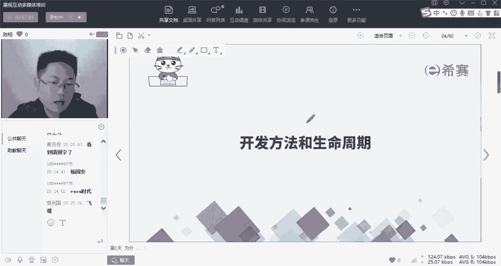

那么刚才讲的呢，呃讲了这个预测型和迭代型和增量型和敏捷型，很多人呢对这几个东西经常搞不清楚啊，也是我们的一个重中之重，那么我们来展开讲一下刚才讲的那些东西呢，它们统称为项目的开发方法和生命周期。

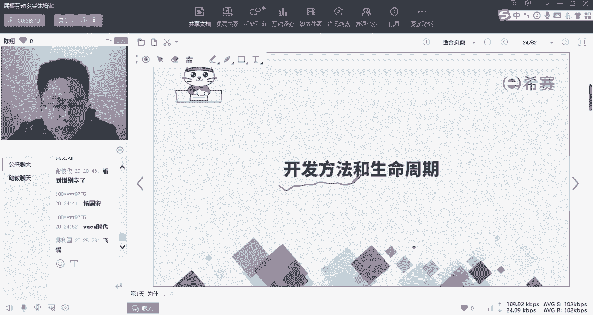

那我们来看一下这四者之间的区别，注意这个东西既是我们理解清楚，第六第七版的区别的重要的根基，也是很重要的考点，它是有很多分值的啊，我们来看一下，首先呢我们还是从最常见的这个瀑布模型啊，来看啊。

你感觉一下你现在做这个项目是在做什么啊，我问一个问题啊，现在你做项目你能分得清楚，你是做瀑布模型的，打个一预测性的打个一，你分得清你是在做敏捷型的，打个二看看，我先看一下啊，咱们的这个理解。

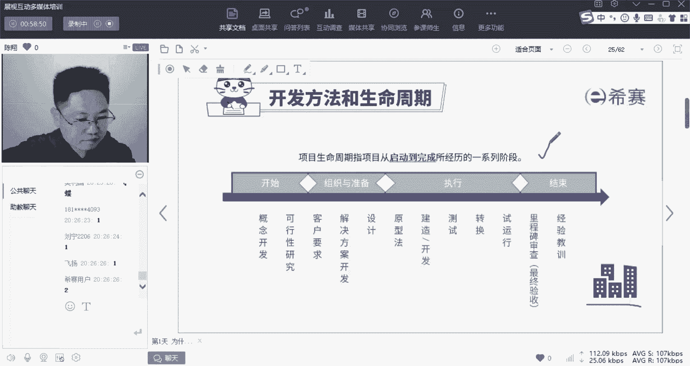

唉还是有不少的在做敏捷啊。

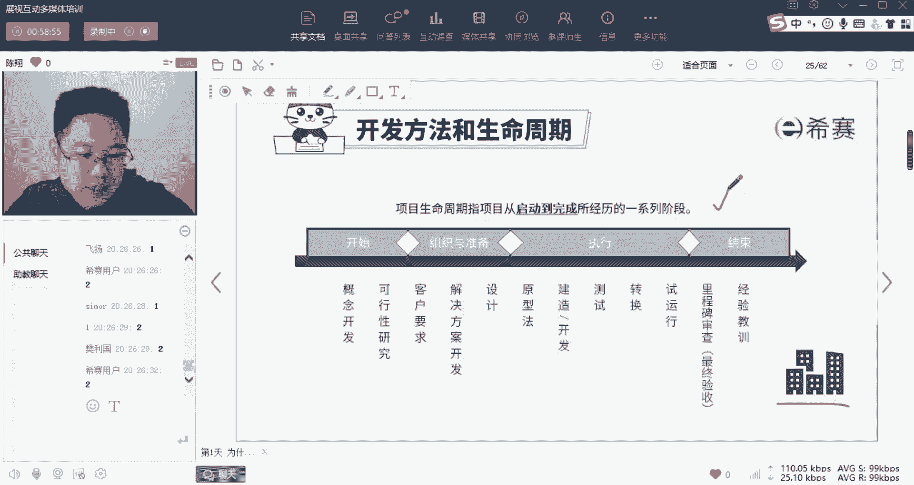

一般敏捷都是在软件行业，对不对。

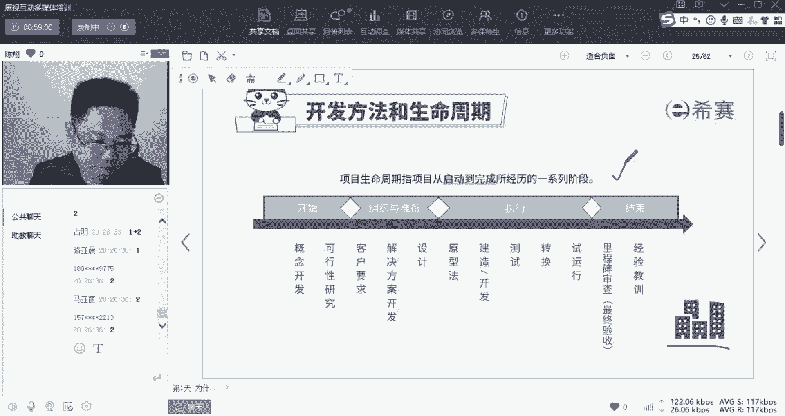

好还是有很多敏捷啊，好O那么我们还是来解释一下啊，啥叫瀑布呢，瀑布模型也叫预测模型，取的是瀑布一样飞流直下，一泻千里的这种意思啊，啥意思呢，就是一个非常明确的线性啊，比如说我们说一个典型的啊。

这个比如说啊你做一个地铁，一个城市的地铁建设对吧，地铁挖隧道，建这个地铁啊，然后组装，首先你会提出一个概念说诶，要不咱们在这儿建一座地铁站吧，但是能不能见呢，你得进行一个可行性研究。

包括诶这个地方是不是有溶洞，是不是有地震断裂带，适不适合建地铁，城市规划部门要进行可行性论证啊，可行性论证还有什么呢，还有经济可行性论证，就是在这投入产地铁，它的投入产出比划不划得来。

是不是亏的还是赚的好，经过论证以后，你会发现啊，这个概念被认可了，值得去做啊，这个产品值得去做，那么咱们就会进入到立项阶段，好立项就是确立这个项目咱们要做，然后项目经理这个时候入场了，项目经理入场之后。

首先就是要探明，因为在这之前只是一个很粗略的概念，那么这个时候你要探明他的需求具体有什么，比如说哎哎我老婆跟我讲，我们结婚十周年，你要给我一个终身难忘的十周年的这个啊，这个回忆，那么这是一个概念。

具体怎么做，像我这种直男是不知道的，所以我要去请教专家，专家告诉我，你要带他去吃植旺晚餐啊，环球旅行买钻戒等等等等啊，那么客户要求探明了诶，他在我解什么设计一个一揽子解决方案对吧，解决方案的开发。

好方案定好了再去设计，你要做这个产品的设计方案，然后再出一个圆形啊，啥叫圆形呢啊，原型就是这就很简单啊，比如说啊我们今天比如说我要送我老婆啊，一个什么东西，然后他到底想要什么，我不知道，我拿个橡皮泥来。

我给她捏啊，捏成一个什么形状，看是不是这个样子，他告诉我不是你那个地方还要多一点，那个地方要少一点，然后再通过这个橡皮泥在再捏到他想要的样子，是不是就是他想要的一个东西。

就通过一个圆形能够可视化地展现出来了啊，这就是圆形，那么有了原型确认了以后，你再去建造和开发，然后去测试它能不能用，然后再做转换，啥叫转换呢啊，我们如果你是搞软件开发的，这东西就叫交割或者说什么呢。

就是你一台地铁不是地铁，你在工厂里面建好了，你要把它放到诶地铁隧道里面去，铁轨上去就能组建起来，是不是这个叫转换到实践实用场景，对吧对好，实践使用场景已经到这儿以后，你还得试运行，比如说地铁。

地铁要试运行，整个一整年才能开放给公众，为什么呀，因为危险性太大了，一架飞机今天掉下来是130多个人民啊，对吧，如果一台地铁出了问题，那简直就不可想象是吧，所以这么重要的东西，一定要先给它试运行一整年。

确定了它的稳定性才能交付啊，这个时候我们才到里程碑审查，叫做最终验收，验收完了之后，你这个时候没完，你得再回顾一下诶，我做的这个项目，我有什么正面的经验，有什么反面的教训值得我学习和沉淀下来。

在将来我在开展类似项目的时候，诶，我能够吸取什么教训，能够来让我接下来做得更好，是不是整个这个项目才算完，所以呢整个这个项目从开始到准备，到执行到结束，它是一个完整的线性结构，啥叫线性结构呢。

就是一定是前一步做完了，经过了验收和批准，才能开始下一步一步接一步诶，按照时间顺序线性的进行下来。

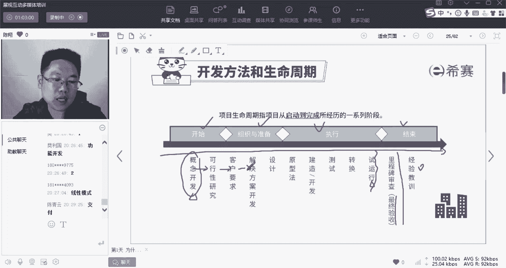

是不是就找到了一个瀑布，从上往下一泻千里的这种顺滑感。

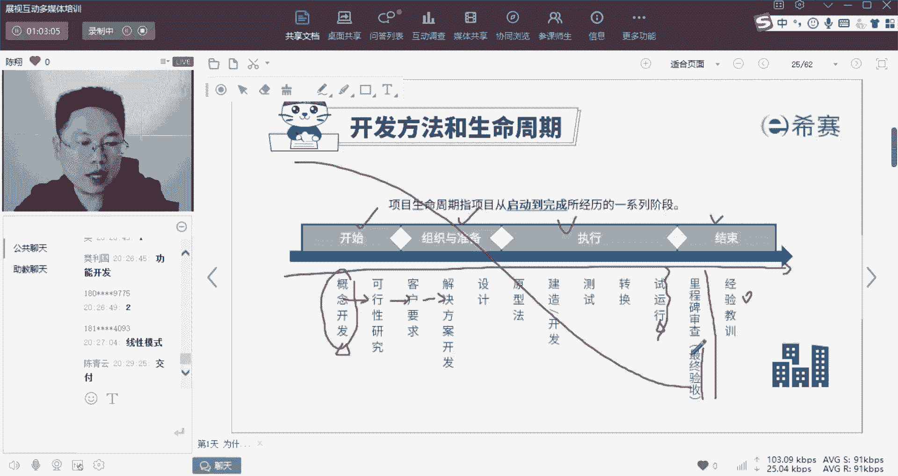

Ok，那么这是一个我们现在在做的，典型的预测型项目型，刚才我问了只有大概不到十几20位同学说，他们现在做项目型，实际上呢如果你对敏捷没什么概念，你现在但凡在接触项目，一般都是这个瀑布型的。

是不是你可以自己感受一下啊，现在基本上都是在瀑布型做事情，除非你是很明确的说我在做敏捷啊。

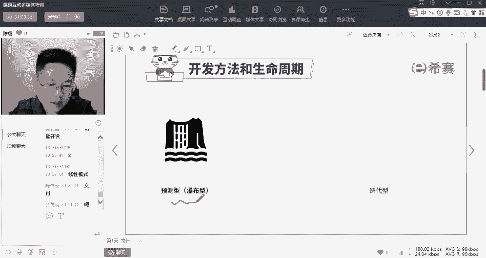

一步一步啊，step by step啊，好OK那么这个瀑布型完了之后，它有一个问题，咱刚才讲了呀，好，我们这个整个这个项目可能呢从最开始设计啊。

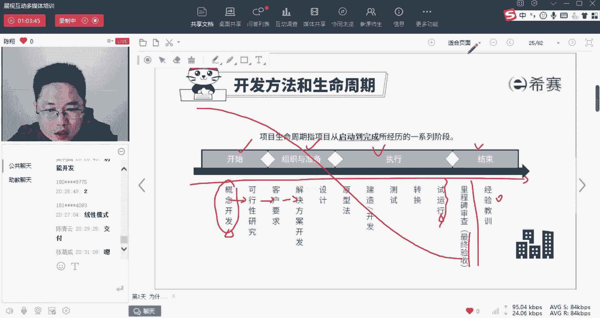

客户要求的东西做到这个最后呢，可能三到4年就过去了，这三到4年之间，无论是客户的口味还是外部的环境，都在急剧的变化啊，那么可能东西没做完，客户的口味就已经完全变完了，那么这个怎么办呢是吧。

不适应变化有可能是三到4年之后，客户才干到实实在在的东西。

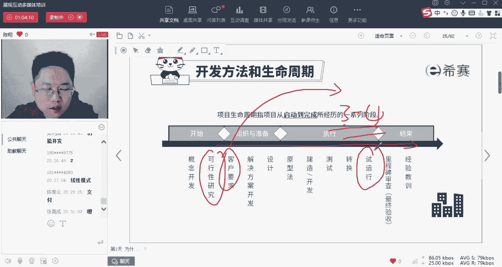

然后跟他想的完全不一样，他让你返工，结果这个时候大量的投资已经投进去了。

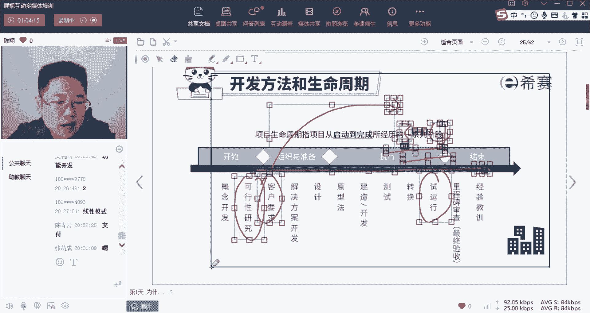

反攻造成大量的浪费，那么这些问题怎么解决呢。

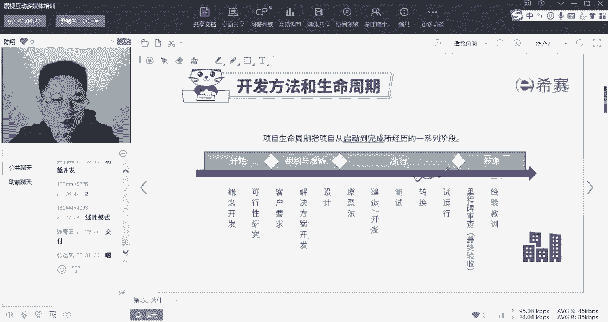

啊我们就必须要去净化啊，比如说进化呢最常见的一个迭代，一个瀑布，啥叫迭代呢啊，前段时间我看这个冬奥会的这个报道啊，这个冬奥会上你们有没有这个印象，是不是有一块冰冰出来了以后呢，出了几道激光激光。

哗啦哗啦把这个冰啊切成这个碎冰，掉落以后出现了五环，有印象吗，有没有看了冬奥会开幕式的一块冰。

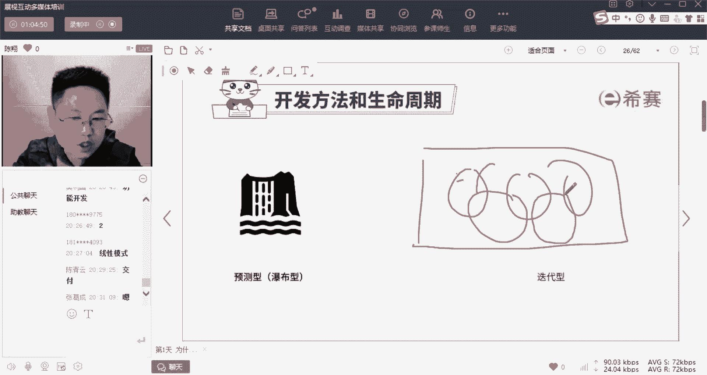

被激光切碎之后变成了五环是吧。

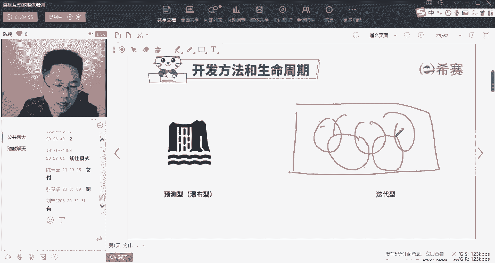

当时你知道老谋子啊，张艺谋跟这个制作团队提的要求是什么，提的要求是你给我制作一块纯洁的冰，你如果是这个乙方，你当时是什么感受，老谋子让你给他设计一块纯洁的冰出来，是不是有点像甲方给你提的要求。

是我要的是五彩斑斓的黑，你完全搞不清楚了，他要的东西的标准是什么是吧，甲方自己都说不清楚啥叫纯洁的冰，面临这样子完全不清楚的需求，你怎么办呢，啊没办法，甲方爸爸出钱，你也得去做呀。

这个时候最适合的就是用迭代型，你摸不清楚，那你就摸清楚嘛对吧，那比如说我现在跟你讲，哎我要你给我画画幅画，这幅画有鱼有水草啊，是彩色的，我这样说，你肯定不知道我要的东西是什么。

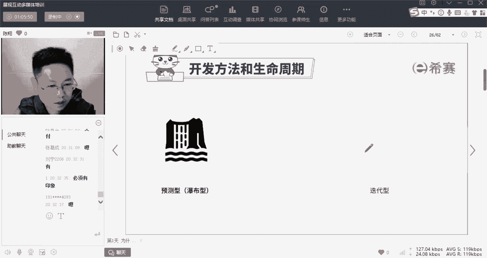

你只能先去试，你说我先给你画个草图，大概是这样。

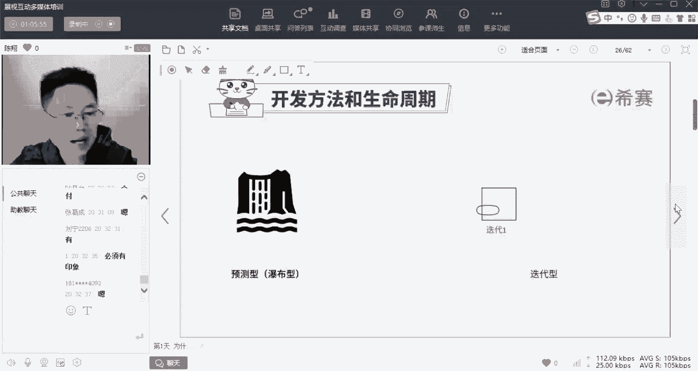

对不对啊，我说没错诶，是你可以照着这个方向去画，然后呢，我给了你这个反应之后。

你又给他诶，你不说我说我要鱼和水草吗，你再给我画几笔鱼和水草诶，我说看着这个A这个东西差不多就这个样子，如果不满意，我会提出来说这个地方去掉，那个地方加深一点啊，加加大一点。

是不是接着我的需求你再去改好，改出了诶，有颜色了，最终哎这幅东西终于满了我的衣，那么你把它交给我，那么啥叫迭代，就是先做交这个给他给甲方看，甲方给反馈再做再看再反馈。

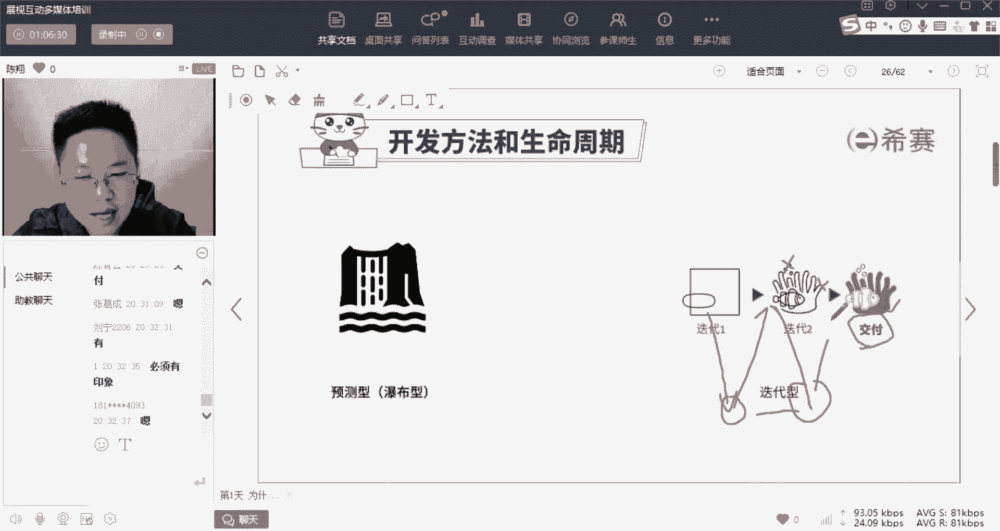

再做再看再反馈，一直不断的这样子去试探他想要什么，直到最后东西通过他的验收，是不是这种生命周期呢，我们每个人应该都经历过，就是你大学写论文对吧，有没有人敢拍着胸脯说，我大学论文或者研究生论文一次。

从我老板那过来的，是不是永远不会对吧，好这版交上去，老板P1顿改一下，P1顿再改一下啊，幺零这次打死都不改了啊，结果上去还得改，最后改了10086版啊，然后终于再改一版以后通过了，是不是。

所以我们说写论文打回重改，打回重改，最后通过这个是典型的迭代型生命周期，它讲究什么呢，讲究去通过唉逐步的靠近你的目标，通过最后一次教父啊，这是迭代型，那么除了迭代型，还有一种叫增量型，啥叫增量型呢。

就是每次交易部分啊，比如说我们还是拿这个做建筑来说啊，大家都知道啊，有些建筑呢它是这样子的，就是下面三层是商场，上面三三十层呢它是住宅，应该都见过吧，对旺达旺达商场下面上面的这个住宅啊。

那么这种楼呢我们原来搞工程的时候，什么意思呢，就是整个这个群我们叫群楼啊，三层和30层都建完了啊，全部装修好，甲方再去运营，但是这个太慢了啊。

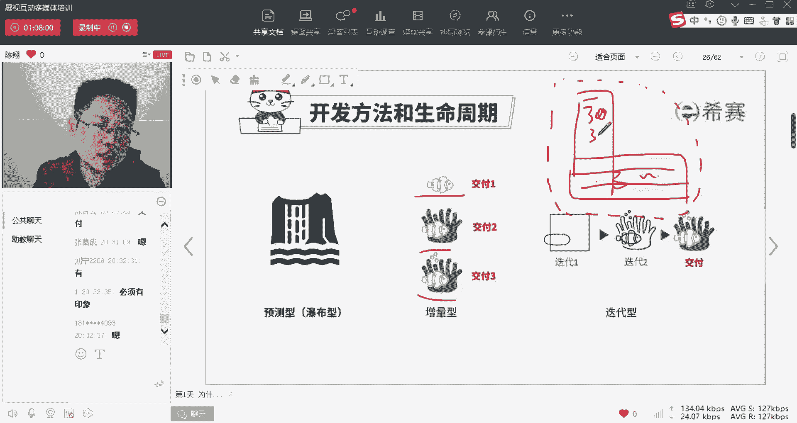

甲方等不了，甲方现在都是什么要求呢，这个东西你给我分两次交，先把下面三层啊，做完了交给我，交给我以后，我马上装修，马上引进店铺来开业，下面已经开业赚钱了啊，你上面同时还在建，这给甲方带来什么好处。

原来这种做法，3年以后我才能开始有诶这个资金回笼，这样子呢，一年下面这个就交了，马上资金回笼了啊，从第一年到第3年，上面这个还在建，是不是就更快地投入到市场，更快的进行啊，资金回笼。

那么像这样同样的一个内容，我把它分多次啊，把它分多次交付出去啊，那么就是叫做增量，每交一次的东西叫多一点增量，陈锦云收的这个预售房，跟我们现在说这个概念啊不太一样不太一样。

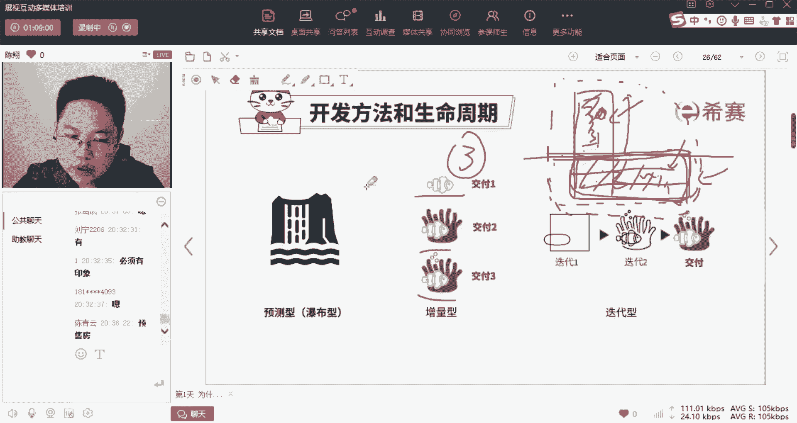

预售房它是一个商业操作手段，这呢我们说的是如何做项目的一种交付，生命周期，好啊，御书房和期房啊都不是一个概念啊，都不是不是这个概念，对他应该是一个进度交付，你先交一块，再交一块，再交一块。

原来呢你交一次，现在呢交三次，好，这个概念呢你们可能会有点模糊，我们再来啊，加一个例子再解释一下啊。

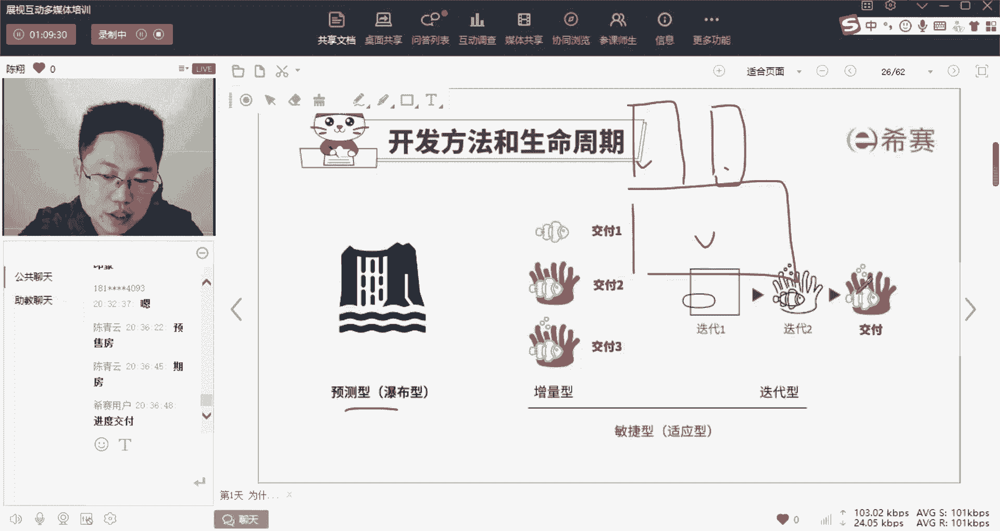

那么这两种加在一块儿呢，就是我们现在常说的敏捷型了，它是什么特点呢，我们举个微信的例子，好微信的例子，大家回忆一下微信，你的手机微信是不是越来越大，原来几百兆，然后一个G两个G，三个G现在可能十几个G。

为什么，因为他一直在给你加功能，大家知不知道微信的第一个版本对吧，只有发消息和发图片，这两个功能就跟我们当时的短信一样，应该是在13年还是一几年啊。

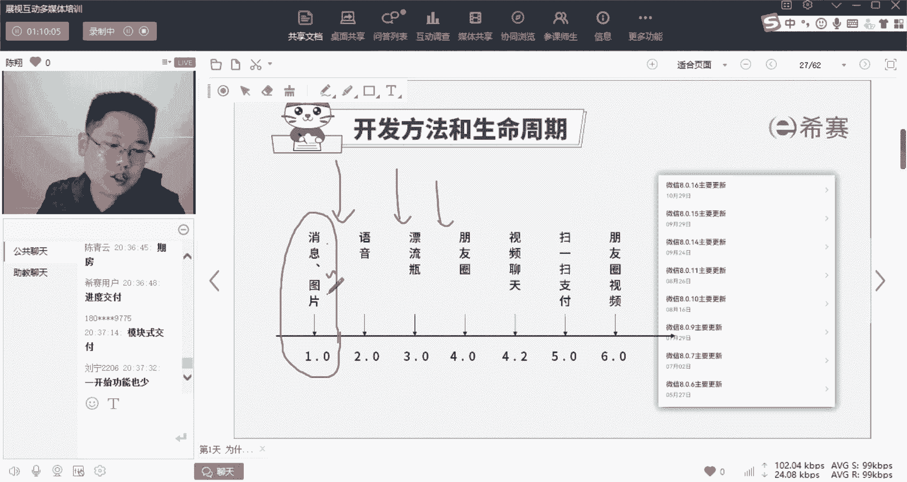

那么第一版微信发出来的时候，这么少的功能跟现在不可同日而语啊，那么问题是什么，为什么他不把这个微信开发到诶。

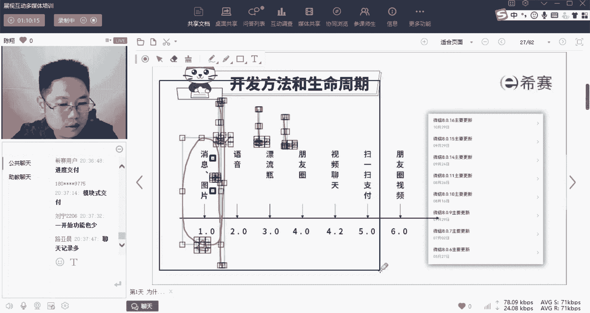

能发朋友圈，能视频聊天，能扫一扫能啊视频这个朋友圈视频，发视频号这些功能都开发出来了，开发得这么完整了，才把它投放市场，大家想一想他为什么要分多个版本发，每个版本发一点出来。

很简陋的功能就赶紧把它发出来了，而不是把所有东西都完全做好了。

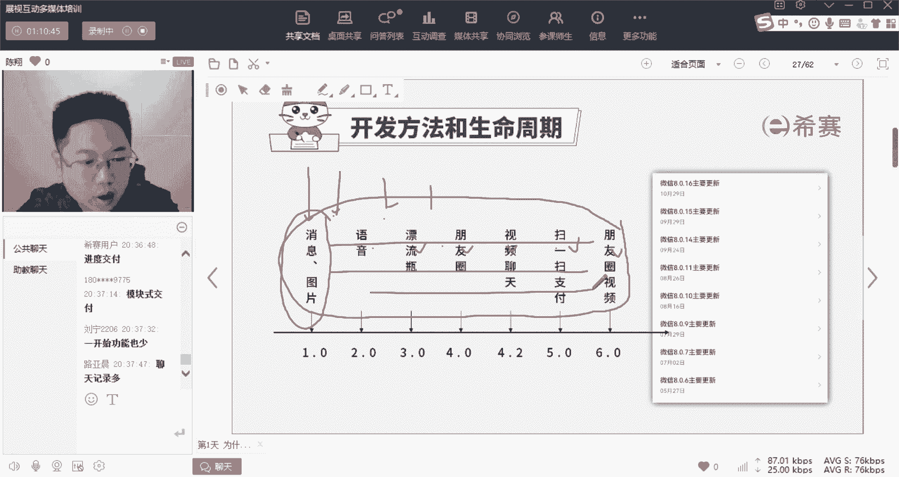

很齐全了，再统一发，为什么。

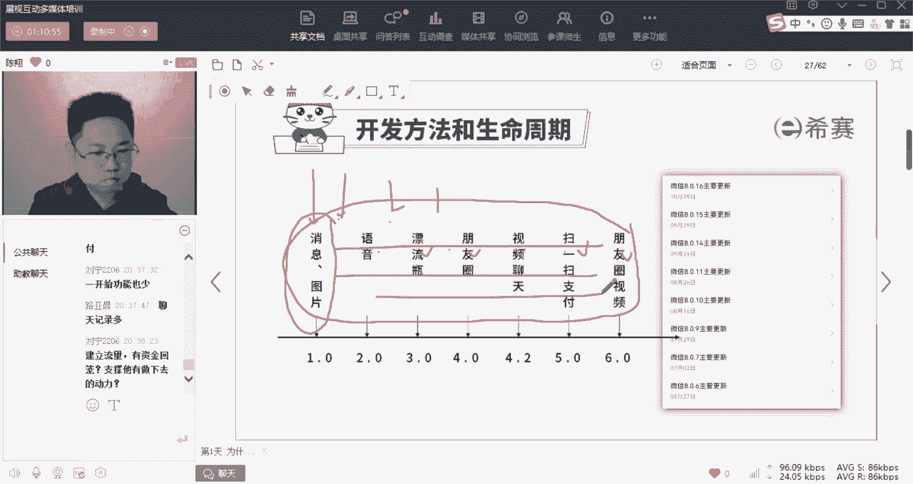

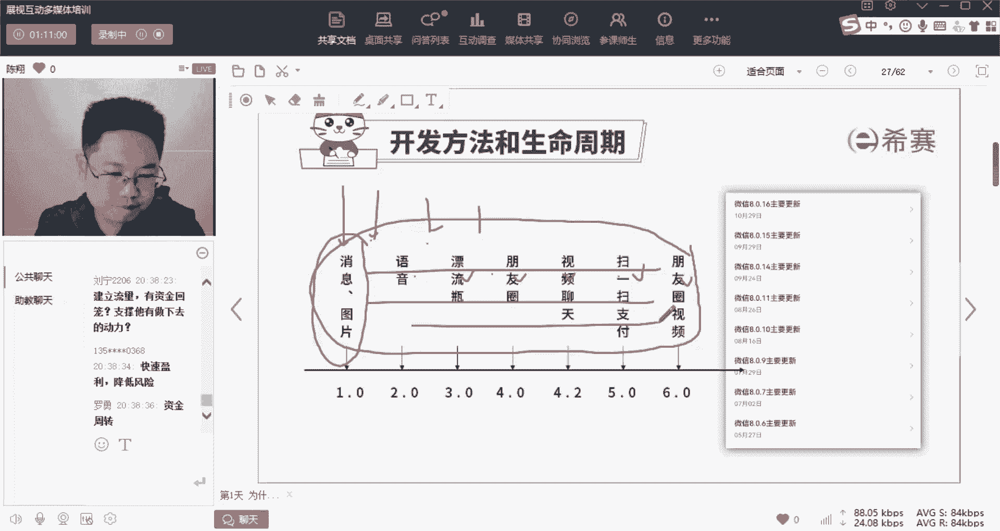

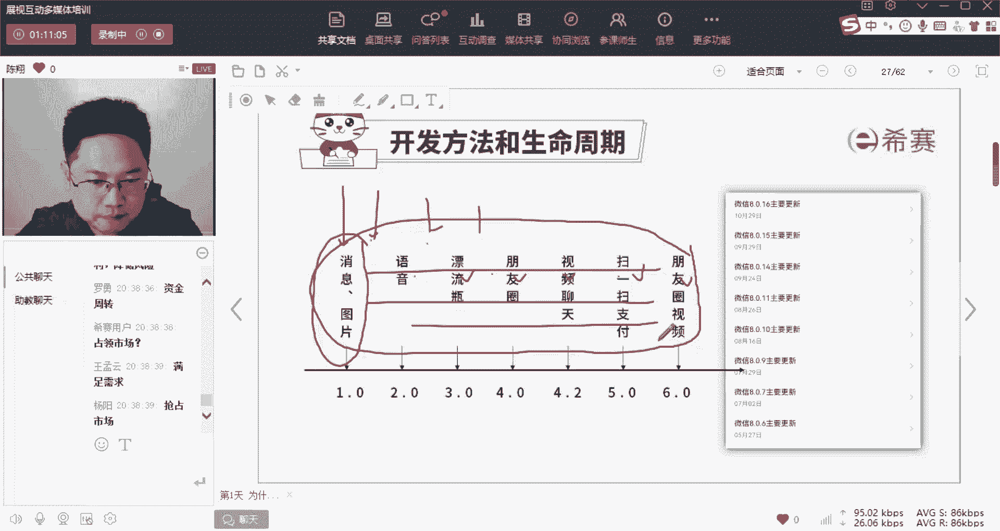

大家说的都对，是不是尽早的进入市场，尽早的抢占市场份额，尽早的建立用户，尽早地收回成本对吧。

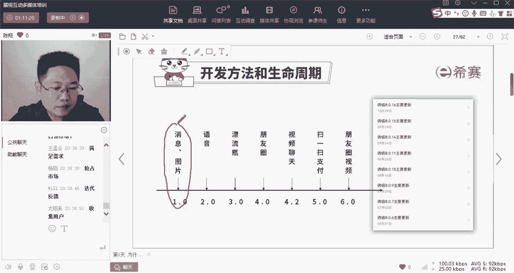

总之就一个字，你得快对吧。

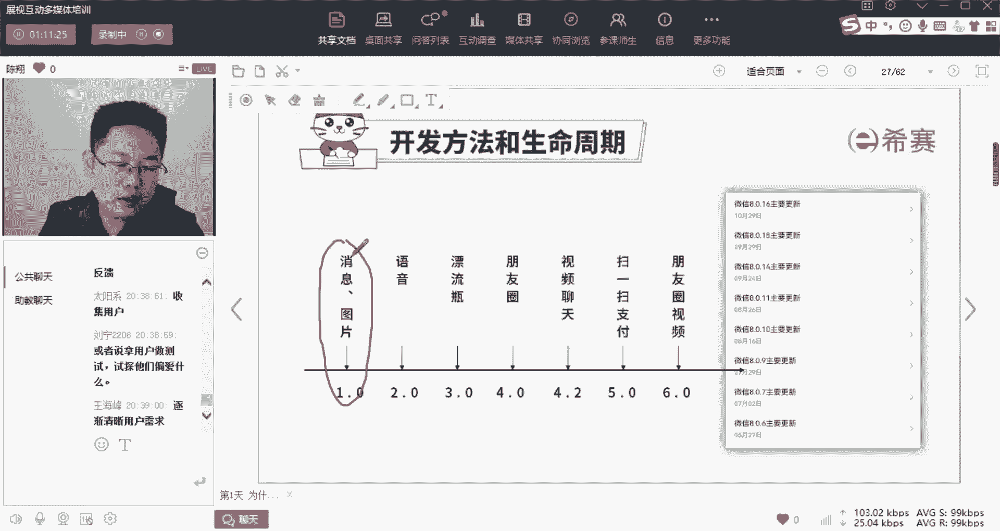

你得快，所以如果还是我们原来预测性，把所有东西都做齐了，再一次性发出来啊，别人早就把这个市场抢完了对吧，那么我们把它切成很碎的小块儿，第一次做了点什么，赶紧发，比如说去年我记得很清楚。

应该是2月12月25号的样子，百度大家最近有没有在关注这个元宇宙是吧。

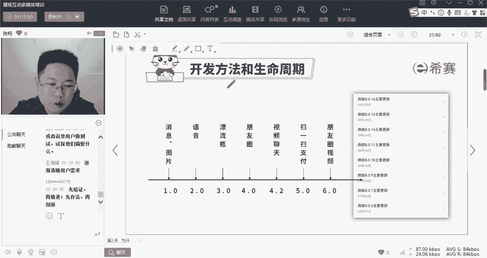

百度在去年12月15号，推出了他的一个第一个啊元宇宙app是吧。

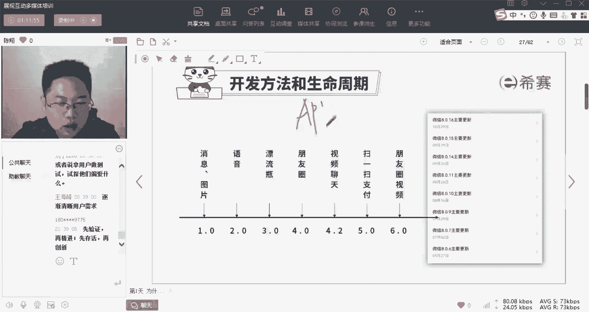

元宇宙app刚出来的时候。

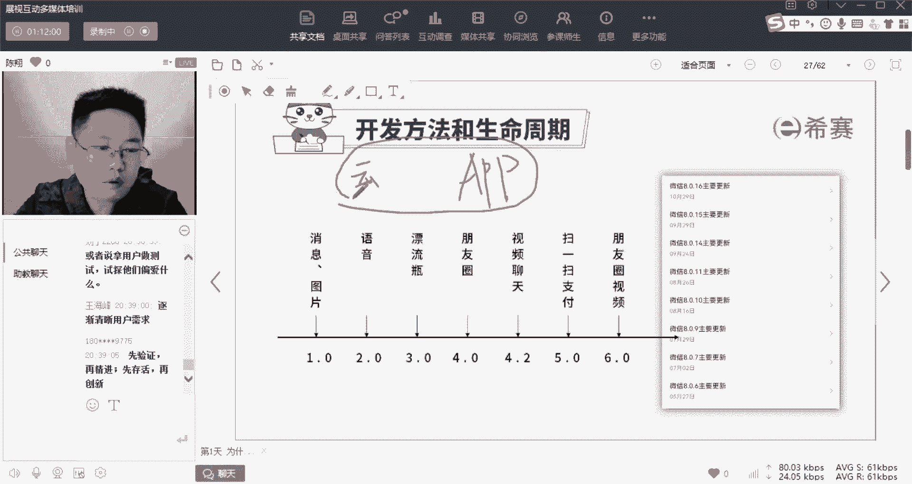

很多人就赶紧去看了，然后一片骂声，这个app里面什么都没有啊，就只能登录进去，体验一下元宇宙是个什么样子啊，完全没有什么好的体验感和功能，一片骂声，那么大家我问一下大家，百度他是赢了还是输了。

在这种情况下，百度是赢了还是输了，推出了一个很简陋的啥都没有的app，元宇宙app，对吧，只有他对吧，除了他被骂以外，还有其他的他的哪些竞品，腾讯阿里他们被骂了吗，都没有骂他，他就赢了。

因为它推出来就有有了，大家就体验，就把它跟第一个元宇宙建立起来了，观感对吧，没关系，你第一版粗糙的先出来，先抢占了市场，然后在一个版本一个版本去迭代，只要你的每个版本优先于别人一步。

你就永远抢占了领先的位置对吧。

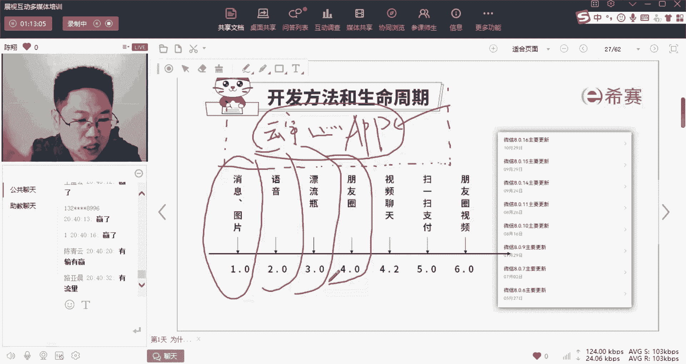

这就是我们迭代这个增量的核心思想，现在做软件的几乎都在用这个思想在玩事情，对吧，对微信，至于米聊，你说米聊比微信好在哪吗，其实不然，那么米聊大家知道他是谁吗，他绝99%的人都不知道为什么。

因为他就慢了微信一步对吧，他们就骂着微信一步，然后就没人知道他是谁了，所以增量型生命周期就是这么来的啊，优先找到MVP，就是最核心的那一小丁点而已，没有他就运行不了的那些功能，先给他做出来。

然后再一个版本一个版本的去增量对吧，这就是增量型生命周期与预测性的优势之所在。

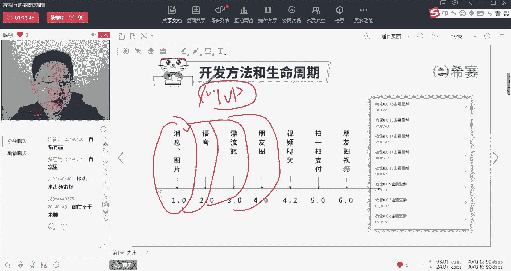

好这是一个第二个呢，是不是，那么每一个版本啊，他在发布之前也经历过多次迭代的内部测试啊，试用客户测试，然后小规模测试是不是都已经听，听过很多人的意见了，改过很多版了，然后再发出来。

这是不是就是迭代的一个，所以呢，现在做软件，大部分都是这个增量型和这个迭代型融合的，在这儿啊，大家不要把增量和迭代当成两个事来看了，他们俩完全可以融合在一块儿的对吧。

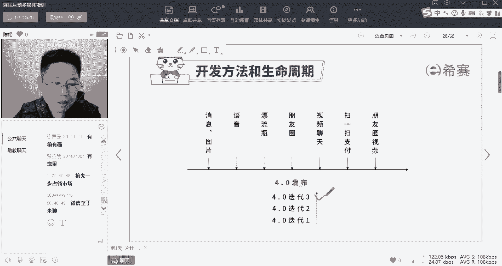

那么它们融合在一块，就是我们所说的敏捷性啊，好讲到这儿呢，应该这几个生命周期类型的特点和用法，也差不多了啊，那么如果还不懂，课后呢，我们在群里你在讨论啊，那么我先来讲一下这个地方怎么考，说这么多呢。

其实考法很简单，它就是给你用二维构建了四个象限，哪个二维呢，一个就是交付的频率啊，就是交付的次数，一个呢就是变更的程度，或者叫做需求的清晰度，如果需求一开始就是非常明确的，也说得清楚，也不会变啊。

那么就是叫做变更程度低，就叫做交互频率少，那么这种呢最典型的就是我们做建筑工程，一开始就知道你是什么啊，以及不会变，如果一开始就知道我要什么啊，那么但是呢我分多次交付这个呢啊交付频率高，这叫增量型。

而如果是搞好多次了之后，最后一次性通过验收，但是在这个过程中呢，你的这个变更这个需求已经变化了好多了啊，或者是不清楚，逐渐多次探明才清楚的，那么叫做迭代，如果两个都具备这个特性，那么叫做敏捷啊。

就是敏捷，这个呢实际上如果到了我们工作中，面临实际情况，他反而没那么好分辨，但是考试呢他也不至于这么来为难你啊，一般有几个关键词能够帮助我们判断，它在两个维度上分别是什么啊，听清楚了。

如果提到了几个词叫做多轮交付，多次交付分多阶段来做是吧，但凡这几个东西你一定识别到了，交互频率高，第二个是什么呢，要快速进入市场，要快速的资金回笼，抢占市场，那么这些通通都是啊这个款。

那么如果有另外一类词叫做什么呢，叫做需求并不清楚啊，并不清晰，或者呢因为环境变化，我们需求也会快速变化，那么这样两类词，那么往这个方向引啊，那么如果这两类词周都找到了，那么你就定义到敏捷。

这啊就到定量敏捷。

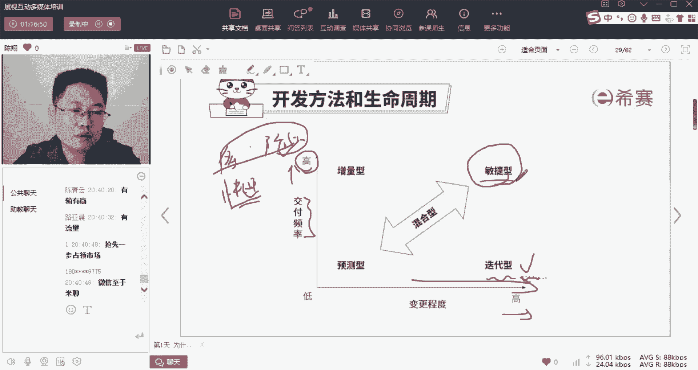