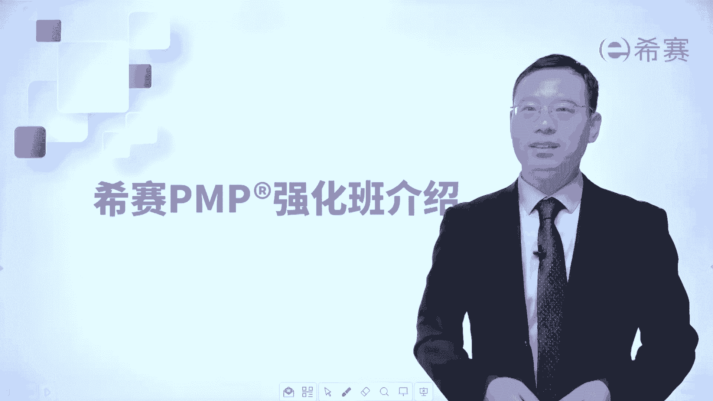
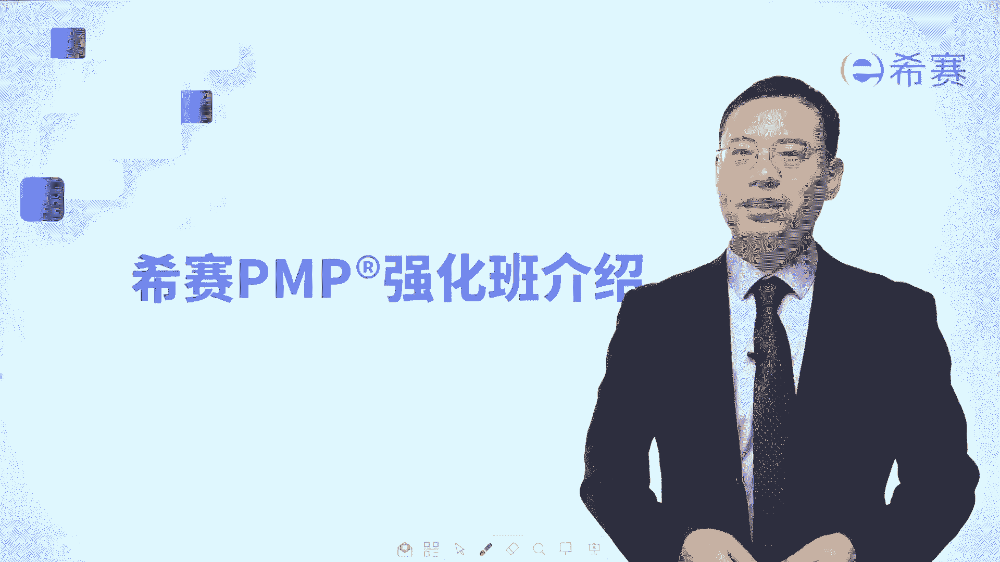

# （24年pmp考试）pmp认证初学者报考指南名师指导+pmp项目管理备考资料分享 - P12：（希赛）PMP强化班介绍 - 冬x溪 - BV15X4y1v7Yg

大家好，接下来由我来花一点点时间跟大家介绍一下，我们西夏的强化班呃。

那西塞偏僻的强化班呢，其实是每一个月都会开一个班级，我们这个班级能够给你提供什么，那我们能够给你提供880视频教程，能够给你提供这些导学课的视频，然后能够提供若干学识的这个在线直播课程。

以及还有若干晚期课程，也说别的老师讲的课程，往期课程的这样一个录播回放，并且呢我们还有模拟题讲解的视频，以及章节练习题的这样一个班级讲解的视频，好若干试题的视频，这是我们会提供的这些个课程视频。

然后还有一些配套服务是什么呢，首先第一个是我们会为你做做一个学习计划，然后会专门有学员群，有老师在里面去专门给大家去回答问题，然后我们还有一个专门的平台，你可以在平台下面提问那些问题，就一定不会丢掉。

老师一定会在那个对应的时间之内去给你回复，平台上的所有的问题，还有就是我有一个智能学习系统，这个智能学习系统，能够给你提供一个智能学习报告，你可以看到你都学了多少东西，掌握多东西还欠缺了一些东西。

哪些可以重点去关注，重点去攻克好，同时呢我们助教老师也会有一些跟踪和题型，并且呢每一次上课你都能够收到短信提醒，那这样的话就避免去错过这一课程，以及我们在适当的时候，可能会给你分发一些资料来去。

专门针对去补某些专题，或者专门要去啊，在尤其在考前的时候，建议大家去看看什么东西，做一些什么东西，那么学习保证就是你能够获得60个p d u啊，这个pd就不用担心了。

第二个呢是我们公司本身就是一个偏卖授权的，这样一个机构，我们会给大家去颁发35学习的培训证明，让你可以顺利去参加p mp考试，以及在报名的时候，大家都知道报名其实是件很费劲的事情，那我们的班主任老师呢。

会给大家去完成这个英文报名，你只需要去填写对应的基本信息，他会能够帮你去完成这一部分，并且呢就是还会有一些优秀学员分享，其实我们的一些学长学姐，他们的这些分享都会给大家提供。

你们可以去看看他们是怎么学的啊，我们的这样一个在线智能题库也是做的非常棒，包括章节练习题呀，知识练习题呀，模拟题呀等这些内容，还有高频考题啊，值得一看，那关于纸质的资料部分呢。

我们会给大家提供三个纸质资料，首先会给你邮寄的是一个西夏的偏僻，内部的讲义，这个讲义是经过我们的，建一个教研团队来精炼出来的，对于考试会直接去相对应相应对的这个内容，会非常棒的一个内容。

第二呢是会给大家邮寄三套模拟试卷，你一定要做哦，还有就是会给大家提供一个知识点集锦，是一个浓缩的精华，那我们来简单总结一下，就是我们会有一个学习中心，你可以在app上面可以去学习。

可以在网站上面也可以去学习，也就是你可以用pc端学习，也可以用那个呃手机p来学习，都是完全可以做到的，会有这样一个视频课程，会有一些这个在线课程，然后呢会有这些海量题库，章节练习题，模拟试卷。

那我相信在你认真学习的这个动力下，有了这些内容，能够让你如虎添翼。