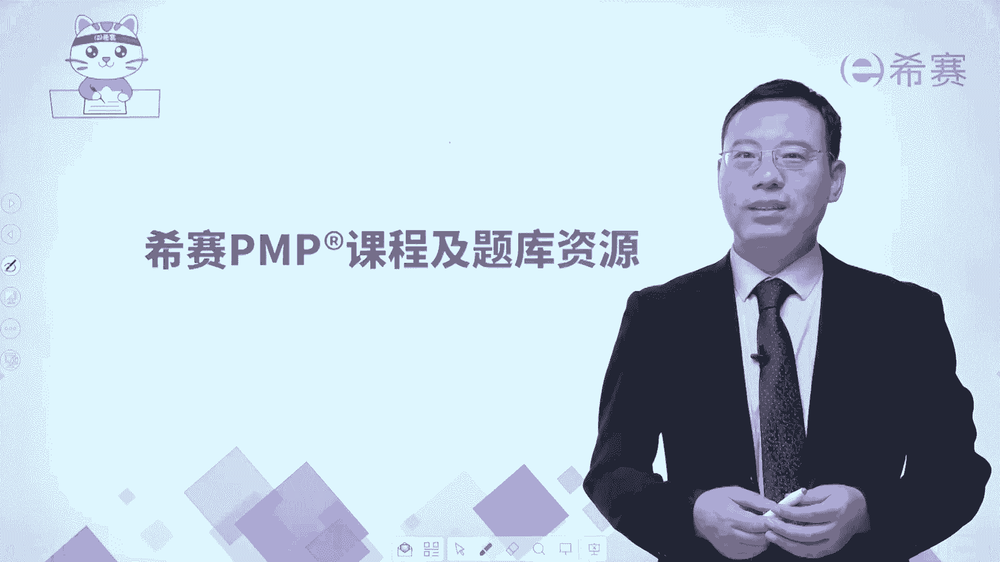
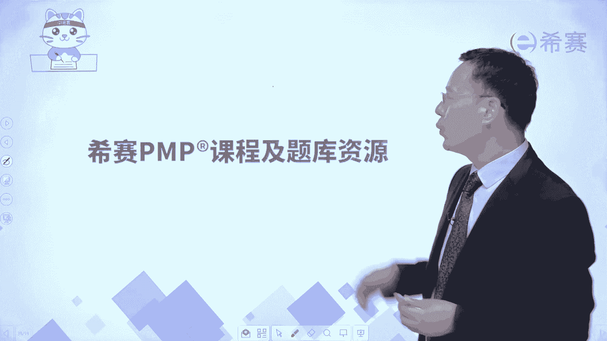

# （24年pmp考试）pmp认证初学者报考指南名师指导+pmp项目管理备考资料分享 - P9：（希赛）PMP课程及题库资源 - 冬x溪 - BV15X4y1v7Yg

大家好，我是西夏pp讲师罗福兴，接下来跟大家一起分享一下，关于西夏的课程以及题库的资源。

首先是关于课程，其实我们的课程呢会分到两大块，一块呢是老师现在正在录的这种方式，就是一个大屏幕录的课程，那这个大屏幕课程呢其实是一个非常精讲的课，程，里面全部都是干货，然后还有呢就是有直播课。

我们直播课会讲到关于50%的预测的部，分，50%敏捷部分，那我们的因为整个知识内容中，预测部分它其实更多，敏捷部分更少，这个50%和50它是指考试的占比啊，考试分数占比，但是本身知识点内容而言的话。

预测形成的内容可能会有200多个知识点，然后敏捷的知识内容可能只有100多个知识点，那么对应的我们排课表的时候也是这样排的，就是对于这样一个预测型项目管理部分，我们的对应的时间会更多。

那敏捷项目管理部分呢时间相对会少一点，同时在题库中，因为以前一直考的是预测，所以我们在这个方面积累了很多，我们把一些旧的题目给去掉了以后，依然还有1000多道题目是有效的。

这样一个预测性项目管理部分的试题，那有几百道关于敏捷项目管理部分的试题，而整个这个课课程的话，你基本上是花3~4个月的这个业余时间，请注意是业余时间啊，你一般就可以顺利拿下，但整个在这个考试中呢。

它会有170道单项选择题，然后呢还有十道左右的这个定向多选题，那具体的这些个视频内容，其实我们都做了很多这样一个免费试听课程，但有兴趣联系我们旗下的任何工作人员，他都会跟你去分享一些这种免费试听课程。

包括在哔哩哔哩啊，知乎啊，抖音啊等这样一个平台上面，其实都放了很多试听课程。