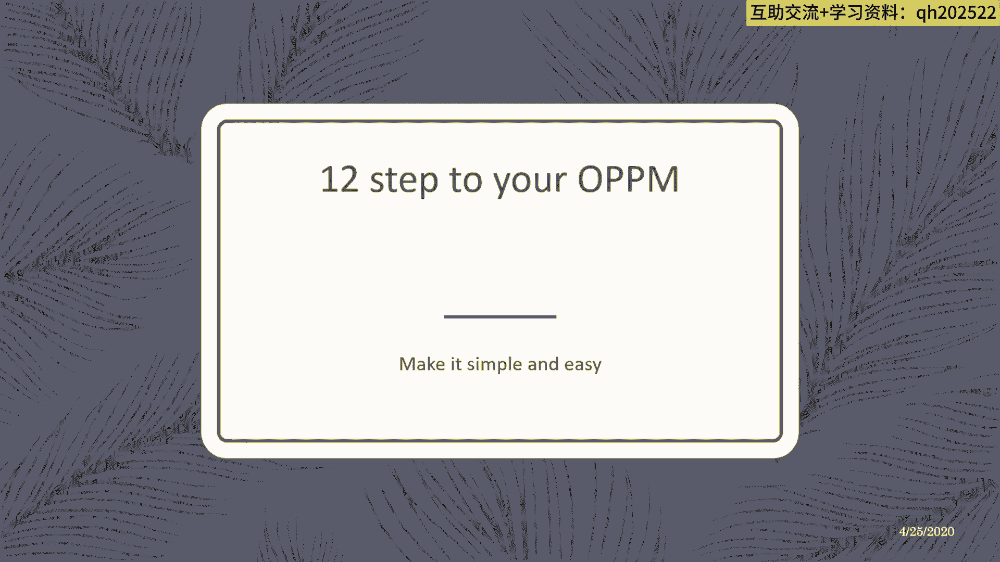
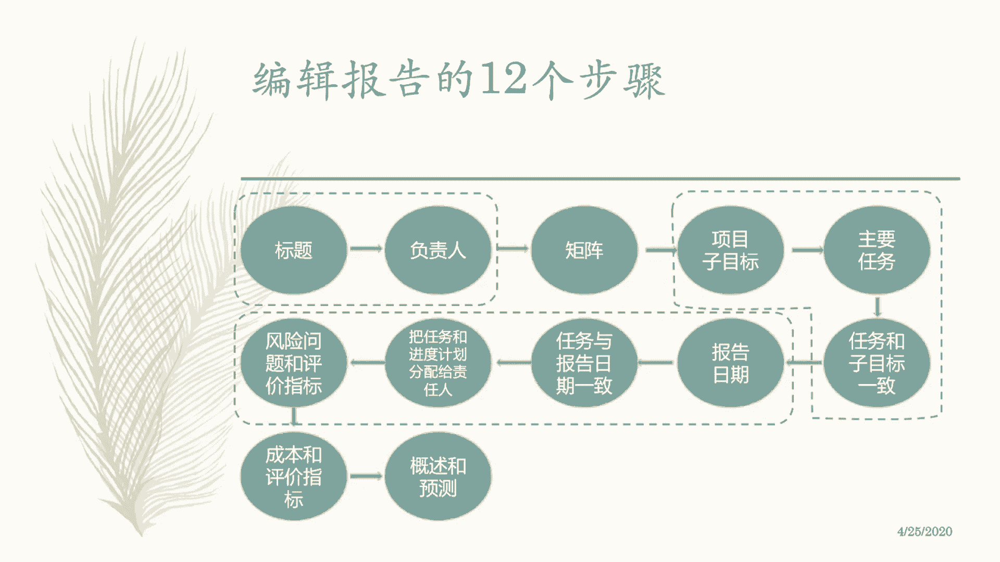

# 【OPPM报告】一页纸搞定项目管理你还不知道？只需12步，收藏起来好好学！ - P2：2、一页纸报告编辑的12个步骤 - 清晖Drina - BV1LS411A7fX

好，那我们再详细讲一下，12个步骤来完成你的这个业子项目管理，这个模板对吧。

够简单了吧，哪12个步骤呢，填表嘛对吧，第一开始呢肯定把标题负责人填清楚对吧，把上面表头部分填清楚，然后呢填完了标题之后呢，就要填负责人，负责人呢具体叫什么，在这个项目里面的一些骨干成员。

为什么当我们还没有把任务任务给找齐的，找齐的情况下，就先要把这个负责人找找，就是把骨干成员或者骨干的负责人找到呢，很正常，因为这些人呢是你的骨干成员，是你能够解决，是你能够把这个项目做完。

给你提供关键资源的人，accountable对吧，这些人要找到要对应起来，第三个呢是属于叫什么这个矩阵，那第三个呢是所谓叫什么东西啊，这个是叫什么东西啊，这个叫啥矩阵的啊，这个矩阵呢，就是你要去围绕着。

刚才我们那个什么那个小矩阵，按照这个叫什么东西啊，这个顺时针的方式先做目标目标分解，任务分解对吧，任务的一个叫什么，这个这个风险的一个评估对吧，问题的一个什么这个这个定义，然后完了再做时间进度的安排。

再做什么沟通频次的设计，再就是落实这样嘛，这个这个这个这个责任人的，这个每个任务的负责，这个肩膀这个责任关系，最后呢再去画这个这样嘛，这个任务成本以及呢做下一次工作，这个一个预测对吧，通过顺时针的方式。

把这个整个表格给什么转起来啊，顺填对吧，顺时针的方式填，顺着填下来好，那么呢此目标主要任务对吧，刚才说过了顺田，然后呢任务和目标要保持一致对吧，这个时候呢是我们切开的一个点。

这个虚框呢这个里面有三个虚框，每个虚框呢就是一个切割的一个组合，目标和责任人，就是我们要完成这个要达成这个目标，其实跟哪些关键干系人相关，你得把这些责任找到对吧，你不能找错人对吧。

这样的话你整个的项目沟通也失去效果了，资源也没有保障对吧，而且没有人能够去支持你，项目经理，这个项目一开始就可注定失败，所以一定要把谁会受到这个目标的影响，哪些人是关键干，全给找到对吧。

不管你是哪个事情啊，出去玩啊，叫什么东西啊对吧，比如安排一次出行，做一个什么一家三口或者一，一家五口的这个想法，或者这个七口的这样的这样全家旅行，那哪些是关键干系人呢对吧，那谁需要去干涉时。

我们要去哪些景点，走哪个路线对吧，路上要干嘛干嘛，谁对这个最操心，或者他受到这些事情的影响，他他有这个这么要要要拿主意的人，他就是负责人对吧，你要把这些人evolve进来，第二个切割的部分呢。

是我们的目标和任务分解的关系，说还是那句话，目标和任务的分解呢是一个那叫啥分解啊，就是关键分解啊，不是饱和分解啊，关键分解就行了，把问题说清楚就行了对吧，做底这事情差不多，这个事情就可到位就行了。

再往下面呢是属于叫什么，这个就沟通的了，就是报告日期的安排对吧，就这么多责任，分别分分别负责哪几个事情，以及呢风险问题的这些指标，这都是属于像偏详细计划性安排一些内容对吧，这个框架就出来了。

最后呢就预测啊。