# 【OPPM报告】一页纸搞定项目管理你还不知道？只需12步，收藏起来好好学！ - P5：5、顶尖的项目经理擅长什么 - 清晖Drina - BV1LS411A7fX

顶尖的项目经理呢他比较善于去管理这个沟通。

或者换句话的话，他更善于去管理沟通背后所蕴含的。

一些人际的一些方式对吧，比如说他一些方法。

第一个呢他尽早的和该行建立一种沟通对吧，尽早的去让肝闲人知道。

想让干型知道信息和得到干型的反馈对吧，通过这样的方式尽可能扩大这个open区域。

公开区域对吧，同时的话呢，他发现他呢呃有有经验的项目经理呢。

他发现哎建立这种这个叫什么。

这个某种特定的频次的，稳定的这样一种沟通节奏呢，对他工作很有帮助。

非常非常有帮助对吧，这种这个这个特定的某种沟通频次或者节奏。

对他很有帮助啊，很有帮助，那么为什么这么说呢，就是说举几个例子啊。

我们在这个讲义上看到一个什么电梯的。

那个叫什么这个按钮对吧，这是大家比较生活中比较常见的例子，你按了这个按钮之后呢。

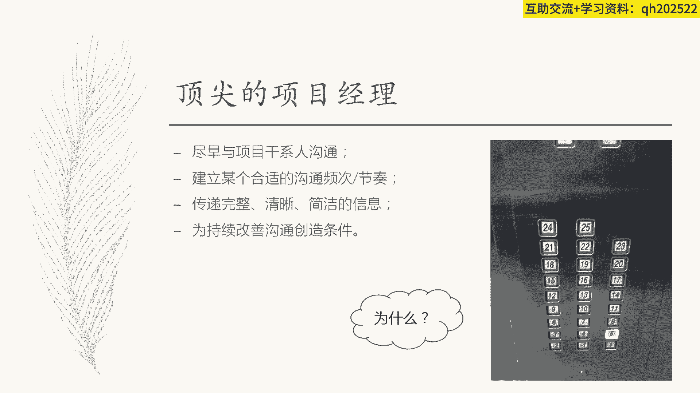

就是要到达楼层就显示出来，对不对，然后呢在这个面板的上面啊。

在这个面板上面呢，应该还有一块小的一块液晶屏对吧，显示当前这个电梯经过的楼层是什么。

对不对，这意思吧，比如说你现在按住五楼。

你从二十二十四楼，你要到五楼去，然后进电梯时候，你按了个五。

这个时候的电梯关门开始运行，然后呢232十221对吧。

然后或者是三个三个一跳，或者五个五个一跳对吧，这样运作好。

这是我们电梯的设计啊，好那这个时候我们做一个假设情景分析啊。

同学们注意啊，我们做个假设情景分析，假设在这样的场景里面呢。

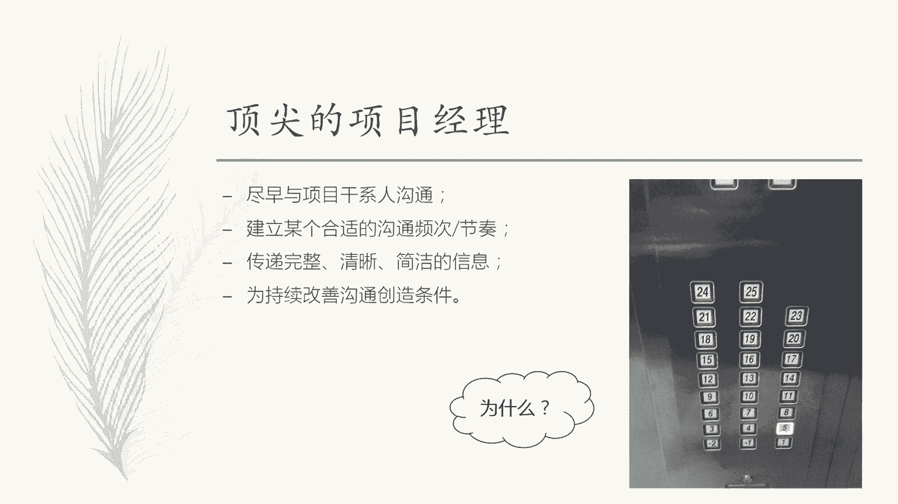

我们取消掉一个要素，就是把那个叫什么这个电梯的。

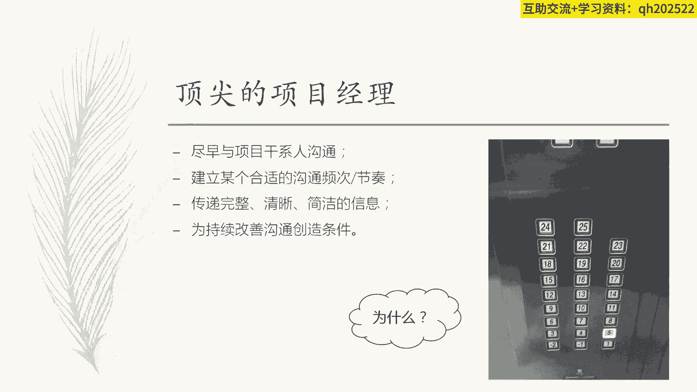

叫什么，这个运行的过程当中，他那个面板把它变化的数字啊给删掉。

没有这个面板了，你只有这些按键，你按了这个按键之后呢，电梯就呜呜关门对吧。

然后哈哈开始运动运走对吧，这样开始去往下去走好。

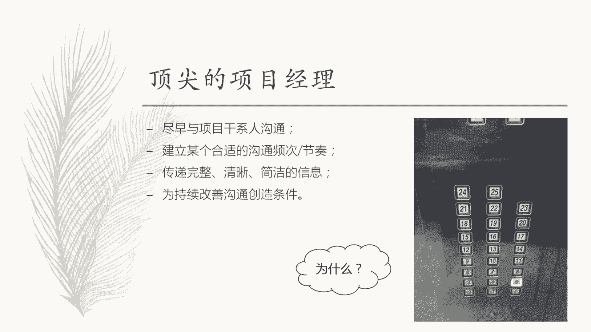

各位同学们啊，请你做一个假设情景分析，你设身处地的想一下。

如果你是这个电梯当中人的话，你会有一种什么感觉来各位同学们。

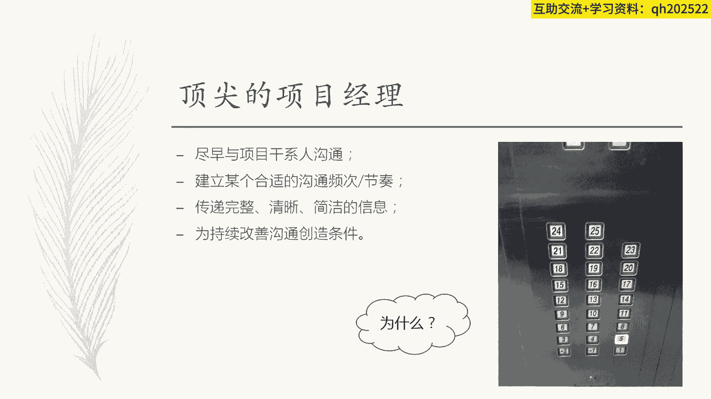

如果是在这样一个电梯里面的话，你会你会有一种什么感觉啊，能给我一些反馈好吗。

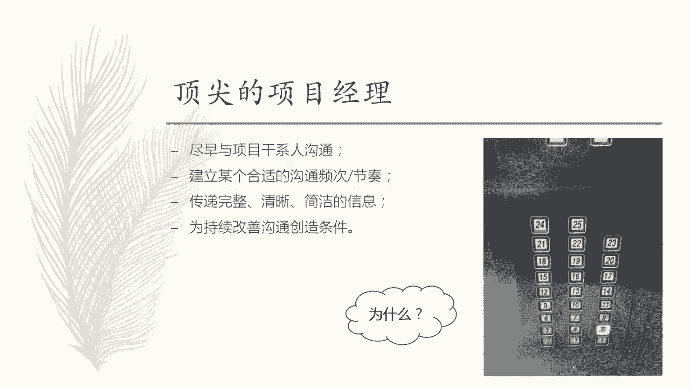

假设那电梯没有异形屏了。

你看不到楼层的变化，你只能按照那个电梯那个叫啥。

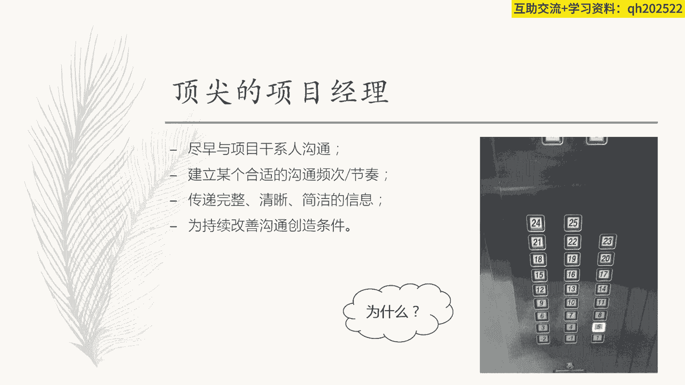

要到了楼层这个灯亮了，然后电梯关门了，这时电梯开始往下走。

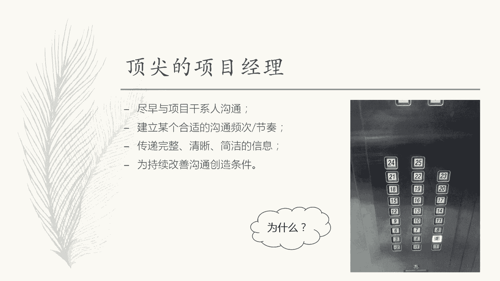

说白了很简单，就是最直观的就是说你前面十秒钟嘛，觉得还OK没问题。

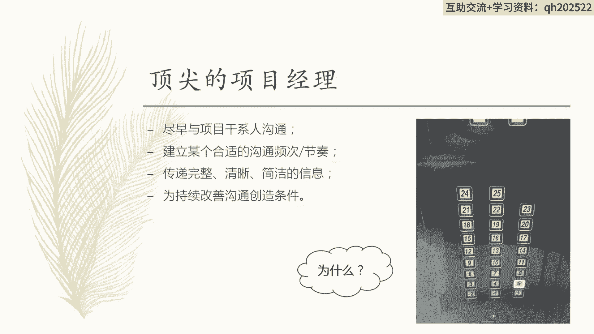

但是呢十秒钟以后呢，这个时候你开始出现了不确定性。

对你现在第一个不知道楼层在哪里，那么我觉得不知道楼层在哪里的话呢。

很重要的就是，其实你并不知道当前安全不安全对吧，也就是说你会有紧张感和困惑。

如果这电梯还是一直在运动，其实你这个时候不确定，这个当前这个电梯到底是正常运行状态。

还是不正常，对啊，就这个意思啊，就这个意思OK好。

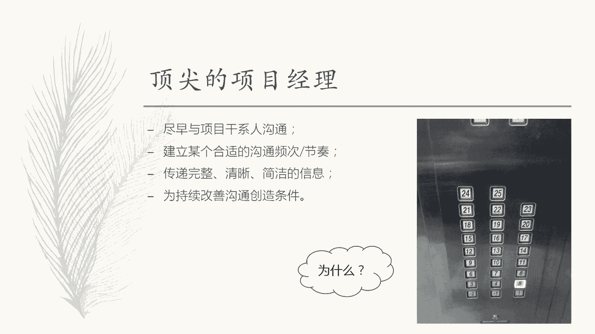

所以呢我们这个时候呢，会在电梯里面增加一个叫什么，这个液晶的显示屏。

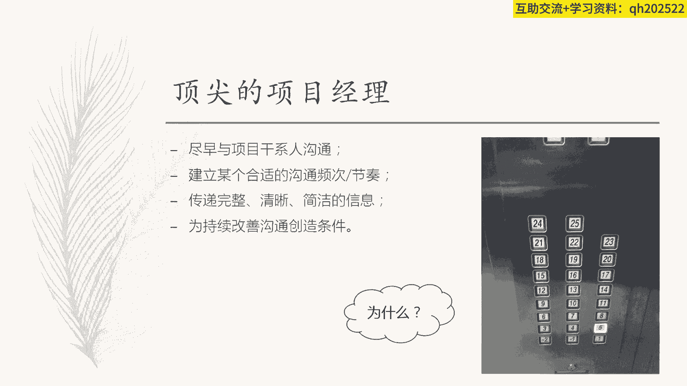

这个液晶显示屏显示楼层变化的这个这个状态。

他的目的，他的目的啊，就是要去管理干性的期望。

大家明白了吗，这个液晶显示屏它数字的变化。

它的最大的目的就是在管理干涉你的期望，就这个意思哎。

来分散大家的什么这个这个焦虑感对吧。

这个时候呢你会看到那个楼梯，电梯的楼层的变化，代表是说现在楼梯运行是正常的。

你是安全的，他在管理你的期望，就这个意思。

那无独有偶啊，无独有偶啊，这个叫什么，还有一个例子啊。

这是经常说的，大家印象中的话，那个叫什么，肯德基麦当劳。

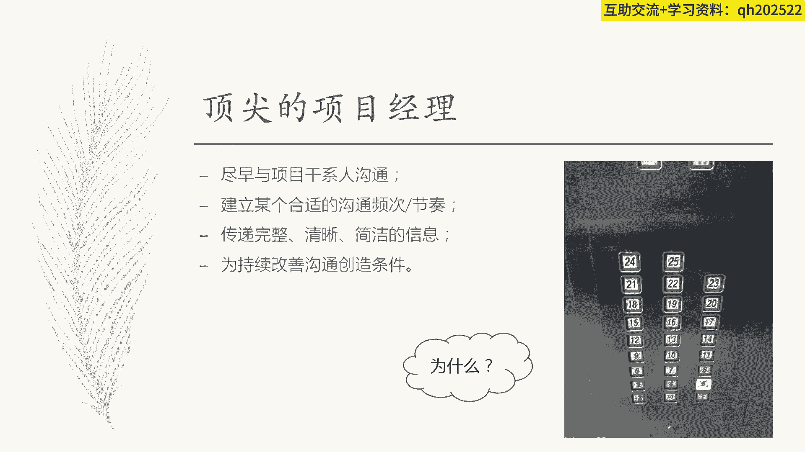

当你以前去肯德基麦当劳买这个快餐的时候，人很多的情况下，这个排队是怎么排队的呀。

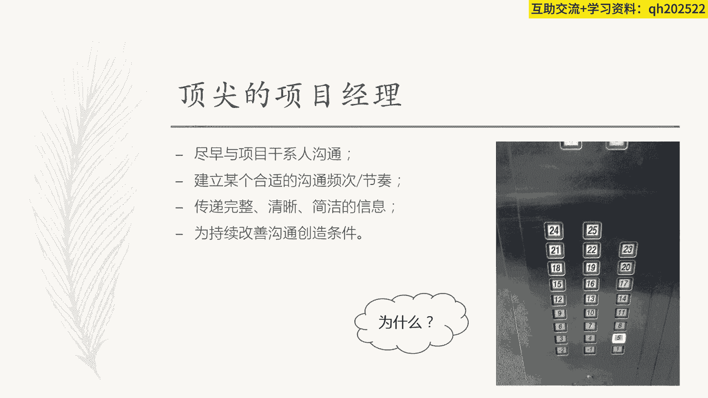

就排队是怎么排的，大家有印象吗。

就肯德基麦当劳，他那个排队是怎么排的，有印象吗，顺着排对吧。

就传统排队的方式，对不对好，那如果说你去我们又做过假设信息分析。

如果说你这时候站在队伍的最末端，你在那排队对吧。

15秒钟之后就说你会干个什么事情对吧，这个时候可能你在玩手机。

但是你玩了15秒钟之后呢，这个时候你会干什么，去头抬起来往前看一看对吧。

30秒钟之后你会干什么事情呢，你会看一下这个队伍前面有没有变化对吧。

一分钟之后你会干什么事情呢，你会觉得这个队伍为什么好像一直没有变呢。

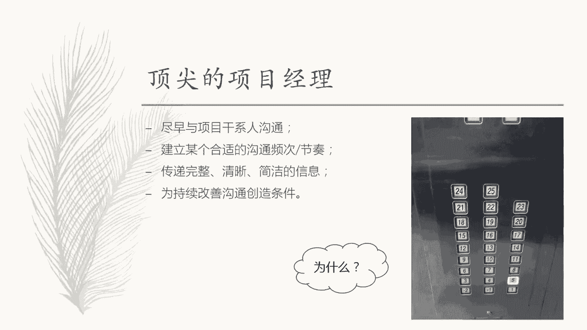

对吧，没有变啊，其实我只是过去了一分钟，但是呢这一分钟对你而言的话。

你感觉像过了10分钟一样的，是这意思吧。

所以呢另外一个企业呢就是他的连锁店呢。

他怎么操作的呢，星巴克对吧，星巴克星巴克排队怎么排的。

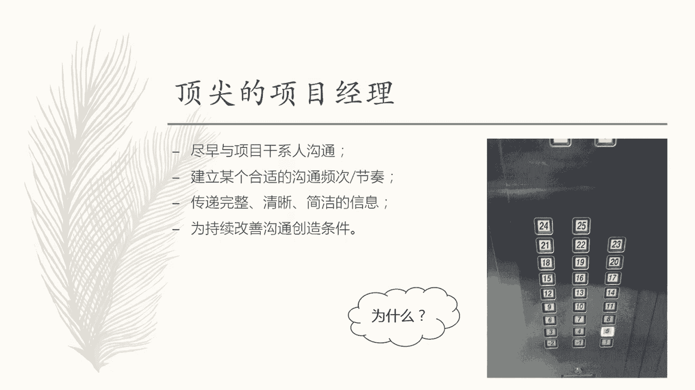

你会你会留意一下，你会发现有个特点，星巴克的排队他是用一个叫什么。

这个叫什么一个栏杆的方式做一条线对吧，或者跟你说要要怎么这么排。

它是沿着柜台排的，星巴克他是沿着柜台拍的。

哎为什么他要沿着柜台拍的，大家想想看。

就他排的队伍，他不是那种跟柜台垂直的队伍。

他是跟柜台平行的，贴着柜台排的那种队伍啊，你这边收银完了之后呢。

下面就是就是什么，就等你的单就行了对吧，就这样一个个排。

大家想想看，为什么星巴克用这样的方式去排队，对就对。

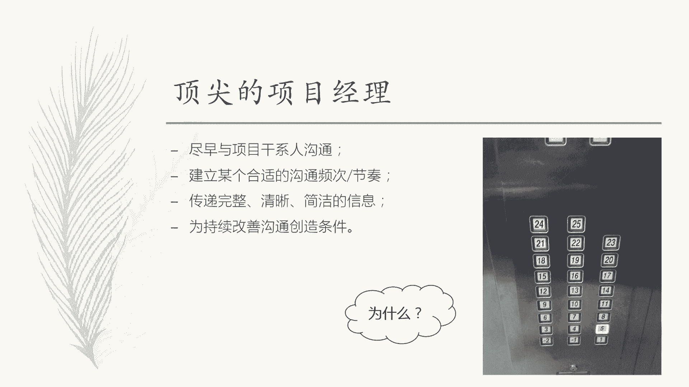

你说的对吗，横排不是送排吗，是的为什么来同学们脑筋动起来。

为什么想想看，你说没关系。

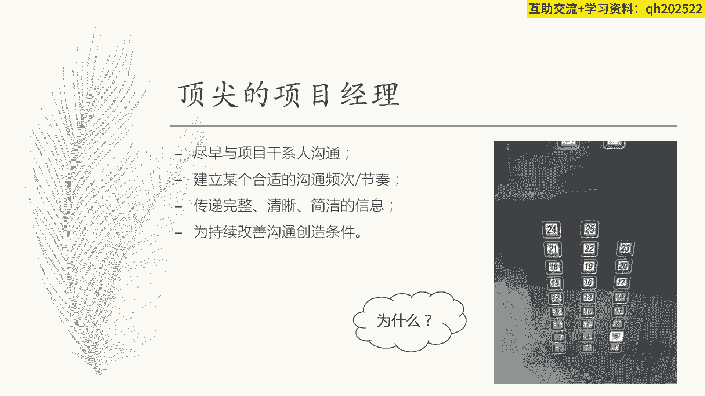

咱们讨论嘛，让你排队时候看吃的，这是一个point啊。

就是看柜台里面吃的，看有没有会进一步的刺激你的消费，对吧嗯这是一个点啊。

就在你收音之前有个叫什么让你排队，按照那个加什么东西啊，按照排到那个叫什么这个高点。

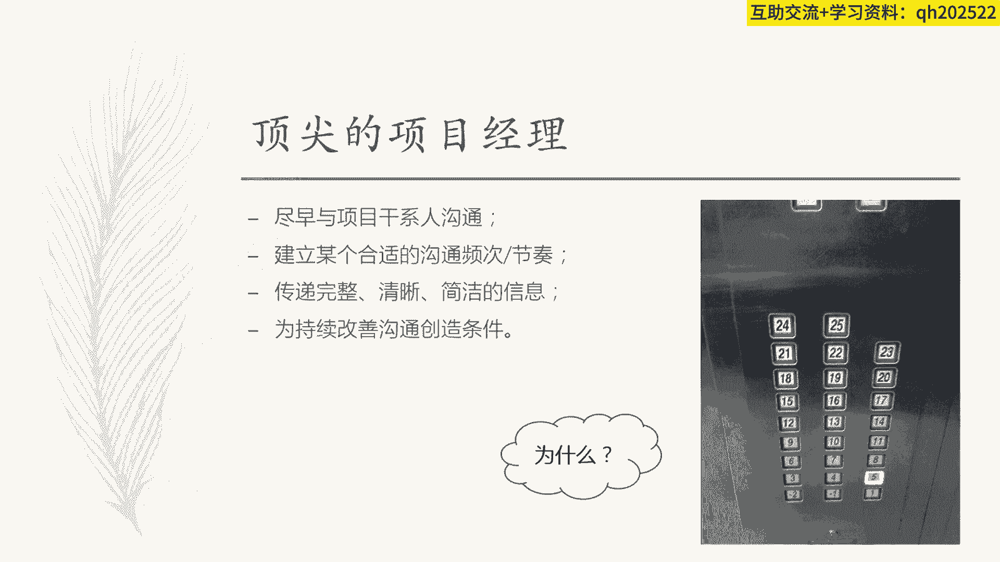

高点那个透明的柜台里面去对吧嗯哎对啊。

直观的看到进度，哈哈哈嗯有同学说很快感觉很快就到我了是吧。

最重要的一点就是说这个时候呢，首先第一点呢，如果说一个人呢不知道柜台的状况的时候。

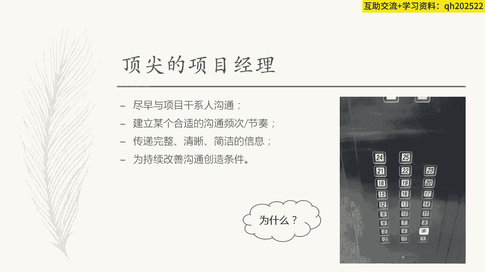

就好比说他在一个没有这个液晶屏的，这个电梯里面了。

他会产生焦虑感，那么星巴克排队的方式呢，就是让你沿着柜台排。

这时候呢你你的注意力呢可能会被这个叫什么，柜台后面忙碌的这几个店员来来回回去操作。

很麻利的，手脚会被他们这个叫什么这个这个动作所分散。

当你看到他们的动作的时候呢，你会意识到一个问题，当前这个叫吗。

这个这个运作呢是正常的，虽然它慢，但是呢他在有高效运作。

他是个正常情况下，没有任何一个电源在怠慢我。

或者没有任何一团就再没有在不顾及我的感受，就这个意思对吧。

那么通过这样的方式呢，一定程度上的管理的干性的期望。

所以呢顶尖的项目经理呢，他意识到平稳的有平次的沟通呢。

非常的有助于管理干线的期望。

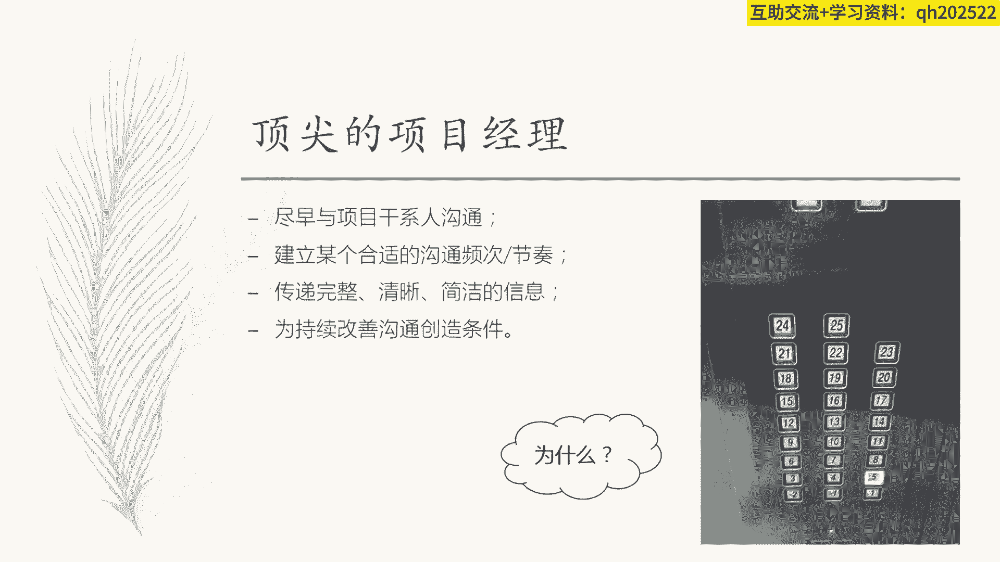

能够消除干弦的叫什么紧张感，和这个这样的压力对吧。

如果说你不定期的跟干系人沟通，甚至你不做计划去沟通的话呢。

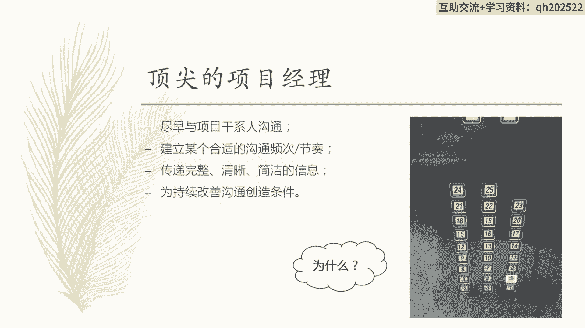

干系人他的期望可能不受你控制了，对吧，他可能会产生新的期望。

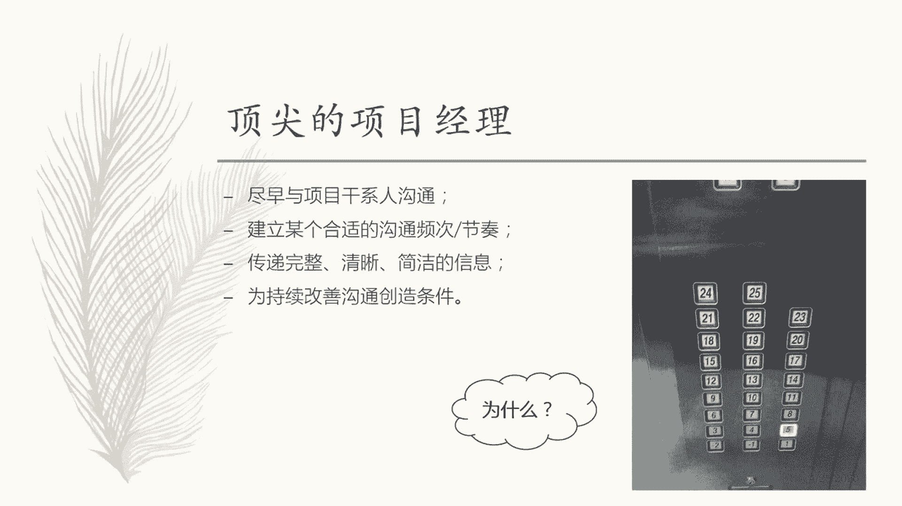

新的情况呢又会产生新的需求，新的需求呢你会倒过来，可能会像加里施加压力。

这个时候大家的关系将会恶化，所以呢建立这种合理的平沟通的瓶子结构。

是非常非常重要的，第三个就是所谓叫什么。

这个在沟通的过程当中，我们传递信息的时候呢，完整清晰简洁。

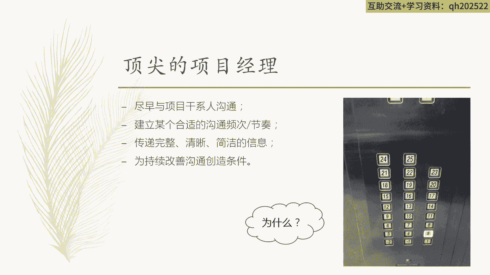

就不要有什么废话对吧，你想说啥。

就是每次就说一件事，每件事就说一个点，把你的目的明确下来。

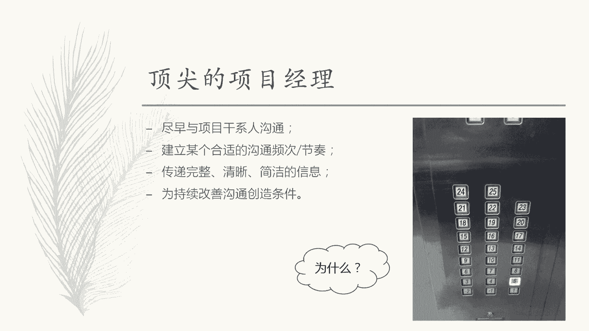

很简单，说清楚就行了对吧，因为别人在理解你的这个信息的时候呢。

他会不自觉的去还原你的这个背景，和他和他所理解的和他所理解的背景对吧。

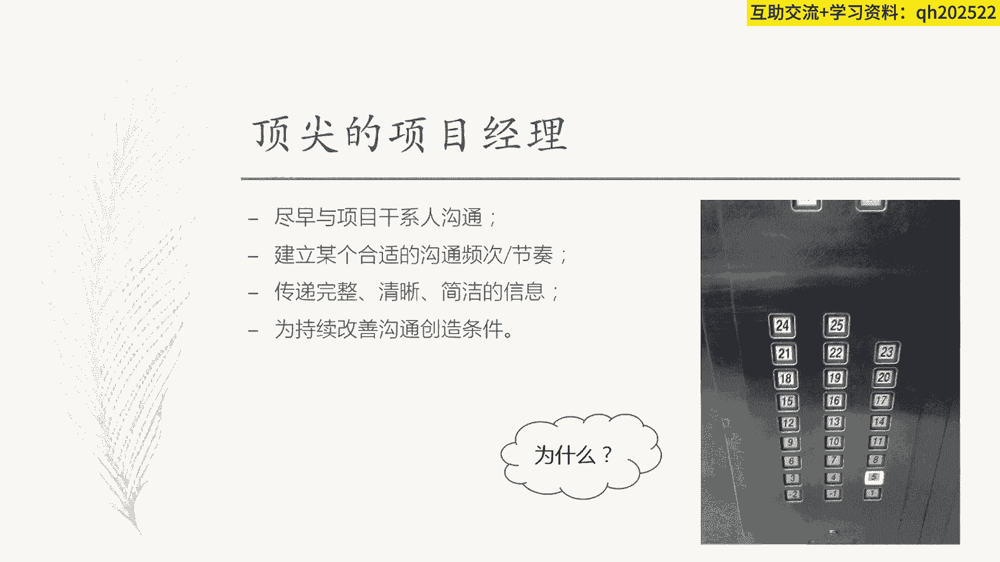

这说呢要把你的信息放在一个，如果说放在一个手件，我们都是公开的区域里面去的话对吧。

他需要去加工，需要去理解这个信息的含义是什么，如果说公开区域很小的话呢。

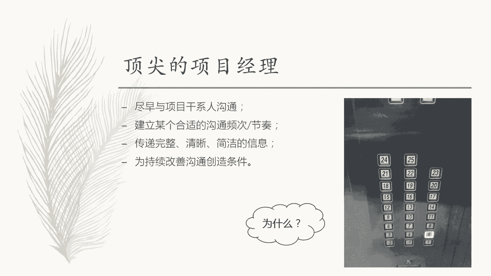

你提中性的话，它就需要去揣测了，他就需要去拼接。

如果在一个公开区域，很大的一个环境当中的话呢，这个拼接的工作做的很少，那么呢它只需要简单去理解就行了。

所以呢我们传递单个信息的时候呢，一定要尽可能的完整清晰简洁。

这样的话呢，可以提高我们的沟通的这个想法效率。

然后呢，这个第四个呢，就是我们常说的这个有些人的项目经理呢。

他会持续的关注这个沟通的效果，而非只关注沟通这个事情本身。

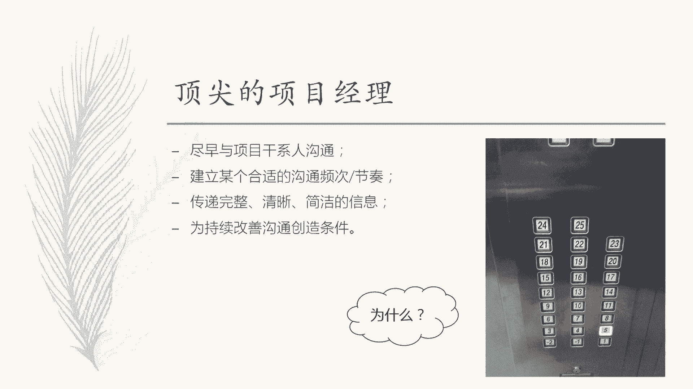

只关注什么时候沟通，用什么样的模仿报告对吧，谁来写对吧。

由谁来说，你就关心这个事情的话，说明你其实并不想沟通，你并没想汇报对吧。

你你仅仅想就说，我赶紧把这个项目的工作往后推对吧。

那这样会你会碰到另外一个结果，可能你付出了这个什么苦劳。

但是呢有可能你将来不一定会有功劳对吧，因为你没有跟关系互动嘛。

