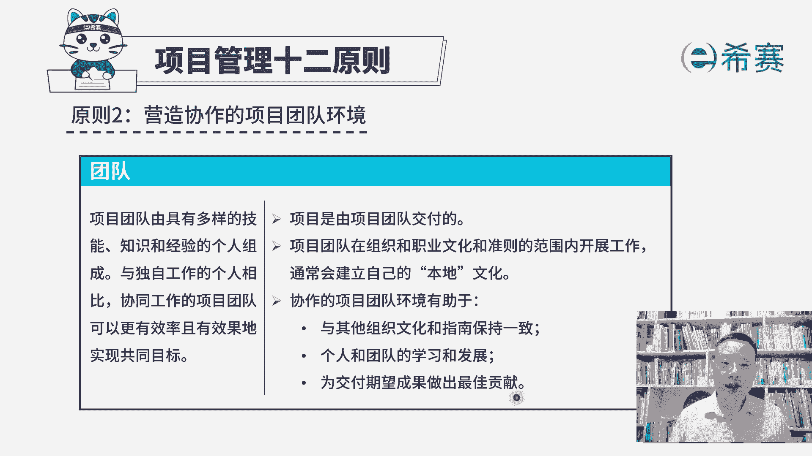
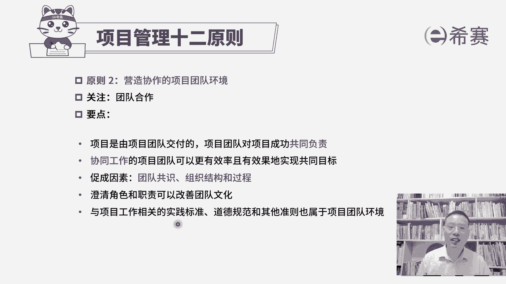

# 【PMBOK第七版】PMP认证考试全套精讲课程，免费学习（配套文档资料） - P47：PMP第七版项目管理原则之02团队 - PMP-B站课堂 - BV1fHW2emEdD

接下来我们一起分享的是，项目管理12条原则的第二条，营造协作的项目团队环境，其实这个营造协作的团队环境，它更强调是关于团队，所以这一条原则它的焦点是团队，我们一起来看一下，项目。

团队是由具有多样性的技能，知识和经验的个人来组成，就像唐僧的这个团队，他既有会念经的人，他也有会打妖怪的孙悟空，他还会搞笑的猪八戒，还会有那种任劳任怨的这个沙和尚，所以我们在做项目的时候。

可能需要有一些牛逼的架构师，有一些做需求的人员，有一些做开发的人员，有一些做这样一个测试的人员，有做运维的人员，有做销售，做售后的人员等等，不同类型的人员与独自工作的个人相比。

协同工作的项目团队可能会更有效率，且更有效果的去实现共同目标，就是现在这个时代的话，很多事情他可能不是靠一个人去单打独斗，就可以顺利的完成，他还需要更多的这样一个合作和协作，如果说能够去有效的协作的话。

其实你就这样来去理解呃，我们需要去把建11111桶水，能够从山下抬到山上去，你一个人抬你其实是很难的，你两个人抬就容易很多对吧，那做项目的时候其实也有很多事情，并且很难说有一个人他既会需求，又会搞架构。

还能够做开发，又能做测试，还可以去做运营，即使不太现实，即便是一个六边形战士，他也是在某一些方面会更加的擅长，关于营造协作的项目，团队环境呢啊具体展开有这样一些内容，我们看一下。

首先第一个项目是由项目团队来交付的，其实也就是团队，他指的是一群人，当我们这群人有共同目标，并且能够凝聚在一起来围着目标去努力的时候，他就形成了团队，而我们做的这些努力就是能够去让项目达成好，第二句。

项目团队，他在组织和职业的文化和准则，的范围内展开工作，什么奖呢，就是我们一定是有一套基本的标准和要求，来框住大家的这样一个行为，就是比方说我们有企业文化，我们有这样一些国家文化啊，有这些。

比方说湖南地区有湖湘文化，那广东地区有岭南文化啊，那个河南地区有中原文化，那东北地区有东北文化对吧，哎我们有这些社会文化，同时每一个企业呢它有自己的企业文化，并且还有员工操作手册。

这样一些基本准则需要去遵守，还有就是每一个项目，它有它自身的这样一些特质和特点，所以我们团队在行为处事的时候，并不是可以信马由缰的去做事情，而是一定是遵守一些基本的文化和准则的前，提下来去开展工作。

当然有的时候他说会建立一些自己的本地文化，也就是说跟我们这个地方有特定习俗，或者说是这种，就跟我们这个小团队有特定关系的一种，新的一种方式，比方说我们在每周五的下午四点钟的时候呢。

来开一个内部的分享大会诶，这就是形容我们本项目的这个本地性的文化，整个关于协作的项目团队环境，他说有什么帮助呢，哎给了这样三条，其实后面还会更多的展开啊，首先第一个说是协作的团队环境。

它是有助于与其他的组织文化和指南保持一致，也就是说当我们大家是能够心往一处想，力往一处使，能够去遵循一些基本规则的时候，那么我们所做的事情跟公司的这些目标和方法，跟公司的战略是相一致相匹配。

第二条他说有助于个人和团队的学习和发展，就是我们大家一起的时候，能够处在一个一团和气，或者说是一个相对比较友好的氛围中，那么每一个人都能够从中感受到一种友，善和鼓励。

我们就能够更好的去发挥自己擅长的东西，来去产生结果，产生价值，并且如果说是一个比较友善的环境中，我不会的东西，你也愿意去给我一些指导指点，那你不会的地方，我也会给你一些帮助贡献。

这样的话呢我们就整个每一个人都可以往前进，我们前面其实是学过有关于团队的管理，或者说叫资源管理，我们整个团队或资源管理中，要打造一个牛逼的团队，从两个方面着手，一个方面就是每一个人技能变得更强。

所以就是通过学习和发展，让每一个人变得更强，还有一个呢，就是我们相互之间合作会变得更加的紧密，配合的更加的默契，这样的话呢我们也会变得更强，所以如果说能够构建这样一个协作的项目，团队环境。

那肯定是能够让每一个人变得更强，也能够让我们整个团队变得更强好，还有一条呢就是说协作的项目团队环境，它有助于为交付期望成果而做出最佳贡献，你想当我们的团队都已经变得更强了以后。

那做出这样一个好的结果不就是水到渠成吗。

那整个关于第二条营造鞋做的项目团队环境呢，它其实焦点是在团队上面，也是我们要关注团队合作，团队协作这条项目管理原则的要点，讲过的我不去重复，没有讲的，我再去展开一下啊。

这里说首先是项目由项目团队来去交付，来去完成，并且呢项目团队他对于项目的成功是共同负责，也就是说是责任共担，这个我们在后面讲到敏捷项目管理的时候，你会感受更深，我们说敏捷的团队是一个自组织团队。

他是一个被授权的，是自我组织，自我管理，大家主动去认领任务，并且呢大家是一荣俱荣，一损俱损，是共同担责啊，所以这就是能够解释这样一条项目团队，他对于项目的成功是共同负责好。

第二个协同工作的项目团队可以更有效率，并且有效果的去实现共同目标，因为大家一个协同的话，配合更加会默契，并且呢是一个友好的氛围，这样的话大家个人的成长也会更快，所以你做事情效率肯定会更高。

并且呢做的也会更好，更漂亮好，这里还有一条说是促成的因素，有这样几个，一个是团队共识，一个是组织结构，还有一个呢是过程，这个讲的是什么意思呢，它是指什么样的因素，能够去让我们团队变得更加的合作。

或者变得协作更好，首先第一个就是团队共识，作为团队共识，就是团队行为处事的一些规范和工作标准，当我们有一套共同的规范和标准去遵守的时候，也就是我们所谓的叫团队章程，我们之前有讲过说没有规矩不成方圆。

那这个利好团队共同行为处事的规矩，大家做事情的时候不去豫举，不去越界，这样的话呢这个事情其实会更容易去推进，所以他能够更好的去促进我们团队之后，一个呃协作的氛围，第二个组织结构。

它指的是说我们项目团队在协调，个人工作和项目工作之间，所采用的这样一个结构，它来去用于规范和管理团队成员的工作，也就是说我们有一个大的一个规矩，第三个是过程，而这个过程呢其实在这里更强调是说。

具体做事情的一些操作步骤，也就是我们去行为处事，他都会有一些既定的，这些好的方式能够沉淀下来，如果说一些好的方式沉淀下来的话，那我们这个团队去营造一个合作的氛围，就会变得更好一点，有了这个好的操作步骤。

团队可以更好的去理解项目的目标和工作要求，并且呢呃去跟踪这些任务的状态，能够去确保团队高效的去运转，去完成工作，还有下一条，澄清角色和职责，可以改善团队的文化，我们前面有讲过，说很多时候啊。

当大家这种信息不对称的时候，会容易产生矛盾，那这里澄清角色和职责，其实也就是说，如果角色和职责不清晰，不管说是你不清晰别人的角色和职责，还是说每一个人不清晰自己的角色和职责。

那么做事的时候都会更容易引发混乱，而如果说我们能够清楚的知道，每一个人自己在这个项目中，他所承担的这样一个角色职责，他在什么时候该做什么样一些事情，该去给团队成员做什么样一个支持。

那我们整个整个团队也会变得更好好，最后一条说与项目工作相关的这些实践标准，道德规范和其他的准则，也是属于项目团队环境，也就是说我们在做事情的时候，一定是要去能够遵循一些基本的标准和要求，来去行为处事。

那包括说呃，整个跟项目相关的所有的这种社会环境，也好，行业标准也好，工作标准也好，其实都是我们需要去共同遵守的，那么整个这个项目管理的第二条原则，营造这种协作的项目团队环境，其实重点讲的就是团队。

我们需要友好的相处，这样的话才能够去更好的创造价值。

