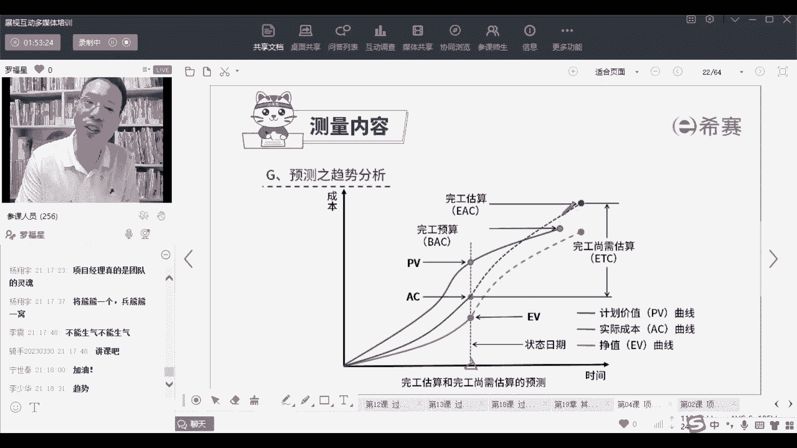

# 【PMBOK第七版】PMP认证考试全套精讲课程，免费学习（配套文档资料） - P77：PMP第七版8大绩效域之07测量绩效域-中 - PMP-B站课堂 - BV1fHW2emEdD

就各位上帝们，然后你要对我们的满意度做一个反馈，满意度几何对吧，哎就是要去测这一个满意度，还有个是关于预测，就是对未来进行把关，对未来进行预测，那这些内容呢我们来稍微看一下啊，我们稍微看一下。

首先第一个是关于测量这一个可交付成果，那么测量可交付成果呢，呃比方说有多少bug，有多少缺陷，有多少漏洞啊，你要去测一测这些漏洞是来自哪里呀，然后识别了多少呀，解决了多少呀，还剩多少呀。

目前在什么什么状态呀，而且都是可以去做一个测量的指标，还有呢是他说绩效的测量可以测量什么呢，测量这东西的尺寸呢，重量啊，容量啊，准确度啊，效率啊，准时率啊等等这些东西啊，你都是可以去测。

还可以测一些什么技术测量指标，这个呢就是你们这个行，你们的行业中有什么样一些技术质量指标，你都是可以去测的啊，这是关于这个具体的可交付物的这个测量，其实是更多的是对于结果，对于结果本身来进行测量。

OK就是这样一个好，另外一个呢就是测量这个交付，所谓测量交付，其实讲的是说我们这个交付的周期，其实你可以或者你把它理解为是一个迭代周期，你看在迭代周期中，它可能会测诶，有多少在制品。

我们不是要去限制在制品吗，那现在是有多少在制品，如果在制品太多的话，就有可能会井喷，有可能会瓶颈，还有什么什么提前量，这个提前量是什么意思呢，解释一下提前量，他说是故事进入了代办。

一直到这个故事做完结束，发布所耗费的实际时间叫提前量，提前量这个词它跟我们在预测形象关联中，提前量之后量提前量不是一个意思啊，这个提前量其实你可以把它理解为叫做交期，叫交期叫交付周期，简单这样来理解啊。

交付周期从最开始准备，一直到最后做完以后出去这个时间，这个叫他所谓的叫提前量交期，那么理论上来讲呢，这个交期应该是越短越好好，还有就是呃还有一个是叫周期时间，周期时间它就是完成任务所需要的总时间。

那么完成任务的总时间也是越短越好，并且呢他希望是稳定，什么叫稳定，就是我这一轮迭代可以怎么怎么样，下一轮迭代又可以怎么样，再下一轮迭代还可以怎么样啊，类似这个意思啊，好这里有个叫队列大小。

这个关于队列大小，其实是后面后面我们会稍微讲一个，叫利特尔法则，反正也从来不考试，但是呢你稍微了解一下啊，就是比方说我们假如说你们家开了一家奶茶店，叫茶颜悦色，你开了茶颜悦色呢，前面有十个人在排队。

那么十个人在排队的话，每一个人他最后拿到就是一个人，拿到拿到拿到拿到奶茶，然后下一个人又有又有新的人过来排队，又一个拿的奶茶，又有新人排队，那么他总共需要排多长时间呢，嗯根据他队列大小有关系，队列越长。

他拿到奶茶的时间就越长，他对立越短，他就能够更快的去拿到奶茶，对不对，那么这个就是一个很朴素的一个道理啊，了解一下，那么如果是队列太长，大家可能会心里不开心，不不痛快，那你可以换种什么方式呢，唉对不起。

我们这里只发十个号码牌，然后十个号码牌发完以后呢，我们暂时不能够排队，嗯你要排队的话，你要晚一点，我们才能够给您发号码牌，像茶颜悦色的，他的排队就是给你发一个那个排队的卡牌对吧，但他不会说是人太多。

不会，但但但他会给你一个什么提醒呢，他会提醒你可能需要排20分钟，你能够等吗，类似这样一个情况，他会给你这样一个信息，我觉得还是还是可以的啊，服务真的还做的不错，呃同学们在外地的同学，欢迎来长沙。

来长沙一定要去喝茶颜悦色，吃臭豆腐，吃剁椒鱼头，然后爬岳麓山，然后去橘子洲头啊，好然后接下来有个叫服务的大那个批量大小，就是一次能够去投入多少东西，一次能够去做多少事情，一次可以做多少事情，对还可以。

欢迎来张家界啊，呃来那个什么凤凰古城啊，啊来去岳阳楼啊，洞庭湖啊等等都可以啊，好这里还有个叫什么过程效率，这个过程效率呢他说是增值时间和非增值时间，这不就是我们在前面讲过一个叫价值流图，就价值流图里面。

价值流图中讲到说哎这个有限的时间，这个无这个就是有价值的时间，不产生价值的时间，那我们去做一个比值，比完值以后呢，然后把那个不承认价值时间尽量减少对吧，消除浪费，消除等待，然后这个呢哎做得更好。

越来越好，类似这样一种方式好，然后呢来认识一个词叫利特法则，这个利特法则它讲的什么呢，你们可以在度量上面去看一下啊，说一条生产线，然后下面带生产的原材料的数量，和每一个东西生产所需要的时间的比值。

就等于它的生产效率，那么也就是说这个生产效率或者叫吞吐量，它等于队列的大小除以它那个前置时间，就周期交期嗯，怎么讲呢，假如说有一个人在卖奶茶，卖奶茶，他卖一杯奶茶，需要他做一杯奶茶需要2分钟。

如果这里有个队列，持续有十个小朋友在排队等奶茶，那么它的前置时间由他完成这个东西，它喝到奶茶时间其实就是20分钟，而这20分钟我们其实如果有一个计算方式，是什么计算呢，就这个人他做一杯奶茶需要2分钟。

那么他一分钟可以做多少奶茶，他一分钟可以做1/2杯奶茶，所以他做1/2杯奶茶，每分钟它就相当于说是十个人排队的时候，要排20分钟，那么如果说你有30个人排队呢，那你就需要去呃。

如果说30个人排队就需要排60分钟，就这个意思对吧，就需要排60分钟，所以你有了这个信息以后，他能够给你什么提示，他给你提示说，如果你需要等待时间更短，假如说你需要把这个20分钟变成10分钟。

那怎么办呢，有一种方式就是让排队的人减少，让排队人减少一些，还有一种方式就是让这个人做奶茶的效率，可以提升啊，他现在是一分钟只能做半杯，但他一分钟可以做一杯，就是这个意思。

所以利特法则它其实是一个很简单的一个逻辑，但是这个逻辑在生活中，在工作中它是有用的，也是一个很朴素的道理，你想明白了以后，你就知道，如果说你想要减少等待，你就少让那个队伍就给一个叫限制在制品。

就w IP work in process，还有呢就是我们可以去提升它的效率，让它效率更快的话，那么他等待时间也会更短，然后再放到你的工作中，在你车间里面，在你的产房里面，他也可以用得上好。

这是这个关于测量中的，第二个就是测量这个这个这个迭代型交付，第三个呢是测量基准，关于测量基准呢其实关于什么呃，有什么进度偏差呀，成本偏差这些东西我就不去花时间讲了，这个没有什么好讲的啊，你前面都看过了。

然后再来看一个测量资源，测量资源它讲的是什么情况呢，我们其实对于资源，我们在前面有讲获取资源，然后组建团就是呃建建设团队管理团队对吧，那其实资源我们是有一个心里面有个筹划，或者有个谋划。

我们大概会怎么样去使用资源，使用多少资源，这就是实际资源的使用率，和你计划的资源使用率，就能够发现你这个资源使用的偏差，明明这里面我的这个料可以做200杯奶茶，结果你只做了150杯。

那么其实你的这个资源使用率就不太高，你就浪费了很多东西，对不对，好，还有就是实际资源的成本，减去你计划的资源成本，就等于价格的偏差，那你这就是浪费了1/4的价格，1/4的原材料就有点可惜哎。

就是这样一个类似这个意思啊，然后再还有一个呢是测量这些商业价值，测量商业价值其实就是测量这个东西，它值得还是不值得，那么它值得还是不值得呢，哎就是你要去算呢，算那个投资回报率和投资回收期哦。

那个投资回报率，投资回收期啊，净现值这些东西我们在前面讲过，不再去赘述，反正考试他也不会去考这东西，你只要知道一个逻辑，就是这个商业价值的，这测量商业价值就是测量它是否值得投资，OK当然包括财务分析。

也包括非财务的分析啊，啊然后呢还有就是测量干性的满意度，那么测量干性满意度其实怎么讲呢，就是各位上帝哈，各位上帝们对这个事情的满意度，他的满意度有什么，有一个叫净推荐值，您是很推荐还是不推荐。

来来敲个数值，就是你如果说对我们的事，对我们的课程，包括对罗老师的课程也好，我们的西夏的课程也好，你觉得你会非常推荐，你就打十分，非常不推荐你就打一分，从一分到十分，你大概推荐的可能性有多少。

然后呢在做这干弦推荐的时候呢，其实会有这样一个点，就是你为什么会去推荐某个产品，一定是你能够从中去收益，你能够从中去收益，那这个收益它就跟很多很多因素有关系啊，跟很多很多很多的因素有关系。

就是一定是你要自己用过，并且有收益才会更好，对不对，一般是这个逻辑啊，谢谢谢谢几位同学啊，都已经是帮我推荐了，感谢感谢感谢感谢好，然后呢，在做这个干系人的这个监测或测量的时候，还有一个词叫情绪图。

情绪图是什么概念呢，就是要测量这个，因为人群他的这个状态其实会持续有调整，持续会不相同的，那我们需要通过这样一种这种这种情绪图，你能够去看出，比方说我们在这里有一个啊，就能够看出这个人的目前的状态。

我们就知道可能我们的累一些地方是有问题，累一些地方可以需要去改进，那么关于哪些地方有问题，哪些地方需要改进呢，其实会有一个工具很有意思的工具，叫让我想一想啊，叫user journey map。

我们是不是上一次讲过对吧，昨天前天讲过，User jy map，就是用户旅程地图，你在用户旅程地图中看到一个客户，他进来以后，他的这个情绪的状态是什么样的状态，怎么样的状态，那你就知道哦，在哪一个环节。

我可能还可以怎么样去弄，还可以怎么样去优化和改进，类似这个意思啊，但是一般的人其实不会真的去搞这个东西，太太太麻烦了，是不是，但是你要知道有这一思路，它是一个参考，一个价值。

就是如果说大家在这个地方体验很不好，一般情况下你是不会去推荐给别人，你你只要觉得诶觉得好像我们虽然对你很凶，但其实是希望你可以学得更好，希望你可以学的更好，所以我们的虚荣也是包括后面。

可能助教老师肯定会给你发信息，也是希望你可以学的更好啊，我悄默默的告诉你们，我上次我早两天跟跟助教老师开会，我说让他们每个礼拜给你发一条短信，我让他每个礼拜给你发一条短信，你不要嫌烦。

你要你要你要你要感谢他，小妹妹们也不容易，小妹妹小小弟弟们，他们也那个啥，你们要加油啊，你们加油，他才才才那啥啊，才才才说他的工作做好了啊，好然后呢除了有这些东西以外，还有呢就是士气。

那士气其实如果士气很高昂，那就是一个很好的状态，那如果说士气嗯很很这样，那就不行了对吧，那所以我们可以通过一些问卷的方式，让大家就自己对自己打分嗯，看一下呃什么什么什么样，对不对，还有就是离职率。

如果离职率很高，那么说明这个状态一这个团队一定是有问题的，如果这离职率很低，大家都愿意留下来，那说明这个团队一定是有它好的地方，对不对，一定有好的地方嗯，哼那个企那个团队离职里，有一个词叫企业的企业。

企业的企是什么呢，是人停留的地方，我们可以停留在这个地方，OK好一个是情绪图，还有呢就是士气，士气就说大家可以去自己去评估，关于评估自己的士气，其实这里面有一个点，有的时候为什么我会很生气。

就是你们给你们上课的时候，又为什么有时候还挺挺生气的，就是因为有时候问的那些问题，真的是其实都是在我们的课堂里面都会有的，或者说有的东西是早晚会讲到，不用那么着急，你认真听我讲都可以，OK当然了。

也不能说不能让你问问题啊，你可以问问题，但人的心情其实会受到很多很多东西的影响，我蛮希望你们可以可以变得更牛逼一点，以后以后做事情，稍微多花一点点时间和精力去做好一点呃，OK好，这是关于士气。

然后再还一个呢，就是预测那个测量内容的预测，其实是对未来进行预测，这个对未来预测呢我们在关于那个啥呃，就是政治分析的时候，政治分析的后面会有一点点内容，正式分析的后面会有稍微提到一点点。

叫什么完工三需估算呐，然后是什么完工三需绩效指数啊，这些东西你只要知道，有这么一些东西是能够对未来进行预测，它什么叫对未来进行预测呢，就是我们会看到目前在这个状态下，发现其实已经钱不够用。

既然已经发现钱不够用，未来肯定要花更多的钱，那么就是接下来再花的钱，我们会对外未来进行重新的预测，诶这是一个对未来新的趋势的预测，至至于说这些区，这这些具体趋势考试基本上不会考你啊。

你基本上学过前面的政治分析就已经是够用了。

就已经够了。