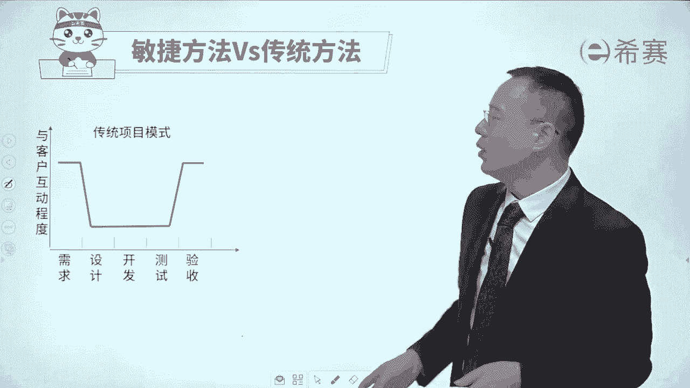
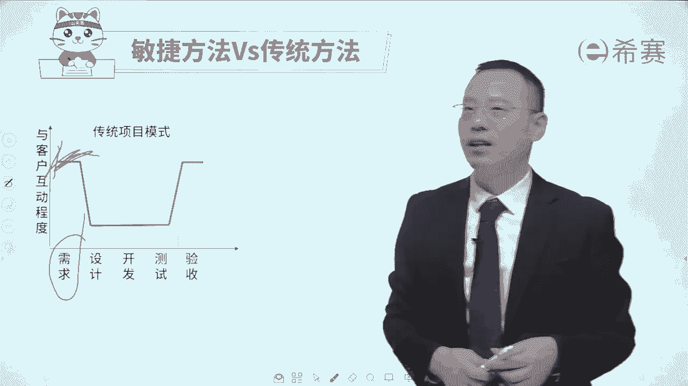

# 【PMBOK第七版】PMP认证考试全套精讲课程，免费学习（配套文档资料） - P82：PMP第七版（敏捷）-1为什么要敏捷 - PMP-B站课堂 - BV1fHW2emEdD

那今天开始我们开启一个新的内容，叫敏捷项目管理，我们会先分享的是敏捷的定义，关于敏捷定义呢，我们会从这四个维度来去进行分享，首先是我们为什么需要敏捷啊，或者你反过来讲说，现在我们做项目管理。

会遇到什么样的一些困难和挑战，那敏捷能够带来什么好处，接下来呢会讲到什么是敏捷，然后就是敏捷的宣言和敏捷的12原则，来给大家做一个解读，那我们一起来看到第一个板块，就是为什么需要敏捷。

我不知道你们在工作中，有没有遇到过类似的情况，就是你跟客户去交流，然后客户去提他的需求，可是客户他自己都不清楚他要的是什么，当他自己都不清楚他要的是什么的时候，那么他不敢跟你讲的任何东西。

你做出来任何东西可能刚好是他内心所想的，或者是他真实所需要的这种概率有多少，非常非常低，对不对，他自己都不清楚，你怎么可能做出他心里想要的呢，还有一种情况，就是客户他心里面想的是一回事儿。

可是他说出来是另外一回事，那你不可能说是透过他的所有的东西，能够去猜出他心里面想另外一个东西，这种情形下，不管你怎么做，你把这东西做得再好，跟他一模一样，也不是他内心真实想要的，所以也达不到他的要求。

你做完以后交付给他的时候，他同样是不会满意的，还有一种情况就是他在跟你讲的时候呢，他也是表达出他心里面所要的东西，他讲的也是这么回事，尼呢也是按照他所陈述的这样一个方式，表达的方式来去完成工作内容。

去交付给他，可是当你去交付东西给他的时候，他的需求已经发生了调整，那么在这种情形下，你交付的东西对他来讲价值就没有那么大，其实就不太能够真正的去帮助到他，当然还有一种情况，就是可能客户给你讲的是一回事。

然后你给同事去讲的时候呢，你给他们去讲的时候呢，他们根本就理解不了，其实这个理解不了有很多原因啊，有可能是他们真的水平太菜，理解不了，也有可能是你表达的不清晰，理解不了。

或者有可能会是因为一些知识的诅咒啊，沟通的那种漏斗呀等等原因对吧，那如果说当团队理解有偏差的时候，那么他做出来的东西一定是他所理解的东西，而最后是客户要的东西吗，不是所以这样做出来的东西。

当我们交付出去的时候，客户同样是不满意的，所以你会发现，真的是要交付一个客户满意的东西，还真的是挺难的，那还有一种情况，就是当时要做的是这样一个东西，可是随着时间推进呢。

发现外部的环境已经发生了很多变化，尤其是从2020年开始，疫情影响了全世界，它会导致很多的项目都发生了很多的挑战呃，像开餐馆的就是首当其冲会直接面临影响的，还有各个服务行业啊。

人家包单也包括说做软件行业啊，做各个不同的行业都会受到一些影响，那当外部环境发生影响的时候，可能被迫着让我们调整我们现在的项目，一些需求来去迎合当下的这样一个具体情况，所以当外部环境发生变化。

导致原来需求不再适用的时候，我们也要跟随着去调整，但如果说我们已经是把他开始想的这种东西，给完成了，给做出来了，那这个时候已经是不再适用于当下的这个社会，所以在做项目的时候。

可能有一些同学会遇到过类似的这样一些情形，就是怎么客户的需求变来变去，感觉有点不可理喻，然后还有就是你会发现团队成员怎么啥都不会，啥都不是，或者说是跟他讲一个事情怎么那么费劲啊，像是鸡同鸭讲。

对牛弹琴的感觉，还有一种就是你会发现真的是生不逢时，如果说是在早几年的时候，用这种方式去做某个事情，可能会赚的盆满钵满，而现在呢就举步维艰，甚至有一些行业，有一些企业他还在做裁员的事情啊之类的。

那么这种情形你就会发现，用传统的方式来去做项目，他可能会遇到很多挑战，所以我们会来讲一个，就是关于用敏捷的方法和传统的方法来做事情，进行一个对比好，我现在会讲的两个例子，可能你都没有做过。

但是呢你应该能够听得懂，比方说首先一个就是如果说是写书，我相信可能很多同学都没有写过书，我自己也没有写过书，但是我们没有吃过猪肉，总见过猪跑吧，你可能在网络上面看过小说对吧，你也是小时候买过什么啊。

白鹿原呐啊，平凡的世界啊等这样一些书籍看过对吧，那如果说是在几十年以前，那些作家他要去写一本书，他要怎么办，他先会去构想一个宏大的一个故事，然后呢会列提纲列提纲，然后再往里面去填内容，填内容。

填内容填内容，然后叫寄到出版社，被出版社退稿退稿退稿啊，然后再一次邮寄出去啊，终于被某一个出版社看中了，然后就开始去发行，发行了以后，结果有两种，一种就是真的写的非常不错，被大家接受和认可了。

成为了爆款，成为了平凡的世界，成为了白鹿原，那还有一种可能就是黑鹿原呐，或者是超凡的世界啊，我们听都没听说过对吧，已经淹没在历史尘埃中，所以如果说是用传统的方式来去写作的话，你最后卖的好或者不好。

其实有很多的不确定的信息，而如果说用一种敏捷的方式来去做项目，它就不一样，我相信也有一些同学，可能会在网络上面去读一些网络小说对吧，他们可能会怎么做呢，首先在一些微博上面也好呀。

或者说是在那些呃论坛上面呢，就去讲说我要去写一个什么样的故事，然后有没有人有兴趣就去发布某一个信息，我们可能会通过一些方式来去发布某些信息，说我要做什么事情，然后一下就能够吸引很多人。

比方说你要写的是一个军事题材的小说，那正好那些军事迷他就特别喜欢，可能就会在下面留言呢啊互动啊之类的啊，这个时候你慢慢的就能够去定下来这个主题好，我就写一个军事题材好，然后呢。

接下来你可能就会了解大家的一些想法信息啊，就开始写一段写一段或写一章就发出来，一发出来那些群体，那些人员他刚好对这个主题感兴趣，他就会去阅读，读完以后哇哦我就特别喜欢，就会热情的去留言，说催更啊。

什么时候快点更新啊之类的，那你就接着就开始因为互动得到信息以后，就开始去更新第二章，然后又去互动更新第二第三章，第四章，这样子整个写的过程中，就会有很多人一边在跟着你去阅读，他就是指你的这一个粉丝群体。

这种情形下，很有可能当你的粉丝阅读量很大的时候，就会有一些出版商，他看中这个商机，说那要求跟你签约来去办理出版，然后出版的时候呢啊，就会找设计师来帮你设计封面，设计版面之类的。

你可能就会在同样的这个平台上面，不管是微博也好，论坛也好，你会说啊，我这本书有三个封面，大家更喜欢哪一个封面呢，大家帮我选一选呢，啊我选了一个最多的，另一个就是作为定下来啊，就有很多人很热情的。

因为他走的是你的粉丝嘛，他见证你的成长，他就好像说这本书跟他有关系一样的啊，这样子选啊，就开始有互动，然后就开始出版，出版的时候就已经有很多的粉丝，并且有可能有一些电影公司，他会看中你这本书。

然后就开始把它拍成一个电视剧对吧，那拍成电视剧呢，如果用传统的方式来拍电视剧，怎么拍，基于这本小说，然后来去重新构思一下，然后来重新去编剧本，编好剧本以后呢，哎就开始去拍啊，招了很多演员呐。

然后导演呐各个场景啊，什么角色呀，然后就开始去拍这个电影，拍下来以后诶，再来去发布到这一些平台上面啊，比方说是啊放到这些个湖南卫视啊，啊翻到中央几套啊，来去创建一个电视剧，那么这个电视剧呢有两种可能。

一种可能就是哇广受欢迎，万人空巷，大家都在讨论这个电视剧特别棒，还有一种可能就是其实也就一般般啊，甚至有可能还会呃都不能上新，就直接是在网络上面去发布，那这种网络发布的东西呢，别人还会抵制。

最后就下架都有可能对吧，但是如果说换一种方式，另外一个新月导演，他会说我们换一种周播剧的方式，我就是一周只播一集，其实也就是像现在很多那种美剧的方式啊，那我先拍三集，拍了三集以后呢。

我就把它先播一集出来，这个礼拜先播一集出来，我播了一集出来以后，看一下观众的反响，大家就在热烈讨论啊，我喜欢刘亦菲，她她那个回眸简直是太美了，什么之类的好，然后接下来就开始翻第二集，同时呢开始拍第四集。

第五集啊，然后说啊那个谁谁为什么会受伤啊，我好心疼啊啊那个谁谁不要死啊，哎你又根据大家的反馈，你可能会把某一些东西虐他们，虐他们对吧，就是越虐越好啊，或者也可能说是让他们撒一撒糖啊，舔一下啊之类的。

就一边在拍的时候，一边就把前面那些存量，就把它慢慢的就是一周放一集的方式放出来，这种方式来去拍和播放呢，就比较能够吸引这个群体，并且会去基于他们的一些反馈信息，就是根据他们的一些反馈信息。

来调整后面的一些剧情，比方说一不小心把某个女主角给写死了，那你赶紧搞一个跟她长的一模一样的，一个孪生姐妹出来了，哎就替代她，而性格是完全不一样，性格大变对吧啊，或者说是他跟谁谁谁。

然后互换了身体以后又怎么样，那通过这种敏捷的方式来去做事情，我们其实有一点什么情况呢，会能够快速交付一点点成果给大家去看到，把这个成果交付出来给别人，先看到以后去获取别人的反馈。

基于反馈我们再去调整后面的这些内容，所以这种方式就是一种很典型的，用敏捷的方式来去做东西，它和传统的方式就不一样，传统的方式，你要把所有东西都全部想的非常清清楚楚，明明白白，然后再一点一点地往前去推。

完全按部就班推的方式，那我们看一下，如果说是用传统方式来去做软件呢。

它一般会有这样几个过程，首先是去获取需求，然后呢获取需求的时候，你跟客户之间的互动是比较频繁的。

然后接下来就开始去做设计，让设计一般是自己团队关起门来做设计，设计完了以后就去做开发啊或做实施，然后呢做测试好，终于把这些东西都做的差不多了，八九不离十了以后呢，我们最后再去交付，做验收，就交付验收。

交付的时候呀，我们又是跟客户互动比较频繁，中间的时候都是自己在闷着头来去做，这是一种传统的方式来去做项目，它这个图形像什么，像一个浴缸，对不对，这个浴缸它同时呢也像一个坑，它其实也是一个坑。

如果说什么东西都没有发生什么改变，那这种方式其实是非常好的，因为我能够一步两步，三步四步五步，按部就班的来进行，但如果说他的需求已经是发生了改变呢，或者有可能他的需求他自己就没有表达清楚呢。

或者有可能说是他的需求表达清楚，你就没有理解透呢啊，或者是有可能外部环境发生了变化，导致这个需求已经不再适用了呢，那么这个时候你再交付的东西是他想要的吗，能够达到效果吗，不一定，大概率事件不行。

所以基于这样一种情况呢，我们还有一种敏捷的方式来去做事情，敏捷的方式做事情，就是我们可能会先去跟他去互动，一点点了解一些他的一些情况，然后呢就开始闭门去坐车，闭门造车去做，做了一点点东西。

可能只做了四个礼拜，就马上把这个结果就拿出来交付给他诶，让他去做评审，他一评审就会说哦，这一部分非常不错，而这一个呢我不是我心里想要的，我其实要的是那个样子，他又会给你一些反馈，他既给你做评审。

同时又给了你一些反馈信息，而你会基于这些反馈信息，你就知道下一步该怎么做对吧，那么你后面再做其他功能的时候，你就会知道该怎么做好，你又做了一个月，你又把东西交付给他，他又会来去评审。

同时呢他再一次给到你一些反馈，那么你不断的在这样一个过程中，你就能够快速获得反馈，在他的反馈中做的事情一定都是他所需要的，都是他所喜欢的，那即便是他的需求发生了很多的变化。

他也会在反馈中能够体现出这样一份变化，即便是外部的环境发生了一些变化，它也能够在这样一个反馈中来体现，这个外部环境，迫使他要做出一些调整和改变，以及包括说，即便是他某一次没有说清楚他的需求。

但是当你交付东西给他以后，他拿到东西一看以后，发现不是他心里面想要的，这个时候他就能够给出你的反馈哦，我要的不是这个，所以这里面就是有一种什么，一个是快速能够看到结果，还有一个呢就是快速试错诶。

如果这条路不通，或者这个东西不是我要的，那赶紧切断，马上就换一个方式来去进行，所以用这种敏捷的方式来做事情，它就不再是那种传统的一个浴缸的这种方式，它是一个波浪的方式，而这种波浪呢是基于频繁的交互。

频繁的互动来去快速获取反馈信息，从而能够去确保我们现在做的事情，刚好就是他所要的东西，所以你看到敏捷的好处了没有，有没有看到一点点好处，那我们再多说一点他的好处，那如果说我们做项目的时候。

做到中间一半的时候咔资金链断裂，打个比方啊，不管是什么行业，都有这种可能性对吧，如果做到一半的时候资金链断裂，那么在这个时候做的这个这个成果他能用吗，大概率事件是不能直接去使用的，都是一个半吊子的工程。

所以他不能够直接去使用，但是又敏捷就不一样，如果同样的事做到一半的时候咔断掉了，那它能不能用呢，其实敏捷中会强调是这一次交付的，这东西是可以使用的，这一次交付的这东西是可以使用的，是可以使用的。

可以使用的，也就是你看到的那些手机的app，那些app他在最开始发布了一个版本，那个版本呢是可以去使用的，那么后面又发布了第二个版本还是可以使用，第三个月发布了一个版本还是可以去使用。

如果在第三个月到第四个月之间，因为种种原因，这个项目提前卡掉了，它依然是可以去使用的，所以它这种东西交付的就是可以用的东西，而不像是正面交付的一大坨这些半吊子的东西，这也是不一样的。

所以你这也能够去凸显敏捷他的一些好处，那那敏捷这么好，是不是我所有东西都是用敏捷的方式来去做，当然不是，因为其实每一种工作方式，它一定有它的一些适用的场景，如果都用敏捷的方式来去做呢。

他其实会很耗费心力，而有一些事情呢他是很确定的，比方说我们的盖房子，你想一想，如果是盖房子这种事情，你不可能说我今天已经定好了图纸，明天我说推翻就推方，然后已经盖到38楼以后。

马上就要求把那个户型改一改，然后再重新往上面盖，这个的话可能会出现安全安全事故对吧，所以某一些类型的事情，他必须要求我们用一种确定的方式来去进行，而这种类型的工作我们就叫确定性的工作。

而盖房子是一个很典型，包括修路啊，修桥啊，包括做一些传统的机械制造呀，都是那这种确定性的工作呢，他的工作范围是早前就已经确定下来，也就是我们要做什么东西，我们要做到什么样，然后它的质检标准是什么。

都是已经提前就清清楚楚，明明白白，不太容易发生变更，并且呢也不太允许发生变更，在这种时候呀，我们就是提前做好一个计划，做好计划，按照计划来按部就班地进行，这也就是我们经常会说的叫房事预则立，不预则废。

我如果能够知道这个事情往前推进的这个路子，那我就知道能可预见性的每一个步骤，该做什么事情，然后可能会要预防什么样一些问题和风险，都要提前做好，而做这种事情呢，一般来讲是做到最后的时候能够交付。

结果他是一次交付，最终去交付这个结果，在做事情的过程中啊，团队成员他们主要是以做为主，以执行为主，这就是一种确定型的工作，那还有一种方式就是不太确定的工作，什么叫不太确定的工作呢，你就这样去想一想嗯。

我们手机上面都装了一个app叫微信，微信在2022年2023年的时候，它都包含一些什么功能哈，到现在又包含了什么功能，中间又发生了多少次功能的改变，改动或者是呃增加了很多新的功能。

你会发现它是持续在变化的，那么这种持续变化它就是属于什么呢，它就属于敏捷的方式，而这就是一种很典型的不确定性的工作，就某一些像手机开发也好呀，它有点像是在球场上面踢球，你不能说我站在这个位置。

我跑到那个地方去，然后再跑到这个按照某个轨道来跑，不可以，你是跟着球在哪里，你就快速跑到那个地方去，你不管说是去铲球也好啊，还是说去啊助攻也好，你要去根据当下情形快速做一些响应和变化。

那么这种类型的工作呢叫不确定性的工作，这种不确定性的工作呀，他有几种情形，有一种是范围可能比较难以确定，当范围不太好去确定的时候，做着做着慢慢的去清晰，所以是边做边看，就像你想那个微信的产品经理。

他在5年前8年前，他就能够清楚的想明白，那个微信具体包含哪些哪些功能吗，应该也不太能够吧，他也只是想到当时可能最近那三个月，那六个月，那九个月以及那一年半的功能之后的呢，可能是随着技术的发展。

可随着时代的发展，以及根据社会的需求，又做了很多新的东西进来对吧，所以就有很多这种辩论，在里面加了很多什么小程序啊啊，又是朋友圈发视频呐，还有视频号啊等等很多功能加进来了。

所以它会有一种叫计划赶不上变化，外边的环境发生变化的时候，它可以快速通过变化的方式来去进行，那这种不确信的工作啊，他会交付多次，他在2022年交付一次，交付两次三次，然后2023年可能交付了六次。

2024年又交付了好多次，中间有很多小的版本的发布，它的小的版本发布呢，既包含加了若干新的功能进来，也包含原有的一些功能里面有一些bug，就有一些那种嗯会导致你宕机啊，或者说是导致你出现错误啊。

那些问题，它修复了原有的那些bug，以及加了新的跟功能，所以这都是交付很多次，而在做这个事情的过程中呢，这个团队成员的要求其实会更高一些，你既要能够去动手来做事情，同时你也要去思考。

你要去琢磨该加哪些功能合适不合适，有什么好处，因为我们做一个产品，一定是能够给客户带来价值，他才是值得的，那所以你会发现，原来确定性的工作和不确定性的工作，这两种类型的工作，那我们对应的管理的方式。

可能就是有些不一样好，这里面再来给更清晰一下确定性的工作，他应该是有一个明确的流程来做事情，根据以往被证明过的行之有效的方式来去做，所以按部就班的去做，基本上不会出错，所以你看像建造这个行业。

它已经是进化的非常的好了，所以很多东西都是一步一步的来去完成，就可以了对吧，那么这种方式呢他就会用一种叫预测型的方法，用传统预测法的这种方式来去做事情，需求已经都很清晰，然后过程也很清晰。

如果说有某一些地方需要去做调整和改进，它会通过一个叫变更控制的方式来去处理，而大部分情况下希望是不要随便去发生改变，这也是我们在很久以前做软件，也都是用这种传统的预测的这种方式来去做的。

因为以前的软件项目，也不像现在变更的这么频繁，尤其是像80年代呀，90年代呀不会有那么的变更频繁，包括说2000年以后，其实有一些行业的软件它还是比较确定的，但是也有一些呢是有一些高度不确定性的。

比方说像你们去设计一款封面，或者是设计一个logo，设计一个图片，那可能要改无数次对吧，那有一些他可能会要去设计一些新的东西，改一些新的东西，做一些之前没有做过的一些新的功能，这种的都是探索性的。

探索性，试探性探索性都是对于未来有很多的不确定，我先去尝试一下，有可能成，如果不成呢，我就换一个路径，那么这种方式它就是既要有这种开发人员，还有一些主题专家，大家一起来共同携手去解决这些问题。

创建一些新的解决办法，而在这种高度不确定性的工作中，他的变化可能是比较多，也变化比较快，同时呢项目可能会比较复杂，也有一定的风险，为什么说这种类型的项目，会用这种敏捷的方式来去做呢。

就是因为它的变化太过于频繁，你用传统的方式去做是搞不定的，你把这个计划都做的好好的，可是他的需求都已经发生了很多变化，你还是按照原来的方式来去进行，那就完全达不到他所要的东西。

所以这种类型的变化很频繁的，或者工作内容很复杂的，风险很大的，他会用一种敏捷的方法来去做敏捷方式，在短时间之内探讨各种可行性，OK它不是可能性是可行，是真的能够去让他去做便贪出一条路出来。

会根据这些评估和客户的反馈来快速调整，来去找到一些正确的路，所以敏捷面会有一个词叫快速试错，前面还加三个字叫低成本，快速试错，会通过低成本快速试错的方式，来去对未来进行很多的探索好。

那我们对于刚刚的这一个确定性的工作，和不确定性的工作来做一个简单的小结，相对来讲确定型的工作呢，他的需求或它的范围一般是比较确定的，不会轻易的发生改变，或者是不太允许他轻易的发生改变。

那么它对应的做计划呢，就是提前做好规划，做事情的时候就是按照计划来去做去执行，所以团队成员是以执行去做事情去执行为主，便是做完以后才去交付，最终去交付，而不确定性的这种工作呀。

有可能是事先比较不太清楚它的范围，当然也可能说是大概范围清楚，但是具体要做哪些事情，以及用什么样的一些技术不太清楚都有可能，那么这个呢都导致我们说要一边走，一边看，一边做，一边考虑，一边看一边调整。

这个过程中，其实你完全按照计划来是不太现实，甚至你连计划都不太能够做得出完整计划，你只能是说做一下最近的计划，然后随着时间推进，你再去把后面的东西来去做计划，就滚动滚动着往前进的方式，滚动着做计划。

它会有一个叫很典型的是计划赶不上变化，那既然变化是一定存在的，所以我们既要去手头去做事情，但要懂手去做事情去执行，同时还要去思考怎么样做，能够去响应当下这个新的变化情况，所以你还要动脑筋去思考这些事情。

并且呢我们会每做了一些东西就能够交付一次，又做一些东西又交付一次，可能会通过多次交付的方式，能够让对方快速拿到一些结果，他拿到结果拿到有用的东西，然后呢会给我们一些好的反馈。

我们会基于他的反馈再来去调整下面的东西，这是确定型的工作，所以这里有一张嗯图来去做一个终极的问题，就是我们的这个敏捷它到底有什么好处，我们为什么要敏捷呢，敏捷它是能够解决进度延误的问题吗。

它是能够解决沟通有困难的问题吗，解决资源不充足的问题吗，解决成本超支，人员变化风险还是什么，是解决这些问题吗，它在一定程度上可能有一些东西上有所缓解，有所解决，但不是焦点，它最核心的焦点是什么呢。

是关于需求变化，如果说我们在做项目的过程中，有大量的需求发生调整和变化的时候，那你就需要敏捷，但如果说你的需求是板上钉钉的，是确定的，其实你就不需要用敏捷的这一套，你用传统的结构化项目管理来去做。

是完全OK，并且是还更省钱，还更省时间，还更省力气，所以敏捷还有它的一些适用场景，那其实我们就是因为发现有一些东西，用传统的方式来去做，用传统项目管理来去做，有挑战，尤其是快速变化的这种项目。

你用传统方式来去做，你是有挑战的，所以才要用敏捷，因为你用传统方式来去做的话，首先他要有大量的做计划，有很多很多的文件，可是如果说这个项目它发生了变化的话，那些计划呢就不再管用。

那些文件呢也都是不再去试用，又需要去做大量调整，还有就是在做事情的时候，传统方式啊，那个团队接近一个隐形的团队，被隔离的团队怎么说呢，还记不记得我们在前面讲过一个浴缸模型，浴缸模型我们在做事情的时候。

不太需要跟客户去互动和交流，只在最前面去做需求的时候跟客户有互动，在后面去做验收的时候跟客户有互动，所以中间的时候，大部分时候都是自己在好好的搞事情，那么这种情形下。

其实我们做的东西真的是客户要的东西吗，很难说对吧，很难说，所以传统的这种方式啊，它就无法适应这种快速变化的情况，所以才需要敏捷呀，那敏捷它能够解决什么问题呢，敏捷的解决问题就是。

首先第一个它有足够的灵活性，就是它非常灵活，会基于这些需求发生调整和改变的情况下，它能够相对的去拥抱变化，去适应这种变化的环境，能够去，你今天提了一个什么新的这个变更请求过来，我我可以去接受。

可以去满足他，而后面又把它推翻了，我还是依然可以去满足它，所以它能够有足够的灵活性，这是选选择敏捷的理由之一，还有呢就是他能够更快的去交付价值，也就是他会分多次来交付，我每一段做的东西。

我就能够交付给你，并且交付给你的东西啊，它不是一个什么中间成果呦，他交付的这东西是可以使用的，你只要审批通过的那一部分，就可以直接拿过来去，用起来是有用的，是有价值的，价值是什么呢。

是能够为客户带来收益的部分哎，这叫有价值，他能够多次来去交付价值，所以是能更快的去交付价值，并且呢它不是交付一次两次，它会持续改进，持续交付价值，我可能说这一个月我交付了一个版本给你。

我到下一个月的时候呢，又加了很多新的功能，并且呢把上一个月的版本中，有一些那种当时没有发现的bug，我把它解决掉了，所以它会持续优化和改进，让它做的更好一些，并且呢这种方式来做的话，你想一想风险就更低。

呃理解风险很低的话，其实好理解啊，我开始有讲过说如果这样一个项目，你做到一半的时候卡掉了，和如果说你是这样的一个项目，你做一半的时候卡掉了，那么很显然用敏捷的方式来去做事情，如果你中间给咔掉的话。

你依然是有效的，依然是可以使用的，并且呢还有就是能够确保我们做的事情，一定是满足客户需求的，因为我会频繁的去获取客户的需求，你只要在频繁获取客户的需求，那么你的方向就一时，一定是随时被客户去指明的。

就像一直在有一个导航在指引，你说啊往前走，往左拐，往前冲，往右拐，有这样一个情形，所以你不可能说做一个他不要的东西出来，所以它会导致你的这样一个风险更低，这是选择敏捷这理由。

而我们刚花了这么长时间去讲这些内容呢，其实都只是给你做了一个敏捷的启蒙哈，我们就了解了一下，首先敏捷就是传统的方式，它不适用于敏捷的这种方法，因为这种不确定性的工作。

它和确定性的工作其实是有比较多的差别的，那用确定性的工作呢，你就用传统的结构化项目管理方式，第一步，第二步，第三步，第四步，因为这些步骤啊都是经过验证的，都是发现用这种方式来去做，能够更快更省力。

更省心的，但是不确定性的工作你没有办法定下来，所以你只能是一边去探索，探索的过程，就跟原来这种预测的方式就完全不一样，所以他不能够再去适应它，以及像这样一个繁重的计划呀，然后隐形的团队呀。

其实对于这种快速变化的方式是不再适应的，那所以我们要去选择敏捷，敏捷能够有足够的灵活性，以及能够更快的去交付价值，敏捷是以价值驱动交付的这种方式来做事情，还有呢它会持续的改进，持续优化迭代。

让它变得越来越好，所以这样来做事情的话，其实风险更低，因为我们能够快速获得客户的一些反馈信息，做的事情就更能够满足客户，我们的第一个小节，关于为什么需要敏捷呢。

