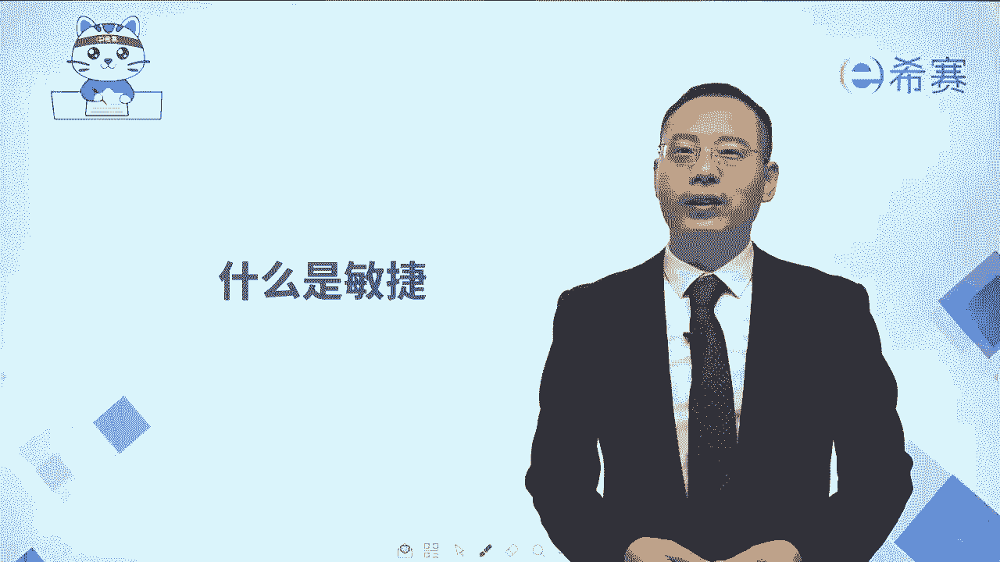

# 【PMBOK第七版】PMP认证考试全套精讲课程，免费学习（配套文档资料） - P83：PMP第七版（敏捷）2什么是敏捷 - PMP-B站课堂 - BV1fHW2emEdD

接下来我们一起来分享一下什么是敏捷。

那关于敏捷呢，我们先从它的起源开始，其实现在大家会讲的敏捷，基本上是软件这个领域开始发展起来的敏捷呃，但是在最最开始我们项目管理可不是软件哦，最开始可能是工业，然后化工呃这种生产制造这个领域。

所以在最开始这样一些工业这个板块中，其实到上个世纪50年代就已经开始，会采用一些迭代的方式啊，一些增量的方式来做开发，后来到上个世纪60年代呢，会有一些演进的方式，也就是每个周期会重点完成某些工作。

每个周期会重点完成某些工作，到上个世纪70年代开始，丰田的生产模式就精益生产方法，TPS会被广泛认可和流传，他会讲到的是小批量制造呀，消除浪费呀，然后快速的去做一些变化呀。

这种都是会导致对后面的很多行业都产生，很多影响，包括软件开发行业，所以在上个世纪80年代到90年代，就已经，陆陆续续出现了一些敏捷的一些实践方法，包括像一些像敏捷SRT这个流派呀，像叉P极限编程流派呀。

还有水晶方法流派呀，动态系统开发方法等这些不同的流派，而这些流派呢你可以把它理解为，就像是武林门派中各个门派，他们之间就是相互没那么多认可，后来到2001年的时候，然后各个流派一些大佬们。

一些做敏捷开发的一些大佬们，他们在某一个地方一起来开会讨论，最后才敲定下来，关于敏捷，也就是我们后面会讲到的敏捷宣言，我们的下一个板块就会去解读敏捷宣言，所以你大概知道说。

原来敏捷的发展其实是先有了一些敏捷的方法，后来才会一统江湖，就重新来去归纳出一个敏捷宣言，然后再基于敏捷宣言，会有各种敏捷的实践，大概是这么一个流程，那事实上呢，敏捷他是从这样一个精益中发展而来。

所以呢包括说后面会引衍生出像看板呐，敏捷里面有水晶的方法呀，擦屁的方法呀，surround的方法呀，然后那个特征驱动开发呀，以及像动态管理系统啊等等这些方式，它都会是这样一个敏捷的具体的实践。

或都是具体的一些方法，他们都是从精密里面来，他会关注的是价值，OK他重点关注价值，小批量制造以及消除浪费，这个呢我们后面会慢慢的去展开来讲，到，我们先大概知道一下，首先敏捷还会重点去关注价值。

小批量制造以及消除浪费，当敏捷发展到2001年的时候，当时就有了一个敏捷宣言，而这个敏捷宣言呢是由17位，在这个敏捷项目管理开发这个领域中呃，做的比较好的人一起来讨论的，其中有一个人叫吉姆海斯密斯。

那吉姆海斯密斯，他写了一本书叫做敏捷项目管理，快速交付创新产品，它会讲到的是说我们的敏捷党，它的核心商业目标有这样的五个，一个呢是持续创新去交付现有客户的这些需求，第二个呢是产品的适应性。

能够去满足我们当下的需求，也能够去对对未来的需求有所满足，第三个呢是缩短上市时间，能够提升或提高它的这个投资回报率，第四个是人员和流程的适应性，能够让我们的人变得更强。

这样的话呢能够对后面的这些产品的变化呀，商业的变化呀做出更快的响应，还有第五个就是可靠的结果，不管说在软件行业中，你怎么说，破天一定是结果最大就是你只有产生结果，只有是能够运行的软件，它才有价值。

所以是只有结果，只有这些可运行的软件，它能够持续的支持这个业务的增长，以及能够为公司创造这个盈利的能力，那我们来看一下，首先第一条持续的创新啊，其实不管说是开发新的产品也好，还是提供新的服务也好。

我们都需要有一些创新的意识，能够去解决人们新的这些需求，那向客户去提交价值，满足他现有的这个需求的这个产品，才是有用的产品，而事实上呢做这些创新的东西呀，你如果用一种很死板的方式，在一种很结构化。

很权威的这种环境下来去做事情，你很难得到一些创新的想法，那只在适应性的这种文化中，在相对比较宽松一点的呃，能够像外理论去管理大家，给大家一些空间自由的这样一个氛围中，才能够得到，那么持续创新。

它就会告诉我们说，敏捷中需要有这种适应性的文化，就快速拥抱变化的这种方式来去做事情，反而能够得到一些创新的东西，然后呢，第二条，他的这一个核心的商业目标就是产品的适应性，产品适应性，它指的是说。

我们不管有多么强大的这种预见能力，可是未来的发展方向，未来这个社会变化，可能是永远都有很多东西是超出我们的意料的，所以在这种情况下，我们很难说做一个东西就能够解决所有问题，一定会导致现有的产品。

可能需要做一些调整和改变，包括像目前的话很多一些销售市场啊，技术呀，还有各种新的一些需求啊，都是在一直在发生变化，那我们怎么样能够，让我们的产品具有更多的一个适应能力呢，有一条就是叫减少技术债务。

这个技术债务呢是我们后面会讲的一个名词，我在这里用很简短的方式，快速给大家去解释一下，你能听懂最好呃，如果听不懂的话呢，我后面还会再展开来讲的啊，技术债务简单来讲就是一件事情发生的时候。

我们可能有一种很好的方式来去解决它，也有一种很临时的方式先去解决掉，以后呢再来弥补，但有一些人就会用一种很临时的方式，快速把它简单处理一下，但是没有认真的去对待，后来就过去了，过去了以后。

等到事后把那建了一个大楼起来，后来发现说哎哪个地方有问题要改，这个时候呢你都已经要再去找到那个问题本身，要追根溯源，其实已经有点难找了，但是那一定是一个隐患，它对未来会造成很多的一些影响。

其实你可以理解说是在做项目的过程中，在技术方面所欠下的债务，没有把它捋清楚的部分，而这个部分是后来的一个隐患，那当我们是减少技术债务，减少这部分的时候，每一个部分都是衔接的比较仔细啊，衔接的比较清晰啊。

接口非常清晰啊，那这样的话做的事情，后面如果要去做一些新的适应，而做一些新的拓展都会比较方便，比较容易就具有一定的适应性，那么怎么样去做到适应性呢，团队要比较技术卓越，追求卓越，能够比较强。

当团队能力比较强的时候，已经没有太多技术债务的时候，他才能够创造一些产品来适应未来，并且是即便未来要去做一些调整，加一些新东西进来，就是可扩展性，你做一些新的扩展的时候，也是比较能够达到的。

能够满足未来的这样一些客户需求，这是关于他的，第二条就是产品的适应性，你可以简单理解，就是当我这个东西它的底层逻辑做的非常清晰，做得好的时候，我再加东西进来都会容易加，我要去做维护，也很容易维护好。

那敏捷核心的商业目标中的第三点呢，就是缩短上市时间，其实怎么缩短上市时间呢，我们开始在前面讲说为什么需要敏捷的时候，已经给大家提到，说敏捷的方式是一种波浪的方式，那我可能每一段我交付的东西。

就是给对方去使用诶，这就是已经是能够去用这种增量交付的方式，快速把东西提供给市场，让市场去用起来，所以它是能够去缩短交付周期，来提前满足市场需要，这样的话呢能够缩短它的整个投资回收期。

而整个在做这样一个事情的过程中，我们每一次交付的东西给对对方，他会给我们一些反馈信息，并且呢他反馈里面的东西一定最强调，是他当下最急迫的最想要的，而那些最急迫最想要的东西，对他而言是最有价值。

也就是我们在做事情的时候呢，会聚焦于这样一个增值的活动，聚焦于有价值的活动，我们会对于价值进行排序，会对这些产品特性进行优先排序，哪些是客户最关心的，他会在早前把它给提出来，给反馈出来。

一定是这样的一个情形，那我们怎么样去做到能够快速的去交付呢，还有一个就是要精简流程，不要有那种很冗杂的这些流程很繁琐，流程来去做事情，而是有一套相对比较简洁快捷的方式，来去完成事情，从而能够提升效率。

减少一些未标准化而去做一些这个啊，那个啊那种辅助性的东西，那个是没有价值和意义，我们更强调的是能够去提供一些有价值的东西，能够增值的东西，那么怎么样才能做到呢，所以还要去培养人员。

让我们的团队成员变得更牛，给团队成员培养技能，OK能够让团队成员总体变得更强大啊，这是敏捷核心商业目标，第三条叫缩短上市时间，第四条呢讲的是说人员和流程也要有适应性。

其实也就是说我们要培养好我们的团队成员，让我们的团队成员，他能够应对外面纷繁复杂的这些变化情况，所以要建立一个适应性的团队，这个适应性的团队，他才能够去快速响应未来的这种产品的变化呀，业务的变化呀。

并且呢我们这个团队成员，他应该要把这个变革作为一个动态商业环境中，必须存在的，就是说已经是习以为常，知道说变化才是正常的一个旋律，我能够去接受这个变化，我能够去拥抱变化啊，这是正常的。

并且鼓励把学习和适应，当做给客户提供价值的一个组成部分，就当我们的团队成员能够持续的去学新东西，持续去适应外部的这些性能环境，唉这作为我们的一个标准参考值，一个打分值。

那这样的话呢它的这个适应性就会变得更强，人员的适应性变得更强，而所有做这些东西，其实只是为了提供一个可靠的结果，或者说是有价值的结果，你只有提供是有价值的结果，他才能够满足客户的目标。

才能够满足商业的需求，所以一定是交付这些有价值的东西，来去满足客户的需求，而事实上因为本身做项目的时候又在发生变化，所以它不再是像那种预测的方式啊，然后说去提前去考虑到范围确定下来呀，啊对应的时间啊。

成本啊什么之类的，他会换了一种新的方式叫探索的方式，所以是一种探索性的这种项目，通过这种探索性的项目，只要是盯着目标不动，你中间的路径怎么样发生变化，你最后做的东西都是达到我这个目标的，就可以了。

所以它会强调是愿景，在这个愿景的情况下，我们会是把呃时间和成本固定下来，范围可以做一些调整，最终的目标就是得到一个可交付的成果，可靠的成果，有用的成果啊，这是这海斯密斯他所提议的这样一个。

关于敏捷的核心商业目标，这个呢只是做一个补充内容，我们稍微了解一下啊，考试基本上不考它，但是你至少对于敏捷有更多的认识和了解，我们目前讲的东西，都是让你对于敏捷有更多的认识和了解。

我们传统的方式来去管理项目的话，一般来讲会有一个项目的三角形对吧，叫范进层，就是范围进度和成本，那通常呢范围是固定下来，一旦固定下来以后就一定要完成，并且我们在做项目的时候，是做且只做范围以内的事情。

即便说是项目有一点点延期了，你也要把该做的事情去完成，即便说是成本有一点超支了，你也要把这个范围内的事情去完成，所以范围内的事情是一把锁锁定了的，而进度和成本呢这里面给了表示开。

说是一个啊还可以稍微多一点点，少一点点都可以的，是这样一个情形，但是在敏捷中呢它就不一样，他刚好反过来敏捷中他因为有太多的变化，所以你没有办法把范围给锁定下来，所以它的范围刚好是一个可以动态调整的。

就是你可能会今天想的是这个功能，明天说啊，这个功能我不要了，我换成这个功能啊，那个功能我不行，我觉得我还要加一个什么东西，就可能会有一些新的调整，所以它的范围其实是在变化的过程，是有可能会调整的。

但是它的进度和成本确实框下来，那你就会好奇说我的范围都没确定，我怎么可能把这个进度和成本框下来呢，正是因为它的范围在一直做做调整，所以我们一定要有一些方式来去核算，他这个代价怎么核算呢。

我们把这个时间给定下来，我把时间定下来，我就是给你多少多长的时间，然后给你多少人，你把人和时间定下来以后，那么对应的成本也就定下来了，就说我把人时间定下来，就是把工作量定下来，把人和时间工作量定下来。

把这个成本也就定下来，至于说你到底这个工作量里面做的是A工作，做的A功能还是做的B功能，还是做的C功能啊，这个是可以调整的，是这样一个情况，所以你会发现敏捷的这个铁三角。

它和传统项目的这个铁三角刚好就是反过来了，但事实上呢在整个敏捷中，不只是这样一个三角形，你更需要去关注的是这个敏捷的，一个新的敏捷三角形，它会更关注什么呢，关注是价值，敏捷中是以价值驱动交付。

也就是我们在说到说，我们要去给这种波浪性的方式来去做东西，那么你交付的东西应该是对客户有用的，有价值的东西，对它有用的东西才是合适的，对它没有用的东西，其实就没有什么太多没有太太多用啊。

所以第一条是价值，第二个呢是质量，在整个敏捷中，你当然你如果说是翻完敏捷书籍，你也会发现几乎没有怎么太提到质量，但事实上前提是什么，你要做一个东西有价值，能够让对方去使用，前提是你的质量达标呀。

你如果质量都不达标，能给客户去用吗，客户会同意吗，对吧，所以现在没有去讲质量，但是质量是它必备的，是必须的，并且我们会在每一轮迭代去交付之前，都要进行质量进行把关，都要去进行测试。

然后测试OK了以后才会考虑去交付的事情，所以它的第二个核心的三角内容就是质量，其次第三个才会是它的这一个约束，它的约束呢就是范围可以调整，但是我的进度可能会固定下来，然后成本可能会固定下来。

这就是敏捷的三角形，看完这个敏捷三角形以后，你是不是对于敏捷会有更多的认识和了解，那我们再多加深一下，那敏捷呢它其实会有他的一套思维和方式，敏捷会有四大价值观，也就是我们听多听了很多的叫敏捷宣言。

我们在下一个板块就会讲敏捷宣言啊，他会有敏捷宣言来去讲，到说我们关于敏捷的话，我们会更看重什么东西，而没那么看重什么东西，接下来还会有敏捷的12条原则来去指导，我们说做事情的时候应该如何如何进行。

如何如何进行，如何如何进行，有了这些个价值观和原则以后，然后我们再基于这样一个敏捷的思维，再去有A实践，B实践，C实践，比方说有SC的实践呐，有XP的实践呐，呃有那个水晶的实践呐，有看板的实践。

哪有这些测试驱动开发的实践啊等等这些东西，所以敏捷思维模式它是由敏捷的核心价值观，这四大价值观以及敏捷的原则，12条原则来作为指导，然后呢会有若干种不同的实践呃，据说一共有500多种实践，很夸张。

对不对，有500多种实践，你一定会好奇，为什么搞一个敏捷要搞那么多实践，其实这个也很好理解，谁不想在这个世界上留下一点，属于自己的东西呢，你想要占一个山头，说这个山头是什么，是罗浮新山，对吧啊。

那这个山头就是我的以我的名字来命名的山，这是旁边那条路叫罗浮新路，这条河叫罗浮星河，然后这个隧道叫罗浮星隧道，类似这样的，而这颗果园是罗浮星果园，类似这样的，你列一个山头，这个山头是以你来去命名的。

或者说是你来去给它命名的，是不是感觉像就即便说你有一天离开这个世界，你依然觉得说你在这个世界上留下过你的痕迹，留下过你的足迹对吧，所以呢就很多不同人，他会基于这样一些敏捷的价值观和实践。

和和原则来去做了各自的一些实践，他的实践可能有很多相通的地方，但下回本来某一些地方改吧改吧，他就说啊我有一个新的实践，就是这样一个情形，所以才会导致有500多个敏捷的实践。

而敏捷实践者就是根据你自身的情况需求，来去选择各自不同的实践，那讲了这么多，到底什么是敏捷呢，海史密斯他给过一个这样的一个解释，他说敏捷是创造并响应变化。

从而能够在动荡的商业环境中去，创造利润的一种能力，所以他并没有讲到敏捷具体该怎么做，而是一种拥抱变化的方式来去创造价值，敏捷，他是去平衡这种灵和，灵活性和稳定性的一种能力。

就是有一些东西我们可能会用预测的方式，一步一步去完成，也有一些东西我们可能需要去随机应变，可能要适应的方式来调整的方式来去完成，这是海斯密斯，他在2002年的时候，给敏捷下了这样一个行义的定义。

那我们对于这个小板块来去做一个简单的回顾，我们呢简单讲了一下敏捷的起源，其实呢是先有了一些敏捷的各种实践方法，然后后来才会去重新召开一个敏捷宣言的，这一大会来去得到敏捷宣言，再有敏捷原则。

再去定下来这些敏捷的东西，然后讲到敏捷的那个核心的商业目标，持续创新，然后产品的适应性，产品适应性就说我既能够解决当下的需求，也能够对未来是能够比较调整适应的，缩短上市的时间，能够更快的去产生价值。

能够去有这样一个盈利，然后人员和流程的适应性，那人员只有比较牛以后才能够去拥抱变化，还有最后一个是创造可靠的结果，然后我们还了解了一下敏捷三角形，那敏捷三角形首先它是一个倒三角。

他会更关注的是把那个范围是可以去调整的，我做什么东西，做什么东西是可以调整的，但是我的工作量是固定的，当把工作量固定以后，到底是先做A功能，B功能还是做C功能，唉这个是可以去选择。

然后呢他的时间就定下来，成本也就定下来了，同时呢敏捷会更关注的是价值质量和约束好，以及我们刚刚也看了一下，敏捷的这个思维和敏捷的含义，它会包含了敏捷的价值观，有四条，也就是敏捷宣言。

然后他的原则有12条，然后有若干的敏捷实践，它会是基于这样一个动荡的这样一个环境中，用这种灵活变化的方式来去更好的创造价值啊，这就是关于啊什么是敏捷这一小段的一个内容。

