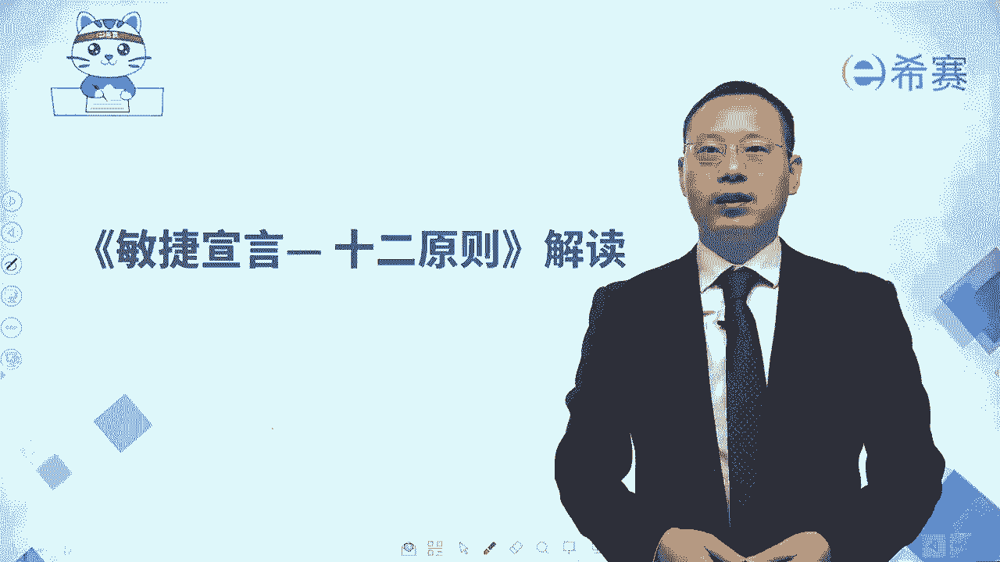
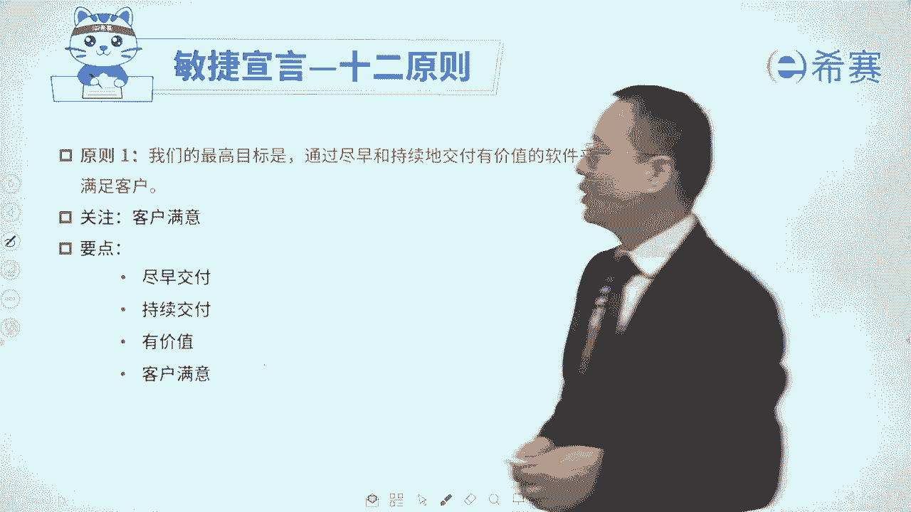

# 【PMBOK第七版】PMP认证考试全套精讲课程，免费学习（配套文档资料） - P87：PMP第七版（敏捷）6敏捷十二原则第一条 - PMP-B站课堂 - BV1fHW2emEdD

大家好，接下来我们一起花一些时间来解读一下，敏捷宣言中的12原则，我们已经看过了，敏捷宣言是这样的，四句话对吧，四句很短的句子，但是这四句很短的句子呢，它还不足以去支撑我们具体的工作。

所以敏捷的这一些个先行者们，他们又讨论，然后得出了12句所谓的敏捷原则，我们一起来看一下，我们会先过一遍这敏捷12原则，然后会逐条来跟大家解读，我们先看一下敏捷的12原则，首先第一条原则说的是。

我们的最高的目标呢，是要尽早的去交付有价值的软件，并且呢要持续地交付有价值的软件，来满足客户的需求，那我们怎么样去满足客户需求呢，首先第一个我们的目标是要去满足客户需求，我们通过尽早交付的方式。

持续交付的方式，交付的是有价值的，这些软件可以用的工具，用的软件来去满足客户需求，第二条原则是，即使在项目开发的后期，仍然欢迎对需求提出变更，敏捷的过程，会通过拥抱变化的这种方式。

来帮助客户创造竞争优势，所以他会鼓励的是拥抱变化，我们在敏捷中的那些关键词语中，有一个就叫拥抱变化，第三个要不断地交付工作的软件，周期呢是从几周到几个月不等，并且越短越好，所以它首先是不断去交付。

是持续交付，其次呢它是周期越短越好，尽早的交付越短越好，第四个在项目的过程中，业务人员和开发人员要每天在一起工作，他这个一起工作，其实也是一种所谓的合作共赢的方式，因为很多情形下，开发人员和业务人员。

他们之间是业务人员挖坑，开发人员填坑，但是你们这种方式不太好，我们换一种方式，大家一起去握着手，携手共进的方式，在一起工作，一起合作共赢，一起为客户创造价值，第五条，要善于激励项目人员。

给他们所需要的环境和支持，并且呢要相信他们能够完成任务，这也是我们通常说X理论和Y理论中，有一个就是Y理论去管理，是相信这些人都是积极主动的上进的，然后只要给他一些空间，然后同时给他一些任务。

他都会努力的去完成，并且呢我们要给他提供一个好的环境和支持，让他能够专注在项目上，第六条，团队内部和各团队成员之间，最有效的沟通方法是面对面的沟通，那面对面的这种沟通。

face to face的这种方式，它不仅仅只是能够去传递这些信息，还可以传递这种情绪啊，情感呐，我们会通过这种面部表情，声音语调，肢体动作，来去传递很多除了语言本身以外的信息。

所以会强调是面对面的沟通好，第七条，可工作的软件是衡量这样一个项目进度的标准，也就是说你不要说啊，你准备了多少文档，这些东西呢他都不作数，最终要的是可用的软件，也就是我们在最开始有讲过说。

你要不断的去交付那些对吧，我们是把这个周期你要交付有用的东西，你要交付有用的东西，你每一个节点都要交付那些有用的东西给它，第八个敏捷过程提倡是可持续的开发，那么在第一句又讲过可持续对吧。

那他怎么可持续呢，相关方开发人员和用户，都应该能够保持一个恒久稳定的进展速度，其实这里面也就说到一个信息，就你不要用明天的精力来完成今天的事情，不要疯狂的加班，这是这样一个可持续开发，第九条。

对技术卓越和好的设计的持续关注，有助于增强敏捷性，那什么意思呢，我们在最开始有讲过一个叫PDCA循环对吧，不断循环，螺旋式上升，那么其实就是对技术要求是越来越好，越来越卓越，对于设计师精益求精。

这种方式呢才真正是敏捷，通过迭代的方式来做得更好，第十条呢尽量做到简洁，尽最大可能减少不必要的工作，这是一门艺术，什么叫简洁呢，就是那些东西够用就好，不要准备很多花里胡哨的东西，包括说做软件开发的话。

那那些软件开发的功能，其实有很多功能别人是根本就不会去使用的，那那些功能呢几乎是不太需要的，或者不太重要的，尽量是少做，少费心思做到简洁，第11条，最佳的架构需求和设计是出自于自组织团队。

那团队呢是一个自我组织，自我管理的团队，你不需要让别人去分配工作，给你给你给你给你，而是大家主动来认领任务，是一个自我组织，自我管理的团队，那这个自我组织自我管理团队中既有架构师，也有需求分析师。

也有设计师，也有开发人员，也有测试人员，那整个这个项目所需要的各路人才，他都有了大家，并且是一种复合型人才，有每个人都有自己专长的擅长的部分，同时呢别的东西也都懂一些好，第12条，团队要定期回顾和反省。

如何能够做到更有效，并且呢相应的去调整团队的这些行为，也就是说我们要不断的去回顾和反省，这样的话呢才能够有利于这个事情往前去推进，要不然的话下一次只是在重复这一次的事情，那他的进步其实是微乎其微的。

这是敏捷宣言的这样一个12条原则，接下来我们就会对这12条原则，一个一个来进行解读，我们首先看到的是第一条原则。

我们的最高的目标呢是通过尽早的交付，和持持续的交付去交付有价值的软件，来满足客户，所以他关注的焦点就是我们做敏捷的话，一定是需要去满足客户需求的，我们能够让客户满意，这是有必要的。

我们怎么样能够做到让客户满意呢，我们一定是要去尽早的交付有价值的软件，我们要持续交付有价值的软件，交付的东西是有价值的，而这是一个很重要的信息，什么叫有价值呢，其实这个价值谁来定义，客户来定义。

客户觉得这个东西对我有用，那么就是有价值，如果客户没有觉得这个东西对他有用的话呢，他就是价值没那么明显，所以是由客户来去定义价值，但是客户他每一次都来去跟你同步这些信息吗，不一定，所以我们通常在敏捷中。

还会有一个角色叫PO的角色，叫product owner这个角色，那这个角色呢他通常会去替代客户来给出，关于哪些东西的价值是比较大的，放在前面的，他会能够去帮我们去定义这个价值，当然他只是客户的代表。

事实上呢如果客户自己亲自来更好一些，让我们通过尽早交付，持续交付，交付有价值的软件，才能够真正的让客户满意，这是第一条，我们来看一下啊，我们给大家准备了两道题目啊，都是做一种补充。

让我们更深度的去认识这些原则，组织正在转型敏捷，负责开发产品的团队是第一次接触到敏捷原则，作为敏捷管理专业人士，那这个作为敏捷管理专业人士呢，你可以把它连简单理解为，就是你来去负责带这个敏捷团队。

那么你的这个角色呢就有点像是一个项目经理，我们通常也会给它取名字叫敏捷教练，或叫敏捷管理专业人士好，作为一个敏捷管理的专业人士，应该要教育团队，敏捷的原则，其实也就是告诉团队该怎么做事情对吧。

提供相应的指导和帮助，在敏捷中，敏捷构建和交付关注的是下列的哪一项，那在整个敏捷中，我们去敏捷构建这个软件，交付这个软件更关注的是什么呢，选项A为客户提供最高价值，就是尽量提供有价值的东西给到客户。

这肯定是的，并且事实上他也是对的啊，所以它就是答案了，第二个选项，以最快速的方式来去进行构建，这最快的方式来进行构建呢，本身它确实是一个目标之一，但它不是核心目标，更快的去交付。

但是焦点落在交付的是有价值的软件，你只有这个东西是有用的，才能够对客户有价值，你如果交付的东西很快，但是没有什么用的话，那其实是无意义的，OK第三个确保工作流程的正确性，在敏捷中呢。

我们说的是人以及人和人之间的互动，它胜过了流程和工具，所以这个其实不是敏捷中重点提倡的好，最后一个呃，确保开发产品的正确性，哎这个是有必要的，我们做东西一定是正确的，什么叫正确呢。

首先第一个做的东西本身没毛病，其次呢也是对方所需要的，我们怎么样能够去确保这个东西是没毛病呢，通过质量检查，通过质量控制，而怎么样能够确保这东西是对方要的呢，我们会通过验收，通过评审这种方式。

但是焦点其实放在，是要提供给他最有价值的东西，也就是说我们的敏捷的第一条原则，我们要去尽早交付，持续交付，交付有价值的软件来满足客户的需求，所以这个题目的答案是选A选项。

那在这里呢你就顺便认识了一个词叫敏捷管理，专业人士啊，其实就是管敏捷的这一个项目经理，或叫敏捷教练，同时呢我们去交付敏捷的东西的时候，是要提供价值好，我们再来看另外一个题目，你是一个项目经理。

你的团队正在构建嵌入式系统的网络固件啊，你这名词很陌生，没关系啊，你知道就说啊，就是要去提交或交付一个东西，要交付一个成果就可以了，你召集大家开会，向技术水平很高的一些业务，用户和客户呢提供演示。

在这个会上演示了团队为控制面板界面，开发的最新版本的代码，这是你第五次来去开这种会议，并且向客户来去演示软件，而在这第五次会议上呢，客户和用户呢他们提出了一些特定的变更，团队现在又得回去开发第六个版本。

这个过程又得再来一次，下列哪一种说法最准确的描述了这种情况，那这里呢老师给你画一个图，让你能够更清晰的知道到底是怎么回事，其实我们去跟客户的沟通啊，是这样的，我们在前期跟他沟通比较频繁。

然后呢就开始自己去做做的东西呢，然后就交付给他，然后又自己做，然后呢又自己交付，然后就是不断的这样一个过程，啊就是这么一个过程，他现在告诉你说嗯第一次交付，第二次交付，第三次，第四次，第五次交付。

通过这种方式来交付东西给对方，去掩饰给对方，然而对方呢他会能够去获知一些重要的信息，同时也会提出一些反馈性的信息，说啊什么东西我要什么东西，我不要，你要怎么改对吧，有了这些认知以后，他说。

那么下列哪一种说法，最准确的描述了这么一种情况，选项A团队不了解需求，真的是这样吗，我们说在敏捷中，很多时候有一些需求是一开始就不太清晰的，是做着做着才会逐渐清晰，所以呢这个说法本身是有问题。

就是因为需求不清晰，才会用敏捷的方法来去应对，来去做事情，当然也包括说这个事情本身难度很大，我们会迭代的方式去做事情，一边做一边去摸索啊，都是可以的好第二个选项，用户和客户不知道他们想要什么。

这个不能够直接就表达出，他们不知道他们想要什么，重点其实是他们在反馈信息，他们这个反馈的信息就是在此时此刻，他又对于他要的东西更清晰了，而这不是焦点，其实我们通过这种方式来去构建。

是能够交付一些有用的东西，第三个选项，这个项目呢需要更好的变更控制，和需求管理的实践，如果说在这样一种预测型的项目管理方法中呢，这个是一个很好的选项，但是题干明确告诉你，我们在用的是一种什么方式啊。

我们是已经是第五次开这种会议，接下来还要再一次做，并且开发第六个版本还会再来一次，也就是告诉你会用一种迭代的方式，一轮一轮一轮来进行，就很明显告诉你是用一种敏捷开发，而敏捷开发中是拥抱变化。

而不是用这种固有的方式去走，有变更，走流程的方式，这个是不正确的，而最后一个选项呢，团队做到了尽早交付和持续交付，您看他是不是尽早交付呀，他都已经开了五次这样的会议，每一次都会去给别人做一些演示。

那么演示的东西如果通过了以后呢，就可以拿给别人去使用了，如果说有一些功能是不能用的呢，它就会把它给注掉，然后就把有用的东西留给别人去使用，没用的东西或者是有问题的东西，然后下一轮再去做调整。

做修改这种方式，所以它是已经达到一种尽早交付，并且他都已经是第，这是第五次，后面将要做第六次是在持续交付，所以这个题目它就是达到了，这种团队做到了尽早交付和持续交付。

不断的去通过这种互动的方式来去交付东西好，这就是刚好满足了敏捷12原则中的第一条，尽早交付，持续交付。

