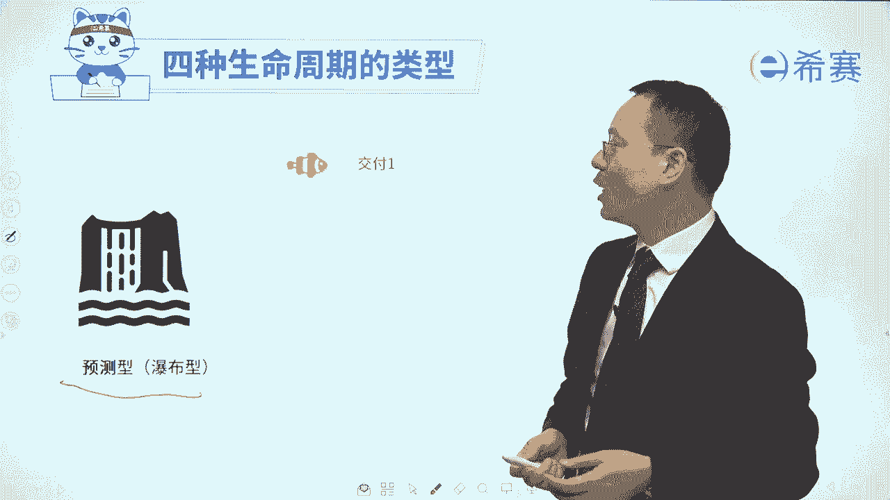
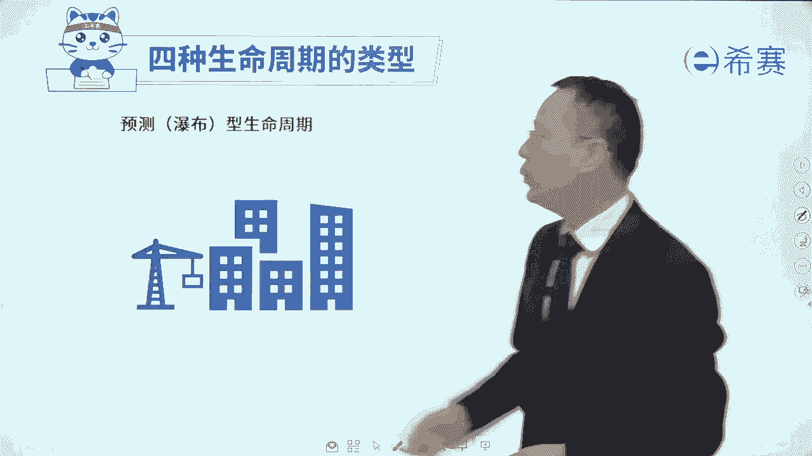
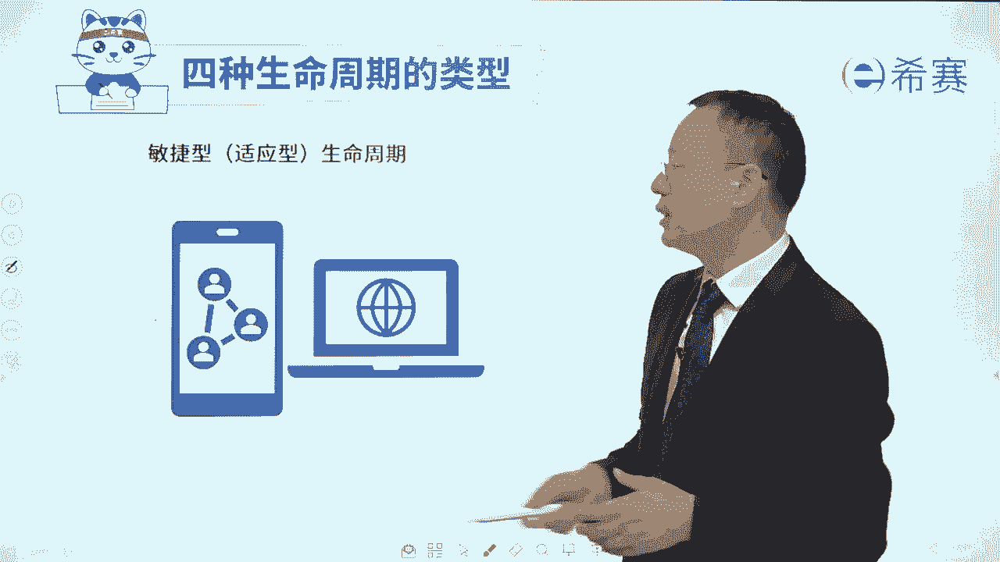

# 【PMBOK第七版】PMP认证考试全套精讲课程，免费学习（配套文档资料） - P97：PMP第七版（敏捷）16四种项目管理生命周期 - PMP-B站课堂 - BV1fHW2emEdD

我们会先对于整个这些内容来做一个总括，然后呢会看几张图来帮我们去引入，去认识和理解，再一个一个的去分别讲，我们先来看一下，总体来讲预测型的生命周期呢，它其实是一种相对比较传统的方式来去做事情。

我们在早前刚开始的时候就做好规划性的工作，做大量的规划，然后接下来就是按照这样一个计划，按部就班的来进行去执行，执行完了以后产生这样一个结果，那通常预测型我们也叫计划型。

也叫瀑布型或叫瀑布式的这种方式呃，像传统的区域盖房子呀，修桥啊，修路啊以及以前传统的区域开发软件呢，它都是这种预测型瀑布型为主，第二种呢是迭代型，而迭代型这种方法，它是允许对工作内容进行反馈。

然后呢一次一次的去迭代，去修改，去改进，不断地去优化迭代，让它变得更好，也就是我刚开始的时候可能做了一个样板出来，这个样板呢发现其实不太优秀，那我就是改了一部分再交出去，发现还是不太好。

再改一部分交出去，但这个教都是一个中间的成果，没有一个最终的成果交付，直到一直改改改到最后一个版本，终于发现可以了，同意了批准，通过了，我才去交付出去，这就是一种很典型的迭代的方式，迭代型，而增量刑呢。

这种方法是允许，我们逐渐会在一个预定的时间之内，向客户提供这种已经完成的部分，而这些已经完成的部分呢，是可以立即使用的部分，我先给你交付一些东西，马上可以用起来，我再交付一些东西，用起来。

过段时间我再交付可以用起来，这种方式交付才叫增量的交付，而适应型比较敏捷型，它就是迭代加上增量的这种方式，通过这种又迭代又增量的方式，既能够把那种没有做好的部分去优化改进，去完善。

同时呢也能够通过频繁交付的方式，让对方更快的去拿到成果，那我们通过几张图来去对这个内容，加深一下印象啊，啊比方说像预测型和争论型，他们的这个对比呢，如果我要做一个事情。

我要交付的是相当于说1000万的这个货物，那我要交付1000万的货物呀，用预测型的方式，就是前面做事情做事情做事情，做事情一直做做做做做，终于做到了一个节点以后好。

我把这1000万的这样一些货物全部都交付给你，而这是一种很典型的预测型的方式，而增量型它就不一样，他会是哎我分阶段去做啊，我这一个月已经是完成了1/4的部分，完成了250万，那我把这250万交付好。

然后又到下一个月，我又完成了250万，我把这个250万呢也去交付，我到下一个月又完成了250万，我要再一次去交付，再到下一个月我又去交付，这样的话，对方他不是等到第四个月才一次性拿到。

这100万的这个结果，他是一开始一个月就拿到了，第二个月又拿到一些，第三个月拿到一些这种增量交付的方式，能够让对方更快的去拿到结果，所以你看出他们的差别了吗，一个是一直做做做，做到最后再交付。

一个是做一些东西，有成果就去交付一部分，再做一些有成果再交付一部分，所以它是更快地去交付，更频繁地去交付好，我们再来看一个图，通过这个图来去看一下关于预测型和迭代型，它们的区别。

那比方说我从这里开始想要去某一个地方，如果按照预测型的方式呢，我们就提前做好了一个规划，做好了一个计划，然后按照计划的方式一直往前走，按部就班地去达到目标，这是一种很典型的预测性的方式。

它会要求我们的需求是会非常明确，范围呢也比较明确，就是按照节点一点一点的去完成就可以了，而迭代型它就不一样，迭代型有可能会是基于需求不太清晰，范围不太明确的这种方式，需求是渐进明细的这种方式。

那么我在这个节点，我可能目标是在这里，然后刚才做了一点点，发现目标已经是移动到这里了，我就往上面移动，而做了一点点，发现它往这移动，我继续往上面移动啊，一直在往上面去移动。

基于他的这些移动的目标的这个靶向，我才最终做出一个结果出来，所以他其实是不断的去改进优化迭代，改进优化迭代才最终去达到目标，并且目标有可能本身也是在动态的这一过程，所以预测型的方式会应对这种需求。

明确范围明确的，而迭代型的方式呢，它可以面对这种需求不清晰不明确的方式，当然也可以是应对这种需求，虽然清楚，但是要怎么做很不清楚，难度特别大，特别复杂的方式，也是不断去试探着做，然后去改试探着做。

去改这个方式啊，这是预测和迭代，我们再来看一张图像，预测型，它和敏捷型的差别啊，比方说预测型，我们也说叫瀑布模型，就像水流一样的，从上往下流下来叫瀑布模型，而咱们的这个增量交付呢是我先交付一个东西。

我再又完成一部分东西，我又交付一个东西，我又多完成一个东西，我又交付一些东西，这样的话分几轮交付，最终呢交付出一个结果出来，这是一种很典型的增量型，那还有另外一种类型叫迭代型，迭代型就不一样。

迭代形式我先做了一个大概的一个草图，然后基于草图去做一些优化，唉慢慢的清晰大概要做成什么样子，然后再去做一些深度的优化改进，做成这个样子，做出一个成果出来，这就是一种迭代的方式。

而咱们的敏捷呢是增量加上迭代，就是既有增量，既有分批次去交付东西出去，同时又有迭代，就是不断的去对过往的东西来进行进行优化，改进的这种方式就是敏捷型，好我们来看一下这张图，啊啊这是世界名画蒙娜丽莎。

那蒙娜丽莎这幅画呢，呃其实达芬奇好像说并没有画完，但是不影响我们在这里拿它来做一个案例，你想一想，我们如果说中间画一条轴线，上面部分是一种什么样的方式在做事情啊，我把要做的事情。

我先完成1/4交付给你去用起来，然后我再完成第二个1/4交付给你用起来，我再完成1/4，我再完成1/4，但是这种情形呢，它其实通常都是像，你对照着别人已有的成果去完成。

那每一段呢他要做的事情都要非常清晰，才能够完全按照目标来进行，才能够一块一块的去交付对吧，这就是一种很典型的增量交付的方式，而下面另外一种方式先画了一个草图，然后把这个草图呢做一些丰富。

然后呢再更多的丰富优化迭代，又加了各种细节，最终做出一个蒙娜丽莎，这种方式呢就是迭代的方式，不断去迭代进行的方式，那事实上呢如果说要有一种方式，用敏捷的方法就是敏捷，他会是不断去交付给对方看。

并且获取对方的一些反馈，那么如果说我们在做这个东西的时候，我一边做一边问询他，哎这个眼睛要放大一点还是小一点呢，啊这个手应该放在哪个地方呢，啊头头发要多长啊，不断去问询他的一些反馈信息。

然后基于他的反馈来去做调整改进，这种方式呢会倾向于是一种敏捷的方式，好我们通过这几张图片，对于四种生命周期的类型呢有了一个了解，接下来就一个一个看到，我们首先第一个看到的是预测型的生命周期。

预测型生命周期也叫瀑布模型的生命周期，通常像那种需求比较确定的，建房子呀，修桥啊，修路啊，以及那种生产制造的领域，他们做的事情都是比较确定的，对于这种确定性的事情，它会有个既定的规则。

比方说先做可行性研究啊，先去收集需求，然后去做开发，去做构建，然后去对它进行测试以及进行验收，验收完的东西呢交付出去以后，到运行和维护，它就像是流水一样的，一层一层的往下面去流，它不会反过来。

那这种方式呢叫瀑布模型，瀑布模型是waterfall model这种方式呀，它的好处就是如果我前面的东西都是很清晰的，那么我做事情就只要按部就班地去做，可能会比较时间可控，然后呢成本可控呃，资源可控。

各个方面都是一个受控的状态，我们能够按部就班的去做事情，心里也不慌，但是他其实对于变更就不太友好，如果说你有一些新的变更过来，他就需要去有变更走流程，所以瀑布模型它是对于变更不友好的这种方式。

而事实上你会发现时间往后推移，来到现在这个新的时代，变更是常见的，是司空见惯的，那我们一起来看一下预测型，它的这样一个具体的形式，比方说我们可能在前期先做好需求分析，然后呢做好架构设计。

然后去做开发构建，去做测试，去交付，去训运行和维护，那么它的要求就是，我们学校需求非常清晰和明确，所以是一个高确定性的建一个需求很明确的，很稳定的这样一个团队，那如果按部就班地去做事情。

大概率是能够做成的，所以它的风险也比较低，这种方式所有的事情都是按顺序的来进行，一步一步一步来进行，减少各种变更，不要有太多变更，因为变更它会对我们造成很多的不必要的影响，也就是在传统的项目管理中。

其实不太欢迎变更，对于变更我们有六个字叫有变更，走流程，走一个变更的流程来去监控，来去管控这个变更，通常预测型的话呢，其实是能够把一些工作内容按照部门来划分，按照职能部门呐，按照这些工序啊。

一道一道工序来划分，那么你上一道工序完成，来到下一道工序，下一道工序完成到下一道工序，所以如果按照一种流水线的方式来做事情，它是会比较好的去节省资源，然后缩短时间，能更快又好的去完成。

所以这是瀑布模型预测型，它的方式，同时我们需要了解到，在预测行这种方式呢，是只有项目完成了以后才去最终交付，所以在过程中，我们是不会去交付这些有用的东西，不会去交付商业价值，只有完成以后才去交付价值。

那么如果是用这种预测型的方式，面对这种需求变更，面对这种需求有分歧，其实它会对项目的影响还是比较大的，就是会可能会要额外花一些钱，有一些意想不到的成本，好我们已经知道了这个预测型它的这个情况。

他的这样一个适应的这个特性，我们接下来看有没有一些更好的方式来去应对，变更的情况呢，因为你会发现时代发展到现在这个节点以后，唯一不变的就是变化，那既然反正有变化，有没有更好的方式来去应对呢。

那有一种叫迭代的方式啊，这张图我不知道有多少同学自己，以前在上大学毕业的时候呀，或者研究生毕业的时候写论文，或者说是你在工作中要去写某一些文档啊，或者设计的稿啊之类的，有没有遇见同感，比方说做一些文档。

做了一个版本，发现还不够，又改了一个版本还不够，又改了又改了又改了好，终于说这个东西是完成了，你喜很喜滋滋的交上去，结果领导并不会对你客气，然后又打回来，你又改了一个完成一版，然后还给了一个最终版。

最终版交上去，你以为终于是可以尘埃落定，发现又被打回来，又有新的，又有新的，又有新的，然后就不断去改，改了一个什么绝对不改最终版，然后打死不改最终版之类的，那么这个过程，其实这些文档它最终会用的是什么。

它最终会用的只有最后那一个版本，你中间可能改了十几版，但是这十几版老板，他会额外给你付十几板的工资吗，不会他只会付你这一版的工资，因为中介都是中间过程，他不是最终成果，那这种迭代的方式呢。

就是说我们在前期可能做了一些需求分析，然后接下来就开始去做设计呀，去做开发呀，去做构建呢，要不断去优化迭代，去优化迭代，去优化迭代，然后打回来一直在改来改去改，到最终的时候交付这个结果。

他是最终才交付结果，中间过程改过来改过去，所以通过连续的原型或概念的验证，来去改进这些产品，我们会在这个过程中不断去重复这些活动，重复这些分析呀，设计呀，重复这些构建啊，测试啊，重复这些事情。

而通过这样一种迭代的方式呢，能够把那些不确定的东西变得逐渐清晰和确定，比方说我们今天有一个东西叫什么圆形法，你通过原型法的方式，你做了一个圆形给到别人哎，别人一拿到原型以后。

就觉得哦这一部分的需求是我要的啊，我还需要一个什么别的需求，是你下面要做到的啊，那个东西我不要的，你就会通过这种原型能够去更好的来收集需求，但事实上这个原型看能不能直接给对方去使用。

一般情况下是不能够直接去使用的，并且很多原型是会被抛弃掉，会被舍弃掉，它都只是我们在中间，我们去获取需求的这样一个过程，我们可能会反反复通过各种手段和方法，来去收集需求，来去进行分析，来去进行设计。

来去构建测试，还不行，又回过来，最终做完了才去做交付，这就是迭代型的生命周期，但是如果说客户他想要更快的去拿到结果，并且用起来怎么办呢，所以还有一种新的方式叫增量型的生命周期，增量性的生命周期。

就是能够让客户更快地拿到结果，并使用的这样一种方法，比方说我们去餐厅里面点餐嗯，带着一桌子人，然后点了12个菜，还加了几个那个前面的开胃小菜呀，还有餐后的这一些个水果呀之类的。

但是客户呢他不会一下子给你，把十几个菜全部都上完，他会怎么上哎，先炒了几个菜给你先端上来，先吃着，然后过一会呢再给你端两个菜上来取，先吃着，所以这样的话每一个桌子的下面的这些顾客。

都可以先有几个菜在吃着，一边吃一边等的这样一个情形，他能够快速去拿到这个结果，并且去使用起来，唉这种感觉就会比较好，对不对，所以增量型的方式就是类似于用这样一个概念，让我们先去交付一部分的结果。

让你去用起来，我再去交付一部分，结果过一会再来用起来，我再过一会再去交付，这种分步做交付，能够让客户快速拿到结果并去使用啊，这些产生价值，那么整个质量交付的方式呢，就是我们在开始看到的。

比方说哎我有一个分析设计构建测试交付哎，交付了第一个版本，接下来我们又开始分析设计构建测试交付，交付第二个版本I又开始交付，第三个版本，就像说我们炒了一盆菜端上去，又炒了两盘菜。

端上去又炒了一盆菜端上去，类似这样一个意思，那它的最大好处是什么，它最大的好处就是能够加快交付的速度，能够让客户拿到结果，而这个结果呢对它是有用的，所以很多时候这种增量的方式极其好用。

我们当能够去给客户提供某个单一的功能，或者是交付某一项成果，让他先用起来，这样的话它就能够基于这个结果先用着，并且在这个过程中，也会给我们一些些反馈性的信息，这里就顺便认识一个词叫最小可行产品。

关于最小可行产品呢，我们稍微先能简单提一嘴啊，后面还会再讲，关于最小可行产品有两种不同的解释，一种解释呢是我们去通过一个最小可行产品，去验证一个商业通路，验证一个商业路径，什么意思呢。

就比方说有一个人他想要去造一个软件，那个软件呢造起来比较复杂，比较难，我们要做一个软件，其实目标都是要把它卖出去，能够赚到钱，那他就想一想，如果我这东西要是花了很多代价去造，造了以后，最后又没人买。

怎么办呢，所以他要去验证一下商业通路，他怎么样去验证，比方说他要做的是一个呃名片的扫描的，这个名片扫描仪，那当然了，现在已经几乎没有人，没有什么人太多人去使用名片了对吧，以前很多人用名片。

那他要做一个名片扫描仪的话呢，需要做一个图像识别技术呀，快速去识别这些文字啊，但那个时候呢，图像识别技术还没有这么强的时候，它可以怎么办，他先去找两个人在后台坐着。

当有人使用我这个名片扫描仪这个软件的时候，给我发了一张图片过来的时候，我在后台赶紧敲字敲字，然后敲完了信息以后给你发送过去一看哇，这么牛，然后他就把这个软件的这个二维码，或者说是把这个软件放在某一些。

比方说什么呃深交会呀，广交会呀，什么什么交易会的这个场所里面，也让大家先免费去使用，看有多少人会愿意去免费使用我这个软件，如果用的人很多，那我就说明这个东西是真的有搞头，并且呢不只是免费去使用。

还会给他一些限制，比方说你免费使用了20次以后，如果你还想要使用呢，你就要把它分享给你的朋友们，让你的朋友们来注册，当你的朋友们有多少人注册的时候，你就可以再多用多少次。

或者还有就是你可以去呃下订单去购买，你购买多少钱的服务，我就可以再给你多用多少次，通过这种方式来去验证这个商业路径，是不是通的，所以通过MVP可以去验证这种商业通路，包括说大家有人做什么，做众筹。

做众筹，它也是一种用这个MVP的思想来去验证商业通路，看有没有人去搞，如果有人选择，那我就去做，如果没有人用它了，如果没有人去投票，如果没有人去花钱，我就不做它，哎这是一种还有一种MVP呢。

最小可行产品的那个另外一种解释呢，就是我们去做事情的时候呀，我们并不要求把这个东西都完整的做出来，我们先把最核心要紧的那些功能给做出来，让他能够做一个乞丐版，这个乞丐版是勉强也可以用起来的。

而这个版本那它就叫最小的可行产品叫MVP，那通常情况下我们用增量的方式，比方说我们在早前可能会通过几轮迭代，来做出一些最小的可行产品，让对方可以先用起来，然后呢在这上面就又加了一些新的功能进来。

又加了新的功能进来，这就是一种MVP增量的思想，然后整个用这种增量思想啊，它最大的好处就是能够交付商业价值，我们能够提前交付商业价值，能够让客户快速去使用这样一些东西。

从而在这个过程中再去对产品的功能进行增加，增加新的功能，然后去吸引更多的客户，你先有一个东西能够用起来，快速去吸引一波用户，然后又加了新的功能，又可以吸引更多的用户，这是增量它的一个非常棒的一个效用。

那大家可以通过这张图，能够看到这样一个增量交付，比方说随着这个时间轴线，我先去交付一部分的功能，同时呢我花的代价和成本其实也都不是很多，但是客户就觉得是有一些东西可以使用。

然后再接下来时间我又去交分析功能，我花的代价不是很多，那客户又能够得到更多有效的东西，我再去交付一些东西，我花代价不是很多，客户又有一些有用的东西，这就是增量交付，那其实除了有这样一些个迭代的方式。

有这种增量的方式，还有一种呢是既有增量，又有迭代的方式来去进行，我们给它取名字叫敏捷或叫适应型，敏捷型或适应型。

它是从哪里来呢，就像说我们如果要在球场上面去踢足球，你不能按照既定的轨道去跑，然后跑到这里踢球，这不可以，因为在球场上大家都在变换着位置，球也在变换的位置，所以你不断去要去调整这个角度，你的目标很清晰。

那就是要去配合团队成员一起来共同去进球，然后去引导对方，所以当你的目标确定了以后，你的过程可能会大量的变换，这种方式呢给了一个词叫敏捷啊。

不管说是什么求善，还包括说像我们手机上开发一些手机app，一些手机app，你会发现那些手机app，它过一段时间就会提醒你要做更新，那为什么要更新呢，因为它又加了一些新的功能。

并且呢它修复了一些原有的一些bug，那些问题，那些漏洞，所以这个过程它其实就是一种在又在增量交付，同时又在对未过往的东西进行一些迭代，优化的过程，它就是一种敏捷型，好我们了解了这些信息以后。

我们再来去做一个总括性的一个介绍，那整体来讲呢预测型的这种方式，他对于需求呢有要求，要求需求是确定的，是固定的，一开始就定好了这些需求，接下来做事情的时候呢，我们是按部就班的去做，在整个执行的过程中。

我们是一步一步的去做，而做到最后做完的东西以后呢，去交付一次交付，那么在整个预测型的项目管理中，我们其实是目标要去把这个项目给管理好，能够让它一次做成，所以他的目标是要去交付啊。

管理这个项目上有一些成本，而另外一种迭代型迭代型，它通常可能是需求会有一些动态的调整，或者有可能说是这个难度比较大，所以导致我们去完成它的时候，没有一个既定的路径，所以呢我们在做事情的时候。

是反反复复的去修改，一直改到合适为止，不断去优化改进，改到合适为止，但它呀是最终改完了一个最终版合适了去交付，所以它是只要交付一次，那么这个迭代型他所关注的目标是什么呢，就是解决方案的正确性。

我们应该要去基于当下这种需求变来变去也好，或者说是这个内容很复杂也好，我要去得到一个正确的解决方案，能够去满足你的需求好，第三种呢叫增量型，那增量型这种方式啊，它会有个特点。

就是总体来讲大方向其实范围是可以调整的，但是本轮要做的事情它是比较清晰和确定的，所以这里给了一个词叫单期需求是固定的，但是总体呢它是可以动态调整的，那这种情形我们就每一轮都增量去执行。

去执行完了以后去交付，执行完了以后去交付，所以他会频繁的去交付，小规模的交付，交付很多次，那么在这种情形下呢，其实增量型它就要关注的是交付的速度，当然也包括说交付的质量，而最后的敏捷型。

敏捷型呢它的需求是动态的，他是要反反复的去修改调整，并且呢要要频繁的去交付，所以他既要去反复修改它，同时又频繁的去交付，交付很多次，那他会通过这种频繁交付的方式，来去获取一些客户的反馈。

然后基于反馈来去调整这类内容，从而能够去实现这样一些客户价值，所以这是这四种不同类型的方法，但是其实不管是预测型，迭代型，增量型或者敏捷型，其实呀他们都需要去做计划，也是计划一直都是贯穿于始终的。

他们的这个差别点呢并不是说有没有计划，而是说这些计划里面的东西我完成了多少，以及我在什么时候去完成，比方说预测型，我是刚开始提前做计划，然后接下去把所有计划里面全部都完成。

而迭代型呢是我开始做了一点点计划，我去完成，完成了以后又修改这个计划，又再来完成一次，而嗯增量型的方式呢，我会是可能会是有一个阶段性的计划，然后按照计划去做成，然后又做下一个阶段性的计划。

又做完成下一段一段一段的都会有一些不一样，但是它都是有计划的好，我们认识了这些东西以后呢，通过这张图可能会看的更清晰，我们虽然把它是展开来讲，说预测形式什么样的呀，迭代形式什么样呢，增量型是什么样呢。

敏捷型又是什么样，事实上呢在真正做项目的时候，他们的这个区分度没有那么严格，如果非得要去区分的话呢，我们是可以通过这个模型来去区分，但是现实生活它往往可能是连连续性的，没有一个绝对严格好。

我们如果说是抛开这个连续性来讲的话，我们看一下它的区分，就是看这个需求它的变更的程度，以及这个项目的成果，交付的频度，预测型呢是我不太有太多的变更，完全是按部就班地去做，并且呢我的交付的频度也非常低。

我只有在最终完成以后才交付那么一次，这是预测型，而迭代型呢它就是变更比较多，变过来变过去，我改过来改过去，或者是因为它特别复杂，所以呢我做了又改，改了又做，做了又改这种方式。

但是只有最终做出成果以后才去交付，所以他交付的频率是比较低，同时呢它的变更呢比较高，这是迭代型，而增量刑它是变更，基本上没太多变更，我这一轮要做什么东西，我是框定下来的，蒙娜丽莎的这一个部分是框定的。

好在做这一部分的时候也是框定的，在做这一部分也是框定的，也是框定的，所以他的变更程度比较低，但是它交付的频度比较高，他做了第一个部分交出去，做第二个部分交出去，第三个部分交出去，第四个部分交出去。

所以他交付的频度要交付很多次，所以你如果说一个东西它的变更比较低，但是交付频率比较高呢，就是增量型，而敏捷型呢它就是增量加迭代的方式，既会有大量的变更，又会有很多的交付，它交付一个版本。

然后下一次又加一些新的功能进来，然后改了原有的东西，然后又交付，然后又下一个版本又是加了一些新的功能进来，然后改了一些东西，所以它是增量加上迭代的这种方式，而事实上你要记住。

就是我们真正在做项目的时候呀，你说那么严格的去区分它其实很难，所以呢还有一个词叫混合型，混合型就是用敏捷的方式和预测的方式，一起来结合起来，一部分内容是预测的方式进行，一部分内容是用敏捷的方式来进行。

当然了，其实我们可以把这三个都叫敏捷型，我们可以把这三个都叫适应型，如果说不是非得要严格区分的话，是可以把它放到一起的，但如果说非得要去严格区分它的话呢。

