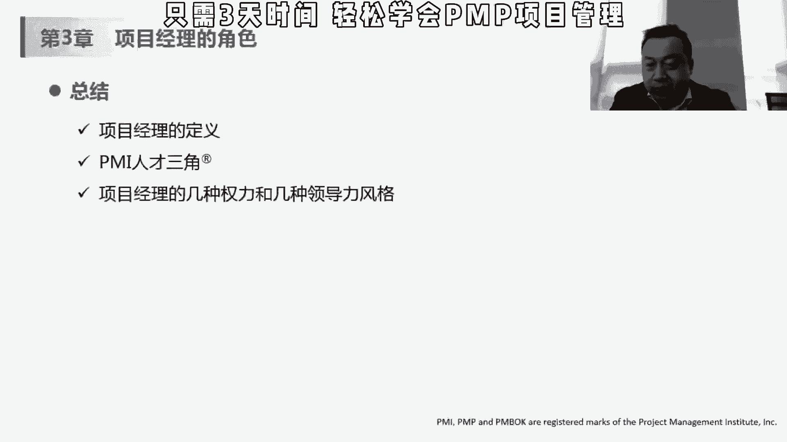
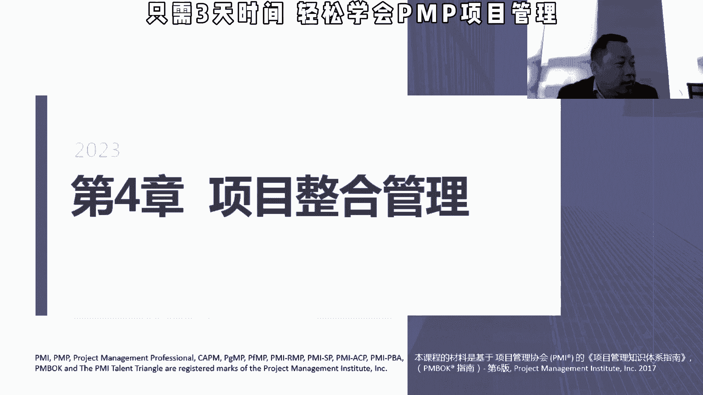

# 【PMP 项目管理】10 项目管理精品课试听   中文教程 PMP入门教程 学习视频 - P1 - PMP小雪球 - BV1Ku411e75N

那我们看第四章第四章项目整合管理，项目整合管理嗯是属于比较重要的，但是因为先讲项目整合管理，大家就会比较嗯不容易理解，其实很多这个美国的这些东西啊，他就说都是讲哎我有各个方方面面，有各个方方面面之后呢。

我要把它整合在一起，那项目整合管理嗯，举个例子哈，就是我我比较喜欢用这个例子，就是说嗯今天比如说我们要吃火锅，那个嗯唐老师你你去买三斤羊肉，小时候你去买五斤青菜，然后呢谁那个去买一些蘸料啊。

谁去买一些酒水，然后呢谁来准备锅，那大家就会想，那我来干嘛对吧，我来整合呀，把你把你的羊肉，把你的这个青菜，把你的酒水，把你的锅，把你蘸料整合在一起，大家凑个群，然后我们今天能够来吃这种火锅。

那吃这种火锅，我要不要知道这个羊肉是怎么做的，你去买呀对吧，那我要不要知道这个心态怎么买，那那那是小茹你负责的事情，还是你去买，所以呢在这个过程中，我不唉具体不是说在买羊肉这件事情要怎么做。

买这个这个侵害的时候要怎么做，但是呢我负责整整合是说唉，其实你看你这个羊肉吧，买三斤差不多够了啊，咱今天这个人人多，大家喜欢这个吃青菜啊，青菜你要多买一点对吧，那我我要确定别说要有多少个人呢。

我在项目之间，你们之间的这个内容是由我来整合的，那我买过50个人吃的话，一个大锅够不够对吧，是不是我要再去借一个这个电磁炉，弄一些小锅，那这些东西是整合，但是我不去确定每一个资源是怎么样。

那这个整合管理是什么呢，我们讲的我们有十大知识领域对吧，除了整合管理之外，有范围进入成本嗯，质量沟通资源那个还有风险，还有相关方，除他之外还有九个，那这九个的话是需要在这个管理过程中。

把大家整合在一起的，他不关心每个具体的这个过程，这个大家理解哈，就是，整合汇总这样的一件事情，是在这个这一章节里面。

那他具体做了什么，在这个之前，我们先讲和，项目中常见的这个几方，如果是甲方或者是买方，一般来说我做项目之前我可能会招标对吧，我是招有有项目资质的，有能做项目的人，供应商来找我来做做我这个项目。

那对我来说我是招标，那对于乙方来说，我是投标，甲方要做这件事情，哎我能做，那我去投标，根据我对这个甲方这个标书的理解，那我要在什么多少钱，在你提供什么样的人，提供什么样的一个项目管理来把这个事做下来。

所以一般来说在项目中会有这种甲方乙方，买方和卖方，如果没有特别说明的话，我们在整个项目管理过程中所讲的，我们一般来说是站在乙方的这个观点，我们做项目，我们去给甲方做项目，根据甲方的客户需求做项目。

只有一点例外，在第12章，我们将采购管理的时候，我们项目去采购别人的资源，这个时候我就变成买方，那别人来买房，这时候买房我要做什么，我要做招表，别人供应商要做投表，所以这个大家一定要理解哈。

就是说我们要除了第12章我们去采购以外，我们要站在投标，乙方或者卖方承建方这个角度去考虑问题，然后这个十大知识领域的学习的重点，这是what，就是每个子过程这个定义y，为什么有这个子过程，how。

就是每个子过程的这个输入，工具和技术以及输出，接下来我们学后面49个管理过程，都是按照这个方面来讲的，这个东西是干什么的，为什么要有这个东西，然后怎么怎么做，a i t t o input tool。

technology art，不是，把项目整，项目整合的管理的核心概念就是统一合并沟通，建立联系，这些活动呢应该贯穿始终，就整合的过程要贯彻始终，不是说我在做计划的时候，我做一次整个计划后面就ok了。

因为其实项目我们讲的项目，有各自的这种制约因素，项目之间会相互影响对吧，质量成本和进度，保安风险都会相互影响，所以这个整合是需要自始至终来做的，第二个整合的管理责任是由项目经理负责。

而且不能被授权或者是转移，你不能说我这个乐队指挥指挥一半，我说那个大型新手，你上来，你来指挥吧，你来做整合，因为他没有这个技能，也没有这个全局观，所以只有项目经理是站在整个项目，所有的这个知识领域的。

这个角度去进行这个整合，所以不能被授权，也不能转移，然后项目经理对项目整个项目承担最终责任，对吧，我们讲那个什么责任，尊重嗯，公平和公正，还有诚实，然后项目越复杂，相关发的期望越多样化。

就需要越全面的整合方法，这个可以理解哈，那你如果就是三五个人的项目，就一个简单的东西，就一个相关方客户做个小程序，可能就很简单就ok了，你要上一个，比如说上一个sap的项目对吧。

从前期的这个高层对sap的这个选项，到后期不是关于光用户的这种沟通，包含这个技术顾问的这个跟业顾问的这个沟通，其实是越来越复杂，所以呢那相关发有期望也是不一样的，那项目公司的老大肯定希望唉。

我上了这个项目之后，对我一个人交流有多少的提升，对我的成本，或者说呃对我的利润也不好帮助的利润，那我们我作为一个关于用户，我肯定是关心这个东西，对我每天的工作有多少帮助，上了这个系统之后。

我每天是不是越来越麻烦，还是说我工作越来越轻快，所以每个人对这个项目的这个期生，官方的这个期望是不一样的，唉所以越需要这个项目经理来进行整合，还要求他整个所有其他知识领域的成果。

刚才讲了其他九个知识领域哈，发展趋势，包含使用自动化工具，一些信息化管理工具，可视化的工具，项目知识管理，我们在后面会讲4。4的时候，会讲那个项目知识管理哈，项目知识管理主要是应对这个人员的稳定。

稳定性，不稳定性和流动性，因为通常刚才我们讲了这个项目结束，这个人就释放了，即便是同一个项目，我原来做过一期的人，我在做二期的时候，他可能在别的项目里，我都不可能说我直接拿来用对吧。

但是我同样有知识管理的话，换一个人来做，其实这些事情也可能能做，再者他还存在着说这个人即便在，有可能还不在组织内，他可能去离职了，他离职之后，他这些no how，他这些知识能不能存储在公司内部。

后来人快速学习，这也是我们刚才一会儿讲的那个4。4，讲那个知识管理里面很重要，增加项目经理的职责。