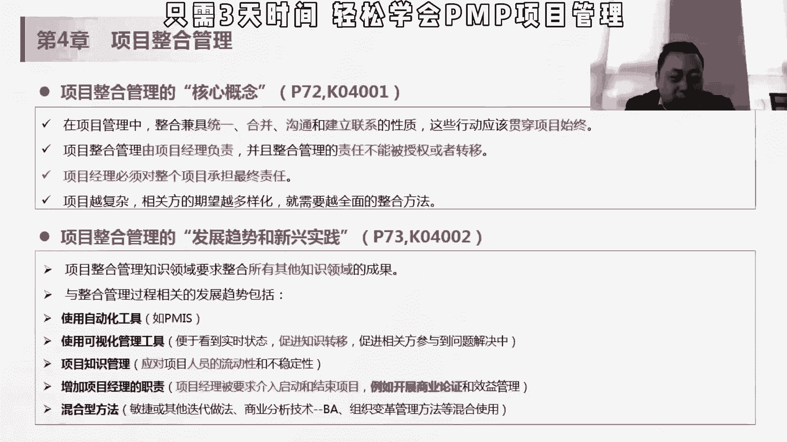
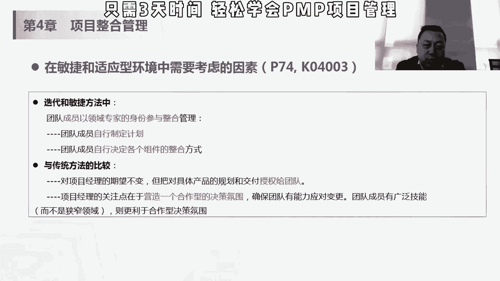
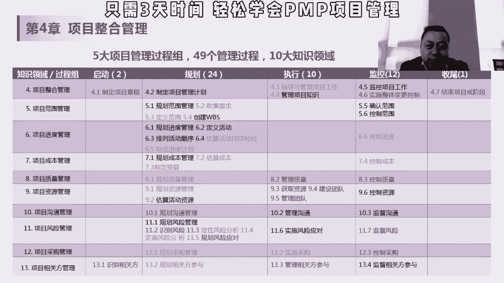
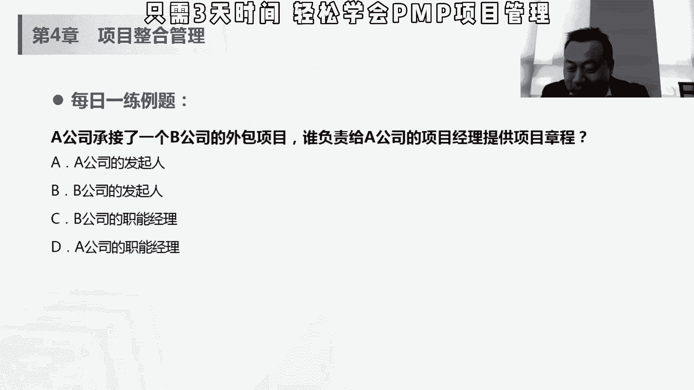

# 【PMP 项目管理】10 项目管理精品课试听   中文教程 PMP入门教程 学习视频 - P1 - PMP小雪球 - BV1nW4y1Q7DC

但是呢增加他的职责，并不是说要求他负责，这个一定要清楚啊，就是他对这个前期的这个商业论证文件，会有建议点，但是没有决定权和这个维护的权利，修改的权，这两个是考点，我觉得第一点会更重要一点。

第二点的话会有一些嗯什么被出轨了，然后这个敏捷和适应性环境想考虑因素，我们现在过掉。

因为我们后面会详细的讲敏捷相关的，所以呢第四章整合管理，首先在启动过程组是制定项目章程，那在职规划过程中是制定项目管理计划，在执行过程中是指导与管理项目工作和管理，项目知识。

在监控过程组织监控项目工作和实施变更控制，那在收尾过程中是结束项目或者收尾，这个第四章他有七个过程组嗯，另外有七个过程组的是风险，第11章风险管理，那我们看第一个哈。

制定项目章程，项目章程应该英语叫差合是吧，是就说一份正式批准项目，或并授权项目经理，在项目活动中使用主流资源的文件的一个过程，这，个什么意思，正式批准项目项目前面立项了。

然后呢项目经理要让项目经理开始做了，那有些项目的话，可能会有这个项目经理的这个任命书，或者有些项目都是说公司指派你做这项任务，他必须要有一个授权，这项目经理不是可以任意使用公司的这个资源。

它只有在授权范围内使用公司资源全都ok了，但有的题目会问诶，这个职能经理不给资源，可能第一反应，第一个要考虑的就是项目章程上规律规定，项目这里可以使用这个资源，它有没有全锁是有数。

所以这个是一个我们讲法定的，对项目经理地位进行承认的这样的一个文件，项目章程一般来说是由项目经理外，本人或者是项目以外的人来做，我不能自己认定自己吧，我不能自己授权自己吧。

所以呢他是一般来说是由项目外部的人，一般来说是项目组织的报酬和，或者是发起人来自定义，那项目章程是在项目执行组织与需求组织之间，进行之前建立的伙伴关系，我们讲项目执行辅助，一般来说是乙方对吧。

是这个卖房，然后呢需求主题呢我们可以认为是假发，所以建立这个伙伴关系，甲方和乙方就是项目章程做的这个，建立的这个伙伴关系，然后呢，项目章程意味着项目正式的启动，是由项目以外的人来做的。

发起人的项目只要项目方或者办公室，所以尽早的任命当经理，他可以参与，还是那句话啊，这个项目章程是由项目以外的人来治病的，他可以参与，跟那个三一论证一样，可以参与，但是没有决定权，那你参与的越早。

其实你对这个项目可能了解的越多，你不能等这个项目启动了，你你才差异的话可能就有点晚，所以它规定的最晚是要在规划开始之前，项目经理很重要的一点就是要做这个项目规划，你不能说别人做好的规划，我来做对吧。

这时候可能不会有什么偏差，所以最好是在制定项目章同时就任命，但是最晚要在开始之前，就要进入到这个项目里面，然后呢，通过编制项目章程，来确定项目符合组织战略和日常运营的需要，和项目存在的目的。

项目的一个法定的这个地位，咱们讲一定要贯彻主持这个战略对吧，从上到下载这个关系，然后执行外部项目和通常又有正式的合同，但合同不是项目商城，合同里面我们会规定甲方乙方的权利义务。

会规定这个费用金额或者什么样的东西对吧，但是在项目章程里面，其实不见得会有这些金钱，或者说让你转换成对价，所以它是相当的合同是两个东西，但是很多项目上可能要遵循合同的对吧，我跟甲方呢。

我们讲需求组织签订了这份合同，然后我做一个项目章程，作为我自己的执行组织，等法定授权我项目经理去做这个事情，如果我没有双方不是烂的，不是一致的话，其实很容易出现偏差，虽然它不是一个东西。

但是呢一般来说项目的项目章程，肯定要是参照这个合同，这合同里面会规定一些大致的范围啊，规规定一些这种项目的这个成本对吧，我这个公司我100万做一个项目，我不可能让你120万去。

那个我100万拿着从甲方拿的项目，我我让120万做，除非是我我们说那些什么战略一致性，所以我们在这货币这个价值的角度来讲，其实不大可能去做这件事情的，所以要参照这个合同，就这里有一个题哈。

a公司承接了一个b公司的外包项目，所以谁负责给a公司的项目经理提供项目章程，大家可以答一下，可以在我们的这个互动区里面搭一下abcd，我看大家都选什么，嗯你会选b，还有其他答案吗，嗯有人选a。

首先a公司承接了b公司的外包项目，是a公司的项目经理对吧，那我们说这个项目章程是什么，是这个项目组织内，提供的一份项目执行组织，提供了一份项目章程，在b的话，b公司也会有项目经理对吧。

我们同时说一般甲方也会有项目经理，但是甲方的项目经理的项目章程是谁给的，肯定是甲方的这个发型，那在这个在这个项目，在我们这道题里面，谁是甲方，b是假的对吧，b是b公司的外包项目，是，是我b是买房。

a是卖房，如果是说问b公司项目经理的项目，当时是由谁提供，那个b公司发现是没问题的，那如果是a公司的项目经理的话，应该是由a公司的人来发起，被公司的高层来答题，在这个项目中，ab都会有发泄。

都会有项目经理，再简简单介绍一下，这是公司签了一个单，我a公司接了b公司的单子100万，然后呢，我这个活儿要现在要a公司的人来做，谁做a公司来做数据对吧，a公司授权a公司的项目经理来做这个。

对a公司来做项目商品，这个公司的发起人来就像是翻译。

