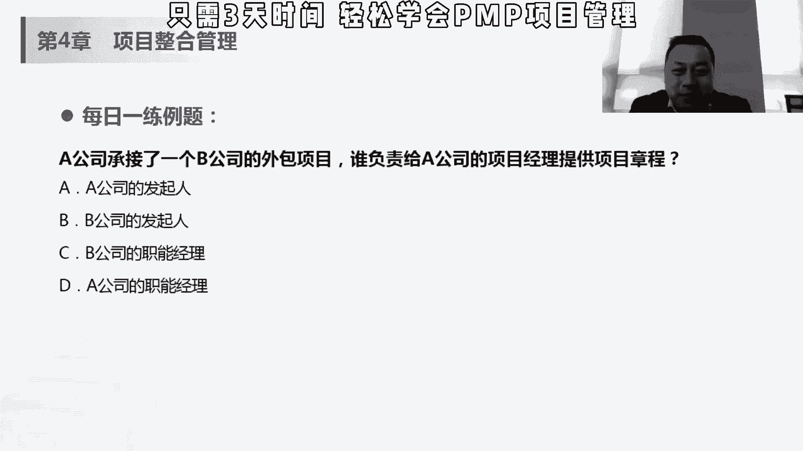
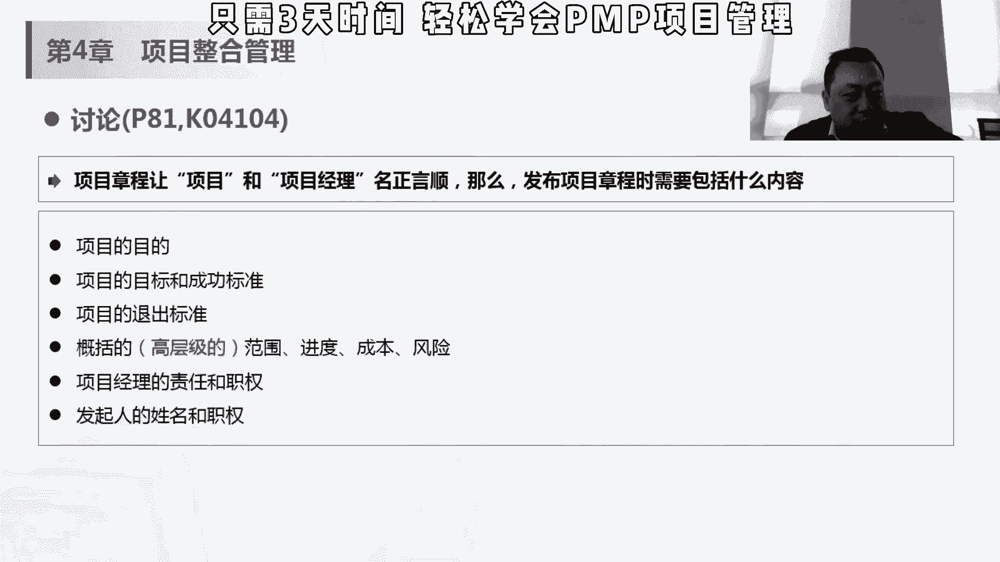

# 【PMP 项目管理】11 项目管理精品课试听   中文教程 PMP入门教程 学习视频 - P1 - PMP小雪球 - BV1MV4y117DN

刚才是讲哈，他是执行组织，首先刚才他讲的执行组织是谁，执行组织是a吗，a的项目经理啊，那执行组织是a与需求组织，需求组织是b，那项目是由项目以外的实体来启动发起人，项目级或相应项目管理办公室。

它是由乙方的这个发起人来做的，乙方决定立项，我要不要做甲方这个项目，乙方做商业论证，乙方做前提的这个呃，可行性分析，乙方做项目章程，乙方授权项目经理做项目，是是这样的一个过程哈，所以这个题比较绕。

如果没有发起人的话，也有可能会选高级经理，或者说只能别人嗯，如果有发起人的话，最好最大答案是选a，就是大家听的时候可能会听明白，这个项目章程怎么回事，但是实际过程中要较真儿的时候。

哎你就得知这到底是a还是b，就是很多这样的这个题目，就是我们将来考试的时候，乙方项目经理可以尽早参与，没有决策权力，他对于这个项目章程是没有决策权力的，嗯所以刚才讲的这些东西，什么正式启动啊，授权了。

尽早任命啊，这部分的话都是指的是女方，我们讲了，我们是站在乙方的立场上去去做这个项目。

那项目章程是让项目和项目经理能正颜色，那需要发布什么样的内容，项目的目的，我为什么做这个项目，项目的目标和成功标准，我们这个项目是在什么样的实践内，用什么样的成本完成什么样的东西，什么叫做成功。

到底是实现我们的这个商业的价值，会有钱的这个价值还是有什么价值，对吧，我们项目经理很重要的一点，就是我们要知道我将来这个项目会怎么样对比，评价，大概是质量越高被评价，还是说我这个工期越短被评价。

那我我做的一个质量，是不是要像我们讲做做毕业项目那样做到极致，还是国内项目这样快速上线，要求更高，知道意思要质量还是要效率，那其实每一个项目的这个标准都是不一样的，项目的退出标准达到什么样的一个条件。

我们就可以退出了，然后这个高层级的，高层级哈，这个应该是英语叫high level，它是一个概括的，就是说不是那么细节的，或者说要宏观的这样的一些范围，进度成本和风险，我们做一个。

比如说呃我们不仅是i t项目，比那个装修对吧，我们要装这套房子，大概我是我想两个月，这时候你不能规定说说四五天还是20天，你只能说哎两个月都能能够弄完成本吧，大概在10万左右吧。

你不能规定说诶一定是9850对吧，999850没有那么细致，大概有一个成本概念，然后风险哎呀，我我的风险对我找不到好的复工队啊，有什么办，然后呢这个你选不到合适的家具，这个板材是什么什么的。

都是一些比较害来我们范围比较粗的，或者比较概括性的，宏观性的这种东西，作为在在项目当中，有些东西是现在没办法细化的，我跟客户签了一个合同，客户比如说你你跟人家贴一个总包合同对吧，当然这时候你去甲方了吗。

别人给就是假设你是施工队，然后别人要让你去做那个你给别人去做的话，这时候可能前期就是一个总包合同，我会把你这个加费两个月之内10万块钱左右，然后把低风险帮你把这个装了，哎这个时候你不会具体到这。

甲方也不会要求你说，这个时候，你要把这个三个月之后的工期给我开好啊，然后呢每一笔钱就买几个螺丝，买几个什么东西都给我定好，这时候不然我不给你签合同，这个不太现实啊。

对基本上这个时候甲方的需求有的也是high level的，也是高层级的，你你能做的事情也是高层级的，所以会有一些概括性的范围，进度成本风险上面放在这里，如果在考试中，一般来说碰到高层级的这个事情。

充满了项目，当成，然后项目经理的这个责任和职权，发行人的姓名和职权，这个可以理解哈，所以这里面就是成功的标准，退出标准项目上成长，然后高层级的呃，比较这个high level的也比较概括的。

红魔玩的这些东西在相当的理解上。

那我们讲每一个管理过程都有输入对吧，然后会有工具和这个技术，然后会有输出，那这个制定章程的输入呢，就前期我们讲的这个商业文件，cs文件的话，我们之前讲过，一个是三人论证一个效益管理计划。

商业文件呢是在项目之前制定的对吧，我们决定要做这个项目，为什么做这个项目，我们通过商业论文件来论证之后，决定做这个项目，但是呢项目要定期审核，为什么要定期审核，有可能我在做的项目的过程中。

整个市场的需求，包括一些环境都变了，我当时那个三要论证的那些条件都已经变了，这个会导致说我现在这个项目做也不做，都可能会受影响，所以我要定期审核去确定，说好当时的如果是条件没有变的话。

那我按照现在的计划继续做下去，没有问题，如果变好的话，我该怎么做，如果变得不好，极端一点的话，项目做不做都是两座，可以在这个项目就停止不做了，所以才需要定期审核的，然后之前也说了，它它不是项目文件。

可不可以对它进行更改和修改，只能去建议，这个地方大家能理解，这个商商业文件能需要做定期审核就可以了，然后输入还有协议对吧，我们讲我们做乙方的话会有合同啊，或者类似这种服务协议，那个soo w对吧。

这些作为我们启动项目的初衷，我们为什么启动这个项目，然后工具和技术，嗯因为专家判断是经常用的一个工具，但是专家判断呢其实嗯相对来说，说白了就是找有经验的人问一下这个专家呢。

不是我们现在在市面上讲这个专家哈，就是那种建议专家不要建议这种专家，哈哈哈嗯也不是说哎那种哎，比如说嗯当时疫情期间，我们一定是专家和东南山大这种专，他指的是在某一个，可以来自专业学历，知识。

技能经验或者培训经历的任何小组或者个人，对人人都是可以去试一些专家，至于这些东西做出专业知识，做出了关于当前活动的这个合理判断，你说你有一个问题，有个项目管理方面的问题，你来问我，哎。

我给你一个大概给给你一个方向性的东西，其实他也是个类似的专家的空调，你说我刚才讲的，我装修我不太懂，哎，我那我那个姐妹前两天刚装完，啥都懂，他研究过，我向他去问，其实也可以理解成一个专家发表。

不是那种纯的专家哈，就在某些领域里面，有一些专业知识和技能的人都可以做专业，所以这个呢其实你说我在项目中，我说我右专家判断。

