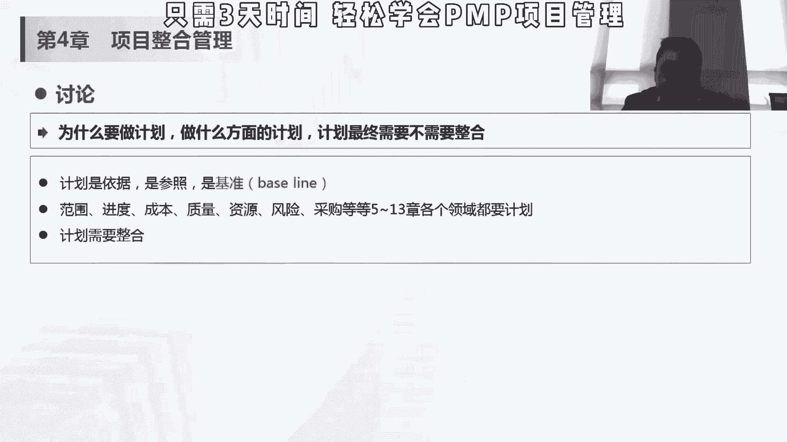
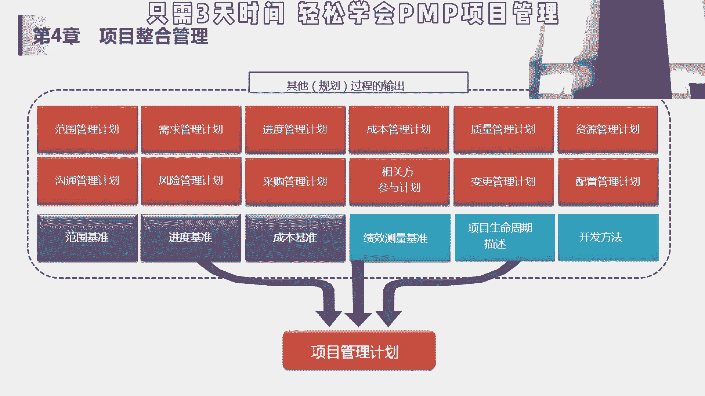

# 【PMP 项目管理】12 项目管理精品课试听   中文教程 PMP入门教程 学习视频 - P1 - PMP小雪球 - BV17c411M7Vu

然后会议对吧，会议也是一个工具嘛，大家开会讨论是各种各样的事情，所以这个是说我们制定项目章程的工具，输入是这个协议和赛季法，那最终输出就是项目的章程，项目刚刚才讲了，是正式批准成立。

是项目经理的上网宝店，通过授权了包含的内容，刚才其实也讲过了，这里面有一个项目文件叫假设日记，假设日志里面含两块，一个是假设条件，就是制约因素，假设条件是不需要验证即可视为正确，真正或者确定的因素。

那如果这些因素不成立，就遭到他们潜在的影响，我们现在大家来考p，就尤其是备考5月的偏僻，大家的一个假设条件，就是5月的pp可以正常的明白了对吧，我们不用验证，我们就可以认为是政府了，如果认为它不正确。

我们可能就不做这个项目，不做学习编第一个项目，然后在实际的这种项目中的假设条件呢，我们会经常会写一些什么东西呢，客户要用的这个技术，要用的这个比如说产品，哦我们比如说我们现在要开发一个多小程序。

那我们假设条件就是说我们小程序只支持ios，不支持安卓对，因为这个客户只要安卓，不只要ios，不要安卓，那我就写这是假设，如果假设成立不成立的话，会造成什么影响，透透明，就说客户想加安卓了。

那我我怎么办，我大概是做两套程序，还是用那种，说一套程序被发布在两个上面的东西，这个假设条件对我来说非常重要，一旦不成立，会造成很多潜在的隐患，一定要写清楚，不写清楚，到时候回头有人说诶。

我要求是手机对眼不大，也有ios安卓，还有以前的那什么老tip，这个你就废了，制约因素呢是对项目或者过程中执行有影响的，限制性因素，有的时候我们会写，10月1号到3号法定假日，即便是工作日。

我们也没办法改变，我们会写在这里对吧，有的时候尤其对国外的项目，我们给日本做项目，我们会把日本的这个假期和中国假期都写了，但主要会写中国的假期，因为在中国假期里面，我们是不工作的。

我们算这个工作日的时候，算这个进度的时候，我们不会把中国的假期算进去了，但是我要跟客户说清楚，这会制约对吧，因为在这再低，我不能给正常来说不给员工三倍工资嘛，要不加班，要给三倍，no。

然后这节课我要正常给大家放假，这就不能排到我们的项目周期里面，这些就是制约因素，但是这些因素如果放开的话，可能对下面会有正面的影响，哎假设我们3号不放假了，我们三个上班，这是我们项目多一天嘛。

工期多一天，那我可能对这个项目我更多的有更多的八份，有更多的这个转盘的余地，所以在那个制定项目章程的时候，除了项目章程以外，会有这种假设日志，但是大家记住，假设日志里面会有假设条件和资源优势。

假设条件不成立的话，一般会对这个项目产生一些威胁，如果是制约因素不成立的话，可能会给项目产生基本产生正面的效果，在这一章里面就是这一节里面的一个重点，就是4104和4105这两个技术点项目。

扎可项目当成里面包含什么样的内容，然后还有一个假设，优质假设式的重要性可能没有这个项目当很高，但是也会出这种题目的，这是我们讲的这个第一个哈启动过程组里面的，制定项目章程，然后，计划。

我们讲在计划这个官方讲的是叫规划，那为什么要做计划，计划是依据是猜到吗，老板问你诶，你现在过得怎么样啊，你下面是延期了还是超前了，成本是超支了还是范围内，都是需要跟计划做比较的对吧。

而且现在的现在的管理，基本上我觉得所有东西都是一个代名词的，我们讲pb ca plan，do check action，先做计划，然后去执行，然后再check check这个计划做的怎么样。

如果偏离的计划的话，我们要采取手，其实整个我们讲的五大后程股数字也不一样，启动规划执行监控收尾，他只会把那个我们讲的这个c和a放在建构，就不对了啊，这两个c是不分家的，所以我们一定要有一个依据。

有一个我们机械机械我们叫英语叫baseline的基准，那我们后面会讲，在项目管理计划里面会有三个基本，然后呢这些计划是需要对有12个字，计划有三个基准，然后这些计划你需要整合的，这个整的好理解哈。

那我范围如果增加的话，我进度和成本肯定要不要给他增加了啊，那我成本超支的话，我等下可能要压缩一些东西，但是一些资源或者在这个是需要各个计划之间，也是需要整合的，所以呢在这个项目整合管理里边。

这第二个过程组就是制定项目管理计划，它属于规划过程中的，定义准备和协调项目计划的所有组成部分，并把它们整合成一份综合的，项目管理计划的过程，生成一份综合文件，用于确定所有项目工作的基础及其执行方式。

可以是概括，也是可以详细的，取决于项目的具体的要求，你看他这里面就提的是说，协调项目计划的所有组成部分，把它们整合为综合项目管理计划，他并没有说我们要做一份综合管理计划，项目管理计划里面涵盖的内容。

所以呢它是一个汇总的过程，它本身并不是一个单独的管理，对方，他是把这是上面讲的范围和需求管理的话，我们可以在第五章讲进度，第六章中本，第七章质量，第八章资源，第九沟通，第十重点11 12。

这采购四三是相关方参与计划，变更管理计划和配置，管理计划会在这个第五章里面，它是一个子计划，这12个计划在其他的这个知识领域里面，计划完成之后，在这里进行汇总，这些计划之后。

我们会产生三个基准范围的baseline，进度baseline和成本的baseline，再加上绩效测量的基准，我怎我怎么去测量我的这个进度计划，只能去测量我的成本计划，能用什么去测量。

下面生生项目的生命周期和开发方法，我到底是用预测方法还是用敏捷，然后是用什么样的阶段去做这个事情，他们是他们是其他规划过程的输出，汇总起来做个项目管理计划，所以它叫整合吧。

有人说把这个项目管理计划相当于，这里有18本书，别人都已经把书编好了。

我把这18本书整合了一下。