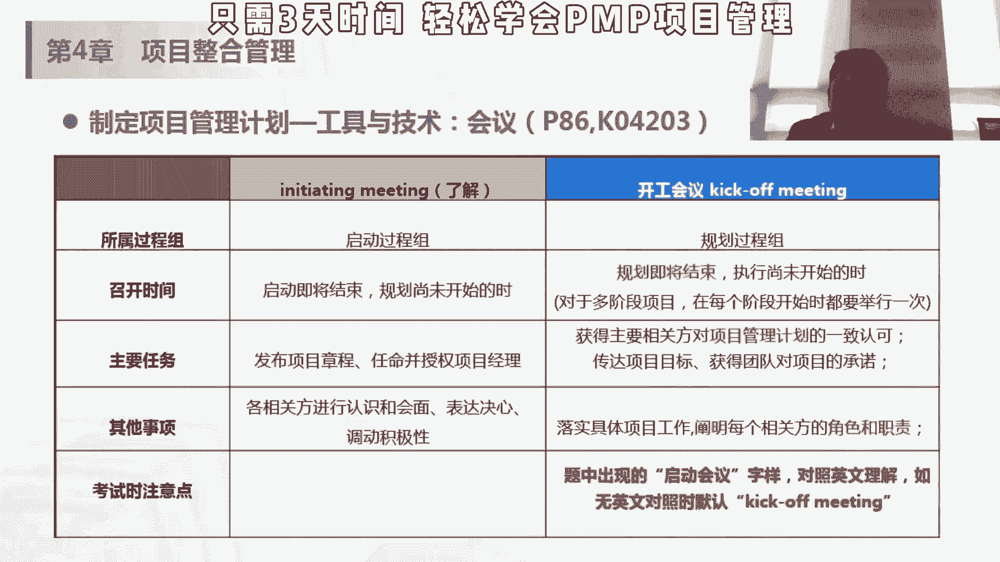
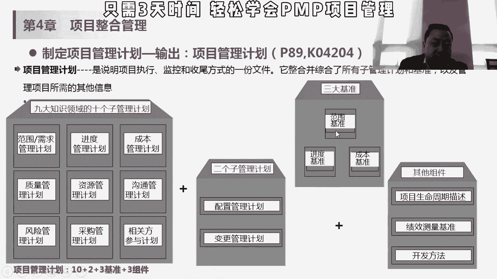
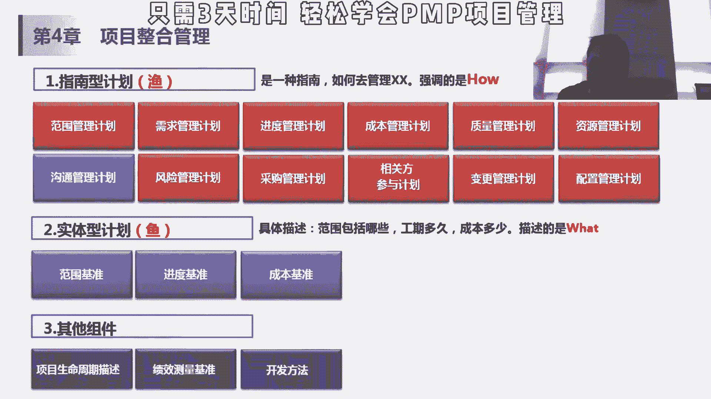
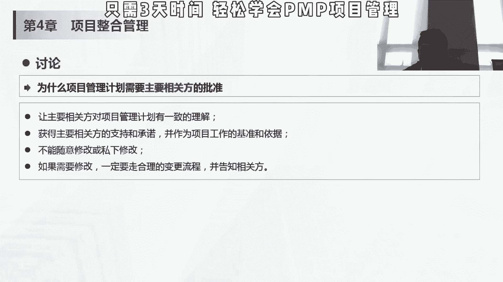

# 【PMP 项目管理】13 项目管理精品课试听 中文教程 PMP入门教程 学习视频 - P1 - PMP小雪球 - BV16X4y1i7RX

第二个项目计划的话，尽可能的话是要有项目团队参与会更好，项目的团队参与的话，会提高他们对这个项目的承诺，这个项目这个设计估了三天，将来女方老师说哎我过了三天，我就得按三天晚上做出来。

我过两天冯老师不认可，说这个明显是三天的活，你项目经理压我，你就压我两天，他可能还是按照上面的去做，他不会有这个承诺，而如果他参与的话，比如说在这个阶段，我跟黄老师咱们商量一下，其实我说过了，黄老师。

其实两天这个算没那么难，两天也能做，觉得你看第四天上海跟我沟通，说明对我还是比较重视，然后他就说了一个道理，两边做也不是做不了，那我就改天做出来，那这次可能到时候做的时候，可能两天就做出来了。

如果没有参与这个过程，可能这次会出现我过两天这样做，三天就做完，三天做，这样的话这个像计划，我玩两天多的地方就会有偏差，所以呢它会有一个在这个过程中，会有一个传达项目目标。

然后呢获得团队对项目承诺这样一个过程，那也是提提醒，就是团队尽可能的参与这个规划，但是通常有的时候可能项目不是所有人都到位，在规划阶段不是所有人都到位的话，有的时候可能还是需要在执行阶段。

项目经理对这个项目团队进行一些说服，后面我们讲冲突管理的时候，会有这种，所以这个take off meeting嗯应该是必考的，这个考点，但是大家记住这方面是在规划过程中，已经说明星的话。

这个大家应该一般不考，大家了解一下就行。

然后它的整体输出呢就是我们讲的刚才，九个知识领域的十个管理子计划，然后两个子管理计划啊，十个指管理计划和两个子管理计划，一共是12个管理计划加三个基准范围，提升进度，集成成本，利润。

和其他组件项目生命周期描述，绩效测量基准开发方法，如果问你，我们这个项目到底是用预测法还是用适应法，这个在哪定的，在项目管理计划里，然后呢是说诶我们怎么去度量成本，我们到底是用人月去度量成本。

还是用额人民币，还用dollar，是度量换成货币是度量成本，这个东西也是在项目中的一个环节，别的地下测量的一个梯子啊，关于象征物周期分多大阶段，每个阶段做什么事情，有有哪些这种我们讲那个阶段关口吧。

审核和这个决策，那这个是关于上升周期的这个描述，也是在这个项目管理计划里面，目前为止我们知道这个事情就可以了，12个指管理计划，三个基准，其他组件在这里，那接下来我们讲后面的话。

会把这个三轮管理计划和三个基准，从从头再讲一遍。

所以呢这个管理计划呢他也是，去分其实是不太一样的，第一个就是指南型计划，教你如何做，强调是how这个have里面这些里面没有真正的计划，所以没有真正计划，就是范围管理计划是告诉你怎么去管file的。

但是呢范围的这个最终的实体性计划呢，就是我们讲的这个范围基准，大概哪些是我们属于我们范围的，那进度管理计划是讲我们怎么去管进度，我们用人天做单位，还是什么样一个力度，做单位去去做管理一个进度。

那最终我要排出来的这个项目计划，放在某个时间段内的，比如说从6月3月份到5月份，我们做p p的这个认证班和3月份到4月份，我们讲前面五天的课，到后面怎么去做，这个属于进度基准。

它是放在这个实体性计划里面，包括成本也是一样的，这这些只是强调怎么管，但是真正，计划出来的东西，或者说将来我们作为变更变哪些东西的话，基准进度基准和成本基准，后面我们讲的时候，你看一个规划过程组。

大家看这个讲义行不看我们这个塑封这个材料，那规划过程组里面你看在范围，项目范围管理里面有绘画创业管理，收集需求，定义范围，创建w i p s，一直到创业打开b s为止，我们才能出现我们的范围基准。

才能出现我们刚才讲的这个实体编辑化，但是你说范围管理计划，他只是讲如何管道的，那你像进度计划一直到6。5，制定进度计划的时候，所有这个五个过程完事之后，才能得到一个进度基准，那成本基准也是在7。1，7。

2，7。3之后得到一个成本基准，所以这个大家区分一下，这个子弹型计划和实体型计划方案，其他主页就可以了，三点水那个1万是讲的如何捕鱼嘛，是how，然后那个没有三点水，这个云是假的，真正的实体。

真正的鱼是what，这块肉这刚才讲那个指南形和实体型的话，其实刚才我们对所有规划过程都是适用的，对一般来说，计划里面没计划是指的，计划里面他讲的是怎么做，具体的计划是在这个范围基准其他里面去做的。

这个我们后面一直会强调的，这个考试应该不考，但是有助于理解我们这个计划和基准，它们之间的这个差异差别。

你看这里举了一个例子，进度管理计划，那我们讨论方法论和工具，我们用project这个软件，用关键路径法来排进度，那我们准确进度呢每个活动重复两天，那计量单位是天，我们cos临界值在进度偏差5%以内。

我们认为是可以ok的啊，可以接受的，肯定会解决，进度超过5%的话，需要及时纠正，但是真正的进度基准是这样的，我们在什么时间做什么事情，这是排的真正的进度计划，所以你看进度管理计划是告你怎么管。

然后呢进度基准呢是实体的，告诉你具体的分配到人呢，或者说分配到具体时间了，由谁来做什么什么事情，然后我们讲项目管理计划做完了之后，一定要相关方的这个批准，或者是主要相关方的批准。

会有一些题目考完了去考试，说诶我我项目计划已经做完了，我下一步要干嘛，是需要相关法来批准的，确保大家对这个项目管理计划的理解是一致的，然后呢这个批准了的这个计划的话，会作为主要相关方支持和承诺。

然后也会作为我们下面工作的一个baseline，基准和依据，不能随意修改，如果需要修改的话，一定要走变更流程，并且告知相关方，我们一会在这个4。6整体变更控制，实施整体变更控制里面会讲在什么的情况下。

我们需要走变更流程，变革流程是怎么样的，其中就有一项就是说哎，不管成功与拒绝这件事情要报纸相关通，所以计划不是pm做完就ok了。

