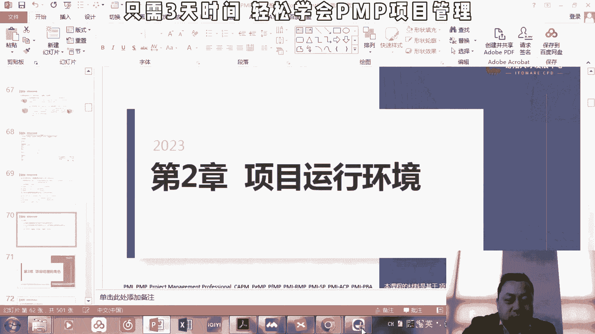
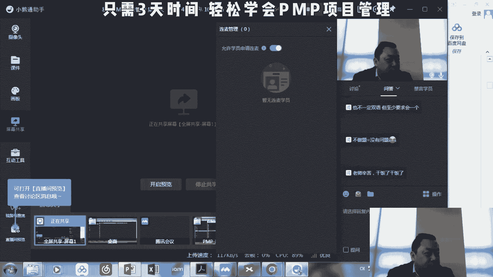
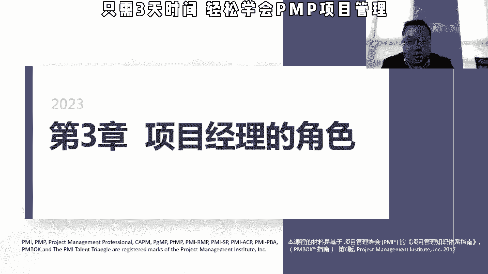

# 【PMP 项目管理】9 项目管理精品课试听  中文教程 PMP入门教程 学习视频 - P1 - PMP小雪球 - BV1gh411T7WV

好啊，我们上午超时了五分钟六分钟。

然后我现在开一下麦，看看大家有没有什么问题，刚才讲那个矩阵英雄的绝对是打架的，这个来源，出来的项目你要需要资源，然后那个谁也是需要资源，职能部门经理也需要资源对吧，我这还摊事呢。

为什么会坐在上面的i h a p里面，不经常会有那种关联用户吗，关键用户比如说它是file的这个部门的这个主管，但是很很显然他是一个资本经理的职能部门，下面的日本一个人对吧。

他就想哎我现在我要去给人工付工资，你要正常开着，你就放一个什么优秀，都是老师太开了，让我们管你，我们还没有前面，就单举那个例子吧，如果他是他肯定说哎我现在手上还有一堆事儿，你你你你你连接a b项目。

你来找我，你得看我视频对啊，如果他老爸说哎这个项目很重要，要以sp这个这个顾问这个时间很为主，那他可能在他他从同时承担自己的这个职能，和这个项目这个角色的时候，他就可能会有项目一个嗯对的。

这个是我们经常碰到的例子，你找客户都不会理你，我一直以排在我身上，说我在下面听说过什么叫项目效果，这个效果还没买，然后就这个没有完全完全完成这个项目，然后说你在pp里面。

一般来说是说你也要说你这个项目经理，要评估这个人的这个影响啊，如果是实在不行，拿走的话，并不影响被影响的报表相关的话对吧，你你别再从我这拿，那你就影响你，你要先把那客户能不能接受，大家都接受。

其实可以嗯，但如果不接受的话，那就双方battle吧，看谁能能其实有点大，就是有点小，他不会这种考虑，不会考虑，你说必须怎么样，他就说在这过程中，你要应该怎么样评估变更，评估影响。

呃那个留言信号说不做题等于没有问题，可以啊，就因为我每次讲完之后呃，我们那个刷题小程序都会给大家里面，每章会有不同的题目嗯，但是大家会发现，其实如果我讲的知识点你大概听懂的话。

那个题目大概百分之六十七十，应该是直接有答案的，但是会有个别题比较绕，这个会可能会选错，行，那我们今天上午就到这里，然后我们下午一点开始，我们讲第三章和第四章，说明第三章也相对比较简单。

但第四章那个整个管理就相对重要的，知识点也比较多，考点也比较。

那我们开始下午哈，项目经理的角色，项目经理的角色，这一章没有太多的考点，所以我们就基本上快速过。

所以什么是项目经理，项目经理是由执行组织，委派领导团队实现项目标的，个人执行组织，就是我们这个项目所在的这个组织领导团队，实现项目标，其实我讲了哈，其实项目经理更多的是一个执行层面。

看他对这个项目的立项，像我们讲的商业论证啊，那个效率管理计划啊，这方面的话它是没有太多的发言权，但他可以建议啊，那项目的主要职责是专注项目目标的达成，这个大家可以理解哈，然后职能经理。

就是我们今天上午讲的这个矩阵型的，包含着是说集中型的这样的组织架构，里面的职能经理呢，他会专注于某个职能领域，和业务单元的管理和监管，比如说我们讲的是财务主管，他更多的是关心公司的这个啊总账啊。

应收应付啊，然后，公司的这个财务报表啊，公司的公司的现现金流水啊，他不大会关心你项目的这些东西，运营经理，那我们上午讲运营和项目的区别，项目是独特性的，临时性的，运营是重复性的，持续性的。

那运营经理主要是说专注业务，运营效率的提高，比如说我同样的成本，我举个例子，我们以前是做那个呼叫中心预演的，那我同样是接1000个客户的电话，我的成本大概是多少，能不能提高10%，那同样的这个事情。

它主要是考虑它的效率的高与低，所以其实不同的经历，他的这个的目标和专注的领域是不一样的，那我们讲项目经理是不是说要是个全才呢，他不他没有办必要去承担项目中所有团队，项目团队的角色，但是呢要有管理的知识。

就比如说我们现在p n p的知识，技术知识，理解咱们相关的经验，更多的他像一个指挥家，他说我我协调我们这里面的各个部门的人，技术部门啊，销售部门，财务部门，各种职能部门的人来一起实现整个项目的目标。

他没有必要说诶，我是财务方面的专家，或者说我是销售方面的专家，但是他要有相关的一些知识，所以呢项目经理在它下面的一个叫项目团队和，项目团队的话，是需要有相应的知识，项目经理的影响范围。

其实这个大家不用记哈，这个虽然我标了题目，但这个基本上应该不会考的，那在项目中我要管理项目的目标相关方的期待，我在主持里，我要提高这个自己在组织里面，总体项目的这个管理和能力，我不但要自己要能量。

要ok我要帮助组织其他人去呃，帮助或者说给po更多的这个建议，来提供一些实践，那我是作为项目经理，然后我要了解行业的动态，行业的发展，我要做这个持续的传递和整合，还有一些跨领域其他的东西嗯。

这个大家不用背，这个不会考，大家理解一下就行，那这个的话，我觉得这个是这章的一个重点的一个知识点哈，pm人才的这个三角形，所以三角形我们看左边叫技术，项目管理技能，技术项目管理技能怎么学。

就是p m p，我们学p p就是学这个管理相关的知识，能够有效运用项目知识，实现项目级或者项目的预期成果的这个能力啊，做一个人的项目管理能力越越强，在这方面知识技能就越强，那战略和商务管理技能。

那我们强调的是说，pm虽然它使用在战略或者这个层面去做决定，想发起人啊，或者说公司高层做这个决定，但是他有必要去follow跟随公司的这些相关的战略，对吧，我们讲这个公司的战略在最上面，然后是项目组合。

项目集项目，但是我们讲项目经理的话，他有必要去理解这方面的战略和商务管理的，那有的人说这块的话主要还是一个行业知识，其实我觉得行业知识可能不是特别准确，更做的是说我管好自己的一摊之后。

我要对公司整体的这个业务有所理解，公司的方向有所把握，这样的话我这项目不是闷头做，当公司的战略和其他方向需要变化的时候，我能够根据这些东西进行对项目进行调整，要紧随着公司，不能说公司战略是一方面。

一旦改变了，我还按照原来的方向去做，包括一些商务的这种管理能力的话，我觉得是说会有一些，因为我们在第12章会讲到一些采购的一些管，理，采购的话可能是说我们对我们外采资源对吧，我们作为嗯甲方。

我们作为这个购买方。