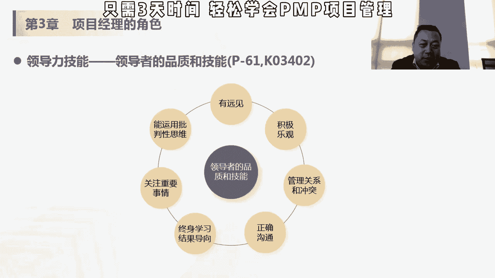
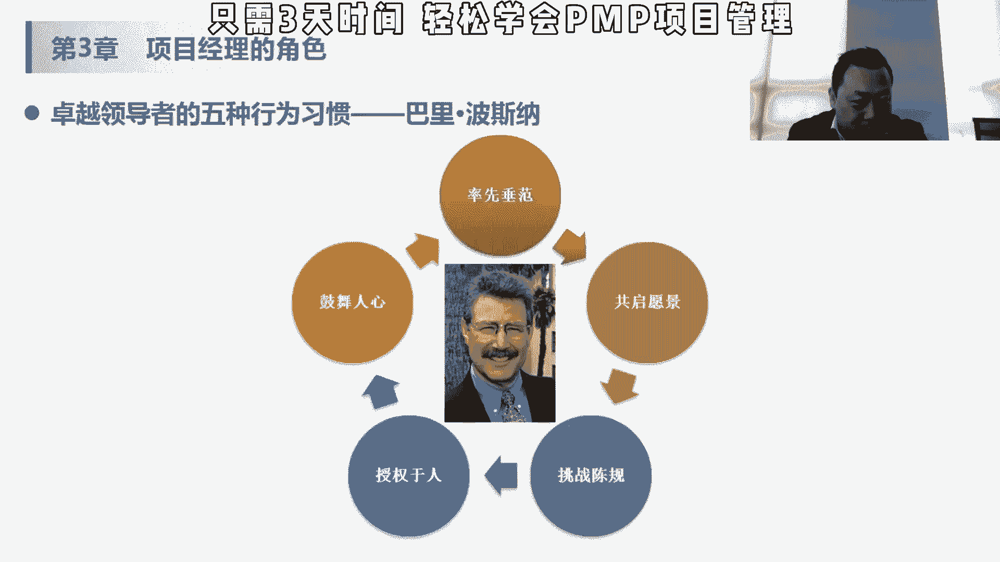
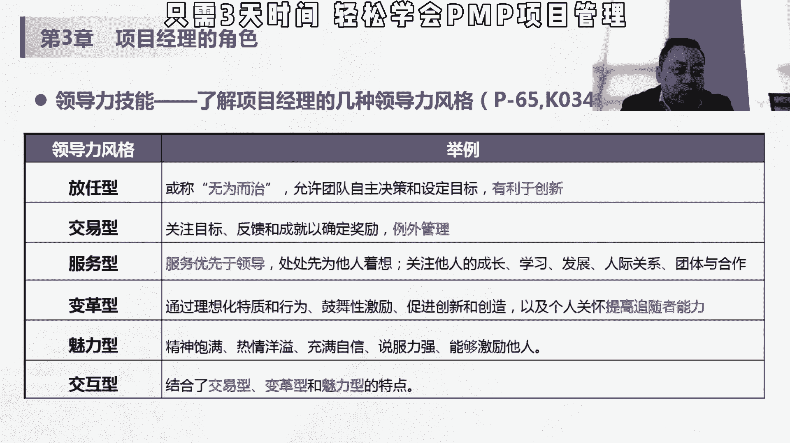

# 【PMP 项目管理】9 项目管理精品课试听 中文教程 PMP入门教程 学习视频 - P1 - PMP小雪球 - BV1Hj411X7rP

有一些商务管理方面的合作，那通常来讲我们做项目管理的话，一般来说我们是乙方，那么乙方的话跟甲方，其实除了这个项目之间的关系之外，肯定还有一定的是商务关系，那这方面的这个技能也是pm需要具备的。

第三个领导力的这个技能，别打力的技能，指导激励和带领团队的这个能力，一般来说是情商嗯，这一块的话很难通过培训来提高，更多的是说你在不断的学习过程中去实践，请模仿对吧，一般一个公司的这个销售。

就是一个领导力技能比较强的一个人，他可以让你客户说话办事都觉得非常舒服，然后让客户觉得你很专业，觉得你我购买你的产品和服务的话，我比较放心，那这个的话我们可能很难通过书本去讲授哈。

那更多的是希望通过模仿啊，通过实践这样的去积累这方面的经验，但是你可以知道是说我在哪些方面会有所欠缺，要怎么样去避免自己的短板，这p y这是一个三角形，这个不会考原题，不会考你三角形就代表什么。

但是大家要理解就是偏僻，我们对应的是技术项目管理的这些技能，那他要承上启下，所以呢他要了解公司的战略，那他要对于作为购买方或者说乙方14方的话，还要跟甲方的这种商务有往来，他要作为这个。

他要跟给他的供应商会有一种商务一些技能，然后呢在这个过程中体现自己的领导力的技能，主要体现自己的一个情商，嗯然后这个领导力领导者的品质和技能，大家理解一下就可以了，有远见，我要跟随公司的战略，永远厌恶。

然后积极乐观面对事情的时候，不要过分悲观，管理关系和冲突，因为今天上午我们讲了这个，尤其是那个组织结构对这个项目的影响，职能经理和项目经理之间，会被这个资源会有些冲突，所以这部分的话。

那包含这个项目项目团队内部对吧，会有一些冲突，比如说那个团队期间成员，互相不服啊，然后对这个呃同样的一个东西有不同的见解呀，那其实你作为这个领导者，你你实际上处理这些方面的这个冲突了，那正确沟通。

那我们在沟通这个沟通管理里面去讲，我们以什么什么频率跟谁，拿什么信息去跟人家沟通的，终身学习嘛，这个p m p也是蔡老师说你后面还要学习，还要攒p p o，然后还要更新p mp的这个认证。

关注重要的事情要是第一嘛，先做重要的事情，能运用批判性的思维，指的是别人给你汇报一些工作的时候，你要能够有逻辑性的去看出来，这个东西到底是有问题还是没有问题的，不要别人讲什么是什么。

你要有一个独立的这种批判性的角度，去看待这个问题，它是符合逻辑的，不符合逻辑的会有什么样的问题，这个大家理解就可以。

不用背，也不会考，这五个习惯这个大家知道不用知道，这个背这个领导力技能里面的项目经理。

这几个权利的话，这个呃之前有考过，首先那个项目经理呢，他肯定是说是被组织授权来做这个项目的，一会儿我们讲那个项目章程的时候就会讲嗯，项目章程主要是说对项目经理进行授权，所以呢他会有一些正式的权利。

因为他是项目经理，所以他可以要求项目团队做做什么事情，或者不做什么事情，那由这个政治权利的话，演变出来的就是奖励的权利和和惩罚的权利，哎我可以给你哎，你项目做好了，我可以给你奖励。

或者说给一些非物质的性格奖励啊，比如说哎你你上班了不用打卡，早来点晚点晚点来，你也做的不错，我也不看，二你你你就这是给你的一个非物质的这种奖励，惩罚权利要慎用，一般来惩罚权力会带来这个下属的这个抵抗嗯。

尤其现在这个号称零零后整顿职场，呵呵你别pm整顿，没整顿好，你整个整个项目被他整顿了，所以那个惩罚权利呢你是有，但是还是要尽量的少用，那这个是我们讲的政治权利，那你有一道题是问a我，你你的职能经理。

要求项目经理去跟某个人去谈话，其实这个时候他就是用了正式的权利，因为职能经理是你的这个上司嘛，然后他要求你做什么事情，是因为他在那个位置，所以会要求你去做这，那专家权力是最好说。

我这个人就是这个方面的专家，我带团队哎，大家都听我的信服，我对吧，我是技术的大拿，那个我我提出的方案大家都认可，这个时候其实你要求他人的忠诚，就相对比较容易，但是呢因为我刚才讲的。

不是所有的项目经理都是某一个行业的行业，所有行业的专家，其实如果你是说我这个人工作20年了，我是管理好好那个专家，那你说什么东西，大家可能按照你的管理方式去做，这个确实有可能。

但你说我我是管理方面的专家，我要求这个技术专家取认可我的这个专家权，这就是很难的，然后还有一个种我们叫做参照权利，这里面讲的比较晦涩哈，或者前四权利来自于项目经理，个人吸引他人并建立起的。

他人对自己的忠诚的这个能力，呃，我我举个例子吧，就是说首先这个产生的权利不是专家权利，不是说他自己有多能，也不是说政治权利，别他他正是在那个职位上给他的权利，举个例子。

就是以前大家为什么就是看看一些古装剧哈，你说为什么太监的权力那么大，他有政治权利吗，没有他没有一个正式职位，他没有一个专家权利对吧，但是呢他有一个参照权利，他在皇帝身边，他说话，皇帝听他的权利就很大。

所以参照权利你就就是这样的，就是背后有人嗯，你说你跟某某总裁是，以前我们那个在戴尔的时候碰到一个case，有个人要换了个电脑，按照规规定不能换，后来听说他是我们老板的邻居，他的关系特别好。

这种狐假虎威对吧，你你说他找到老板把这事办了，你也很痛苦，还是说你现在就把这事办了，所以我们讲这叫这个参照权利啊，你就说背后有人狐假虎威，他来到这个权利并不来源于他自己，来源于他。

他背后的人或者其他的这种，你对这种几种权利的话也有可能会考嗯，所以慎用这个讲信用，惩罚最好是专家啊，奖励可以多用，然后领导力风格，领导力风格的话一般不会直接考，但是大家还是要了解放任一些，无为而治。

允许团队自主决策和设定目标，有利于创新，就是这个东西啊，说白了其实也不认为嗯，项目经理你你就一定是对的，因为创新嘛其实你也不清楚什么是对，什么是错，这时候你有可能是说，为了激发大家的。

这个整个团队的这些创新的点子，你会选择这个方任性，一般如果考的话，会说哎这有个创新项目啊，然后怎么怎么样啊，这个时候那个项目里最好用哪种领导力，交易型呢，关注目标反馈和成就以及奖已确定奖励。

另外管理交易点是什么意思，嗯有的时候可能比如说用在销售这边，哎你销售达到什么目标。

我我给你什么样的这个奖励再更高了。