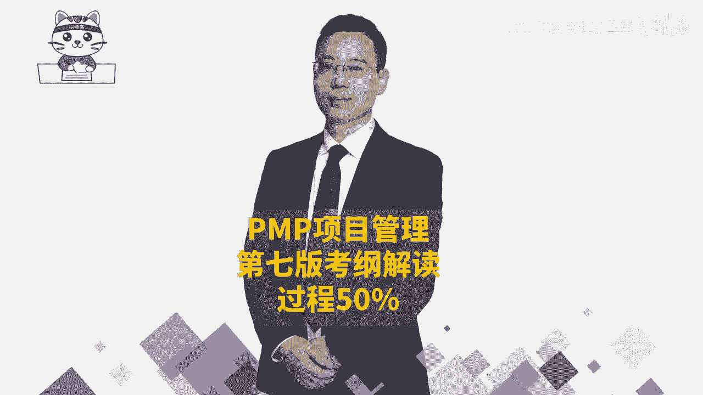

# 【PMP指南】PMP第七版考纲三大板块之过程50%大咖讲解，新手如何了解PMP详细教程 - P1 - PMP项目管理那些事 - BV16Ue4e9EeA

大家好，接下来我们一起分享的是PMP考试，第七版考纲，在第七版考纲中，它是按照人员过程和商业环境这三个维度来去，按照分数计分的，那么关于过程这个板块呢，它考试占比占到了有一半50%，占90道题目。

如果说我们已经是看过了关于有呃资源呐，然后沟通啊，干系人呐，范围呀，进度啊，成本啊，质量啊，然后以及整合呀，风险啊，采购啊，看过这些内容以后，我们再来看过程这个板块，它的这些考纲你会发现。

其实大部分你都很容易理解，而少部分不太好理解的东西，我们在后面的敏捷中会展开来讲到。

我们一起来看一下，那整个过程这个板块呢它就是涵盖到整合范围，进度成本质量，资源沟通风险，采购相关方等这些内容，包括启动规划，执行监控收尾，这些内容中间有少量的内容，它是超出了这样一个十大知识领域。

五大关注，那么它会从这个敏捷，SRON的实践，以及敏捷阶段框架中来得到一个有效的补充。

我们一起来看一看，首先第一个关于过程的任务，叫以交付商业价值所需的紧迫性来执行项目，它里面有一个很重要的词汇叫商业价值，我们做的事情一定是能够去交付商业价值，这样的话那才值得去做。

那首先我们说做项目本身，它是需要有这个商业价值，就是这个项目值得去做，同时在做项目的过程中，我们会在敏捷中还会讲到，他会把要做的功能一个两个三个四个五个，它也会是按照商业价值来进行有效排序。

那么在这种排序的情况下，我们优先做那种价值比较大的，然后再然后也会有这样一个过程，那么这里首先第一条就是评估机会，以便增量交付价值，所谓增量交付也是在敏捷中会讲到的一个内容。

就是我并不需要把所有的东西全部都做完以后，才交给客户，我们是先做了一些有用的东西就交给客户，然后再做一部分增量交付，再做一部分增量交付，所以他给的是说评估机会来去增量交付，能够持续交付好。

第二个要检查整个项目的商业价值，就整个这个项目本身是值得去做的，以及每一个具体要做的内容，他是值得去做的，第三个支持团队根据需要来细分项目的任务，以便找到最小可行产品，这也是在敏捷中会讲到的一个内容。

就是我们的这些东西，很多的情况下，我并不需要把所有东西都完成再交付，我们先做一个所谓的叫最小可行产品，Minimal viable product，叫MVP，我们先做一个MVP来看他是不是对付对方。

是需要的有用的，然后在此基础上面再去丰富，再去增加，所以他这里面的话更多的是这种增量交付，迭代交付，然后持续交付MVP的这样一个思想啊，其实关注焦点是商业价值，所以以交付商业价值所需的这个紧迫性。

这个所谓的紧迫性其实就是有有序的排序，OK根据它的这个商业价值，有序排序来执行项目好，第二个任务呢叫管理沟通，那你如果已经是学过了关于沟通管理的话呢，就比较清晰。

你看首先是分析所有相关方他的一个沟通需求，他是在什么时候需要信息，需要什么信息，以什么样的方式来去给他等等，你把这些沟通需求搞搞清楚以后呢，我们就去可以做一个沟通管理计划对吧。

唉就一个沟通策略的这一个计划好，第二步是确定所有相关方的这样一个沟通方式，渠道频率详细程度，这不就是把他这沟通需求再细化到这样一些，细节的方式，渠道频率和详细程度吗，好第三个有效的沟通项目的信息和更新。

这个呢相当于说是收集沟通的需求，这个是做一个沟通的计划，而这个就是落实沟通，去执行沟通，去管理沟通好最后一条，确认沟通是否有效并获取反馈，这是在监督沟通，看监督的有效性。

所以你会发现整个这样一个考纲中的，关于沟通这一个板块，它就是跟我们在十大知识领域中的沟通管理，几乎是一样的，好，再看到第三条，第三个任务呢，评估和管理风险，他讲的就是要去确定风险管理的可选方案。

以及迭代评估和排列优先级，怎么讲呢，首先就是我们在做项目的过程中，风险是不可避免的，如果产生风险，我们应该是要去想到一些方式和方法，来去应对它，那么整个在风险管理中，我们说先去识别风险，再做定性的分析。

对风险进行排序，然后再做量化的分析，对风险有更深的认识和了解，然后再去规划风险应对，然后呢再去实施风险应对，然后后面是去监督风险，那么整个过程这就是所谓的确定风险管理。

他的这些可选方案就是包含了这类内容，后面一个要说迭代评估和排列优先级，其实所谓迭代评估也是持续的过程，那我们在你整个风险管理中有一个监督风险，它也会强调我们要持续关注项目的这些风险。

有没有新的风险产生啊，旧的风险是否已经过时啊，这都是在做迭代的建议过程，并且所谓排列优先级是我们在做定性风险分析，对的优先级排序，所以整体来讲这样一个任务三，它就是跟我们的风险管理是相一致的。

接下来我们看到任务四叫相关方参与，其实也就是要去争取相关方的参与，让他更好的去支持项目，让他抵制变得更少，那我们来看，首先第一个叫分析相关方，包括他的权利，包括他的利益，包括他的影响作用。

然后可以用权利，利益方格等这些方式来去分析这些相关方，他在什么位置，他对这个项目的一些影响和权利是什么样的，然后从而能够去有效地把相关方进行分类，也就是第二句话，对相关方进行分类。

这个维度的人员我们要重点管理，然后这个维度的人员我们要如何如何，这个维度又如何又如何，对吧好，第三个就是按照类别来促进相关的参与，其实也就是说根据你的分类的方式，对不同的方格里面的人员。

我们有一套自己的这样一个应对的规则和方法，来去有效地去管理它，最后一句，制定执行和确认相关方参与策略，其实也就是说我们去落实相关方参与策略中的，这些个东西去执行，并且如果发现做的不够好的地方呢。

我们可能需要去做相对应的调整，这就是整个跟我们的十大知识领域中，相关方管理这个板块是完全匹配的，好在接下来呢会看到一个叫规划和管理，预算和资源，那这就是既会考考虑到我们的这个成本管理。

同时呢也会考虑到我们这个资源管理，我们一起来看一下，但重点是在成本管理，您看，首先第一句是根据项目范围和从过去的项目中，来汲取的经验教训来估算项目资源的需求，也就是说我们这个项目需要什么样的一些资源。

需要多少数量，OK这就是我们在资源管理那一章节里面，其实会有去估算资源，对吧好，接下来是预测未来预算的挑战，所谓预算挑战，其实说我大概可能需要多少预算，以及可能会存在哪一些风险，那么对于这些风险的话。

那我们可能还要再多花多少，这样一个呃成本的储备，或者是预算的储备来去做，这就是关于对未来这一个估算啊，预算啊，估做的这些事情，下一条监控项目预算偏差，如有需要根据治理流程来进行调整。

也就是我们像用政治分析啊之类的，这样一些方法来去监控，看目前的成本是超支还是节约啊，如果说成本超支的话，我们该采取什么样的措施来去有效的处理，可能需要去动用这样一些应急储备，而动用一些管理储备。

肯定要去做一些申请之类的，这是我们再去控制成本好，后面还有一条规划和管理资源，这一来到我们资源管理这个专业中，我们已经是大概知道要多少资源，然后呢，我们该如何去有效地去利用好这样一些资源。

我们该如何去打造团队，建设团队，让这些资源能够更更有战斗力，来去完成某些事情，所以这是既考虑到这样一个成本，也考虑到资源管理好，再看下一个叫规划和管理进度，你看这里就是重点管理进度。

他第一句话说估算项目的任务，其实也就是估算他的这样一个工作量咯，然后估算工作量以后呢，就能够估算出时间咯，能够去列出这些里程碑节点呢，然后他们的这样一些内部依赖关系。

外部依赖关系FSFF整这些依赖关系啊，还包括说故事点，故事点呢是我们在敏捷项目管理这一段，会再展开讲的这样一个内容，其实也就是一种工作量，然后会基于这些信息，然后你看第二个。

利用标杆对照和历史数据来去做一些努力，做什么努力啊，类比估算啊，参数估算呐，哎就是这么一回事对吧，就是利用过往的这些历史数据来做类比估算啊，如果有大量的历史数据的话，我们能够得到一些参数模型。

那就做参数估算，然后基于这些个信息，基于它的这样一个呃，比方说是进度网络图和这些估算数据，我们来去做一个进度计划，所以是基于方法论来去准备进度计划，做出一个具体的进度计划。

然后再看这样一个进度计划的进展情况，我们去监控它的这样一个进展情况，所以基于方法论来去度量进展情况，其实你同样的会发现我们在政治分析，政治管理中，他一样可以算出，我们目前是进度是落后还是超前。

未来还需要花多少时间去完成，哎都是有这些，所以这就是我们去做制定进度计划，便是控制进度，在规划和管理进中，还有一个是基于方法论，来根据需要来修改进度计划，也就是我们在监控的过程中。

如果发现进度已经是严重落后，可能需要去对原有的这样一个进度计划，做相对应的调整，这其实也是控制进度的一部分内容，好最后一条配合其他的项目和运营工作，我们在做进度管理的过程中，也需要去做一个整合的方式。

来共同完成一些事情，所以要配合一些其他的工作内容好，这是关于进度管理，我们前面已经是看过了成本呐，资源呐进度，然后再接下来看看另外一个呢是质量任务七，规划和管理产品的质量，规划和管理可交付成果的质量。

OK也就是说我们需要去做好质量管理，那么首先的第一句呢就是确定项目可交付成果，它所需要的这个质量标准，也就是我们在最前面说，制定质量管理计划的时候，在质量管理计划中会包含质量的标准。

然后第二个呢是根据质量的差距，来推荐可改进的方案，那你首先你得要去做一个控制质量，你才能够发现质量的偏差，然后才能够去找到改改进方案，所以这个其实是在控制质量，OK这叫控制质量。

然后在最后一句说持续的调查项目，可交付成果的这样一个质量，那么在这个过程中，如果是持续的过程中的这样一管理呢，就是管理质量，那么也就是规划质量管理，控制质量，管理质量，它都是跟我们的。

在质量管理这个知识领域完全是一致的，好再来往下面看到第八条叫规划和管理范围哦，整体来到范围，其实我们去算工作量也好呀，计算质量也好呀，算这些资源也好啊，都是基于范围来的，那么这个规划和管理范围中。

首先第一句要确定需求并排列需求的优先顺序，也就是从客户这边来去获取，关于项目的一些需求，并且呢需求它一定是有更重要的，其次的，然后再次的，然后基于需求，然后把它去转变成范围，并且对范围呢进行分解来分解。

这个范围我们为什么要分解，因为把它分到更小的颗粒度以后，更方便我们去管控，更方便去管理，肯定跟进，所以呢才要去做分解，比方说创建工作分解结构，那这里还有一个词叫代办事项backlog。

这个呢是在敏捷里面会讲到的，我们在事冠实践中会讲到一个叫产品代办，事项列表，Product blog，还有一个呢是冲刺待办列表，叫spring backloud啊，这是在敏捷里面会再展开，讲好。

后面还有一个叫监督和确认范围，那确认范围其实是做验收，然后还要去监控范围呢，就是关于这个范围的变化，我们需要去走变更的流程，所以整个任务八基本上就是范围管理，然后再来看到任务九。

发现说是整合项目规划活动哇，这里面有一个点你需要去了解，你会发现他把整个我们在项目管理中的整合，管理呢拆分成很多个部分。

一个是整合项目的规划的部分，然后再一个呢是管理项目的变更，它也是属于整合里面的这个实施整体变更，控制的变更，然后再还有一个呢是管理项目工作，这就是执行，这是在整合中的执行。

然后再还有一个呢说确保知识转移，这也是属于在整合项目管理中的这样一个管理，项目知识，那还有一个说规划和管理项目，它的这一个收尾或移交，这是结束项目或阶段，所以你会发现整合就包含在好几个不同任务中。

我们一起来看一下，首先看到还是第一个关于整合项目的规划活动，那我们知道规划其实是plan做计划对吧，就是各方方面的计划，他的，首先第一句说叫强化项目的计划，或强化阶段的计划，因为我们知道房事预则立。

不预则废，如果没有计划呢，这个事情可能会一盘散沙，可能会没有一个依据，没个着落，第二句就依赖关系差距和持续商业价值评估，整合的项目管理计划，首先我们得要知道项目管理计划，它是一个综合性的计划。

它是整合了范围管理计划，需求管理计划，进度管理计划，成本管理计划，资源管理计划等等等等，一系列，有十几个计划，对不对，所以呢，其实首先第一个是我们需要去知道，计划的重要性，其次呢能够去做出计划。

并且能够去评估这个计划是否依然有效，然后我们来看一看，我们后面还要去监控的时候也是一样的，拿了一个结果和这个计划去比对，看是否需要去做相对应的一些调整，所以是基于一些外部的环境的情况。

来去看这样一个计划，它的这个实际情形好，接下来说是分析收集的数据，那这个收集数据是用来干什么，其实很多时候我们收集更多的信息，是为了方便我们去做决策，所以后面有一条说收集和分析数据。

已做出明智的项目决策，那么这个决策里面有什么呢，就是我们要不要改计划呀，我们要不要做项目的一些调整呢，由于我们要不要去申请更多的资源呢，或者申请延长更多时间呢等等，其实这就是我们在做一些监控的事情。

好后面还有个说确定关键的信息要求，其实也就是说，如果我们需要很好的去做这个项目的话，哪一些信息是我重点需要去考虑，哪些是我重点需要去观察和了解的好，这就是在整合项目的规划活动。

我们再来看到任务时呢，管理项目变更，哎我们前面有一个过程叫实时整理边控制，那你看首先第一个预测并拥抱变更的需要，其实也就是说，如果你明确的知道变更他几乎是在所难免的，那如果用预测型项目管理方式呢。

它会有一个叫实施整体边缘控制，我们就要需要去遵循这个边控制的，这样一个过程，那如果在敏捷中，我们后面会讲到敏捷中拥抱变化，他也有一套方式来去拥抱，那如何去拥抱，我们在民中会再展开来讲。

首先要有这个思路好，第二个说确定处理变更的策略，在预测中就一定是实时指令变控制的这个策略，而在敏捷中是一种拥抱变化的，这种策略是不一样的，但他都是有对应的策略，第三个基于方法论来去执行变更管理策略。

也许你有了这个变更的策略以后，要去落实去执行啊，最后一个确定变更应对措施，以推进项目，我们继续有效地去管控，避免这个项目的范围蔓延，避免这个项目做到一种失控的这个状态。

从而能够去有效的把所有的东西都管控在里面，OK这是第十条任务，叫管理项目的变更，再来看看第11条，规划和管理采购，其实并不是每一件事情，我们都能够去亲力亲为的去做，有一些时候。

有一些事情也许是找别人做会更划算更合适，那我们首先了解一下，他说定义资源的需求和需要，我们需要做一些什么东西，然后第二个是沟通资源的需求，我们可能从哪里去获取到，如果有可能说并不会从自己去完成的话呢。

我们就可以从外面去采购，所以第三句，管理供应商或者是管理合同，也就是我们通过这种采购的方式，甲乙双方之间我们需要什么资源，我们提供什么样的资金，他最后就能够帮我们把这个东西给完成好。

这里还有第四条规划和管理采购策略，也就是说我们已经是知道，我们有需要这样一些资源，我们也知道有对应的一些供应商，然后呢，我们也知道要该怎么样去跟他有效的去合作，能够让我得到我想要的东西。

他得到他想要的东西好，并且呢去落实去执行，去执行，就是去发布招标广告呀，然后去开建议投标人会议呀，然后去开标评标呀，然后签合同啊，对吧好，后面一个叫制定交付解决方案，其实也就是签完合同以后呢。

对方他应该是要能够去给我们去落实这些东西，那么他要去制定他一个具体的这个交付方案，也就是投标的过程，投标中他要去提供的这一个好的解决方案，这都是跟采购有关，一般很多时候。

采购呢是站在一个甲方的角度来考量这个事情，接下来看到的是第12个任务，叫管理项目弓箭，这弓箭这个词EFACTOR，它其实你把它简单理解，其实就是组成部分，组成部件，你就像我们的基模块。

基模块里面有很多的组成部件，那么对应的我们在项目管理中呢，也有很多的这些文件呐，这些东西它都是你的一些所谓的叫工建啊，简单这样来理解，那么他第一句说要去确定管理项目，工建的需求内容，时间地点人员等等。

也就是说我们如果是要去产生什么东西的话，一定是需要有一些人在对应的时间，提出什么样一些要求来去做什么事情，从而能够去产生若干的弓箭，我们先要搞搞清楚这一些需求情况好，第二个确认项目信息是否是保持最新。

并且呢所有相关方都可以访问它，其实讲的就是一个重点，就是版本的控制，也就是目前我们所去交付给大家的，这样一些个弓箭，就是这些文件啊，这些东西它都是最新的，但相对应的这一些有权限的人，是可以访问得到的。

好下一条持续评估项目工建管理的有效性，也许我们目前这些工件，它都是处在一个良好的状态里面，然后都是最新的版本，其实我们在十大知识领域中呢，没有特别专门去强调说管理项目工建。

但是呢默认会有一个叫整理这些个经验教训，整理这些组织过程资产，那包括说整理这些项目文件，那这些文件呢其实也就属于我们的这些工件，我们需要去有效的管控好这些东西，而真正在落实项目的过程中。

这些文件它作为一个很非常重要的支撑，而这些工件它都是一个很重要的一个支撑。

然后再接下来看到第13条，确定适当的项目方法论方法和实践，其实我们前面已经大概简单认识了一下，有预测型项目管理方法呀，敏捷型项目管理方法呀，其实即便说是敏捷也好，它里面还会有surround的方法呀。

有什么看板的方法呀，有精益呀，有水晶啊，有那个TDD啊等等这些东西，那么这里面说是要去确定一个适当的，这样一个方法管理，首先第一个评估项目的需要复杂性和规模，如果项目它的规模特别特别大。

那么你用敏捷的方式来搞呢，就不太合适，敏捷它更适合用这种小规模的短时间的，如果周期很长，你还是要一定是用预测的方式，在预测中，你分小阶段的时候可以在内部用敏捷，但是大方向应该是大方向是比较清晰且一致的。

所以公司的这些项目本身的这些特质，它的这些复杂性和规模情况，我们可能会采取的这一些方法是不一样的好，第二个推荐项目执行的这样一个策略啊，有些东西你是自己亲自开发比较合适。

还是说从外面去找一些资源来去帮你去完成，比较合适，还是说你需要去通过一些融资的方式来去，自己做，以及你所推荐的这些方法论，是用预测的方法来去做，还是用敏捷的方法还是混合混合，它是指预测加上迭代预测。

加上增量预测，加上敏捷等多种方式，也可以说是先预测再敏捷，也可是先敏捷再预测，也可是边敏捷边预测，这都是一种混合，那到底是基于这个项目本身，它的这个具体情况和特质，我们来看如何做比较好好再来呢。

在整个项目生命周期中，使用迭代增量实践来做事情，那这个特质就是说如果某一些项目，它本身特质就是是适合用这种敏捷，用迭代这种方式来做的话呢，我们可以考虑用敏捷迭代，这个呢是等会后面在敏捷中会展开来讲。

并且事实上像这里给来说，经验教训是持续的，可以去增加的，然后一些相关方的这些参与，也是我们可能会过程中又识别一些新的相关方，都把它累积下来，风险也是会识别新的风险，然后去阶段性的去处理一些对应的风险。

然后处理完的东西也会做一些新的文档的整理，那么也是一种增量，但事实上呢，我们除了有这样一些过程性的文件的增量以外，我们对于整个要做的工作内容，它是可以去增量的迭代开发的。

所以我们在后面敏捷中会展开讲这一部分，这是确定适当的项目方法论，方法和实践，也是要基于这个项目本身的这一特性，来去选择合适的方法和实践。

第14个任务，建立项目治理的结构，那么关于治理呢，我们在最开始有讲过，我们说韩信点兵多多益善，那刘邦去管韩信，管张良，管萧何这大领导管这些领导们，他属于治理，然后领导管下面人员，他属于管理。

那你大概知道这个意图，整个公司的大领导董事会，他来去给公司定好一套规则和机制，这属于治理，所以这里有一条说确定适当的项目治理啊，用什么样的一种方式去做治理，这个呢其实不是项目经理们干的事情啊。

项目经理都还够不够格，但是你得要稍微了解下，有这么一个思路好，这里还有一条定义，上报的路径和阈值，也就是说某一些事情该如何去处理，我们这种规则啊，路径升问题升级的这个原则，或者说是过程流程这些东西呢。

都会是你治理面提前定好的，那我们要有这个意识，就是这套规则是什么样的，是提前治理定好的，然后再来看看第15个问题，管理项目问题，我们经常会把问题和风险区分来，但是事实上你在后面你会发现。

在敏捷项目管理中呢，有的时候把问题和风险就混到一起来，不严格去区分，但在预测型项目管理中，我们有的是把问题和风险是区分，怎么区分呢，风险是还没有发生，但是将来有概率的，而问题呢是已经发生的。

所以我们来看一下，首先第一句话，认识到风险何时成为问题，何时成为问题啊，他已经真的发生了，或者板上钉钉肯定要发生了，那么这个时候都可以当这是一种问题，当然这句话其实重点不是说，我要知道什么时候成为问题。

我知道是说如果出现了问题，我们得怎么办，那出现了问题肯定是要去找应对的措施，对不对，所以呢如果出现问题，我们可能要去收集更多的信息，然后分析影响，然后再找寻解决方案，然后再去处理解决这个问题。

一般是这个逻辑好，到第二句，采用最佳行动解决问题，以实现项目成功，也就是说出现问题以后，我们要去分析分析原因，采取采取一些措施，然后去落实去处理掉这样一个问题啊，那么并且呢问题本身我们一定要去跟踪啊。

比方说发现了问题啊，要写到这个问题日志里面来，然后去安排给谁，谁作为责任人，然后后面的每个步骤环节对吧，哎这都是关于问题，后面一条，与相关方就解决问题的方法来进行合作。

那么其实也就是我们如果要去解决某些问题呀，也许不只是说靠我们自己的力量就可以，可能还需要靠更多的力量，那么我们有可能是跟别人一起，还有就是可能在做项目的过程中，相关的他自己也会遇到很多的一些问题和挑战。

那我们是需要去主动的帮助他来解决，因为我们是拿了别人的钱替别人去干活，所以要去解决好他的这些问题，所以这是最后一句，说与相关方就问题解决的方法来进行合作啊，这是关于管理项目问题，我们接下来看到第16条。

一共有17条啊，倒数第二条了，说确保知识转移，以实现项目的连续性，首先我们在做项目的过程中，一定会有一些经验和教训，那么有经验的话呢，就可以让下一次做的更好，如果说是一些教训呢。

哎就可以避让下次可就避免了这些事情，所以经验和教训它都是好的事情啊，它都是能够让我们对未来做事情的时候，可以少走一些弯路的这些东西，那这个题标题说的是确保知识转移。

也就是说我们这些经验和教训能够得到传承，我们这些组织过程资产，它能够得到有效的传承，第一句讨论团队类的项目责任，其实也就是说谁会负责什么事情，谁会负责什么事情，你负责这个事情，那么出了问题。

你也比较容易去有的更深的认识和了解呃，能够去总结一些经验和教训好，第二个概述，对项目工作环境的这一个提问，这个点怎么讲呢，其实也就是说你负责这个事情，你要搞搞清楚这个事情是什么样的情况下。

这个事情就可以有效的去开展，可以顺利去开展，其实也就是一种标准启动的标准好，并且你在做这个事情的过程中，如果真的有一些经验和教训，有这些知识的产生，包括隐性的知识和显性知识，那我们需要去说。

有一个方法来去管理好这些知识，包括知识管理工具和信息管理工具，把隐性知识变成显性知识，把显性知识把它编撰成册，得到这个经验教训能预测，这也是确认知识转移的这一个方法，我们来看到整个过程中的最后一条。

叫规划和管理项目的收尾或移交，规划和管理阶段的收尾或移交，其实也就是结束项目或阶段啊，结束项目或阶段呢，我们是在项目整合管理中的，最后一个内容讲到的，那么首先第一个说确认成功收尾项目，或者说阶段的标准。

那个标准是什么呀，通常我们是在最最开始的时候，制定项目章程的时候就定好了，这个标准也是以终为始的这一种方式好，第二句，确认移交的准备情况，其实你既然要去做这样一个结束项目或阶段，要去做收尾，要去做移交。

一定要提前准备好很多东西，包括这些可交付成果以及支撑性的文档，各方面的，像以前我罗老师，以前自己在软件这个行业中去工作的时候呢，那我们既要去交付这个成果给对方，同时还会涉涉及到有需求规格说明书啊。

干扰设计说明书啊，详细设计说明书啊，数据库设计说明书啊，还有什么用户手册呀啊等等，这一大堆东西，111写写一大摞，那么这些东西都要提前准备好好，最后一个完成收尾项目或阶段的活动啊。

包括说总结最后的经验和教训，自己内部去复盘回顾和反省，然后还有财务采购的结尾呀，财务的收尾呀，而资源要去示范掉，那么这些采购财务财务就是要打款么，然后资源给释放掉，其实也就是项目最后做完了以后。

团的成员就解散了，大家就各干各的事情去了，可以做下一个项目了，那我们刚花了一些时间来去给大家解读了一下，关于整个考纲中的定义，二个板块叫过程，而过程呢考试呢占比占到了一半，有90道题目它是非常重要的。

基本上你认认真学过了五大过程组，十大知识领域，49个过程，你对这个过程的这些内容呢，就会相对比较清楚的认识和了解，而我们后面还会讲敏捷的surround的框架，我们还会讲敏捷阶段框架，那这些时间呢。

它都是能够对我们的过程有更深的认识和补充。

