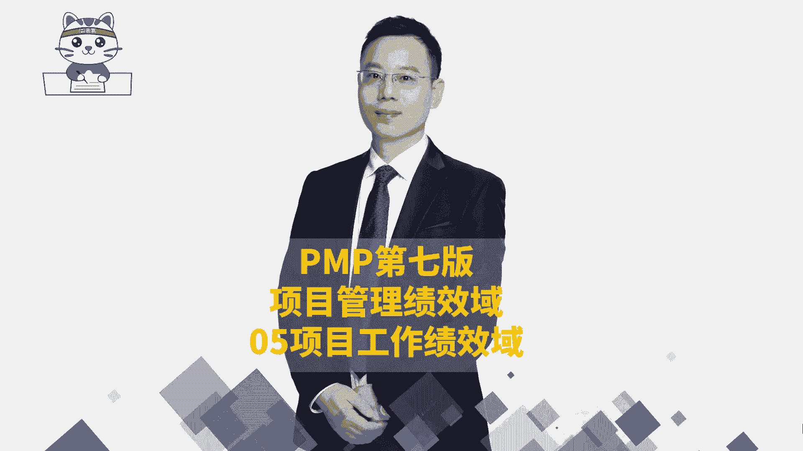
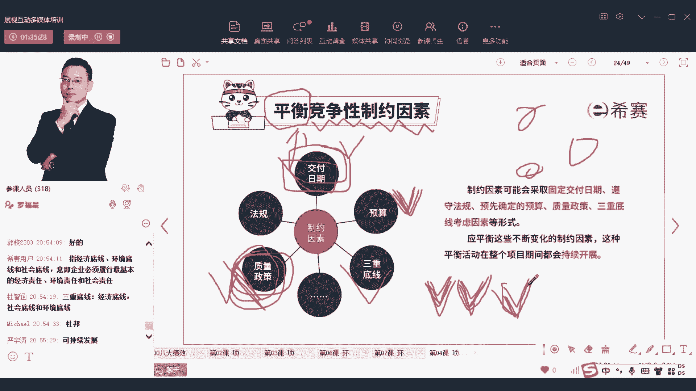

# 【PMP新版视频】24年第七版教学视频免费观看，报考指南+考纲讲解+第七版教材精讲！ - P39：PMP第七版8大绩效域之05项目工作绩效域-中 - 渡河的蝉 - BV1CP411x7Y2

然后这里还有一个叫晚做决策，那晚做决策的话，我们把它们往前翻，翻到这个地方来，看到这张图，看到这张图，就是它其实在敏捷里面会有一个东西叫做，不确定性追区，不确定性追求说在早前的时候。

在时间比较靠前的时候啊，这是一个时间轴啊，时间比较靠前的时候，它的浮动会很大，那么如果在这个时候你就定下来，我要做什么东西，大概率很有可能是不准确的，可能会跳来跳去的，然后你不如晚做决策。

什么叫晚做决策，你到这个时候你才做决策，才定下来要做什么东西，那么这个时候定的东西他才改动的，改动的不会那么大，它改动会小很多，会少很多，给的是任何一个逻辑，所以他才需要晚做决策，是早做计划。

晚做决策就早早就开始准备这个事情，但是到了那个比较靠后的时候才去做决策，对留音机说的很对啊，就是让子弹飞一会儿可以扔一个逻辑，所以是晚做决策啊，再来一个呢品质啊，品质一定是最优先的，你如果做一个东西。

你的质量都不行，那别人根本就没法用对吧，这就是质量的没毛病，全面优化怎么样全面优化，我们说过PDCA循环，你不断去PDCA循环不断的去迭代，你不断的去迭代，不断去优化，让这个事情做的变得更强。

哎这就是全面优化来干的事情，还有一个词叫快速交付，什么叫快速交付啊，这不就是增量交付的方式吗，你用增量交付的方式能够让对方快速拿到东西，当他拿到东西，他才能够去给你提供反馈，对不对。

所以也就是这个逻辑是很清晰的一个逻辑，就是让你能够尽早的去进，尽快的去做小小小块小块的去做，你做一小块做了以后交付出去，做一小块，做了以后交付出去，正式快速去交付，对迭代周期很短，快速去交付嗯。

还有呢就是授权给团队，你不用所有事情都非得轻易亲为的去管，你可以让他们自己去管自己，这种方式就是你那个精英的核心，而经济的核心的这些理念，我们在后面会讲到一个叫价值流图，价值流图。

就是我们去把中间那些若干的浪费的东西，不谈价的东西都把它给压缩，压到一定的程度，压到尽量少的程度，就像你们有的时候去医院的时候，你真的是忍不住哈，好想吐槽，觉得这个医院的流程真的是什么那么费劲对吧。

排队两小时，然后看电影，看病3分钟，然后又开始排队一小时，然后才能够拿到药，又开始干什么，做个什么检查，要排队很久，那这个能否让这东西变得更顺遂一些，能够让这些人快速流走呢。

不要一一堆人都等待等待这个医院里面呢对吧，那么有没有消化方式，那都是我们去消除浪费的这种逻辑和方式，呃，谁帮我说一下，让他刷新一下，让他刷新一下，那这还有一个呢需要迭代回顾，迭代回顾会议。

他其实讲的更多的是说我们在做敏捷的时候，如果做敏捷的时候呢，我每一轮迭代做完了，我们都可能会需要去重新检视一下自身，也就是开始有同学给了一个词叫复盘，我们可能就需要去复盘一下，我们要去重新解释一下。

其实这个复盘呢呃我不想要展开讲，因为我们后面会展开讲，我只想要在这里说一个词叫指向未来，指向未来，就我们所有的复盘，都应该是一个叫指向未来的这种方式，就是我们去做这一复盘，是为了希望他未来变得更好。

而不是变得更糟，所以我们并不是为了去批判自己而批判自己，我们是为了能够去找到一些改进的措施，找到一些好的一些东西，可以去传承以及找一些不够好的东西，可以去改进，去指向未来，我只希望你能够记得这一个字。

就是我们所有的这些回顾会迭代回顾，会不是为了去批判自己，OK而且能够去指向未来，这个呢我曾经做过一期，好像做过一期短视频呃，大家有兴趣的话，你也可以去搜一下，就是在罗帅啊，在在阿罗塞太阳里面。

在阿罗塞太阳里面，我有讲过一个就是应该是最近的东西讲过的，关于复盘，那关于那个什么东西的，OK有讲过一个小视频，小小的视频再往后面看啊，下一笔资金，下一笔资金就是说呃我们现在做的这个东西。

钱是继续做现在的项目还是不做项目，对对就是就是那个潘同学给的啊，潘同学和如来同学就前面那六个五个字，前面五个字就是阿罗晒太阳这个视频号里面，我好像做过一期，就是讲这个指向未来的这种方式，回顾的方式。

然后呢还有就是下一笔资金，其实也就是说你看当前的任务是否要继续砸钱，如果砸钱，那么就是钱就投在这里了，如果不砸钱呢，那我们可能就换一个地方，我们就做一个别的地方，我们做一个别的东西。

OK做一个次要的这种方式来去做事情，总之就是让这个钱是值得的，其实你换一句话就是及时止损，就是及时止损，你当你发现这个路径它不合适的时候，呃，我们就换一换啊，我们就换一下对吧，那还有一个词。

他说整个我们在做这个工作的时候呢，要平衡各种竞争性的制约因素什么，首先认识几个词啊，什么叫制约的因素，制约制约其实就是对你有约束，对你有约束，你先去听课吧，这是第四章的内容，我们现在讲的是第四章的内容。

然后竞争那个制约性的因素，就是对你有一些约束的，比方说要求你必须在多少钱之内完成，必须在多少时间之内完成，必须要质量达到什么样的要求啊等等，这些东西呢就是都是一些制约的条件，制约的因素。

那竞争性的资源因素，什么叫竞争性的资源因素，就某一些因素，他们之间你不如，你为了满足A，你可能在B这一方面你就要放水，你为了满足B你可能在C这方面可能就要放水，就类似这样的一个意思。

那么怎么怎么个放水的方式呢，比方说你如果想要让更短的时间之内去完成，你如果想要去更短的时间之内去完成，那你就可能会需要花更多的钱来做，你就要花更多的钱，然后你更你如果想要去花更多的。

你如果说不想花更多的钱来去做，你就想要去在更短的时间完成，但是你又不想花更多的钱，那你可能就在质量方面做的更差一点，就在质量方面做的更差一点，如果说你质量方面你又不想去，不想要失去。

那你可能时间就要画得更长，你可能时间花的更长，所以他们就是你这一块和另一块，他们之间有很多梦幻联动，就有很多这种联动的方式，那这里给了一个词叫平衡，平衡balance，我们经常说叫平衡工作和生活对吧。

经常说这个词叫平衡工作和生活，像我现在的话，可能就是没有办法去平衡我的工作和生活，就是最近有每次出差的时候是没有办法平衡的，因为约定好的这个直播又不能够推，也不能够换人，但其实也可以换人啊。

其实也是可以换人的，但是估计换人有意思，同学会不同意，有意思的同学会觉得没问题，但是所以我们为了方便就没有去换人，家，还是只能是善之善人啊，那么平衡是什么意思呢，平衡就是我们要去从中去做一个取舍。

娶到一个最佳的状态，就是每一个公司，每一个项目，它可能关注的焦点是不一样的，我们要去取到另一个项目上的最佳状态，而能够让大家去接受，比方说像某一些这种军工类的项目，它对于质量的要求就极其高。

那你得要在质量这个维度上要求最高，那么印象他可能在时间的维度上要求很高，那咱们就得在时间的维度上，咱们就不能够拖延啊，宁愿多花点钱，那也有某一些项目，它可能会在钱方面卡得很紧，他如果钱方面卡的很紧。

那么对不起，可能你就不能随便加活，你也不能随便变动东西来，这是一些相互制约的因素，那除了这些东西以外，还有一个词叫三重底线，哎正好有王志斌在问三重底线是什么，三重底线是什么呢。

就是我们现在在做项目的时候啊，首先第一条你一定要能够去赚钱，就是能够有这种经济方面有收益，如果你没有收益，那你又不是做慈善机构，对不对，你在干什么，即便是做慈善机构，你要知道那李连杰的那个思想境界很高。

他肯定曾经有讲过，说做壹基金，别人说你这么有钱，你为什么还要做壹基金，他说过，他说那像比尔盖茨那么有钱，他为什么还要去做慈善，还要去让大家去捐赠，就是为了让他有一种持续性可持续性。

OK那么首先第一条就是说能够有经济的收益，OK如果你做的这个东西都没有经济收益的话，那么这个项目就做不下去，你做一个项目亏钱，你再做一个项目亏钱，你早晚把钱亏光，亏光了以后，你就这个公司都不要存在了。

公司不存在，那么这些员工又没地方工作，又要换工作，所以是一个很糟糕的一个事情啊，这是第一个，所以呢而在这个经济这个维度上，至你至少要赚到钱，这是第一个，第二个呢，你还要具备一些这种叫社会的这个价值观。

或者社会的这个影响力，你不能够说是对社会有负面的影响，就你不能做一些违背公序良德的这些事情，你不能够做那些不太那啥啥啥的那些那些事情，OK那社会的这个责任是什么意思呢，比方说你做的东西。

你不能够说是有那种呃，让大家这种价值观的崩塌呀，像有一些这种什么假摔事件，那又是什么一种各种乱七八糟一些事件，搞得这个社会乌烟瘴气啊，哎这种那可是不行的，OK还包括说你能够让大家生活的更幸福，更喜悦。

而吃了东西以后身体变得更健康，这是可以的，你不能说别人让你吃了你这个东西以后，他要是拉肚子呀，又是又是又是上医院了，又是什么之类的，这都是对别人不友好，包括说对那种就是让你你做的这个产品。

对员工有一些毒害的作用呢，让他们脱发呀啊什么什么智能那断的，那都是不太好的，OK所以你的这个社会方面，社会影响这方面你要有一条底线，第三个呢是环境，环境的底线，环境就说我们不能够去破坏这个环境。

我们现在的这一环境，它也是我们子孙后代的环境，我们去赚钱的时候，我们要能够去不只是管住我们的赚钱，我们还要能够去为我们的子孙后代的赚钱，来去留下这个好的环境，所以你不能够是把那些地下水全部都抽干了。

以后，让这个整个城市没有地下水，所有的那些什么东西都会往下面坍塌呀，这就是一种破坏环境的一种方式对吧，你不能够说排放一些污污水呀，废废水啊，废气啊，不去做处理啊，就直接排放了，这也是不可以的。

对我们要一种可持续发展的这个，这个思路来去做事情，所以呢三重底线，就是我们既要去能够有经济方面的这个收益，同时也要在有社会责任感，有社会方面的这一个底线，还有就是环境方面，我们能破坏环境。

