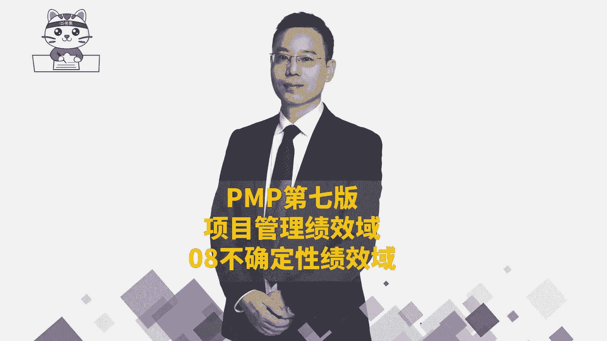
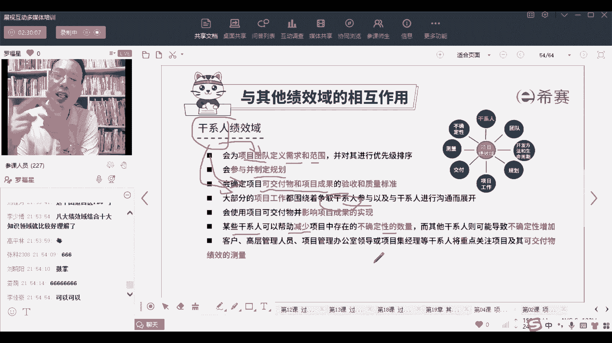

# 【PMP新版视频】24年第七版教学视频免费观看，报考指南+考纲讲解+第七版教材精讲！ - P48：PMP第七版8大绩效域之08不确定性绩效域-中 - 渡河的蝉 - BV1CP411x7Y2

首先那多样性多样性它讲的是什么，多样性讲的是说，我们可以允许有，从不同的维度和角度来去看待一个事情，并且做事情他可能不止一种方式，可能有多种方式，所以我们可能会通过这种发散的方式来做事情，OK比较发散。

先去发散，然后再去收敛，先发现得到可能的方式，也就是大胆假设，小心求证，就类似这样一个逻辑，而第二个词平衡，平衡讲的是什么呢，平衡讲的就是说类似于我们在组合管理中，有那种比方说中风险中收益低风险低收益。

高风险高收益，那么对应的而我们在平衡中间时，也是各种各样的东西都可以允许存在好，还有一个是关于过程的复杂性，那我们可以通过迭代的方式先完成扣完美，一步一步来PDCAPDCAPDC对吧啊，大家参与进来。

然后还有一个词叫故障保护，这个故障保护讲的是什么，他讲了一个东西叫做冗余，就是如果就是有点像你们公司有一个叫UPS电源，为什么要有一个UPS电源，就是万一他妈的要是停电了怎么办，诶。

有UPS电源不用担心，他就是提前去安排这种东西来去解这种东西，OK我做一些冗余的部件，或者你可以理解为是有一些冗余的配件，他万一什么东西掉链子的话，我可以快速去补上来，就这么一个逻辑啊。

咱们这些东西都只是听一嘴就可以了，你不用太在意啊，不用太在意好，那么乌卡中还有最后一个呢叫易变性，易变性就说有太多的变化对吧，烟花易冷啊，什么叫红颜易逝啊，对不对。

那那个所以当这东西很容易发生变化的时候，怎么办呢，他说你就提前安排一些，就是多做一些储备，那么这个东西不可以用的话，下一个东西可以用一个东西不可以用，下一个东西可以用，对不对。

还有就是多一些不同的这种备选方，有着不同的这种备选方案来去做事情，他也也是可以的，还是这么一个逻辑啊，好那么整个风险呢它其实是一个不确定的事件，它可能是对于未来进行一个把控，而整个对于风险的话。

有单个风险，有整体风险，之前我们在前面已经讲过了，然后我们在管理风险的时候呢，会留一个残口风，这个场口就是我能够接受的亚洲风险，裸露在外面，我能够接受的这东西，那整个风险的应对方式有善报呀，规避呀。

转移呀，减轻啊，接受啊，前面讲过了，然后机会呢也是好好的风险，它有善报啊，开拓呀，分享啊，提高呀，接受前面讲过了，跳过不再去赘述啊，那整个风险其实我们也可以用，一个类似于像这种图，这种图呢。

其实你可以把它理解为是它有，它是不是有一点点像那个累计流图，但是他这个累计流程是反馈，是风险累积的，风险图会发现A其实风险会变得越来越少，就他是说我们现在还存留的风险，往后面走，可能会变得越来越少。

越来越少，类似这样一个情况，其实也就是只是告诉你，也许对于风险，我们是可以通过这种看板的方式来去展现，搞一张风险看板来去展现，因为你如果说写一个这个东西哇，看起来费老劲了，但是你如果画一个图呢。

大概是比较清晰，能够看到他目前的未来的这样一个状态，OK可能会有这样一个情况，而整个风险呢，其实我们在前面讲风险管理的时候，讲定量风险分析，在定量风险分析中，我们还学过一个词叫预期货币价值分析。

有印象没有预期货币化分析，我们说做老工厂还是做新工厂，做老工厂的预期货币价值是多少，新工厂的预期货币价值是多少对吧，那同样的对于风险，其实它如果发生，它可能是什么什么情况，如果他不发生。

他可能考的是什么情况，那我们关于这个风险我们该怎么样去做呢，唉有一个预期货币价值，稍微了解一下，你了解了这些预期货币价值以后，你大概就知道我们接下来可能怎么样去做，是比较好的一种方式。

至少说是你要去让老板做决策的话，老板他是在做这个决策的时候，他是可以去参考什么信息来做这样一个决策，OK就给的是这样一个信息，所以他这个值是在告诉你这一个点啊，那么整个关于风险管理中。

已知风险我们用这些应急储备来去应对对吧，然后对于未知风险，我们用这个管理储备来去应对，而对于已经确定的事情呢，他就是一个内容，他这些活动他就是要做的事情，那就直接去做就可以了。

好然后关于风险呢还有一个词叫风险审查，这个风险审查其实你要审查有什么好处，审查以后就是方便我们更清晰的认知，了解目前的这个健康情况对吧，今天要干什么，遇到什么困难，挑战风险问题漏洞。

还有一个就是经常做一些演示，每一个阶段我们都去做一个演示汇报，来去做评审对吧，那通过这个演示汇报也能够发现一些问题，能够去暴露一些问题，还有呢这个叫状态状态会议，所谓状态会议其实也就是汇报啊。

就是有的时候如果说你不是开中美日，不是敏捷的方式，你是日常的这种预测型项目管理的方式，状态会议呢就是我们如果不是用预，不是用敏捷的方式，而是用预测的方式，他也同样的是需要去了解这样一个基本状态。

通过状态中去看到这个项目的风险情况对吧，还有回顾回顾中看做得好的，做的不好的，那么下一次怎么改进，对未来有一个更好的把控这些风险，那整个风险检查的结果呢其实就在这里了，前面刚已经看过了啊。

说了解它的一个运行情况，关于PEL分析这些东西，那么怎么判断，就是团队在评估不确定的时候，要考虑各方各面的一些因素，考虑社会的因素，政治因素，法律的因素，环境因素，经济因素啊等等这些东西。

OK积极探索这种东西和应对，就是你要主动去应对，你如果不去主动应对，他反正会来到你的门前，他反正会找上你的门，对好再就是多个变量之间关系，你如果找到多个变量之间关系，你有可能会可以去降维。

把多个变量变成少数维度，少数维度以后就某一些变量它是一种惰性因子，那种惰性因子就不用管它那种类似这种方式啊，维度越多，你处理起来越难，但是维度越少呢，你处理起来就会越得心应手好。

再一个就是说能够去预测这些威胁，然后去怎么样预测呀，我们去识别风险，捕捉风险，做风险的应对这样一种方式，还有就是把这样一个负面的风险的降低，那么也就是有一个有一个临界值，有一个容许偏差。

在这个临界值允许偏差一类都可以，但超出的话，对不起，那就采取一定的措施，还有就是正面机会要大增，我们要多找多找，采取机会，要去识别识别，多搞一些会议啊什么之类的，去识别这样一些机会好啊。

还有就是做一些有效的储备，储备应该干什么，储备用来去应对威胁，应对威胁，OK这是整个这样一个风险好了，那么整个关于这个风险，就是整个关于巴拉绩效率呢，我们就已经是简单过完了，最后呢还有一点时间。

我们来讲一下各个绩效率，它和别的绩效与金有什么关系啊，这个好好神啊，看一下我们一共讲了八大八大奇效语，首先应该是干系人的气象与干系人，讲的是人以及人与人之间，对吧啊，调动大家的这样一个积极性。

然后第二个其实它就相当于说是干系人管理啊，就是我们在前面讲的干系人管理或相关方管理，然后第二个呢讲的是团队的绩效与团队，绩效率来讲的，其实就是人人与人之间就是讲的是资源对吧，资源以及沟通。

然后第三个是开发方法和生命周期，那开发方法和生命周期，我们前面讲过预测型，增量型，迭代型，敏捷型啊，就这些东西啊，就这些东西那告诉你说不同的项目，他可能在不同的行业，他要用不同的方开发方法来去做嗯。

然后再下一个是规划，规划呢，其实我们在在项目管理中，有一个叫呃呃叫叫叫什么叫，就是制定项目管理计划，那么制定项目管理计划，包括制定范围管理计划，进度管理计划，成本管理计划，质量管理计划等等。

那么这些都是在做规划，对未来进行规划，同时我们在敏捷中还会有一个叫发布计划呀，然后迭代计划，至于至于迭代计划，就是这个迭迭代的这个待办事项列表啊，就迭代计划啊，这都是规划的东西，然后再有一个叫项目工作。

项目工作你可以把那就一直做事情，通过做事情来产生结果啊，做做做做具体事情来产生结果，而这个交付呢是做完东西要去做移交啊，这个交付再还有一个呢就是啊送pd是吧，好，今天发截截图，截图截图可以发。

发朋友圈截图，发朋友圈送pd，明天送都都，既然是最后一个任课，必须送对吧，好，然后呢是交付，交付的话就是去交东西了，那再有一个呢是测量，测量的话呢，其实就是去测它的这个进度情况呢，呃成本的情况呢。

团队情况呢，健康情况呢等等这些东西来去做一些测量，然后再还一个呢就是不确定性，不确定性其实就相当于是我们的风险，就是风险就是可能会有各种各样的风险，我们该要怎么样去管理它。

那它和别的绩效率之间是什么关系，我们一起来看一看，首先看到第一个干系人的那个迹象语，它和别的迹象于是什么关系呢，干系人他说我们会，他说会为项目团队来去定义需求范围，但是基本上是从干系人那边去获取需求。

对不对，然后呢，还有就是制定这些整体的规划，会去确定这些可交付成果目标，其实都是从客户那边获取，就客户那边获取需求，关于这些可交付成果，大部分的工作是围绕着干系人的这样一个，参与来进行。

就是想办法让大家去更好的去支持他，参与他做这些事情，还有就是我们在做这个项目的过程中，他说要去要去减少这些个，他说某一些干系人，可能会帮助减少项目的不确定性的数量，那么这些人其实就是我们有一个叫什么呃。

权利利益方格你还记得吗，那么权利利益方格的这些东西，那你就是可以有效的去处理它咯，对不对啊，是就类似这样一些方式，这是干系人绩效率和别的绩效率之间关系，就跟需求也好，跟范围也好，跟规划也好啊。

跟这些相关的影响也好，都有关联啊。