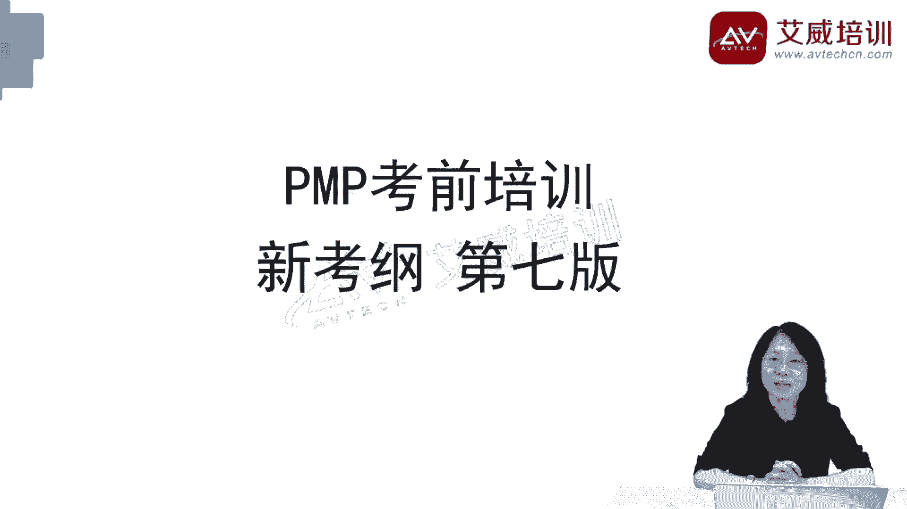

# 【PMP第七版课程】2024年PMP项目管理之八大绩效域知识精华~PMP免费培训课程，助你轻松获得PMP证书 - P1 - 艾威PMP项目管理 - BV1qW4y1W7WJ

大家好    ，欢迎大家参加pmp考前培训，咱们这个课程有两个特点，第一个特点是：新，备课参考的是最新的考纲，和最新的项目管理体系，第二个特点是简洁、高效，课程紧扣考点，希望能够帮助大家。

快速、高效的学到知识。

通过考试，获得pmp的证书，首先介绍考纲，考纲是什么呢，就是出题的人出题时候的参考依据，考纲呢分成三个部分，流程50%，人员42%，商业环境8%，这个分数是什么意思呢，就是一份卷子里面包含的题目的数量。

一份卷子一共是180道题目，流程50%那就是90道题目，人员42那就是76道题目，商业环境呢8%，那就是14道题目，在每个部分呢，我们看到又有若干个考点或者叫任务，流程17个，人员14个。

商业环境呢有4个，每个任务又有更为详细的描述，如果我们事先看了那个描述，然后再看题目，有的时候就会心领神会，原来考的是这个点啊，咱们学习的方法就是每讲完一个章节，我们就回到考纲，找些知识点。

然后做几道题，巩固知识，接下来，我们看到的就是项目管理知识体系框架，我们把它可以分成三个部分，第一个部分是项目管理的原则，一共有12个原则，说的是在当前错综复杂，快速变化的商业环境下，项目经理。

和所有的项目管理从业人士，应该遵守的一些基本的规则，第二个部分项目绩效域，一共有8个，说的是项目从前到后，项目经理、 项目管理人士应该做的所有的工作，这些工作当然很多很多，我们把它分门别类。

分成了8个绩效域，这是我们学习的重点，也是考试的重点，第三个部分是项目管理相关的模型，方法和工件，工件就是文件的意思，数量很多，后面标了数字，模型有20几个，方法有50几个，工件有70几个。

实际工作中呢，不会每个都用，根据项目的需要，选择合适的方法或者是工件，考试的时候当然也不会都考，我们根据以往考试中出现的频率。

有选择的讲解和学习，这是我们课程的提纲，我讲课的时候会按照这个顺序讲，你听课的时候可以按照你的喜好，从任何一个章节开始都是可以的，我会先介绍项目管理里面的基本概念，什么是项目，什么是项目经理。

这样我们就有了共同的沟通语言，之后呢，会挨个介绍8个绩效域，最后呢，介绍12个项目管理的原则，在这个过程中，会根据需要，穿插介绍项目管理的模型，方法和工件，还有刚才说的，每个小节结束之后。

我们会回顾考纲。

